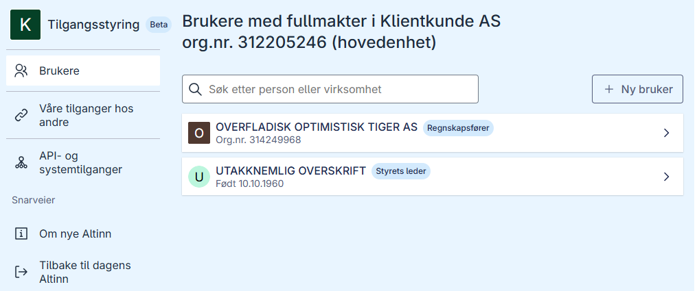
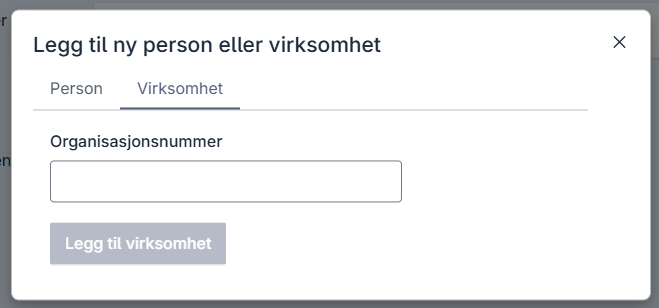
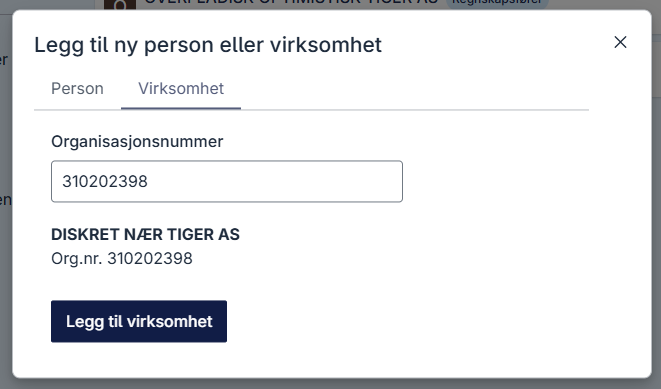
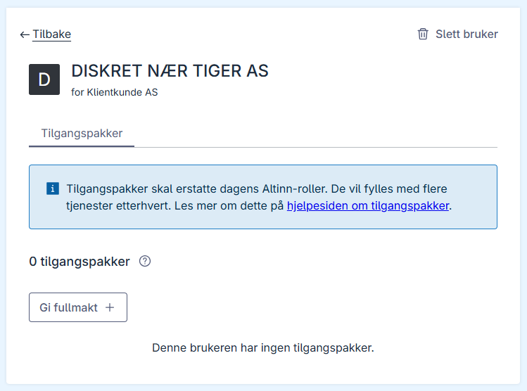
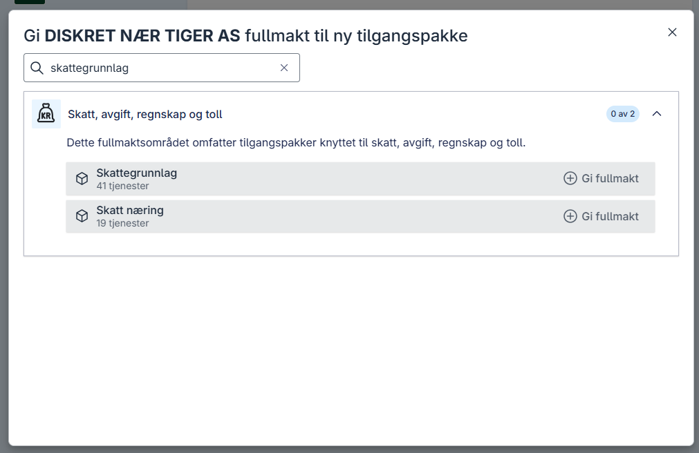
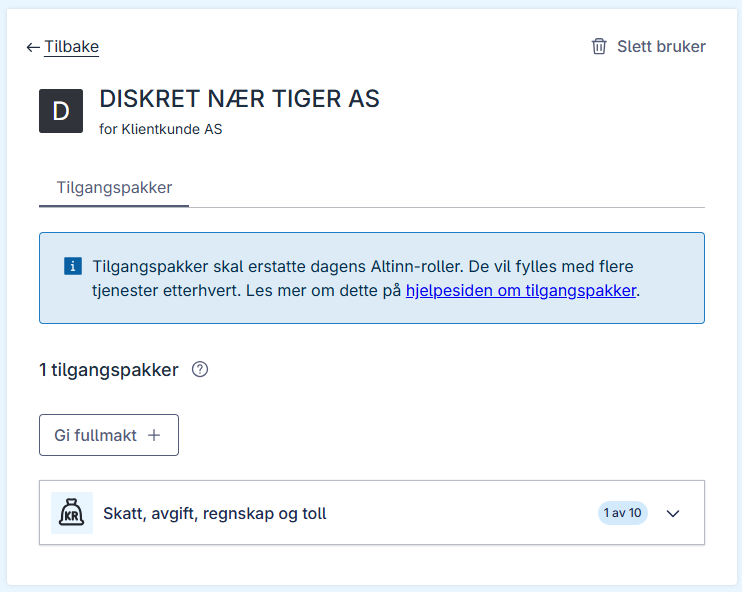

## Opprett et klientforhold som ikke finnes fra før

Hvis du skal administrere klienter, men det ikke finnes et klientforhold fra før, må du opprette forholdet før klienten kan legges til en systemtilgang for kunder.
Dette gjelder tilfeller der det ikke finnes et etablert klientforhold i Brønnøysundregistrene. Det er kundene selv som gir denne fullmakten til virksomheten som eier systemtilgangen.

### Forutsetninger

- Du må ha tilgang til Altinn som **Klientadministrator** eller **Daglig leder**.

### Prosess i Altinn-portalen

1. Logg på som daglig leder i virksomheten som skal legges til som kunde i systemtilgang for kunder. I dette eksempelet bruker vi Klientkunde AS som klient.
2. Gå til **Brukere** i menyen, hvis du ikke allerede er på denne siden.
   
3. Trykk på **+ Ny bruker** for å etablere et klientforhold.
   
4. Skriv inn organisasjonsnummeret til virksomheten du ønsker å gi fullmakt til. I dette eksempelet skriver vi inn organisasjonsnummeret til DISKRET NÆR TIGER AS, som vi brukte i eksempelet over.
   
5. Trykk på **Legg til virksomhet**. Du har nå opprettet et forhold mellom Klientkunde AS og DISKRET NÆR TIGER AS, men uten å ha gitt DISKRET NÆR TIGER AS noen fullmakter enda.
   
6. Trykk på **Gi fullmakt +**. I dette eksempelet vil vi gi fullmakt til tilgangspakken "Skattegrunnlag" til DISKRET NÆR TIGER AS, så vi søker på "Skattegrunnlag".
   
7. Trykk på **Gi fullmakt** på tilgangspakken Skattegrunnlag. DISKRET NÆR TIGER AS har nå fått fullmakt til tilgangspakken Skattegrunnlag. Du har nå etablert et klientforhold som kan brukes for systemtilgangen.
   
8. Etter at du har etablert klientforholdet gjennom disse stegene, kan Klientkunde AS [legges til i systemtilgang for kunder](/nb/authorization/guides/end-user/system-user/delegate-clients/) som er satt opp med tilgangspakken "Skattegrunnlag". 
