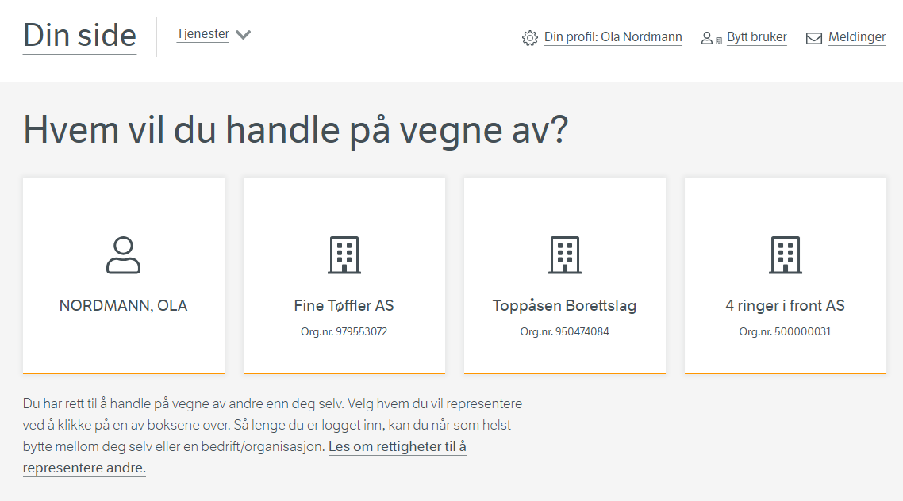

## Setting up integration with the ID port 

In order to be able to authorize end users in a digital service, it is necessary to be able to authenticate the user.

This is typically done using the ID port


## Access Altinn's API

To access Altinn's API, the service owner needs the following

- API Subscription for the Access Management products. 
- Scope for sender list for service owner user "altinn:accessmanagement/authorizedparties.resourceowner"
- Scope for PDP "altinn:authorization/authorize"

This can be ordered from Altinn servicesdesk@altinn.no

When API scopes are assigned to the organization, an integration in Maskinporten can be set up and assigned the scopes.

By authenticating against Maskinporten with the relevant client, one then receives a token that is authorized for these APIs.

This Maskinporten token must be exchanged for an Altinn token.

The setup of the Maskinporten client and the exchange process are described [here](/api/authentication/maskinporten/).

## Set up access management in your own application

In the application that offers the service, the service owner must set up access management for when users access functionality
which requires authorization.   At Altinn, we call such a code "Policy Enforcement Point" or PEP. 

The Policy Enforcement Point's task is to call the Policy Decision Point to get an answer as to whether the end user/system is authorized to perform the requested operation.

## Integration with API for authorized parties (Issuers)

In order to be able to present a list of transmitters that an end user can choose from, Altinn offers an API to be able to present this. 



The API that Altinn offers is called AuthorizedParties. Documentation can be found [here](https://docs.altinn.studio/api/accessmanagement/resourceowneropenapi/#/Authorized%20Parties/post_resourceowner_authorizedparties) 

Input is personr to authenticated person in the following format

```json
{
   "type": "urn:altinn:person:identifier-no",
   "value": "01017012345"
}
```

## Integration with PDP

A separate PDP API has been created that supports PEP making an authorization call based on the XACML Json Profile.

The documentation can be found [here](https://docs.altinn.studio/api/authorization/spec/#/Decision/post_authorize)

Below is an example of a call that authorizes **01017012345** for **read** on the resource **ttdintegrationtest1** for organization **312824450**


```json
{
   "Request": {
     "ReturnPolicyIdList": true,
     "AccessSubject": [
       {
         "Attribute": [
           {
             "AttributeId": "urn:altinn:person:identifier-no",
             "Value": "01017012345"
           }
         ]
       }
     ],
     "Action": [
       {
         "Attribute": [
           {
             "AttributeId": "urn:oasis:names:tc:xacml:1.0:action:action-id",
             "Value": "read",
             "DataType": "http://www.w3.org/2001/XMLSchema#string"
           }
         ]
       }
     ],
     "Resource": [
       {
         "Attribute": [
           {
             "AttributeId": "urn:altinn:resource",
             "Value": "ttdintegrationtest1"
           },
           {
             "AttributeId": "urn:altinn:organization:identifier-no",
             "Value": "312824450"
           }
         ]
       }
     ]
   }
}

```

Response

```json
{
  "Response": [
    {
      "Decision": "Permit",
      "Status": {
        "StatusCode": {
          "Value": "urn:oasis:names:tc:xacml:1.0:status:ok"
        }
      },
      "Obligations": [
        {
          "id": "urn:altinn:obligation:authenticationLevel1",
          "attributeAssignment": [

            {
              "attributeId": "urn:altinn:obligation-assignment:1",
              "value": "2",
              "category": "urn:altinn:minimum-authenticationlevel",
              "dataType": "http://www.w3.org/2001/XMLSchema#integer",
              "issuer": null
            }
          ]
        }
      ]
    }
  ]
}
```


### Multi Resource integration with PDP

Altinn PDP offers a convenient solution in scenarios where several elements need to be authorized for a given user at once. Thanks to the XACML Jason Profile, it supports multiple authorization requests in a single PDP request, alleviating potential complications.

In the example below, a user must be authorized for three resources owned by a different organization and of two different types.

```json
{
  "Request": {
    "ReturnPolicyIdList": true,
    "AccessSubject": [
      {
        "Id": "s1",
        "Attribute": [
          {
            "AttributeId": "urn:altinn:person:identifier-no",
            "Value": "01039012345"
          }
        ]
      }
    ],
    "Action": [
      {
        "Id": "a1",
        "Attribute": [
          {
            "AttributeId": "urn:oasis:names:tc:xacml:1.0:action:action-id",
            "Value": "read",
            "DataType": "http://www.w3.org/2001/XMLSchema#string",
            "IncludeInResult": true
          }
        ]
      }
    ],
    "Resource": [
      {
        "Id": "r1",
        "Attribute": [
          {
            "AttributeId": "urn:altinn:resource",
            "Value": "ttd-externalpdp-resource1",
            "IncludeInResult": true
          },
          {
            "AttributeId": "urn:altinn:organization:identifier-no",
            "Value": "897069651",
            "IncludeInResult": true
          }
        ]
      },
      {
        "Id": "r2",
        "Attribute": [
          {
            "AttributeId": "urn:altinn:resource",
            "Value": "ttd-externalpdp-resource1",
            "IncludeInResult": true
          },
          {
            "AttributeId": "urn:altinn:organization:identifier-no",
            "Value": "950474084",
            "IncludeInResult": true
          }
        ]
      },
      {
        "Id": "r3",
        "Attribute": [
          {
            "AttributeId": "urn:altinn:resource",
            "Value": "ttd-externalpdp-resource3",
            "IncludeInResult": true
          },
          {
            "AttributeId": "urn:altinn:organization:identifier-no",
            "Value": "950474084",
            "IncludeInResult": true
          }
        ]
      }
    ],
    "MultiRequests": {
      "RequestReference": [
        {
          "ReferenceId": [
            "s1",
            "a1",
            "r1"
          ]
        },
        {
          "ReferenceId": [
            "s1",
            "a1",
            "r2"
          ]
        },
        {
          "ReferenceId": [
            "s1",
            "a1",
            "r3"
          ]
        }
      ]
    }
  }
}

```

You get a list of responses in return. In the request, you tell which elements you need in return for each request to be able to map the response to the request.

```json
{
  "Response": [
    {
      "Decision": "Permit",
      "Status": {
        "StatusCode": {
          "Value": "urn:oasis:names:tc:xacml:1.0:status:ok"
        }
      },
      "Obligations": [
        {
          "id": "urn:altinn:obligation:authenticationLevel1",
          "attributeAssignment": [

            {
              "attributeId": "urn:altinn:obligation-assignment:1",
              "value": "2",
              "category": "urn:altinn:minimum-authenticationlevel",
              "dataType": "http://www.w3.org/2001/XMLSchema#integer",
              "issuer": null
            }
          ]
        }
      ],
      "Category": [
        {
          "CategoryId": "urn:oasis:names:tc:xacml:3.0:attribute-category:action",
          "Attribute": [
            {
              "AttributeId": "urn:oasis:names:tc:xacml:1.0:action:action-id",
              "DataType": "http://www.w3.org/2001/XMLSchema#string",
              "Value": "read"
            }
          ]
        },
        {
          "CategoryId": "urn:oasis:names:tc:xacml:3.0:attribute-category:resource",
          "Attribute": [
            {
              "AttributeId": "urn:altinn:resource",
              "DataType": "http://www.w3.org/2001/XMLSchema#string",
              "Value": "ttd-externalpdp-resource1"
            },
            {
              "AttributeId": "urn:altinn:organization:identifier-no",
              "DataType": "http://www.w3.org/2001/XMLSchema#string",
              "Value": "897069651"
            }
          ]
        }
      ]
    },
    {
      "Decision": "Permit",
      "Status": {
        "StatusCode": {
          "Value": "urn:oasis:names:tc:xacml:1.0:status:ok"
        }
      },
      "Obligations": [
        {
          "id": "urn:altinn:obligation:authenticationLevel1",
          "attributeAssignment": [
            {
              "attributeId": "urn:altinn:obligation-assignment:1",
              "value": "2",
              "category": "urn:altinn:minimum-authenticationlevel",
              "dataType": "http://www.w3.org/2001/XMLSchema#integer",
              "issuer": null
            }
          ]
        }
      ],
      "Category": [
        {
          "CategoryId": "urn:oasis:names:tc:xacml:3.0:attribute-category:action",
          "Attribute": [
            {
              "AttributeId": "urn:oasis:names:tc:xacml:1.0:action:action-id",
              "DataType": "http://www.w3.org/2001/XMLSchema#string",
              "Value": "read"
            }
          ]
        },
        {
          "CategoryId": "urn:oasis:names:tc:xacml:3.0:attribute-category:resource",
          "Attribute": [
            {
              "AttributeId": "urn:altinn:resource",
              "DataType": "http://www.w3.org/2001/XMLSchema#string",
              "Value": "ttd-externalpdp-resource1"
            },
            {
              "AttributeId": "urn:altinn:organization:identifier-no",
              "DataType": "http://www.w3.org/2001/XMLSchema#string",
              "Value": "950474084"
            }
          ]
        }

      ]
    },
    {
      "Decision": "NotApplicable",
      "Status": {
        "StatusCode": {
          "Value": "urn:oasis:names:tc:xacml:1.0:status:ok"
        }
      },
      "Category": [
        {
          "CategoryId": "urn:oasis:names:tc:xacml:3.0:attribute-category:action",
          "Attribute": [
            {
              "AttributeId": "urn:oasis:names:tc:xacml:1.0:action:action-id",
              "DataType": "http://www.w3.org/2001/XMLSchema#string",
              "Value": "read"
            }
          ]
        },
        {
          "CategoryId": "urn:oasis:names:tc:xacml:3.0:attribute-category:resource",
          "Attribute": [
            {
              "AttributeId": "urn:altinn:resource",
              "DataType": "http://www.w3.org/2001/XMLSchema#string",
              "Value": "ttd-externalpdp-resource3"
            },
            {
              "AttributeId": "urn:altinn:organization:identifier-no",
              "DataType": "http://www.w3.org/2001/XMLSchema#string",
              "Value": "950474084"
            }
          ]
        }

      ]
    }
  ]
}

```