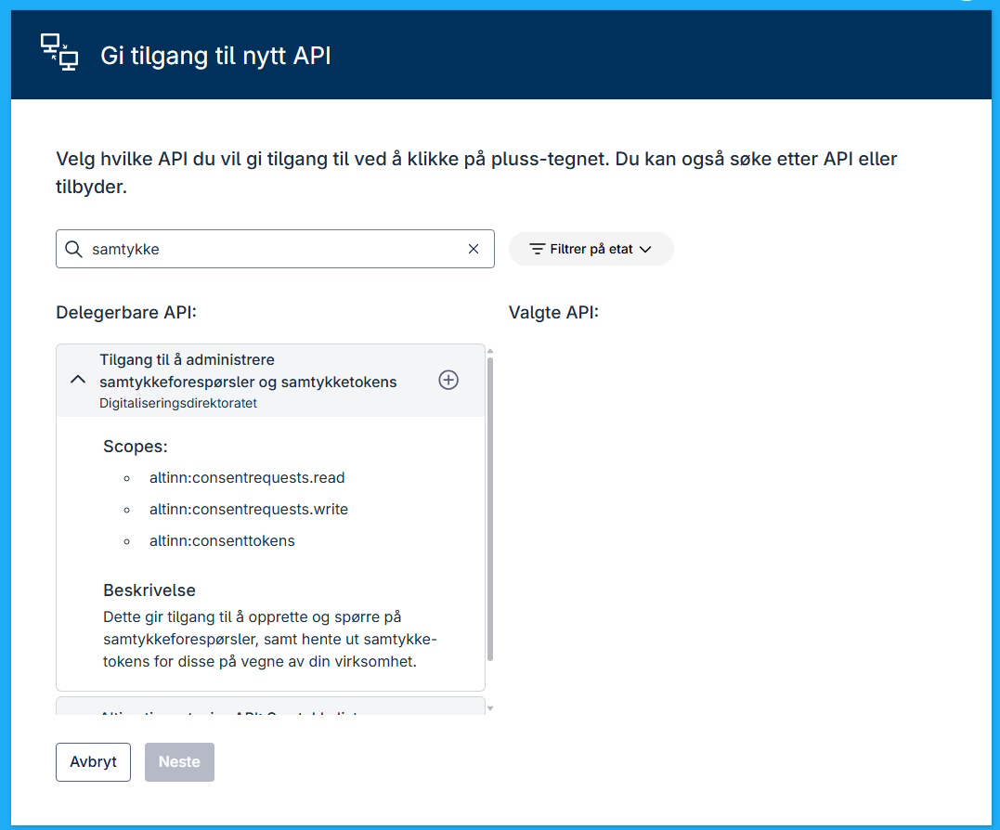

En datakonsument kan be om samtykke fra innbygger og virksomheter. Det man ber om er tilgang til en viss type data.
Disse datene er definert av noe som kalles en ressurs i Altinn som defineres av den aktøren som tilbyr API for å hente ut disse datene.

Det er flere aktører som tilbyr slike tjenester. 

Nedenfor er en liste over noen av de som tilbyr samtykke løsninger vi Altinn 2 løsningen. Det er forventet at disse vil flytte sine løsninger til Altinn 3 i løpet av Q3 2025/ Q1 2026. 

- [Skatteetaten](https://skatteetaten.github.io/api-dokumentasjon/en/om/samtykke) 
    - [Inntekts API](https://skatteetaten.github.io/api-dokumentasjon/en/api/inntekt)
    - [Summert skattegrunnlag API](https://skatteetaten.github.io/api-dokumentasjon/en/api/summertskattegrunnlag)
    - [Krav og betalinger API](https://skatteetaten.github.io/api-dokumentasjon/en/api/kravogbetalinger)
    - [Arbeidsgiveravgift API](https://skatteetaten.github.io/api-dokumentasjon/en/api/arbeidsgiveravgift)
    - [Mva meldingsopplysning API](https://skatteetaten.github.io/api-dokumentasjon/en/api/mva_meldingsopplysning)
    - [Oppdrag utenlandske virksomheter API](https://skatteetaten.github.io/api-dokumentasjon/en/api/oppdragutenlandskevirksomheter)
    - [Restanser API](https://skatteetaten.github.io/api-dokumentasjon/en/api/restanser)


- [Lånekassen Saldo studielån](https://dokumentasjon.dsop.no/dsop_saldostudielan_om.html)

Altinn tilbyr API for å kunne be om samtykke og for å kunne hente ut status på en gitt samtykkeforespørsel. 


## Be om samtykke

Url Test: POST https://platform.tt02.altinn.no/

```json
{
  "id": "019743e8-cb17-7f9f-b690-fb1338003c23",
  "from": "urn:altinn:person:identifier-no:01025161013",
  "requiredDelegator": null,
  "to": "urn:altinn:organization:identifier-no:810419512",
  "validTo": "2025-06-07T06:23:39.2925023+00:00",
  "consentRights": [
    {
      "action": ["read"],
      "resource": [
        {
          "type": "urn:altinn:resource",
          "value": "ttd_inntektsopplysninger"
        }
      ],
      "metadata": {
        "INNTEKTSAAR": "ADSF"
      }
    },
    {
      "action": ["read"],
      "resource": [
        {
          "type": "urn:altinn:resource",
          "value": "ttd_skattegrunnlag"
        }
      ],
      "metadata": {
        "fraOgMed": "ADSF",
        "tilOgMed": "ADSF"
      }
    }
  ],
  "requestMessage": {
    "en": "Please approve this consent request"
  },
  "redirectUrl": "https://www.dnb.no"
}
```

```json
{
  "id": "019743e8-cb17-7f9f-b690-fb1338003c23",
  "from": "urn:altinn:person:identifier-no:01025161013",
  "to": "urn:altinn:organization:identifier-no:810419512",
  "requiredDelegator": null,
  "handledBy": null,
  "validTo": "2025-06-07T06:23:39.292502+00:00",
  "consentRights": [
    {
      "action": ["read"],
      "resource": [
        {
          "type": "urn:altinn:resource",
          "value": "ttd_inntektsopplysninger"
        }
      ],
      "metaData": {
        "INNTEKTSAAR": "ADSF"
      }
    },
    {
      "action": ["read"],
      "resource": [
        {
          "type": "urn:altinn:resource",
          "value": "ttd_skattegrunnlag"
        }
      ],
      "metaData": {
        "fraOgMed": "ADSF",
        "tilOgMed": "ADSF"
      }
    }
  ],
  "requestmessage": null,
  "consented": null,
  "redirectUrl": "https://www.dnb.no",
  "consentRequestEvents": [
    {
      "consentEventID": "019743e9-128b-74fc-bb3a-49a3997d63ff",
      "created": "2025-06-06T06:23:57.298375+00:00",
      "performedBy": "urn:altinn:organization:identifier-no:810419512",
      "eventType": "Created",
      "consentRequestID": "019743e8-cb17-7f9f-b690-fb1338003c23"
    }
  ],
  "viewUri": "https://am.ui.localhost/accessmanagement/ui/consent/request?id=019743e8-cb17-7f9f-b690-fb1338003c23"
}
```

## Be om samtykke for andre

Det er mulig å be om samtykke for andre virksomheter. F.eks i sammenhenger hvor man har en Bank som er med i et konsern og man f.eks har en fells organisasjon som gjør selve  forespørselene. 

Løsningen for dette er noe annerledes enn det som var løsningen i Altinn 2. For å gjøre dette i Altinn 3 krever det at virksomheten som skal opprette forspørsel for andre får delegert
scopene fra virksomheten som skal stå som mottaker.

F.eks Smart Bank Øst må delegere til Smart Bank IT-drift for at Smart Bank IT-drift kan opprette samtykkeforespørsler på vegne av Smart Bank Øst.

Delegeringen av scope gjøres i tilgangststyring i Altinn under API delegering.





## Testimplementasjon

Det er laget en testimplementasjon for å demonstrere samtykke i Altinn 3 løsningen. 

Denne ligger foreløpig [her](https://github.com/TheTechArch/smartbank). 