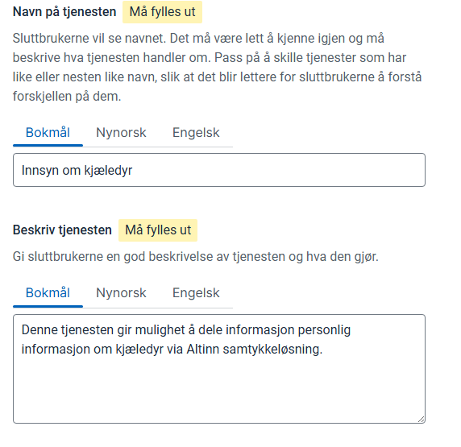

 
For å bruke Altinn Samtykke må du opprette samtykkeressurser for hvert sett med tjenester eller data som skal inngå i et samtykke.
 
Eksempler på slike ressurser er Skatteetatens "inntekts-API" og skattegrunnlag, som banker bruker for innsyn i finansielle forhold ved lånesøknader.
 
Denne veiledningen forklarer hvordan du setter opp en samtykkeressurs.
 
## Forutsetninger
 
Du må ha tilgang til ressursadministrasjon for din organisasjon. Se [Kom i gang-veiledningen](../../../getting-started/resource-admin-studio).
 
## Opprett ny samtykkeressurs
 
Velg **Opprett ressurs** øverst til høyre.
 
ID for ressursen bør navngis på formen `{tjenesteeierkode}-{forståeligressursid}`.
 

 
### Navn og beskrivelse
 
Gi samtykkeressursen et navn og en beskrivelse. Dette vises til brukere når de skal delegere tilgang til å gi samtykke på vegne av virksomheter.
 

 
### Samtykkemal
 
Valg av samtykkemal avgjør hvordan samtykket presenteres i Altinn for brukeren som skal akseptere det.
 
For eksempel avgjør malen om du kan legge til egen tekst for samtykke.
 

 
### Metadata og samtykketekst
 
Metadata brukes for samtykketjenester hvor det er behov for informasjon utover selve tjenesten. Dette kan for eksempel være en begrensning på hvilke data eller hvilket år samtykket gjelder for.
 
Disse metadataene kan presenteres som en del av samtykketeksten som vises til sluttbruker.
 

 
### Engangssamtykke
 
Hvis man ønsker at tjenesten skal kun være tilgjengelig via engangsamtykke kan man sette dette.
 
Dette betyr at den som ber om samtykke bare kan hente ut data 1 gang uansett periodelengde.
 
## Validering av samtykker
 
I den nye samtykkeløsningen for Altinn 3 er det **Maskinporten** som utsteder samtykketoken.  
Tokenet utstedes som et vanlig Maskinporten-token, men inneholder i tillegg `authorization_details`-attributter med informasjon om hvilke rettigheter samtykket gir.
 
Eksempelet under viser et token fra demoapplikasjonen **Smartbank** i testmiljøet TT02:
 
```json
{
  "authorization_details": [
    {
      "type": "urn:altinn:consent",
      "id": "93413201-b7e8-4ec3-a899-580fc02c6aeb",
      "from": "urn:altinn:person:identifier-no:25922947409",
      "to": {
        "authority": "iso6523-actorid-upis",
        "ID": "0192:991825827"
      },
      "consented": "2025-07-18T07:57:30.409251+00:00",
      "validTo": "2026-07-18T07:57:15.639509+00:00",
      "consentRights": [
        {
          "action": ["consent"],
          "resource": [
            {
              "type": "urn:altinn:resource",
              "value": "samtykke-test-vegard"
            }
          ],
          "metadata": {
            "inntektsaar": "2022"
          }
        }
      ]
    }
  ],
  "scope": "altinn:consentrequests.read",
  "iss": "https://test.maskinporten.no/",
  "client_amr": "private_key_jwt",
  "token_type": "Bearer",
  "exp": 1752825571,
  "iat": 1752825451,
  "client_id": "107c6f58-e06b-44e9-be7a-11ea44c7ad8b",
  "jti": "T2KUt3ufgIPycdoGPMEFU87pNm9e9nPB1ODkJj5wH0k",
  "consumer": {
    "authority": "iso6523-actorid-upis",
    "ID": "0192:991825827"
  }
}
```