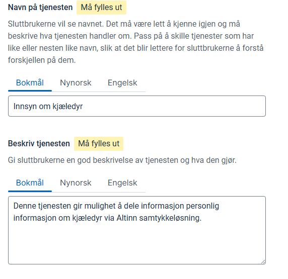
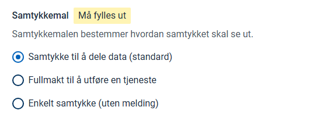
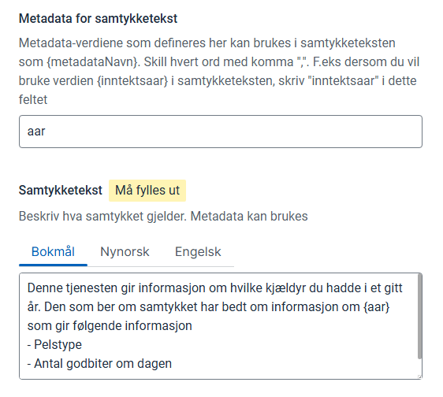

To use Altinn Consent, you must create consent resources for each set of services or data to be included in a consent.

Examples of such resources are the Tax Administration's "income API" and tax base, which banks use to access financial information during loan applications.

This guide explains how to set up a consent resource.

## Prerequisites

You must have access to resource administration for your organization. See the [Getting Started Guide](/en/authorization/getting-started/resourceadministration/).

## Create New Resource

Select **Create Resource** in the upper right corner.

The resource ID should be named in the format `{serviceowner-code}-{understandableresourceid}`.

### Name and Description

Give the consent resource a name and description. This is shown to users when they delegate access to give consent on behalf of organizations.

### Consent Template

The choice of consent template determines how the consent is presented in Altinn for the user who will accept it.

For example, the template decides whether you can add custom text for the consent.

### Metadata and Consent Text

Metadata is used for consent services where information beyond the service itself is needed. For example, this could be a restriction on which data or which year the consent applies to.

This metadata can be presented as part of the consent text shown to the end user.

### One-Time Consent

If you want the service to only be available via one-time consent, you can set this option.

This means that the party requesting consent can only retrieve data once, regardless of the period length.
