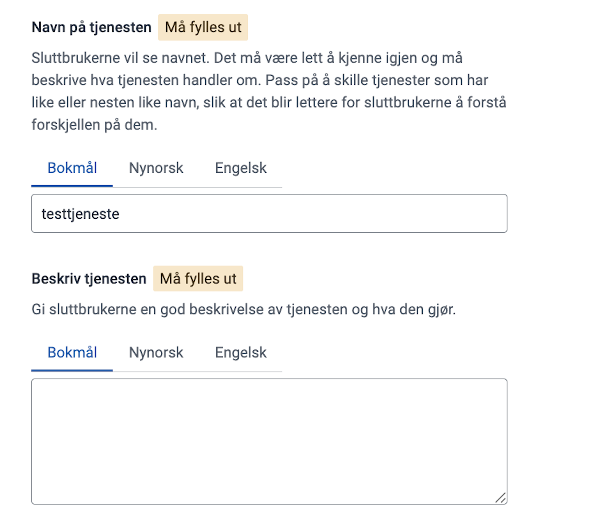
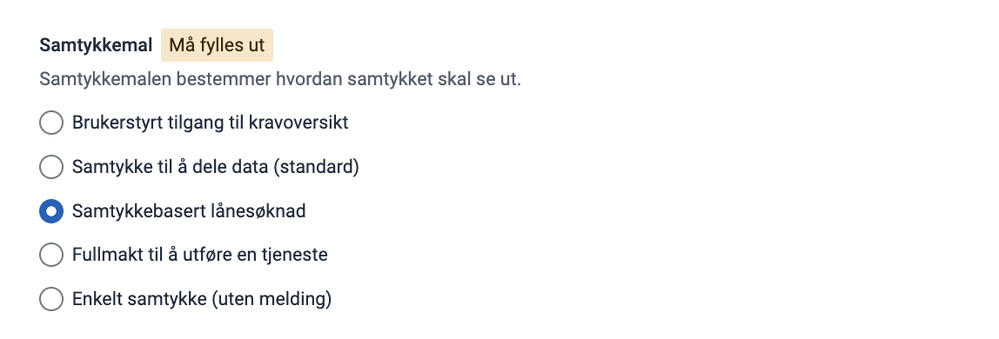
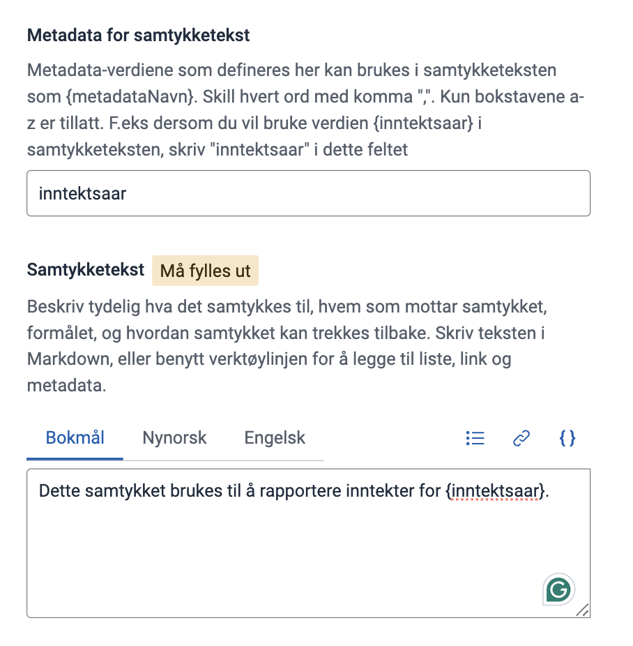
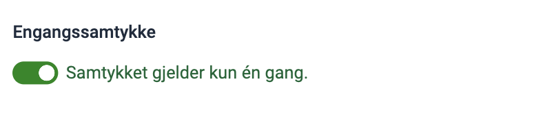
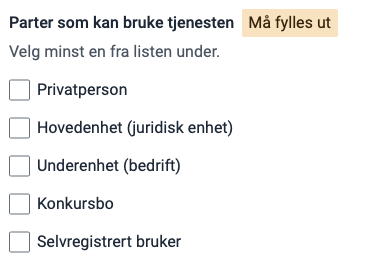
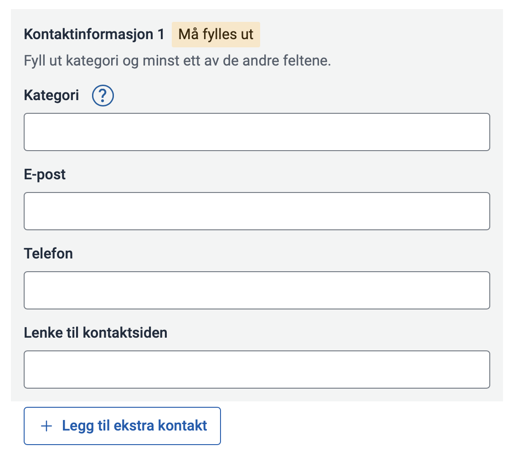
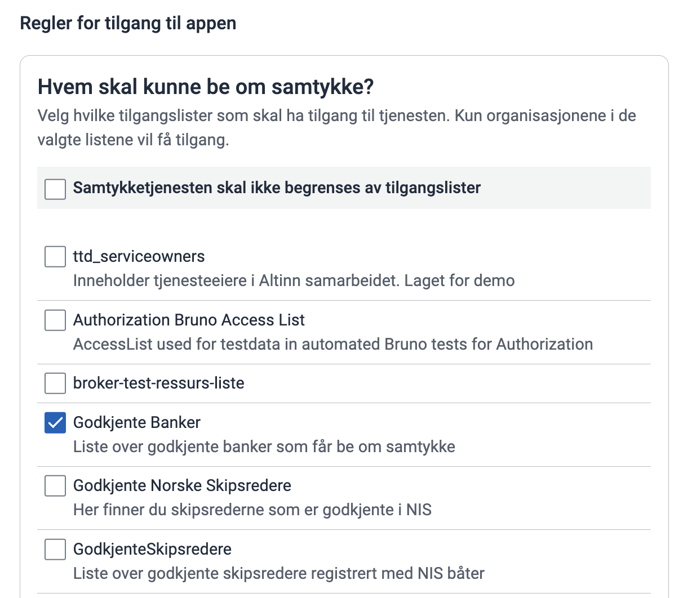

For å bruke Altinn Samtykke må du opprette samtykkeressurser for hvert sett med tjenester eller data som skal inngå i et samtykke.

Eksempler på slike ressurser er Skatteetatens "inntekts-API" og skattegrunnlag, som banker bruker for innsyn i finansielle forhold ved lånesøknader.

Denne veiledningen forklarer hvordan du setter opp en samtykkeressurs.

## Forutsetninger

Du må ha tilgang til ressursadministrasjon for din organisasjon. Se [Kom i gang-veiledningen](/nb/authorization/getting-started/rresourceadministration/).

## Opprett ny samtykkeressurs

Velg **Opprett ressurs** øverst til høyre.

ID for ressursen bør navngis på formen `{tjenesteeierkode}-{forståeligressursid}`.

### Navn og beskrivelse

Gi samtykkeressursen et navn og en beskrivelse. Dette vises til brukere når de skal delegere tilgang til å gi samtykke på vegne av virksomheter.

### Samtykkemal

Velg en mal for hvordan samtykkeforespørselen skal presenteres i Altinn for brukeren som skal akseptere det.

Du kan se en forhåndsvisning av teksten i malen til høyre.

### Metadata og samtykketekst

Samtykketeksten er teksten sluttbrukeren ser når de skal gi samtykke i Altinn. Den bør tydelig forklare hvilke data som deles.

Du kan sette inn metadata i samtykketeksten ved å bruke krøllparenteser { }. Metadata brukes når samtykket krever tilleggsinformasjon utover selve tjenesten – for eksempel hvilket år, hvilken periode eller hvilke data samtykket gjelder for.

List opp metadataene som skal brukes i samtykketeksten i feltet Metadata for samtykketekst. Se forhåndsvisningen til høyre og aktiver «variabler med eksempeltekst» for å kontrollere at metadataene vises riktig.

### Engangssamtykke

Dersom du ønsker at samtykket kun skal kunne brukes én gang til utlevering av opplysninger, må engangssamtykke aktiveres. Hvis ikke, vil samtykket være tidsavgrenset.

### Delegering

Aktiver delegering for å gi brukere mulighet til å gi andre i virksomheten rett til å godkjenne samtykkeforespørsler på vegne av virksomheten.

Skriv en kort tekst som beskriver hva den som får delegert retten, får mulighet til å gjøre. Teksten vises i Altinn når en bruker delegerer tjenesten videre til andre i virksomheten.

### Nøkkelord

Skriv inn relevante nøkkelord som gjør tjenesten enklere å finne i søk. Nøkkelordene er ikke i bruk ennå, men vil bli benyttet i fremtidige tjenestekataloger.

### Status

Angi status for tjenesten. Velg _Fullført_ dersom tjenesten er i produksjon, og _Avviklet_ for tjenester som er avviklet.

### Brukertyper

Definerer hvilke typer brukere som har tilgang. Disse innstillingene kan brukes til filtrering på et senere tidspunkt. For tiden er dette bare informasjon.

### Parter som kan bruke tjenesten

Definerer hvilken type part tjenesten er målrettet mot. Kan bli brukt til filtrering i tjenestekatalog på et senere tidspunkt.

### Kontaktinformasjon

Kontaktinformasjon for tjenesten. Kan bli presentert i tjenestekatalog på et senere tidspunkt.

## Tilgangsregler

Her kan du definere regler for hvilke enhetsregisterroller, tilgangspakker og Altinn-roller som gir tilgang til å godkjenne en samtykkeforespørsel på vegne av en virksomhet

### Sikkerhetsnivå

Velg hvilket sikkerhetsnivå som skal være minimumskrav for innlogging. Det samme nivået vil også gjelde når brukeren skal godkjenne samtykket.

### Hvem skal kunne be om samtykke?

Velg tilgangsliste med utvalgte organisasjoner for å avgrense hvem som skal kunne be om samtykke. Kun organisasjonene som inngår i de valgte listene vil kunne sende samtykkeforespørsel og hente ut data.
Tilgangsliste kan opprettes i på sidene for [tilgangsliste i Altinn Studio](https://docs.altinn.studio/nb/authorization/guides/resource-owner/manage-accesslists-resource-admin/) eller [via API](https://docs.altinn.studio/nb/authorization/guides/resource-owner/manage-accesslist-api/).

### Hvem skal kunne godkjenne en samtykkeforespørsel?

Velg roller fra Enhetsregisteret, tilgangspakker og Altinn-roller for å angi hvem som kan gi samtykke på vegne av en virksomhet. Tilgangspakker tar over for Altinn-roller. Bruk dagens Altinn-roller og tilsvarende tilgangspakker til nye delegeringer er gjort og Altinn-roller er slått av. Roller fra Enhetsregisteret, som daglig leder og styrets leder, administreres i Brønnøysundregistrene og fungerer som tidligere.

