I Altinn Studio Ressursadministrasjon kan du opprette ressurser som brukes som grunnlag for tilgangskontroll for tjenester utenfor Altinn-plattformen.

## Forutsetninger

Du må ha tilgang til ressursadministrasjon for organisasjonen din. Se [Kom i gang-veiledningen](/nb/authorization/getting-started/resourceadministration/).

## Trinn 1: Opprett ressurs

Logg inn i Altinn Studio og gå til Ressursadministrasjon for organisasjonen din:
`https://altinn.studio/resourceadm/{orgkode}/{orgkode}-resources`

Klikk **Opprett ressurs**. Gi ressursen en unik ID — denne brukes i Altinn API for å sjekke tilgang. Deretter gir du ressursen et navn.

{}
Første gang du besøker Ressursadministrasjon etter å ha opprettet repository og team, kan det ta noen minutter før siden er tilgjengelig.
{}

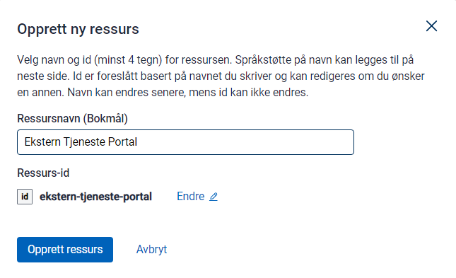

### Ressurstype

For eksterne ressurser vil typen være generisk tilgangsressurs.

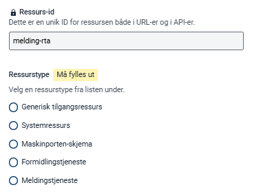

### Tittel

Tittelen vises i tilgangsstyring og i tjenestekataloger som data.altinn.no.

Du må definere tittelen på bokmål, nynorsk og engelsk.

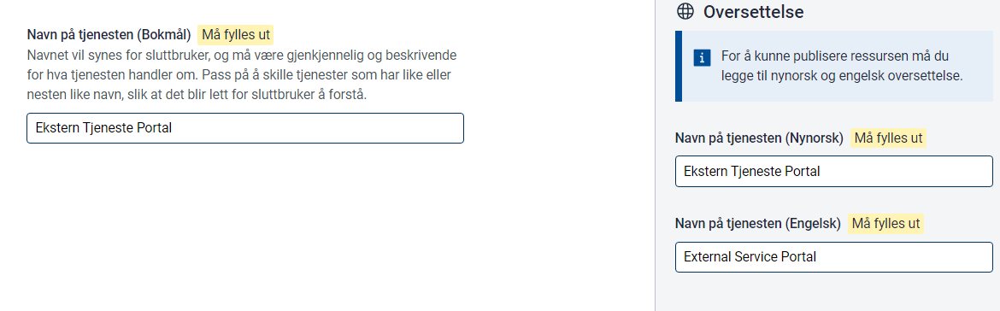

### Beskrivelse

Beskrivelsen vises i tilgangsstyring og i tjenestekataloger som data.altinn.no.

Du må definere beskrivelsen på bokmål, nynorsk og engelsk.

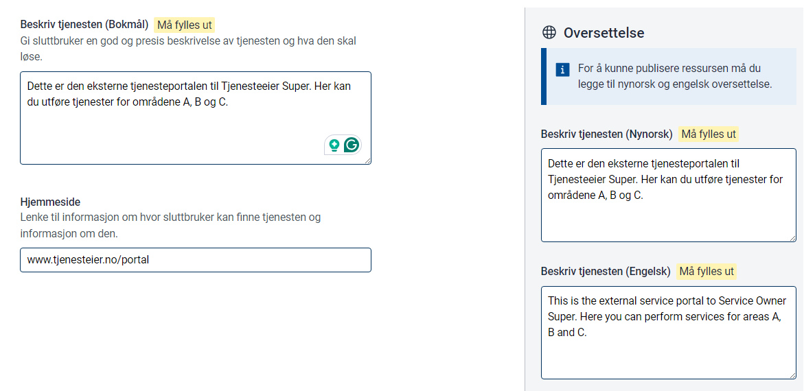

### Delegeringsbeskrivelse

Hvis ressursen skal kunne delegeres, aktiverer du delegering og angir delegeringsbeskrivelse på bokmål, nynorsk og engelsk.

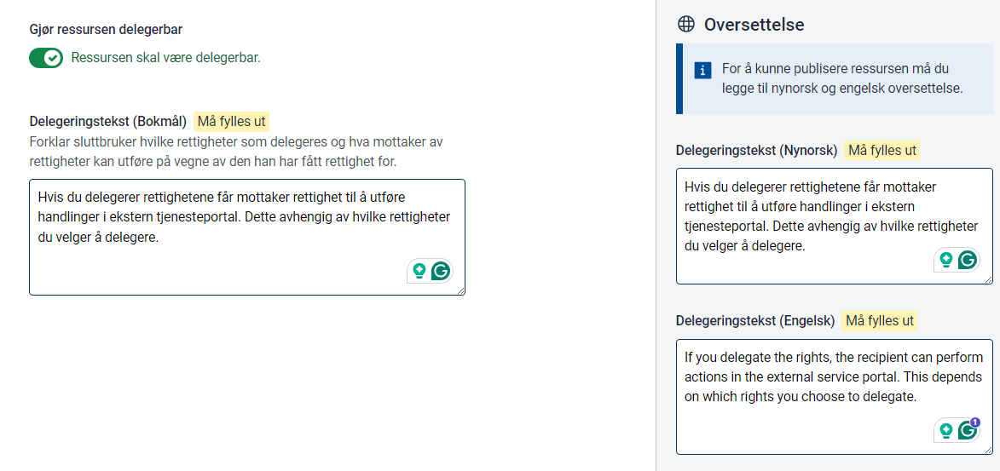

### Nøkkelord

Nøkkelord kan brukes til filtrering i tjenestekataloger på et senere tidspunkt.

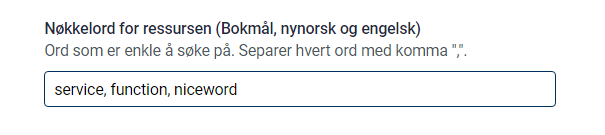

### Status

Statusen til tjenesten ressursen peker på.

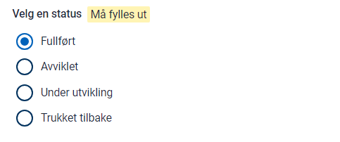

### Brukertyper

Definerer hvilke typer brukere som har tilgang. Brukes foreløpig kun som informasjon.

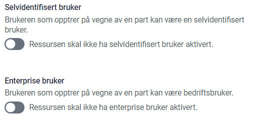

### Parter som kan bruke tjenesten

Definerer hvilken type brukere tjenesten er rettet mot. Kan brukes til filtrering i tjenestekatalog på et senere tidspunkt.

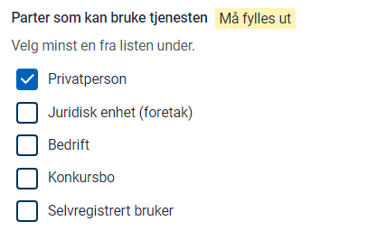

### Kontaktinformasjon

Kontaktinformasjon for tjenesten. Kan vises i tjenestekatalog på et senere tidspunkt.

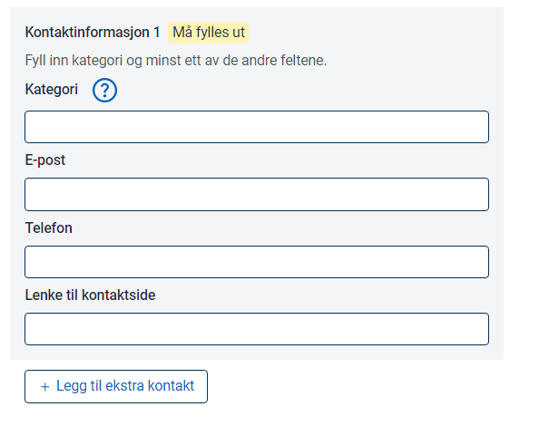

## Opprett policy

Når ressursen er opprettet, må du definere policyen. Policyen må inneholde minst én regel.

Hver regel inneholder ressurs, emne og handling.

### Ressurs

Definer ressursen for regelen.

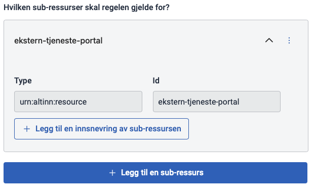

### Handling

Definer handlingen for regelen.

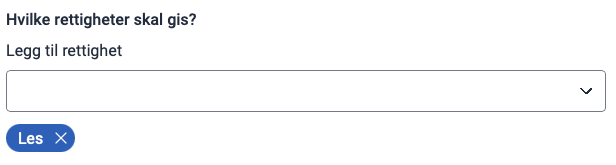

### Emne

Definer emnet for regelen. Du kan velge mellom ER-roller, Altinn-roller og tilgangspakker.

Les mer om [tilgangspakker og roller](/nb/authorization/what-do-you-get/accessgroups/).

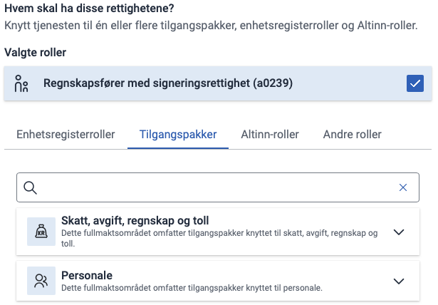

## Publiser

Når du er ferdig med ressursinnstillingene og policyen, kan du publisere. Du må angi en ny versjons-ID og bekrefte endringene i ressurslageret.

{}
Får du en feilmelding om at det lokale lageret er ute av synk med det som finnes fra før, velger du å hente siste versjon fra serveren og prøver på nytt.
{}

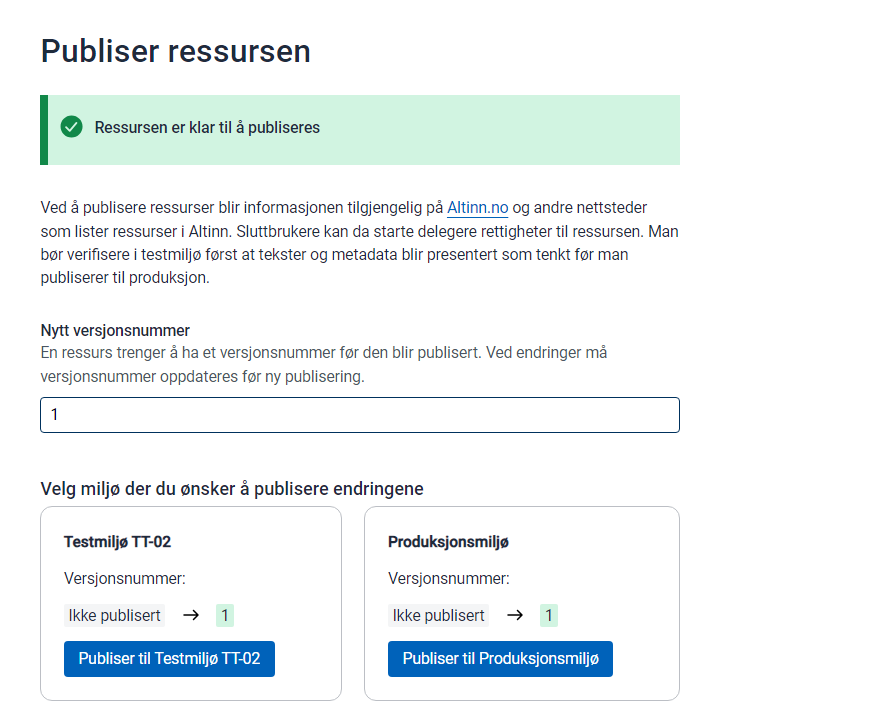

### Rettighet til å publisere

For å publisere ressurser må du være medlem av riktig team i Gitea. Disse teamene settes opp av administratoren i organisasjonen din. Team for din organisasjon finnes på
`https://altinn.studio/repos/org/{orgkode}/teams`

Følgende team gir tilgang til å publisere ressurser:

- **Resources-Publish-PROD**: Rettighet til å publisere til produksjon
- **Resources-Publish-TT02**: Rettighet til å publisere til TT02

## Bekreft

Når ressursen er publisert, er den tilgjengelig i ressursregisteret.

Eksempel på ressurs fra denne guiden:
[https://platform.tt02.altinn.no/resourceregistry/api/v1/resource/ekstern-tjeneste-portal](https://platform.tt02.altinn.no/resourceregistry/api/v1/resource/ekstern-tjeneste-portal)

Eksempel på policy fra denne guiden:
[https://platform.tt02.altinn.no/resourceregistry/api/v1/resource/ekstern-tjeneste-portal/policy](https://platform.tt02.altinn.no/resourceregistry/api/v1/resource/ekstern-tjeneste-portal/policy)
