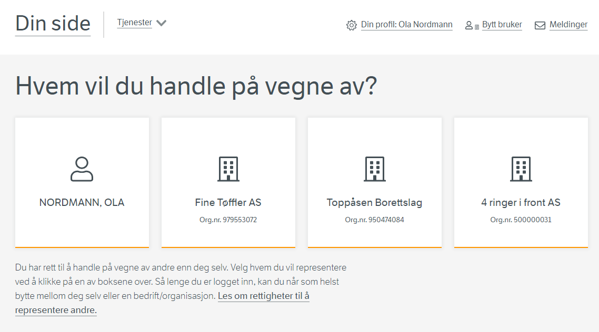

## Sette opp integrasjon med ID-porten

For at man skal kunne autorisere sluttbrukere i en digital tjeneste er det nødvendig å kunne autentisere brukeren.

Dette gjøres typisk ved hjelp av ID-porten

## Få tilgang til Altinns API

For å få tilgang til Altinns API trenger tjenesteier følgende

- API Subscription for produktene Access Management.
- Scope for avgiverliste for tjenesteeierbruker "altinn:accessmanagement/authorizedparties.resourceowner"
- Scope for PDP "altinn:authorization/authorize"

Dette kan bestilles hos Altinn servicedesk@altinn.no

Når API scopes er tildelt organisasjonen kan man sette opp en integrasjon i Maskinporten som tildeles scopene.

Ved å autentisere seg mot Maskinporten med den aktuelle klientene får man da en token som er autorisert til disse API.

Dette Maskinporten tokenet må veksles inn til et Altinn token.

Oppsett av Maskinportenklient og innveksling er beskrevet [her](/nb/authorization/getting-started/authentication/).

## Sette opp tilgangs håndtering i egen applikasjon

I applikasjonen som tilbyr tjenesten må tjenesteeier sette opp tilgangshåndtering for når brukere aksesserer funksjonalitet
som krever autorisasjon. I Altinn kaller vi slik kode "Policy Enforcment Point" eller PEP.

Policy Enforcement Point sin oppgave er å kalle Policy Decision Point for å få svar på om sluttbruker/system er autorisert for å utføre forespurt operasjon.

## Integrasjon med API for autoriserte parter (Avgivere)

For å kunne presentere en liste over avgivere som en sluttbruker kan velge mellom tilbyr Altinn et API for å kunne presentere dette.



API som Altinn tilbyr heter AuthorizedParties. Dokumentasjon finnes [her](https://docs.altinn.studio/nb/api/accessmanagement/resourceowneropenapi/#/Authorized%20Parties/post_resourceowner_authorizedparties)

Input er personr til autentisert person på følgende format

```json
{
  "type": "urn:altinn:person:identifier-no",
  "value": "01017012345"
}
```

### Respons

Nedenfor vises respons for en person som har

- Tilgang på seg selv (OPPRIKTIG KAMEL)
- Tilgang på virksomhet han har daglig leder for (ULASTELIG RETTFERDIG TIGER AS)
- Tilgang på virksomhet han er regnskapsfører for
- Tilgang på virksomhet han har fått delegert 


```json
[
{
    "partyUuid": "a5eb95db-97fc-4bd4-a6f6-b9214bc24549",
    "name": "OPPRIKTIG KAMEL",
    "organizationNumber": null,
    "parentId": null,
    "personId": "30856499983",
    "dateOfBirth": "1964-05-30",
    "partyId": 51181765,
    "emailId": null,
    "type": "Person",
    "unitType": null,
    "isDeleted": false,
    "onlyHierarchyElementWithNoAccess": false,
    "authorizedAccessPackages": [
      "innbygger-arbeidsliv",
      "innbygger-attester",
      "innbygger-avlastning-stotte",
      "innbygger-bank-finans",
      "innbygger-barn-foreldre",
      "innbygger-barnehage-sfo-skole",
      "innbygger-behandling",
      "innbygger-bolig-eiendom",
      "innbygger-byggesoknad",
      "innbygger-design-varemerke",
      "innbygger-forerkort",
      "innbygger-forsikring",
      "innbygger-fritidsaktiviteter-friluftsliv",
      "innbygger-frivillighet",
      "innbygger-helsetjenester",
      "innbygger-idrett",
      "innbygger-innkreving",
      "innbygger-kjoretoy",
      "innbygger-kultur",
      "innbygger-loyve",
      "innbygger-patent",
      "innbygger-pensjon",
      "innbygger-permisjon-oppsigelse",
      "innbygger-pleie-omsorg",
      "innbygger-samliv",
      "innbygger-sertifisering",
      "innbygger-skatteforhold-privatpersoner",
      "innbygger-soknader-sertifisering",
      "innbygger-stotte-tilskudd",
      "innbygger-straffesak",
      "innbygger-sykefravaer",
      "innbygger-tilgangsstyring-privatperson",
      "innbygger-toll-avgift",
      "innbygger-utdanning",
      "innbygger-vapen"
    ],
    "authorizedResources": [],
    "authorizedRoles": [
      "PRIV",
      "LOPER",
      "ADMAI",
      "PRIUT",
      "REGNA",
      "SISKD",
      "UILUF",
      "UTINN",
      "UTOMR",
      "PAVAD",
      "KOMAB",
      "BOADM",
      "A0278",
      "A0236",
      "A0212",
      "A0282"
    ],
    "authorizedInstances": [],
    "subunits": []
  },
 {
    "partyUuid": "066148fe-7077-4484-b7ea-44b5ede0014e",
    "name": "ULASTELIG RETTFERDIG TIGER AS",
    "organizationNumber": "314242726",
    "parentId": null,
    "personId": null,
    "dateOfBirth": null,
    "partyId": 51235100,
    "emailId": null,
    "type": "Organization",
    "unitType": "AS",
    "isDeleted": false,
    "onlyHierarchyElementWithNoAccess": false,
    "authorizedAccessPackages": [
      "a-ordning",
      "aksjer-og-eierforhold",
      "akvakultur",
      "annen-tjenesteyting",
      "ansettelsesforhold",
      "attester",
      "avfall-behandle-gjenvinne",
      "baerekraft",
      "barnehageeier",
      "barnehageleder",
      "barnehagemyndighet",
      "barnevern",
      "beredskap",
      "bergverk",
      "biblioteker-museer-arkiver-og-annen-kultur",
      "byggesoknad",
      "damp-varmtvann",
      "dokumentbasert-tilsyn",
      "dyrehold",
      "eiendomsmegler",
      "elektrisitet-produsere-overfore-distrubere",
      "elektronisk-kommunikasjon",
      "familievern",
      "finansiering-og-forsikring",
      "fiske",
      "folkeregister",
      "fornoyelser",
      "forskning",
      "generelle-helfotjenester",
      "godkjenning-av-personell",
      "godkjenning-av-utdanningsvirksomhet",
      "gummi-plast-og-ikkemetallholdige-mineralprodukter",
      "helfo-saerlig-kategori",
      "helsetjenester",
      "helsetjenester-personopplysninger-saerlig-kategori",
      "hovedadministrator",
      "hoyere-utdanning-og-hoyere-yrkesfaglig-utdanning",
      "informasjon-og-kommunikasjon",
      "infrastruktur",
      "jakt-og-viltstell",
      "jernbanetransport",
      "jordbruk",
      "kjop-og-salg-eiendom",
      "kjoretoy",
      "klientadministrator",
      "kommuneoverlege",
      "krav-og-utlegg",
      "kreditt-og-oppgjoer",
      "kunst-og-underholdning",
      "lagring-og-andre-tjenester-tilknyttet-transport",
      "lonn",
      "lonn-personopplysninger-saerlig-kategori",
      "lotteri-og-spill",
      "lufttransport",
      "maskinlesbare-hendelser",
      "maskinporten-administrator",
      "maskinporten-scopes",
      "merverdiavgift",
      "metaller-og-mineraler",
      "metallvarer-elektrisk-utstyr-og-maskiner",
      "miljorydding-miljorensing-og-lignende",
      "miljorydding-rensing",
      "mine-sider-kommune",
      "mobler-og-annen-industri",
      "motorvognavgift",
      "motta-nabo-og-planvarsel",
      "mva-kompensasjon-revisorattesterer",
      "naeringsmidler-drikkevarer-og-tobakk",
      "offentlige-anskaffelser",
      "oljeraffinering-kjemisk-farmasoytisk-industri",
      "oppforing-bygg-anlegg",
      "opplaeringskontorleder",
      "ordinaer-post-til-virksomheten",
      "overnatting",
      "patent-varemerke-design",
      "pensjon",
      "permisjon",
      "plansak",
      "pleie-omsorgstjenester-i-institusjon",
      "politi-og-domstol",
      "politikk",
      "posttjenester",
      "ppt-leder",
      "rapportering-statistikk",
      "regnskap-okonomi-rapport",
      "reindrift",
      "renovasjon",
      "reparasjon-og-installasjon-av-maskiner-og-utstyr",
      "revisjon",
      "revisorattesterer",
      "saeravgifter",
      "samle-behandle-avlopsvann",
      "servering",
      "sfo-leder",
      "sikkerhet-og-internkontroll",
      "sjofart",
      "skatt-naering",
      "skattegrunnlag",
      "skogbruk",
      "skoleeier",
      "skoleleder",
      "sosiale-omsorgstjenester-uten-botilbud-og-flyktningemottak",
      "sport-og-fritid",
      "starte-drive-endre-avvikle-virksomhet",
      "statsforvalter-barnehage",
      "statsforvalter-skole-og-opplearing",
      "sykefravaer",
      "sykefravaer-personopplysninger-saerlig-kategori",
      "teknisk-samhandling-skatt",
      "tekstiler-klaer-laervarer",
      "tilgangsstyrer",
      "tilskudd-stotte-erstatning",
      "tinglysing-eiendom",
      "toll",
      "trafikant",
      "transport-i-ror",
      "trelast-trevarer-papirvarer",
      "trykkerier-reproduksjon-opptak",
      "ulykke",
      "utleie-eiendom",
      "utvinning-raaolje-naturgass-kull",
      "vann-kilde-rense-distrubere",
      "varehandel",
      "veitransport",
      "verft-og-andre-transportmidler",
      "yrkesskade"
    ],
    "authorizedResources": [],
    "authorizedRoles": [
      "LEDE",
      "LOPER",
      "ADMAI",
      "REGNA",
      "SISKD",
      "UILUF",
      "UTINN",
      "UTOMR",
      "KLADM",
      "ATTST",
      "HVASK",
      "PAVAD",
      "SIGNE",
      "UIHTL",
      "KOMAB",
      "ECKEYROLE",
      "HADM",
      "PASIG",
      "A0278",
      "A0236",
      "A0212",
      "APIADM",
      "A0298",
      "DAGL",
      "A0293",
      "A0294"
    ],
    "authorizedInstances": [],
    "subunits": [
      {
        "partyUuid": "825d14bf-b3f3-4d68-ae33-0994febf8a43",
        "name": "ULASTELIG RETTFERDIG TIGER AS",
        "organizationNumber": "314613155",
        "parentId": null,
        "personId": null,
        "dateOfBirth": null,
        "partyId": 51708660,
        "emailId": null,
        "type": "Organization",
        "unitType": "BEDR",
        "isDeleted": false,
        "onlyHierarchyElementWithNoAccess": false,
        "authorizedAccessPackages": [
          "a-ordning",
          "aksjer-og-eierforhold",
          "akvakultur",
          "annen-tjenesteyting",
          "ansettelsesforhold",
          "attester",
          "avfall-behandle-gjenvinne",
          "baerekraft",
          "barnehageeier",
          "barnehageleder",
          "barnehagemyndighet",
          "barnevern",
          "beredskap",
          "bergverk",
          "biblioteker-museer-arkiver-og-annen-kultur",
          "byggesoknad",
          "damp-varmtvann",
          "dokumentbasert-tilsyn",
          "dyrehold",
          "eiendomsmegler",
          "elektrisitet-produsere-overfore-distrubere",
          "elektronisk-kommunikasjon",
          "familievern",
          "finansiering-og-forsikring",
          "fiske",
          "folkeregister",
          "fornoyelser",
          "forskning",
          "generelle-helfotjenester",
          "godkjenning-av-personell",
          "godkjenning-av-utdanningsvirksomhet",
          "gummi-plast-og-ikkemetallholdige-mineralprodukter",
          "helfo-saerlig-kategori",
          "helsetjenester",
          "helsetjenester-personopplysninger-saerlig-kategori",
          "hovedadministrator",
          "hoyere-utdanning-og-hoyere-yrkesfaglig-utdanning",
          "informasjon-og-kommunikasjon",
          "infrastruktur",
          "jakt-og-viltstell",
          "jernbanetransport",
          "jordbruk",
          "kjop-og-salg-eiendom",
          "kjoretoy",
          "klientadministrator",
          "kommuneoverlege",
          "krav-og-utlegg",
          "kreditt-og-oppgjoer",
          "kunst-og-underholdning",
          "lagring-og-andre-tjenester-tilknyttet-transport",
          "lonn",
          "lonn-personopplysninger-saerlig-kategori",
          "lotteri-og-spill",
          "lufttransport",
          "maskinlesbare-hendelser",
          "maskinporten-administrator",
          "maskinporten-scopes",
          "merverdiavgift",
          "metaller-og-mineraler",
          "metallvarer-elektrisk-utstyr-og-maskiner",
          "miljorydding-miljorensing-og-lignende",
          "miljorydding-rensing",
          "mine-sider-kommune",
          "mobler-og-annen-industri",
          "motorvognavgift",
          "motta-nabo-og-planvarsel",
          "mva-kompensasjon-revisorattesterer",
          "naeringsmidler-drikkevarer-og-tobakk",
          "offentlige-anskaffelser",
          "oljeraffinering-kjemisk-farmasoytisk-industri",
          "oppforing-bygg-anlegg",
          "opplaeringskontorleder",
          "ordinaer-post-til-virksomheten",
          "overnatting",
          "patent-varemerke-design",
          "pensjon",
          "permisjon",
          "plansak",
          "pleie-omsorgstjenester-i-institusjon",
          "politi-og-domstol",
          "politikk",
          "posttjenester",
          "ppt-leder",
          "rapportering-statistikk",
          "regnskap-okonomi-rapport",
          "reindrift",
          "renovasjon",
          "reparasjon-og-installasjon-av-maskiner-og-utstyr",
          "revisjon",
          "revisorattesterer",
          "saeravgifter",
          "samle-behandle-avlopsvann",
          "servering",
          "sfo-leder",
          "sikkerhet-og-internkontroll",
          "sjofart",
          "skatt-naering",
          "skattegrunnlag",
          "skogbruk",
          "skoleeier",
          "skoleleder",
          "sosiale-omsorgstjenester-uten-botilbud-og-flyktningemottak",
          "sport-og-fritid",
          "starte-drive-endre-avvikle-virksomhet",
          "statsforvalter-barnehage",
          "statsforvalter-skole-og-opplearing",
          "sykefravaer",
          "sykefravaer-personopplysninger-saerlig-kategori",
          "teknisk-samhandling-skatt",
          "tekstiler-klaer-laervarer",
          "tilgangsstyrer",
          "tilskudd-stotte-erstatning",
          "tinglysing-eiendom",
          "toll",
          "trafikant",
          "transport-i-ror",
          "trelast-trevarer-papirvarer",
          "trykkerier-reproduksjon-opptak",
          "ulykke",
          "utleie-eiendom",
          "utvinning-raaolje-naturgass-kull",
          "vann-kilde-rense-distrubere",
          "varehandel",
          "veitransport",
          "verft-og-andre-transportmidler",
          "yrkesskade"
        ],
        "authorizedResources": [],
        "authorizedRoles": [
          "LEDE",
          "LOPER",
          "ADMAI",
          "REGNA",
          "SISKD",
          "UILUF",
          "UTINN",
          "UTOMR",
          "KLADM",
          "ATTST",
          "HVASK",
          "PAVAD",
          "SIGNE",
          "UIHTL",
          "KOMAB",
          "ECKEYROLE",
          "HADM",
          "PASIG",
          "A0278",
          "A0236",
          "A0212",
          "APIADM",
          "A0298",
          "DAGL",
          "A0293",
          "A0294"
        ],
        "authorizedInstances": [],
        "subunits": []
      }
    ]
  },
  {
    "partyUuid": "0fcdee75-036a-47d9-ab40-5e55509a5b26",
    "name": "UNYTTIG MANGE TIGER AS",
    "organizationNumber": "313750531",
    "parentId": null,
    "personId": null,
    "dateOfBirth": null,
    "partyId": 51653860,
    "emailId": null,
    "type": "Organization",
    "unitType": "AS",
    "isDeleted": false,
    "onlyHierarchyElementWithNoAccess": false,
    "authorizedAccessPackages": [
      "regnskapsforer-lonn",
      "regnskapsforer-med-signeringsrettighet",
      "regnskapsforer-uten-signeringsrettighet"
    ],
    "authorizedResources": [],
    "authorizedRoles": [
      "REGN",
      "A0241",
      "A0239",
      "A0240"
    ],
    "authorizedInstances": [],
    "subunits": [
      {
        "partyUuid": "fd0b7c4b-54cf-42cd-a9cd-c15d8abe337a",
        "name": "UNYTTIG MANGE TIGER AS BERGEN",
        "organizationNumber": "315880394",
        "parentId": null,
        "personId": null,
        "dateOfBirth": null,
        "partyId": 51823877,
        "emailId": null,
        "type": "Organization",
        "unitType": "BEDR",
        "isDeleted": false,
        "onlyHierarchyElementWithNoAccess": false,
        "authorizedAccessPackages": [
          "regnskapsforer-lonn",
          "regnskapsforer-med-signeringsrettighet",
          "regnskapsforer-uten-signeringsrettighet"
        ],
        "authorizedResources": [],
        "authorizedRoles": [
          "REGN",
          "A0241",
          "A0239",
          "A0240"
        ],
        "authorizedInstances": [],
        "subunits": []
      }
    ]
  },
  {
    "partyUuid": "ffa48a06-6a01-4fc7-ae5e-8aaff6c1a850",
    "name": "STOLT BETYDELIG TIGER AS",
    "organizationNumber": "313816915",
    "parentId": null,
    "personId": null,
    "dateOfBirth": null,
    "partyId": 51658393,
    "emailId": null,
    "type": "Organization",
    "unitType": "AS",
    "isDeleted": false,
    "onlyHierarchyElementWithNoAccess": false,
    "authorizedAccessPackages": [
      "lonn",
      "mobler-og-annen-industri",
      "revisorattesterer"
    ],
    "authorizedResources": [
      "app_ttd_authz-bruno-testapp1",
      "app_ttd_authz-bruno-testapp2",
      "devtest_gar_authparties-main-to-org",
      "devtest_gar_authparties-main-to-person"
    ],
    "authorizedRoles": [
      "REGNA",
      "UTINN"
    ],
    "authorizedInstances": [
      {
        "resourceId": "app_ttd_authz-bruno-instancedelegation",
        "instanceId": "4d52d719-b48d-474f-ba5c-022e5f2704b9"
      },
      {
        "resourceId": "app_ttd_authz-bruno-instancedelegation",
        "instanceId": "f54e6f9c-f9cd-437e-9c75-8436252a2821"
      }
    ],
    "subunits": [
      {
        "partyUuid": "1044638b-f6ad-4e6c-a341-11a6eac4d8b8",
        "name": "STOLT BETYDELIG TIGER AS BARTEBYEN",
        "organizationNumber": "315043336",
        "parentId": null,
        "personId": null,
        "dateOfBirth": null,
        "partyId": 51747770,
        "emailId": null,
        "type": "Organization",
        "unitType": "BEDR",
        "isDeleted": false,
        "onlyHierarchyElementWithNoAccess": false,
        "authorizedAccessPackages": [
          "kjop-og-salg-eiendom",
          "lonn",
          "mobler-og-annen-industri",
          "revisorattesterer",
          "skatt-naering"
        ],
        "authorizedResources": [
          "app_ttd_authz-bruno-testapp1",
          "app_ttd_authz-bruno-testapp2",
          "devtest_gar_authparties-main-to-org",
          "devtest_gar_authparties-main-to-person",
          "devtest_gar_authparties-sub-to-org",
          "devtest_gar_authparties-sub-to-person"
        ],
        "authorizedRoles": [
          "REGNA",
          "UTINN",
          "LOPER",
          "HVASK"
        ],
        "authorizedInstances": [
          {
            "resourceId": "app_ttd_authz-bruno-instancedelegation",
            "instanceId": "9158bcbc-fca0-44d5-b049-93a78fce7a70"
          },
          {
            "resourceId": "app_ttd_authz-bruno-instancedelegation",
            "instanceId": "a8084cad-202d-4435-be49-8c4bffd48b0c"
          }
        ],
        "subunits": []
      }
    ]
  }
]
```


### Filter muligheter

Apiet har flere filter muligheter


**Filtrering på party**

Hvis man kun er interessert i noen spesielle party og om brukeren har tilgang kan man sende inn en liste til API'et med. Dette kan f.eks være nyttig hvis man bare ønsker navnet til pålogget person.

```json
{
  "type": "urn:altinn:person:identifier-no",
  "value": "01017012345",
  "partyFilter": [
    {
      "type": "urn:altinn:organization:identifier-no",
      "value": "991825827"
    }
  ]
}
```

**Query param: includeAltinn2**

Filter for å definere om API skal inkludere aktører man kan representere til via Altinn 2. Default = true

**Query param: includeAltinn3**

Filter for å definere om API skal inkludere aktører man kan representere til via Altinn 3. Default = true

**Query param: includeRoles**

Filter for å definere om API skal returnere roller man har for aktørene.

**Query param: includeAccessPackages**

Filter for å definere om API skal returnere tilgangspakker man har aktørene.

**Query param: includeResources**

Filter for å definere om API skal returnere tjenestedelegerigner man har for aktørene.

**Query param: includeInstances**

Filter for å definere om API skal returnere 

**Query param: includePartiesViaKeyRoles**

Filter for å definere om API skal returnere aktører man får via nøkkelrolle tilgang. F.eks er man styreleder eller daglig leder for store regnskapsfører som BDO eller KPMG vil denne settingen avgjøre man man får tusenvis av kunder i responsen.

**Query param: anyOfResourceIds**

Filter for å fjerne alle aktører som ikke sluttbruker har rettighet for gitte ressurser.


## Integrasjon med PDP

Det er laget et eget PDP API som støtter at PEP gjør et autorisasjonskall basert på XACML Json Profile.

Dokumentasjonen finnes [her](https://docs.altinn.studio/nb/api/authorization/spec/#/Decision/post_authorize)

Nedenfor vises eksempel på kall som autoriserer **01017012345** for **read** på ressursen **ttdintegrasjonstest1** for organisasjon **312824450**

```json
{
  "Request": {
    "ReturnPolicyIdList": true,
    "AccessSubject": [
      {
        "Attribute": [
          {
            "AttributeId": "urn:altinn:person:identifier-no",
            "Value": "01017012345"
          }
        ]
      }
    ],
    "Action": [
      {
        "Attribute": [
          {
            "AttributeId": "urn:oasis:names:tc:xacml:1.0:action:action-id",
            "Value": "read",
            "DataType": "http://www.w3.org/2001/XMLSchema#string"
          }
        ]
      }
    ],
    "Resource": [
      {
        "Attribute": [
          {
            "AttributeId": "urn:altinn:resource",
            "Value": "ttdintegrasjonstest1"
          },
          {
            "AttributeId": "urn:altinn:organization:identifier-no",
            "Value": "312824450"
          }
        ]
      }
    ]
  }
}
```

Response

```json
{
  "Response": [
    {
      "Decision": "Permit",
      "Status": {
        "StatusCode": {
          "Value": "urn:oasis:names:tc:xacml:1.0:status:ok"
        }
      },
      "Obligations": [
        {
          "id": "urn:altinn:obligation:authenticationLevel1",
          "attributeAssignment": [
            {
              "attributeId": "urn:altinn:obligation-assignment:1",
              "value": "2",
              "category": "urn:altinn:minimum-authenticationlevel",
              "dataType": "http://www.w3.org/2001/XMLSchema#integer",
              "issuer": null
            }
          ]
        }
      ]
    }
  ]
}
```

### Multi Resource-integrasjon med PDP

Altinn PDP tilbyr en praktisk løsning i scenarier der flere elementer må autoriseres for en gitt bruker samtidig. Takket være XACML Jason-profilen, støtter den flere autorisasjonsforespørsler i en enkelt PDP-forespørsel, og lindrer potensielle komplikasjoner.

I eksemplet nedenfor må en bruker være autorisert for tre ressurser som eies av en annen organisasjon og av to forskjellige typer.

```json
{
  "Request": {
    "ReturnPolicyIdList": true,
    "AccessSubject": [
      {
        "Id": "s1",
        "Attribute": [
          {
            "AttributeId": "urn:altinn:person:identifier-no",
            "Value": "01039012345"
          }
        ]
      }
    ],
    "Action": [
      {
        "Id": "a1",
        "Attribute": [
          {
            "AttributeId": "urn:oasis:names:tc:xacml:1.0:action:action-id",
            "Value": "read",
            "DataType": "http://www.w3.org/2001/XMLSchema#string",
            "IncludeInResult": true
          }
        ]
      }
    ],
    "Resource": [
      {
        "Id": "r1",
        "Attribute": [
          {
            "AttributeId": "urn:altinn:resource",
            "Value": "ttd-externalpdp-resource1",
            "IncludeInResult": true
          },
          {
            "AttributeId": "urn:altinn:organization:identifier-no",
            "Value": "897069651",
            "IncludeInResult": true
          }
        ]
      },
      {
        "Id": "r2",
        "Attribute": [
          {
            "AttributeId": "urn:altinn:resource",
            "Value": "ttd-externalpdp-resource1",
            "IncludeInResult": true
          },
          {
            "AttributeId": "urn:altinn:organization:identifier-no",
            "Value": "950474084",
            "IncludeInResult": true
          }
        ]
      },
      {
        "Id": "r3",
        "Attribute": [
          {
            "AttributeId": "urn:altinn:resource",
            "Value": "ttd-externalpdp-resource3",
            "IncludeInResult": true
          },
          {
            "AttributeId": "urn:altinn:organization:identifier-no",
            "Value": "950474084",
            "IncludeInResult": true
          }
        ]
      }
    ],
    "MultiRequests": {
      "RequestReference": [
        {
          "ReferenceId": ["s1", "a1", "r1"]
        },
        {
          "ReferenceId": ["s1", "a1", "r2"]
        },
        {
          "ReferenceId": ["s1", "a1", "r3"]
        }
      ]
    }
  }
}
```

Du får en liste over svar i retur. I forespørselen forteller du hvilke elementer du trenger i retur for hver forespørsel for å kunne kartlegge svaret på forespørselen.

```json
{
  "Response": [
    {
      "Decision": "Permit",
      "Status": {
        "StatusCode": {
          "Value": "urn:oasis:names:tc:xacml:1.0:status:ok"
        }
      },
      "Obligations": [
        {
          "id": "urn:altinn:obligation:authenticationLevel1",
          "attributeAssignment": [
            {
              "attributeId": "urn:altinn:obligation-assignment:1",
              "value": "2",
              "category": "urn:altinn:minimum-authenticationlevel",
              "dataType": "http://www.w3.org/2001/XMLSchema#integer",
              "issuer": null
            }
          ]
        }
      ],
      "Category": [
        {
          "CategoryId": "urn:oasis:names:tc:xacml:3.0:attribute-category:action",
          "Attribute": [
            {
              "AttributeId": "urn:oasis:names:tc:xacml:1.0:action:action-id",
              "DataType": "http://www.w3.org/2001/XMLSchema#string",
              "Value": "read"
            }
          ]
        },
        {
          "CategoryId": "urn:oasis:names:tc:xacml:3.0:attribute-category:resource",
          "Attribute": [
            {
              "AttributeId": "urn:altinn:resource",
              "DataType": "http://www.w3.org/2001/XMLSchema#string",
              "Value": "ttd-externalpdp-resource1"
            },
            {
              "AttributeId": "urn:altinn:organization:identifier-no",
              "DataType": "http://www.w3.org/2001/XMLSchema#string",
              "Value": "897069651"
            }
          ]
        }
      ]
    },
    {
      "Decision": "Permit",
      "Status": {
        "StatusCode": {
          "Value": "urn:oasis:names:tc:xacml:1.0:status:ok"
        }
      },
      "Obligations": [
        {
          "id": "urn:altinn:obligation:authenticationLevel1",
          "attributeAssignment": [
            {
              "attributeId": "urn:altinn:obligation-assignment:1",
              "value": "2",
              "category": "urn:altinn:minimum-authenticationlevel",
              "dataType": "http://www.w3.org/2001/XMLSchema#integer",
              "issuer": null
            }
          ]
        }
      ],
      "Category": [
        {
          "CategoryId": "urn:oasis:names:tc:xacml:3.0:attribute-category:action",
          "Attribute": [
            {
              "AttributeId": "urn:oasis:names:tc:xacml:1.0:action:action-id",
              "DataType": "http://www.w3.org/2001/XMLSchema#string",
              "Value": "read"
            }
          ]
        },
        {
          "CategoryId": "urn:oasis:names:tc:xacml:3.0:attribute-category:resource",
          "Attribute": [
            {
              "AttributeId": "urn:altinn:resource",
              "DataType": "http://www.w3.org/2001/XMLSchema#string",
              "Value": "ttd-externalpdp-resource1"
            },
            {
              "AttributeId": "urn:altinn:organization:identifier-no",
              "DataType": "http://www.w3.org/2001/XMLSchema#string",
              "Value": "950474084"
            }
          ]
        }
      ]
    },
    {
      "Decision": "NotApplicable",
      "Status": {
        "StatusCode": {
          "Value": "urn:oasis:names:tc:xacml:1.0:status:ok"
        }
      },
      "Category": [
        {
          "CategoryId": "urn:oasis:names:tc:xacml:3.0:attribute-category:action",
          "Attribute": [
            {
              "AttributeId": "urn:oasis:names:tc:xacml:1.0:action:action-id",
              "DataType": "http://www.w3.org/2001/XMLSchema#string",
              "Value": "read"
            }
          ]
        },
        {
          "CategoryId": "urn:oasis:names:tc:xacml:3.0:attribute-category:resource",
          "Attribute": [
            {
              "AttributeId": "urn:altinn:resource",
              "DataType": "http://www.w3.org/2001/XMLSchema#string",
              "Value": "ttd-externalpdp-resource3"
            },
            {
              "AttributeId": "urn:altinn:organization:identifier-no",
              "DataType": "http://www.w3.org/2001/XMLSchema#string",
              "Value": "950474084"
            }
          ]
        }
      ]
    }
  ]
}
```
