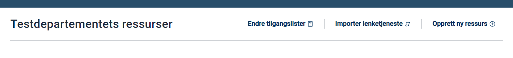
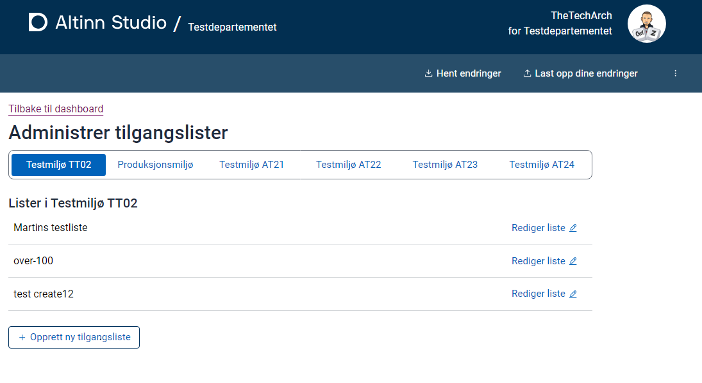
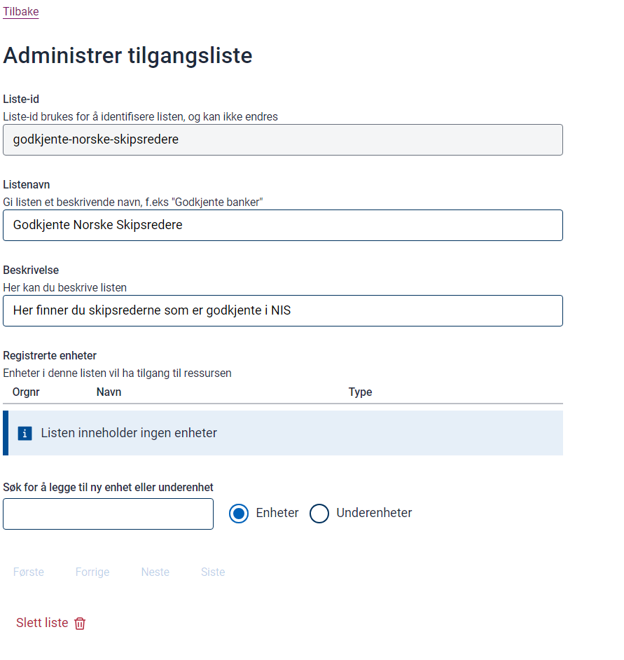
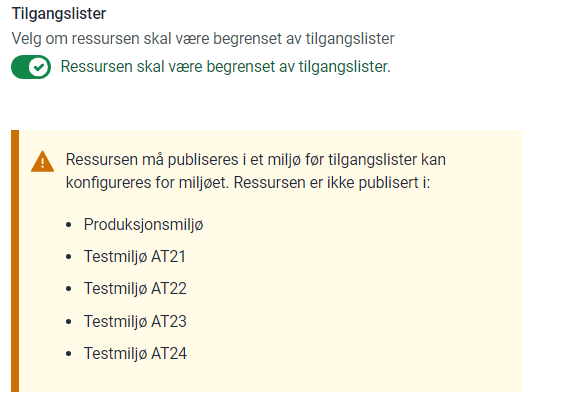

## Background

For certain services, restricting access to specific organizations is necessary. In Altinn 2, this was managed via the Service Rights Registry (SRR). 

In Altinn 3, this functionality is handled by the Resource Rights Registry (RRR) through Access Lists.

## Prerequistes

- Resource Registry Admin privileges
- Membership in the AccessList group for a specified environment

Refer to [Getting Started with Access Lists ](../../getting-started/accesslist-admin-studio/) for more information.

## Create new Access List

Navigate to the resource admin dashboard and click on the link for access list administration.

You’ll arrive at the overview page for Access Lists. Here, you’ll see a list of environments available to your organization.

Select an environment to view its Access Lists.

Click “Create new Access List” and provide a unique name and ID for your list.

Once created, you can add a description to your list.

## Adding members to list

Add organizations as members to your list. 

In production environments, search by name or organization number. In TT02, use the test organization’s number as names won’t display.

## Assign Access List to resource

To assign your list to a resource:

- Enable RRR for the resource.
- Select one or more lists authorized as reportees for the resource.

After updating, publish the resource to various environments. Note: If you enable RRR before setting up the list, access will be lost for all.