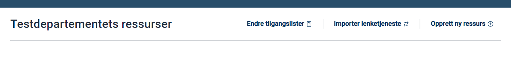
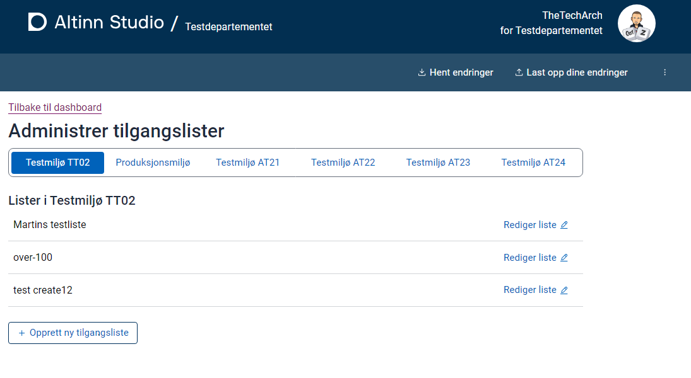
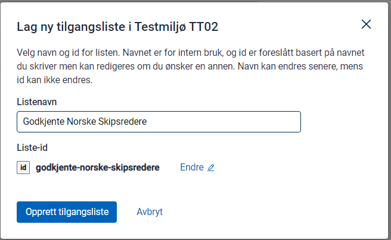
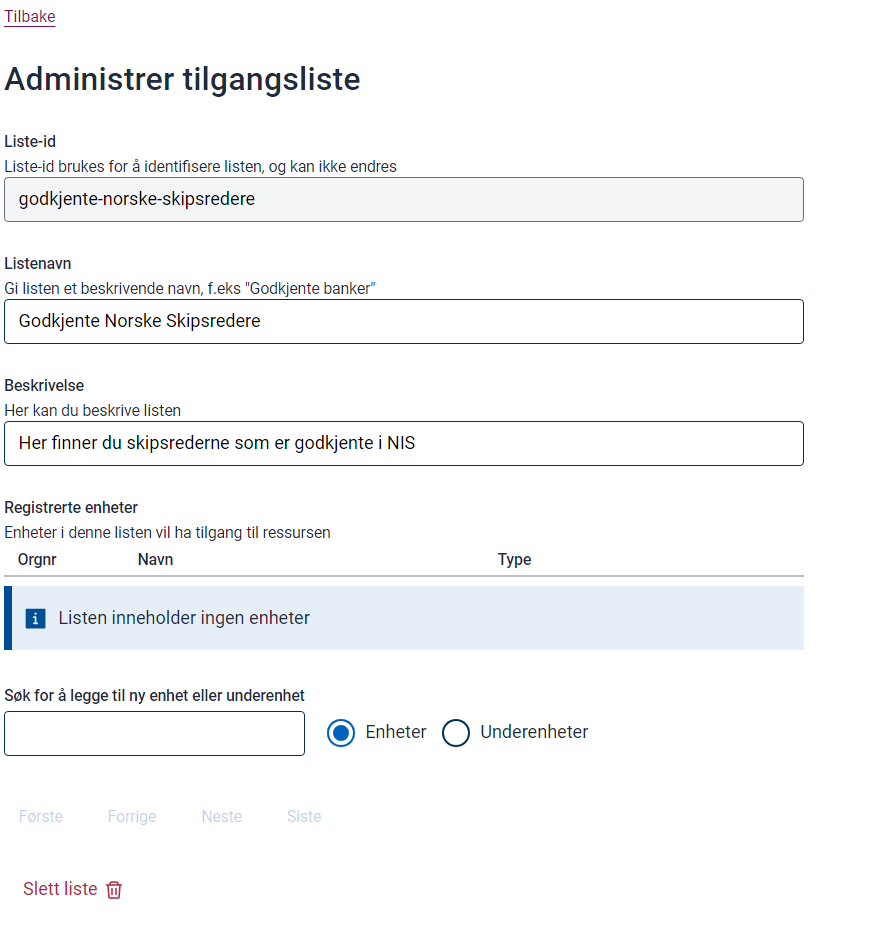
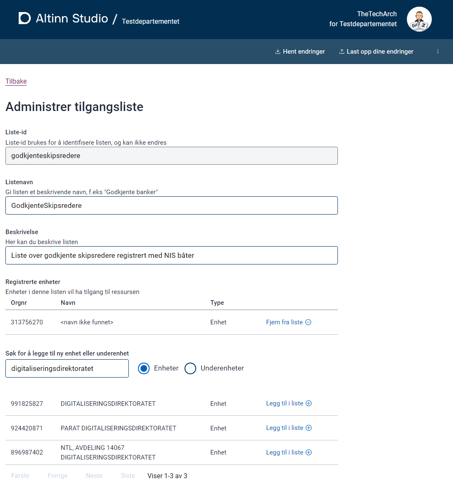
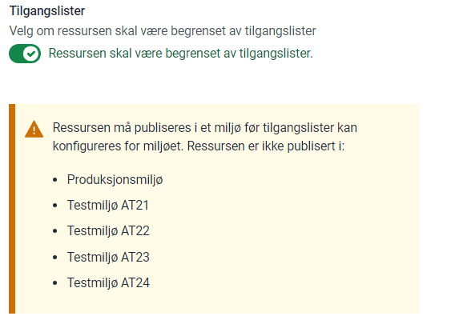
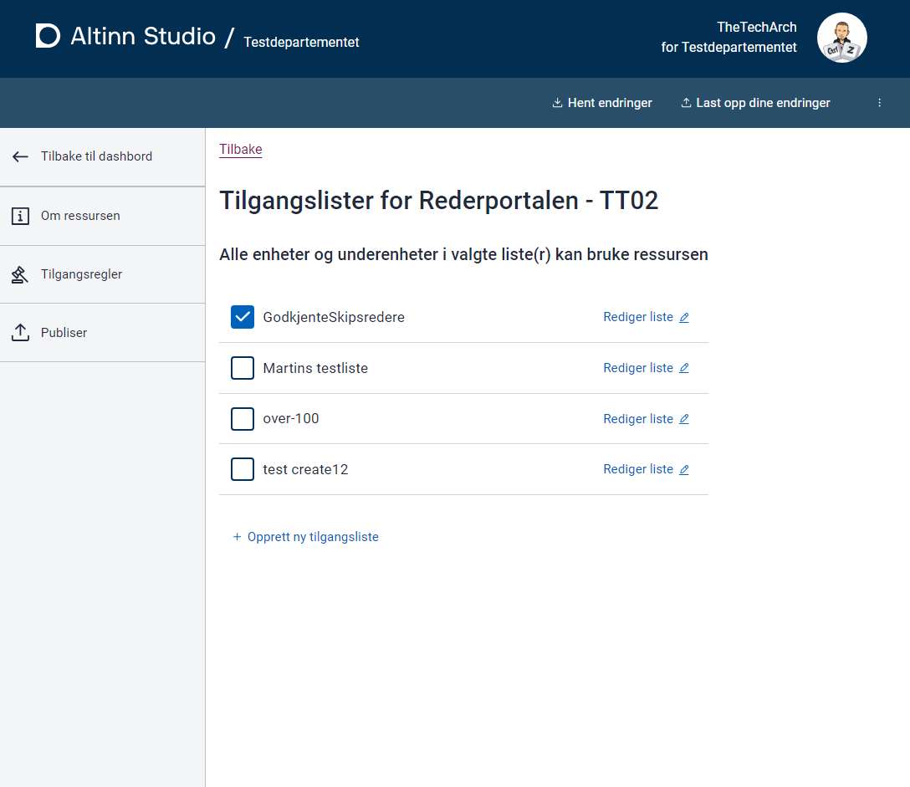

## Background

For visse tjenester er det nødvendig å begrense tilgangen til bestemte organisasjoner. I Altinn 2 ble dette håndtert via Tjenesterettsregisteret (SRR).

I Altinn 3 håndteres denne funksjonaliteten av Ressursrettsregisteret (RRR) gjennom Tilgangslister.

## Prerequistes

- Administrasjonsrettigheter for Ressursregisteret
- Medlemskap i Tilgangsliste-gruppen for et spesifisert miljø

Se [ Komme i gang med Tilgangslister](../../getting-started/accesslist-admin-studio/) for mer informasjon.

## Opprette ny Tilgangsliste

Naviger til ressursadministrasjonsdashbordet og klikk på lenken for administrasjon av tilgangsliste.

Dette tar deg til oversiktssiden for Tilgangslister. Her vil du se en liste over miljøer tilgjengelig for din organisasjon.

Velg et miljø for å vise dets Tilgangslister.

Klikk “Opprett ny Tilgangsliste” og gi listen et unikt navn og ID.

Når listen er opprettet, kan du legge til en beskrivelse av listen din.

## Legge til medlemmer i listen

Legg til organisasjoner som medlemmer i listen din.

I produksjonsmiljøer, søk etter navn eller organisasjonsnummer. I TT02 må du bruke testorganisasjonens nummer da navn ikke vil vises.

## Tildele Tilgangsliste til ressurs

For å tildele listen din til en ressurs:

- Aktiver RRR for ressursen.
- Velg en eller flere lister autorisert som rapportører for ressursen.

Etter oppdatering, publiser ressursen til forskjellige miljøer. Merk: Hvis du aktiverer RRR før listen er satt opp, vil alle brukere miste tilgang.