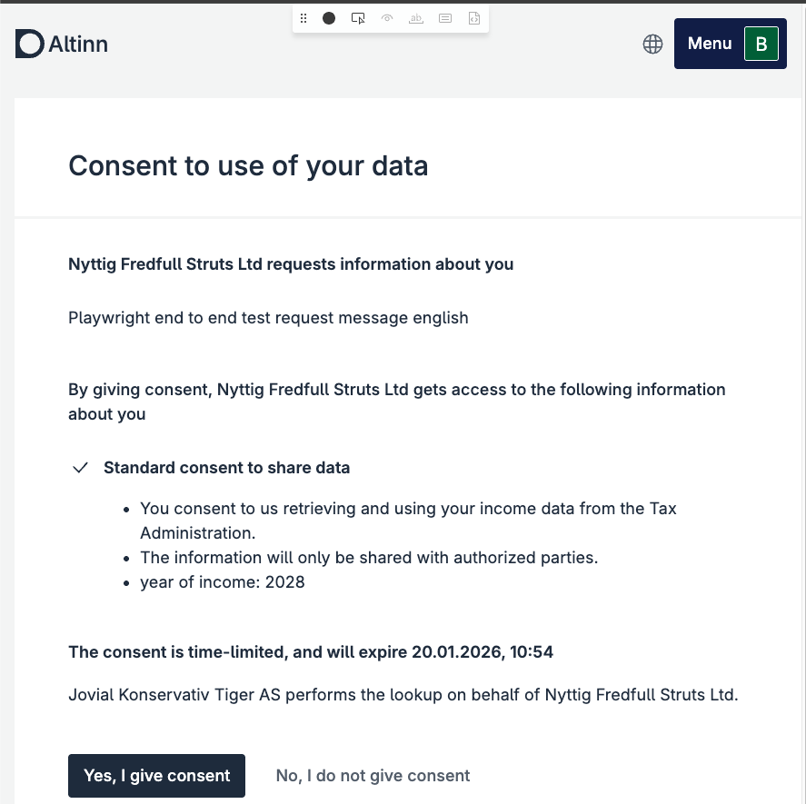

## Introduction

This documentation describes how data consumers can request, retrieve, and manage consent using Altinn 3's consent solution. Consent gives data consumers access to specific data resources for individuals or organizations, as defined by the API provider.

## Glossary

- **Data Consumer**: The organization requesting access to data about an individual or another organization.
- **Resource**: A category of data defined by the actor providing the API in Altinn (e.g., income information, tax base).

## Providers of Consent Solutions

Below are some key actors with consent solutions for Altinn 2. Most are expected to migrate to Altinn 3 during Q3 2025 or Q1 2026:

- **Skatteetaten (Norwegian Tax Administration)**
  - [About Consent](https://skatteetaten.github.io/api-dokumentasjon/en/om/samtykke)
  - [Income API](https://skatteetaten.github.io/api-dokumentasjon/en/api/inntekt)
  - [Summed Tax Base API](https://skatteetaten.github.io/api-dokumentasjon/en/api/summertskattegrunnlag)
  - [Claims and Payments API](https://skatteetaten.github.io/api-dokumentasjon/en/api/kravogbetalinger)
  - [Employer's National Insurance Contribution API](https://skatteetaten.github.io/api-dokumentasjon/en/api/arbeidsgiveravgift)
  - [VAT Reporting Information API](https://skatteetaten.github.io/api-dokumentasjon/en/api/mva_meldingsopplysning)
  - [Foreign Companies Assignments API](https://skatteetaten.github.io/api-dokumentasjon/en/api/oppdragutenlandskevirksomheter)
  - [Outstanding Claims API](https://skatteetaten.github.io/api-dokumentasjon/en/api/restanser)
- **Lånekassen (Norwegian State Educational Loan Fund)**
  - [Student Loan Balance](https://dokumentasjon.dsop.no/dsop_saldostudielan_om.html)

Altinn itself offers APIs for requesting consent and retrieving the status of consent requests.

## 1. Request Consent

### 1.1 Prerequisites

1. The data consumer must have a registered Maskinporten client.
2. The data consumer must have been delegated the consent scope from Digdir.
3. The necessary scopes must be added to the Maskinporten client.
4. Access to request consent for the relevant resource(s) must be granted.

### 1.2 API Endpoint

- **Test**: `POST https://platform.tt02.altinn.no/accessmanagement/api/v1/enterprise/consentrequests/`
- **Production**: `POST https://platform.altinn.no/accessmanagement/api/v1/enterprise/consentrequests/`

#### Request (example)

```jsonc
{
  "id": "77ed8698-e619-4066-9eb4-5c1eb3f165a1", // per-request unique ID
  "from": "urn:altinn:person:identifier-no:21818297804",
  "to": "urn:altinn:organization:identifier-no:991825827",
  "validTo": "2026-07-18T06:18:12.2597103+00:00",
  "consentRights": [
    {
      "action": ["consent"],
      "resource": [
        {
          "type": "urn:altinn:resource",
          "value": "standard-samtykke-for-dele-data"
        }
      ],
      "metaData": {
        "inntektsaar": "2023"
      }
    }
  ],
  "redirectUrl": "https://altinn.no"
}
```

#### Response (example)

```jsonc
{
  "id": "77ed8698-e619-4066-9eb4-5c1eb3f165a1",
  "from": "urn:altinn:person:identifier-no:21818297804",
  "to": "urn:altinn:organization:identifier-no:991825827",
  "requiredDelegator": null,
  "handledBy": null,
  "validTo": "2026-07-18T06:18:12.25971+00:00",
  "consentRights": [
    {
      "action": ["consent"],
      "resource": [
        {
          "type": "urn:altinn:resource",
          "value": "standard-samtykke-for-dele-data"
        }
      ],
      "metaData": {
        "inntektsaar": "2023"
      }
    }
  ],
  "requestMessage": null,
  "consented": null,
  "redirectUrl": "https://altinn.no",
  "consentRequestEvents": [
    {
      "consentEventID": "01981c2f-1de4-7b9f-a7c7-854f1dd4f115",
      "created": "2025-07-18T06:18:26.65293+00:00",
      "performedBy": "urn:altinn:organization:identifier-no:991825827",
      "eventType": "Created",
      "consentRequestID": "77ed8698-e619-4066-9eb4-5c1eb3f165a1"
    }
  ],
  "viewUri": "https://am.ui.tt02.altinn.no/accessmanagement/ui/consent/request?id=77ed8698-e619-4066-9eb4-5c1eb3f165a1"
}
```

## 2. Retrieve Consent Token

In Altinn 3, the consent token is retrieved as part of the Maskinporten token. You request it from Maskinporten using a JWT assertion (RFC 7523) and include the consent reference in `authorization_details`.

```json
{
  "aud": "https://test.maskinporten.no/",
  "iss": "<MASKINPORTEN_CLIENT_ID>",
  "scope": "altinn:consentrequests.read",
  "iat": 1736938000,
  "exp": 1736938120,
  "jti": "<UNIQUE_JTI>",
  "authorization_details": [
    {
      "type": "urn:altinn:consent",
      "id": "<CONSENT_REQUEST_ID>",
      "from": "urn:altinn:person:identifier-no:<PID>"
    }
  ]
}
```

## 3. Consent on Behalf of Others

To create consent requests on behalf of another organization, you must distinguish between:

- The data consumer (consumer): the organization that should be the recipient of the consent (e.g. Sparebank Super).
- The organization that owns the Maskinporten client: the supplier/operations organization that makes the API calls (e.g. Sparebank Super - Drift).

The examples below use fictional actors (TT02):

- Sparebank Super org no (consumer): `313876144`
- Sparebank Super - Drift org no (Maskinporten client is owned here): `310149942`
- Person: `03867199348`

### 3.1 Delegate the required scopes in Altinn (API delegation)

Sparebank Super delegates the required scopes (minimum `altinn:consentrequests.write` and `altinn:consentrequests.read`) to Sparebank Super - Drift in Altinn under API delegation.


### 3.2 Sparebank Super - Drift: get a Maskinporten token to create the consent request

Sparebank Super - Drift requests a Maskinporten access token with scope `altinn:consentrequests.write`, but with `consumer_org` set to Sparebank Super’s organization number.

#### JWT assertion claims (example)

```jsonc
{
  "aud": "https://test.maskinporten.no/",
  "iss": "<MASKINPORTEN_CLIENT_ID_FOR_SPAREBANK_SUPER_DRIFT>",
  "scope": "altinn:consentrequests.write",
  "iat": 1736938000,
  "exp": 1736938120,
  "jti": "<UNIQUE_JTI>",
  "consumer_org": "313876144" // Sparebank Super
}
```

### 3.3 Sparebank Super - Drift: create the consent request (from person, to Sparebank Super)

The consent request is created to Sparebank Super’s org no, but the call is performed using Sparebank Super - Drift’s Maskinporten token (with `consumer_org=313876144`).

#### Request payload (example)

```jsonc
{
  "id": "a005e4e7-78b3-42b4-ce69-dc68cc5349eb",
  "from": "urn:altinn:person:identifier-no:03867199348",
  "to": "urn:altinn:organization:identifier-no:313876144", // The bank
  "validTo": "2026-07-07T13:45:00.0000000+00:00",
  "consentRights": [
    {
      "action": ["consent"],
      "resource": [
        {
          "type": "urn:altinn:resource",
          "value": "enkelt-samtykke"
        }
      ],
      "metaData": {
        "simpletag": "2026"
      }
    }
  ],
  "redirectUrl": "https://altinn.no"
}
```

### 3.4 Person: approve the consent request



### 3.5 Sparebank Super - Drift: retrieve the consent token (Maskinporten token with consent in `authorization_details`)

After approval, Sparebank Super - Drift requests a Maskinporten token with scope `altinn:consentrequests.read` and `authorization_details`. Remember to set `consumer_org` to Sparebank Super’s org no.

#### JWT assertion claims (example)

```jsonc
{
  "aud": "https://test.maskinporten.no/",
  "iss": "<MASKINPORTEN_CLIENT_ID_FOR_SPAREBANK_SUPER_DRIFT>",
  "scope": "altinn:consentrequests.read",
  "iat": 1736938000,
  "exp": 1736938120,
  "jti": "<UNIQUE_JTI>",
  "consumer_org": "313876144", // Sparebank Super
  "authorization_details": [
    {
      "type": "urn:altinn:consent",
      "id": "<CONSENT_REQUEST_ID>",
      "from": "urn:altinn:person:identifier-no:03867199348"
    }
  ]
}
```

The returned token from Maskinporten is used as the consent token towards the API provider (as described in “Use consent”).

## Resources

- [Maskinporten: API Consumer Guide](https://docs.digdir.no/docs/Maskinporten/maskinporten_guide_apikonsument.html)
- [GitHub: Test Implementation](https://github.com/TheTechArch/smartbank)
