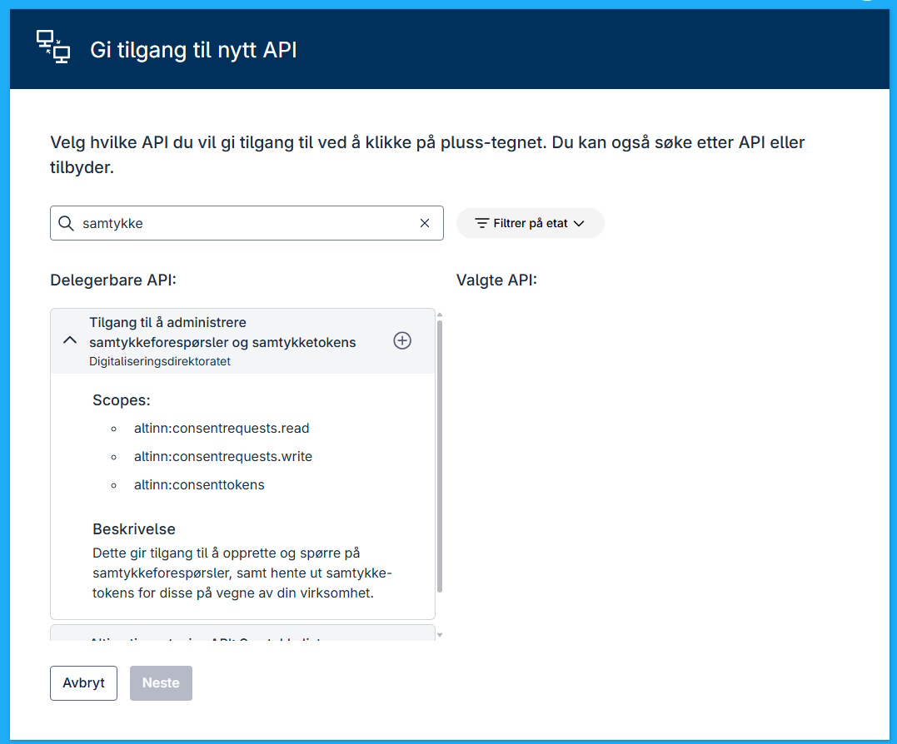
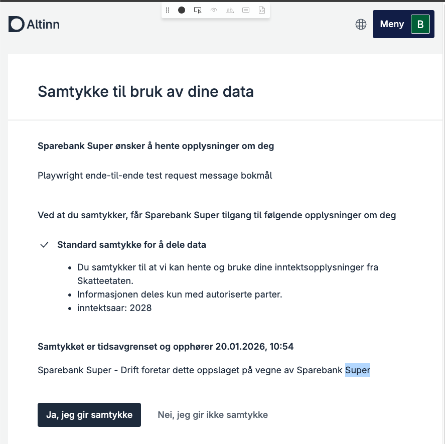

Gjennom samtykke får datakonsumenter tilgang til utvalgte dataressurser for innbyggere eller virksomheter, slik disse er definert av tjenesteeieren.
Det er tjenesteeieren som fastsetter hvilke data som kan deles, hvor lenge samtykket gjelder, og under hvilke vilkår.

### Forutsetning

Du må ha gjennomført stegene beskrevet i Kom i gang med samtykke for datakonsumenter
før du følger denne veiledningen.

## 1. Be om samtykke

Legg til de nødvendige parameterene i forespørselen:

- **Test**: `POST https://platform.tt02.altinn.no/accessmanagement/api/v1/enterprise/consentrequests/`

- **Produksjon**: `POST https://platform.altinn.no/accessmanagement/api/v1/enterprise/consentrequests/`

#### Forespørsel (eksempel)

```jsonc
{
  "id": "77ed8698-e619-4066-9eb4-5c1eb3f165a1",
  "from": "urn:altinn:person:identifier-no:21818297804",
  "to": "urn:altinn:organization:identifier-no:991825827",
  "validTo": "2026-07-18T06:18:12.2597103+00:00",
  "consentRights": [
    {
      "action": ["consent"],
      "resource": [
        {
          "type": "urn:altinn:resource",
          "value": "standard-samtykke-for-dele-data"
        }
      ],
      "metaData": {
        "inntektsaar": "2023"
      }
    }
  ],
  "redirectUrl": "https://altinn.no"
}
```

#### Svar (eksempel)

```jsonc
{
  "id": "77ed8698-e619-4066-9eb4-5c1eb3f165a1",
  "from": "urn:altinn:person:identifier-no:21818297804",
  "to": "urn:altinn:organization:identifier-no:991825827",
  "requiredDelegator": null,
  "handledBy": null,
  "validTo": "2026-07-18T06:18:12.25971+00:00",
  "consentRights": [
    {
      "action": ["consent"],
      "resource": [
        {
          "type": "urn:altinn:resource",
          "value": "standard-samtykke-for-dele-data"
        }
      ],
      "metaData": {
        "inntektsaar": "2023"
      }
    }
  ],
  "requestMessage": null,
  "consented": null,
  "redirectUrl": "https://altinn.no",
  "consentRequestEvents": [
    {
      "consentEventID": "01981c2f-1de4-7b9f-a7c7-854f1dd4f115",
      "created": "2025-07-18T06:18:26.65293+00:00",
      "performedBy": "urn:altinn:organization:identifier-no:991825827",
      "eventType": "Created",
      "consentRequestID": "77ed8698-e619-4066-9eb4-5c1eb3f165a1"
    }
  ],
  "viewUri": "https://am.ui.tt02.altinn.no/accessmanagement/ui/consent/request?id=77ed8698-e619-4066-9eb4-5c1eb3f165a1"
}
```

## 2.1 Hente samtykke-token

I Altinn 3 hentes samtykke-token som en del av Maskinporten-tokenet. Spesifiser følgende i JWT-en:

```json
{
  "aud": "https://test.maskinporten.no/",

  "scope": "altinn:consentrequests.read",

  "iss": "<clientid>",

  "exp": 1752827349,

  "iat": 1752827339,

  "jti": "<jti>",

  "authorization_details": [
    {
      "from": "urn:altinn:person:identifier-no:25922947409",

      "id": "77ed8698-e619-4066-9eb4-5c1eb3f165a1",

      "type": "urn:altinn:consent"
    }
  ]
}
```

## 2.2 Samtykke på vegne av andre

For å opprette samtykkeforespørsler på vegne av en annen virksomhet må dere skille mellom:

- Virksomheten som er datakonsument (consumer): organisasjonen som skal stå som mottaker av samtykket (f.eks. Sparebank Super).
- Virksomheten som har Maskinporten-klienten: leverandør-/driftsorganisasjonen som faktisk kaller API-ene (f.eks. Sparebank Super - Drift).

Eksemplene under bruker fiktive aktører (TT02):

- Sparebank Super orgnr (consumer): `313876144`
- Sparebank Super - Drift orgnr (Maskinporten-klient eies her): `310149942`
- Privatperson: `03867199348`

### 2.2.1 Deleger nødvendige scopes i Altinn (API-delegering)

Sparebank Super delegerer nødvendige scopes (minimum `altinn:consentrequests.write` og `altinn:consentrequests.read`) til Sparebank Super - Drift i Altinn under API-delegering.



### 2.2.2 Sparebank Super - Drift: hent Maskinporten-token for å opprette samtykkeforespørsel

Sparebank Super - Drift henter et Maskinporten access token med scope `altinn:consentrequests.write`, men med `consumer_org` satt til Sparebank Super sitt organisasjonsnummer.

#### JWT (assertion) claims (eksempel)

```jsonc
{
  "aud": "https://test.maskinporten.no/",
  "iss": "<MASKINPORTEN_CLIENT_ID_FOR_SPAREBANK_SUPER_DRIFT>",
  "scope": "altinn:consentrequests.write",
  "iat": 1736938000,
  "exp": 1736938120,
  "jti": "<UNIQUE_JTI>",
  "consumer_org": "313876144" // Sparebank Super
}
```

### 2.2.3 Sparebank Super - Drift: opprett samtykkeforespørsel (fra person, til Sparebank Super)

Selve samtykkeforespørselen opprettes til Sparebank Super sitt orgnr, men kallet gjøres med tokenet til Sparebank Super - Drift (med `consumer_org=313876144`).

#### Request payload (eksempel)

```jsonc
{
  "id": "a005e4e7-78b3-42b4-ce69-dc68cc5349eb",
  "from": "urn:altinn:person:identifier-no:03867199348",
  "to": "urn:altinn:organization:identifier-no:313876144", // Banken
  "validTo": "2026-07-07T13:45:00.0000000+00:00",
  "consentRights": [
    {
      "action": ["consent"],
      "resource": [
        {
          "type": "urn:altinn:resource",
          "value": "enkelt-samtykke"
        }
      ],
      "metaData": {
        "simpletag": "2026"
      }
    }
  ],
  "redirectUrl": "https://altinn.no"
}
```

Du får tilbake en respons som blant annet inneholder `id` (samtykkeforespørselen) og ofte `viewUri` (lenke til UI for å godkjenne).

### 2.2.4 Privatperson: godkjenn samtykkeforespørselen



### 2.2.5 Sparebank Super - Drift: henter samtykke-token (Maskinporten token med consent som `authorization_details`)

Når samtykket er godkjent, henter Sparebank Super - Drift et Maskinporten-token med scope `altinn:consentrequests.read` og `authorization_details`. Husk å oppgi `consumer_org` som Sparebank Super sitt orgnr.

#### JWT (assertion) claims (eksempel)

```jsonc
{
  "aud": "https://test.maskinporten.no/",
  "iss": "<MASKINPORTEN_CLIENT_ID_FOR_SPAREBANK_SUPER_DRIFT>",
  "scope": "altinn:consentrequests.read",
  "iat": 1736938000,
  "exp": 1736938120,
  "jti": "<UNIQUE_JTI>",
  "consumer_org": "313876144", // Sparebank Super
  "authorization_details": [
    {
      "type": "urn:altinn:consent",
      "id": "<CONSENT_REQUEST_ID>",
      "from": "urn:altinn:person:identifier-no:03867199348"
    }
  ]
}
```

Tokenet du får tilbake fra Maskinporten brukes videre som samtykketoken mot tjenesteeierens API (som beskrevet under «Bruke samtykke»).

## 3. Bruke samtykke

(...)

Etter dette er du klar for å ta i bruk samtykketjenesten.

## Ressurser

- [Maskinporten: API-konsument-guide](https://docs.digdir.no/docs/Maskinporten/maskinporten_guide_apikonsument.html)

- [GitHub: Testimplementasjon](https://github.com/TheTechArch/smartbank)

- [Kjørende smartbank](https://smartbankdemo.azurewebsites.net/)
