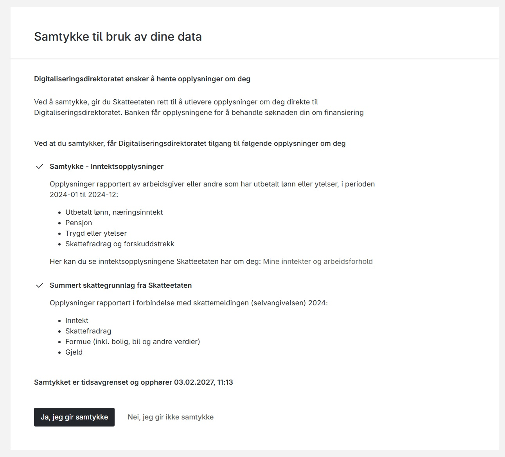

### Forutsetninger

1. Datakonsumenten må ha en registrert Maskinporten-klient.
2. Datakonsumenten må ha fått delegert samtykke-scope fra Digdir. (altinn:consentrequests.write & altinn:consentrequests.read) 
3. De nødvendige scopene må legges til i Maskinporten-klienten.
4. Tilgang til å be om samtykke for relevante ressurs(er) må være gitt.


### API Endpoint

- **Test**: `POST https://platform.tt02.altinn.no/accessmanagement/api/v1/enterprise/consentrequests/`
- **Produksjon**: `POST https://platform.altinn.no/accessmanagement/api/v1/enterprise/consentrequests/`

### Forespørsel (eksempel)

```jsonc
{
  "id": "77ed8698-e619-4066-9eb4-5c1eb3f165a1",
  "from": "urn:altinn:person:identifier-no:21818297804",
  "to": "urn:altinn:organization:identifier-no:991825827",
  "validTo": "2026-07-18T06:18:12.2597103+00:00",
  "consentRights": [
    {
      "action": ["consent"],
      "resource": [
        {
          "type": "urn:altinn:resource",
          "value": "standard-samtykke-for-dele-data"
        }
      ],
      "metaData": {
        "inntektsaar": "2023"
      }
    },
    {
      "action": ["consent"],
      "resource": [
        {
          "type": "urn:altinn:resource",
          "value": "standard-samtykke-for-dele-data"
        }
      ],
      "metaData": {
        "inntektsaar": "2024"
      }
    }
  ],
  "redirectUrl": "https://bankenmin.no/huslaan/?consentId=77ed8698-e619-4066-9eb4-5c1eb3f165a1",
  "portalViewModel": "hide"
}
```

#### Redirect URL

Som del av samtykkeforespørselen spesifiserer konsumenten hvilken URL brukeren skal returneres til etter at samtykkebehandlingen er fullført. 

Dersom det er behov for å motta en identifikator tilbake i responsen, kan denne legges til som en query-parameter i redirect URL-en med ønsket parameternavn. For eksempel kan `authorizationCode` brukes, som var terminologien fra Altinn 2.

**Eksempel på redirect URL med parameter:**

```
https://bankenmin.no/huslaan/?consentId=77ed8698-e619-4066-9eb4-5c1eb3f165a1
```

#### PortalViewMode
Dersom samtykket ikke er del av en synkron flyt (der bruker forventes å ta stilling til samtykket med en gang), kan man i samtykkeforespørselen sette PortalViewMode til "show". Etter forespørselen er sendt, vil brukeren som skal gi samtykke se samtykkeforespørselen i Altinn-portalen under tilgangsstyring, og kan gi sitt samtykke der.

### Svar (eksempel)

```jsonc
{
  "id": "77ed8698-e619-4066-9eb4-5c1eb3f165a1",
  "from": "urn:altinn:person:identifier-no:21818297804",
  "to": "urn:altinn:organization:identifier-no:991825827",
  "requiredDelegator": null,
  "handledBy": null,
  "validTo": "2026-07-18T06:18:12.25971+00:00",
  "consentRights": [
    {
      "action": ["consent"],
      "resource": [
        {
          "type": "urn:altinn:resource",
          "value": "standard-samtykke-for-dele-data"
        }
      ],
      "metaData": {
        "inntektsaar": "2023"
      }
    },
    {
      "action": ["consent"],
      "resource": [
        {
          "type": "urn:altinn:resource",
          "value": "standard-samtykke-for-dele-data"
        }
      ],
      "metaData": {
        "inntektsaar": "2024"
      }
    }
  ],
  "requestMessage": null,
  "consented": null,
  "redirectUrl": "https://altinn.no",
  "consentRequestEvents": [
    {
      "consentEventID": "01981c2f-1de4-7b9f-a7c7-854f1dd4f115",
      "created": "2025-07-18T06:18:26.65293+00:00",
      "performedBy": "urn:altinn:organization:identifier-no:991825827",
      "eventType": "Created",
      "consentRequestID": "77ed8698-e619-4066-9eb4-5c1eb3f165a1"
    }
  ],
  "viewUri": "https://am.ui.tt02.altinn.no/accessmanagement/ui/consent/request?id=77ed8698-e619-4066-9eb4-5c1eb3f165a1"
}
```


### Konkret eksempel innteksopplysninger og skattegrunnlag

Skattetaten har detaljert eksempel på bruk av samtykke for skattegrunnlag og inntektsgrunnlag.  Disse eksemplene finner du [her](https://skatteetaten.github.io/api-dokumentasjon/om/samtykke)

Nedenfor viser vi en sammensatt forespørsel av de mest vanlige tjenstene for lånesøknader. 


```jsonc
{
  "id": "f70542a8-d97a-40a8-9ef7-221603ffd5e6",
  "from": "urn:altinn:person:identifier-no:25922947409",
  "to": "urn:altinn:organization:identifier-no:991825827",
  "validTo": "2026-07-18T06:18:12.2597103+00:00",
  "consentRights": [
    {
      "action": [
        "consent"
      ],
      "resource": [
        {
          "type": "urn:altinn:resource",
          "value": "ske-samtykke-sbl-inntekt"
        }
      ],
      "metadata": {
        "fraogmed": "2024-01",
        "tilogmed": "2024-12"
      }
    },
    {
      "action": [
        "consent"
      ],
      "resource": [
        {
          "type": "urn:altinn:resource",
          "value": "ske-samtykke-sbl-summert-skattegrunnlag"
        }
      ],
      "metadata": {
        "inntektsaar": "2024"
      }
    }
  ],
  "redirectUrl": "https://smartbankdemo.azurewebsites.net/private/loanapplication/consentresult?requestId=f70542a8-d97a-40a8-9ef7-221603ffd5e6&environment=tt02"
}
```

```json
{
  "id": "f70542a8-d97a-40a8-9ef7-221603ffd5e6",
  "from": "urn:altinn:person:identifier-no:25922947409",
  "to": "urn:altinn:organization:identifier-no:991825827",
  "requiredDelegator": null,
  "handledBy": null,
  "validTo": "2027-02-03T10:13:27.897002+00:00",
  "consentRights": [
    {
      "action": [
        "consent"
      ],
      "resource": [
        {
          "type": "urn:altinn:resource",
          "value": "ske-samtykke-sbl-inntekt"
        }
      ],
      "metadata": {
        "fraogmed": "2024-01",
        "tilogmed": "2024-12"
      }
    },
    {
      "action": [
        "consent"
      ],
      "resource": [
        {
          "type": "urn:altinn:resource",
          "value": "ske-samtykke-sbl-summert-skattegrunnlag"
        }
      ],
      "metadata": {
        "inntektsaar": "2024"
      }
    }
  ],
  "requestMessage": null,
  "consented": "2026-02-03T10:14:05.419279+00:00",
  "redirectUrl": "https://smartbankdemo.azurewebsites.net/private/loanapplication/consentresult?requestId=f70542a8-d97a-40a8-9ef7-221603ffd5e6&environment=tt02",
  "consentRequestEvents": [
    {
      "consentEventID": "019c22fe-2b6a-7352-a77a-9b76da385e08",
      "created": "2026-02-03T10:13:28.54048+00:00",
      "performedBy": "urn:altinn:organization:identifier-no:991825827",
      "eventType": "Created",
      "consentRequestID": "f70542a8-d97a-40a8-9ef7-221603ffd5e6"
    }
  ],
  "viewUri": "https://am.ui.tt02.altinn.no/accessmanagement/ui/consent/request?id=f70542a8-d97a-40a8-9ef7-221603ffd5e6"
}
```


Skjermbildet nedenfor viser hvordan samtykkeforespørsel for disse ressursene presenteres til sluttbruker.





Nedenfor viser hvordan responsen ser ut hvis man henter ut status på forespørsel etter samtykke er gitt


```json
{
  "id": "f70542a8-d97a-40a8-9ef7-221603ffd5e6",
  "from": "urn:altinn:person:identifier-no:25922947409",
  "to": "urn:altinn:organization:identifier-no:991825827",
  "requiredDelegator": null,
  "handledBy": null,
  "validTo": "2027-02-03T10:13:27.897002+00:00",
  "consentRights": [
    {
      "action": [
        "consent"
      ],
      "resource": [
        {
          "type": "urn:altinn:resource",
          "value": "ske-samtykke-sbl-inntekt"
        }
      ],
      "metadata": {
        "fraogmed": "2024-01",
        "tilogmed": "2024-12"
      }
    },
    {
      "action": [
        "consent"
      ],
      "resource": [
        {
          "type": "urn:altinn:resource",
          "value": "ske-samtykke-sbl-summert-skattegrunnlag"
        }
      ],
      "metadata": {
        "inntektsaar": "2024"
      }
    }
  ],
  "requestMessage": null,
  "consented": "2026-02-03T10:14:05.419279+00:00",
  "redirectUrl": "https://smartbankdemo.azurewebsites.net/private/loanapplication/consentresult?requestId=f70542a8-d97a-40a8-9ef7-221603ffd5e6&environment=tt02",
  "consentRequestEvents": [
    {
      "consentEventID": "019c22fe-2b6a-7352-a77a-9b76da385e08",
      "created": "2026-02-03T10:13:28.54048+00:00",
      "performedBy": "urn:altinn:organization:identifier-no:991825827",
      "eventType": "Created",
      "consentRequestID": "f70542a8-d97a-40a8-9ef7-221603ffd5e6"
    },
    {
      "consentEventID": "019c22fe-bb6d-7cbb-9c62-fe10f017da70",
      "created": "2026-02-03T10:14:05.419279+00:00",
      "performedBy": "urn:altinn:person:identifier-no:25922947409",
      "eventType": "Accepted",
      "consentRequestID": "f70542a8-d97a-40a8-9ef7-221603ffd5e6"
    }
  ],
  "viewUri": "https://am.ui.tt02.altinn.no/accessmanagement/ui/consent/request?id=f70542a8-d97a-40a8-9ef7-221603ffd5e6"
}
```

Nedenfor vises dekodet token for dette samtykket.

```json
{
  "rawToken": "eyJraWQiOiJiZFhMRVduRGpMSGpwRThPZnl5TUp4UlJLbVo3MUxCOHUxeUREbVBpdVQwIiwiYWxnIjoiUlMyNTYifQ.eyJhdXRob3JpemF0aW9uX2RldGFpbHMiOlt7InR5cGUiOiJ1cm46YWx0aW5uOmNvbnNlbnQiLCJpZCI6ImY3MDU0MmE4LWQ5N2EtNDBhOC05ZWY3LTIyMTYwM2ZmZDVlNiIsImZyb20iOiJ1cm46YWx0aW5uOnBlcnNvbjppZGVudGlmaWVyLW5vOjI1OTIyOTQ3NDA5IiwidG8iOnsiYXV0aG9yaXR5IjoiaXNvNjUyMy1hY3RvcmlkLXVwaXMiLCJJRCI6IjAxOTI6OTkxODI1ODI3In0sImNvbnNlbnRlZCI6IjIwMjYtMDItMDNUMTA6MTQ6MDUuNDE5Mjc5KzAwOjAwIiwidmFsaWRUbyI6IjIwMjctMDItMDNUMTA6MTM6MjcuODk3MDAyKzAwOjAwIiwiY29uc2VudFJpZ2h0cyI6W3siYWN0aW9uIjpbImNvbnNlbnQiXSwicmVzb3VyY2UiOlt7InR5cGUiOiJ1cm46YWx0aW5uOnJlc291cmNlIiwidmFsdWUiOiJza2Utc2FtdHlra2Utc2JsLWlubnRla3QifV0sIm1ldGFkYXRhIjp7ImZyYW9nbWVkIjoiMjAyNC0wMSIsInRpbG9nbWVkIjoiMjAyNC0xMiJ9fSx7ImFjdGlvbiI6WyJjb25zZW50Il0sInJlc291cmNlIjpbeyJ0eXBlIjoidXJuOmFsdGlubjpyZXNvdXJjZSIsInZhbHVlIjoic2tlLXNhbXR5a2tlLXNibC1zdW1tZXJ0LXNrYXR0ZWdydW5ubGFnIn1dLCJtZXRhZGF0YSI6eyJpbm50ZWt0c2FhciI6IjIwMjQifX1dfV0sInNjb3BlIjoiYWx0aW5uOmNvbnNlbnRyZXF1ZXN0cy5yZWFkIiwiaXNzIjoiaHR0cHM6Ly90ZXN0Lm1hc2tpbnBvcnRlbi5uby8iLCJjbGllbnRfYW1yIjoicHJpdmF0ZV9rZXlfand0IiwidG9rZW5fdHlwZSI6IkJlYXJlciIsImV4cCI6MTc3MDExMzc2NywiaWF0IjoxNzcwMTEzNjQ3LCJjbGllbnRfaWQiOiIxMDdjNmY1OC1lMDZiLTQ0ZTktYmU3YS0xMWVhNDRjN2FkOGIiLCJqdGkiOiJDaXAtVE82TFNvcDRHMWQ2dU9DSW1tVVVTaXpFelZDYzhDR0dINVNtWTM0IiwiY29uc3VtZXIiOnsiYXV0aG9yaXR5IjoiaXNvNjUyMy1hY3RvcmlkLXVwaXMiLCJJRCI6IjAxOTI6OTkxODI1ODI3In19.Ji0tzG1fEqU5xLCYmF4mLngRpXyRexCxOwVlNBNSVoZjN3qm7artYoLYgfWOpLxoxPn4Oqyn6Osfe0jy2okC7gAzEImThmnuaajY6HFAvozQTX5y7DnpIDSZvgPCN2BH-8NY5KZL0VCYrP-eo8kITS4ri8_4CT9ncJXZTbj035PZCJmsfh2fcdv17CuK1FYDxOGEtNHYwp3cqHftgfZDdXnWxlTAt6SX7-zlcG-E_yAclH-fGx4vyVaITJe4BYAzuXsy_cm0EsTSCiAnzpY0xWuc0mP_IkAeoyf3OmdZOj2ic53G0sRKqSHy9Bbtv0djeAd27OnTM2mSMHsZR8VYhpdB6EVOMTlP0BCcrXo6t6MfXZtS6CIpfIxwqCwK1O1O1_NKQ4UeEnsO71XG-i-YQ6kTXFp3nPkHff4Gnnm5_KMvvRuSg5OruRVdx0r2Y8en3n9RXKQabWhv_faJVWrUGoLwui1MQFtgRDheCS81z3azd2ZKzoBJjQDPvuFOvzA4",
  "header": {
    "kid": "bdXLEWnDjLHjpE8OfyyMJxRRKmZ71LB8u1yDDmPiuT0",
    "alg": "RS256"
  },
  "payload": {
    "authorization_details": [
      {
        "type": "urn:altinn:consent",
        "id": "f70542a8-d97a-40a8-9ef7-221603ffd5e6",
        "from": "urn:altinn:person:identifier-no:25922947409",
        "to": {
          "authority": "iso6523-actorid-upis",
          "ID": "0192:991825827"
        },
        "consented": "2026-02-03T10:14:05.419279+00:00",
        "validTo": "2027-02-03T10:13:27.897002+00:00",
        "consentRights": [
          {
            "action": [
              "consent"
            ],
            "resource": [
              {
                "type": "urn:altinn:resource",
                "value": "ske-samtykke-sbl-inntekt"
              }
            ],
            "metadata": {
              "fraogmed": "2024-01",
              "tilogmed": "2024-12"
            }
          },
          {
            "action": [
              "consent"
            ],
            "resource": [
              {
                "type": "urn:altinn:resource",
                "value": "ske-samtykke-sbl-summert-skattegrunnlag"
              }
            ],
            "metadata": {
              "inntektsaar": "2024"
            }
          }
        ]
      }
    ],
    "scope": "altinn:consentrequests.read",
    "iss": "https://test.maskinporten.no/",
    "client_amr": "private_key_jwt",
    "token_type": "Bearer",
    "exp": 1770113767,
    "iat": 1770113647,
    "client_id": "107c6f58-e06b-44e9-be7a-11ea44c7ad8b",
    "jti": "Cip-TO6LSop4G1d6uOCImmUUSizEzVCc8CGGH5SmY34",
    "consumer": {
      "authority": "iso6523-actorid-upis",
      "ID": "0192:991825827"
    }
  }
}
```


Dette kan testes i [Smartbank testapplikasjon i TT02](https://smartbankdemo.azurewebsites.net/private/loanapplication)
