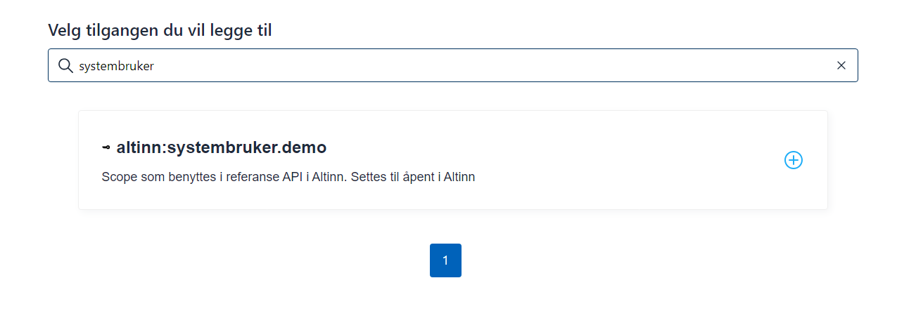
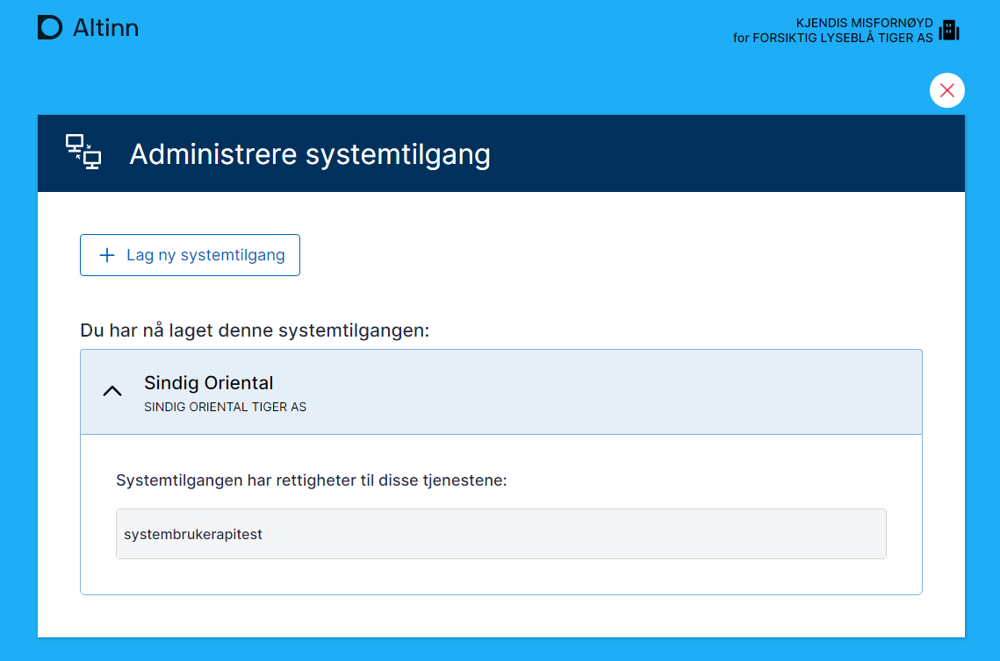

#### Actions by System Vendor (SmartCloud AS)

1.  Contact Digdir

    - The System vendor must contact Digdir to get access to the system register, system user scopes. Procedures for this is described on [Samarbeisportalen](https://samarbeid.digdir.no/altinn/kom-i-gang/2868).

2.  Creating a Maskinporten Client for the System
    - SmartCloud AS wants to integrates the system user into their accounting software, SmartCloud.
    - To integrate, they must create a client in Maskinporten for system SmartCloud, which gets a client ID that will be used for authentication and authorization.
    - On the [Collaboration Portal](https://samarbeid.digdir.no/altinn/kom-i-gang-i-testmiljoet-tt02/2868), you can read more about the steps that must be completed before you can begin integration and testing against our test environment (TT02).
    - Refer the guide for establishing machineporten integration [Machineporten as consumer](https://samarbeid.digdir.no/maskinporten/konsument/119)
    - To consume public APIs with system users, you need to register at least one MaskinPorten integration.
      This can be done in the [collaboration portal](https://docs.digdir.no/docs/Maskinporten/maskinporten_sjolvbetjening_web#opprette-klient-for-%C3%A5-konsumere-api) or via [API](https://docs.digdir.no/docs/Maskinporten/maskinporten_sjolvbetjening_api#registrere-klient).
3.  Delegated access to the scope for registering a system in the system register: `altinn:authentication/systemregister.write`

    If you want to use the provider-controlled flow for creating a system user, you need the following scopes to create requests and check status:

    - `altinn:authentication/systemuser.request.read`
    - `altinn:authentication/systemuser.request.write`

    Additionally, access to scopes for the APIs that the system will use is required. This information will be held by the service owner.

4.  Registering the System in Altinn’s System Register
    - The first step after gaining access to the system register is to register the system.
    - The system is typically web-based software available in the market, which end customers (businesses) can use for communication with the public sector.
    - SmartCloud AS then registers SmartCloud system in the Altinn System Register.
    - They define the required rights for accessing "Krav og betalinger" by associating the client ID with the relevant permissions.
    - Refer [here](/api/authentication/systemuserapi/systemregister/model/) for the detailed description for information about each input.

```
  {
  "id": "991825827_smartcloud",
  "systemVendorOrgNumber": "991825827",
  "vendor":
    {
      "authority" : "iso6523-actorid-upis",
      "ID" : "0192:991825827"
    },
  "name":
    {
        "nb":"SmartCloud 1",
        "en":"SmartCloud 1",
        "nn":"Smart SKY"
    },
  "description":
    {
        "nb":"SmartCloud er verdens beste system.",
        "en":"SmartCloud Rocks.",
        "nn":"SmartSky er vestlandets beste system"
    },
  "rights": [
    {
        "resource": [
        {
          "id": "urn:altinn:resource",
          "value": "ske-krav-og-betalinger"
        }
      ]
    }
  ],
  "clientId": [
    "xxxxxx-xxxx-xxxx-xxxx-xxxxxxx"
  ],
  "allowedredirecturls": [
    "https://smartcloudxxxx/receipt"
  ],
  "isVisible": true
}
```

- Registering the System with required access packages in Altinn’s System Register. In tis example we register a system with required access for an accesspackage

  ```
  {
    "id": "991825827_smartcloud_ap",
    "systemVendorOrgNumber": "991825827",
    "vendor":
      {
        "authority" : "iso6523-actorid-upis",
        "ID" : "0192:991825827"
      },
    "name":
      {
          "nb":"Smartcloud TP",
          "en":"SmartCloud AP",
          "nn":"Smartcloud TP"
      },
    "description":
      {
          "nb":"SmartCloud er verdens beste system.",
          "en":"SmartCloud Rocks",
          "nn":"SmartSky er vestlandets beste system"
      },
      "accessPackages":
      [
          {
              "urn": "urn:altinn:accesspackage:regnskapsforer-med-signeringsrettighet"
          }
      ],
    "clientId": [
      "xxxxx-xxxx-xxx-xxx-xxx"
    ],
    "allowedredirecturls": [
      "https://smartcloudxxxx/receipt"
    ],
    "isVisible": true
  }
  ```

- Refer [here](https://platform.tt02.altinn.no/accessmanagement/api/v1/meta/info/accesspackages/export) for list of available access packages on tt02 environment.
- For all subsequent communications, the system vendor must reference the value specified in the 'id' field.

### Creating a System User For Standard System User

The system user can be created in two ways

1. End user driven
   - Smartcloud As must request "TILFELDIG SUBTIL APE" (end user) to login to altinn portal and create a system user for their system SmartCloud
2. Vendor driven

   - SmartCloud AS creates a system user request (via altinn api for system user request) from within SmartCloud, which is sent to Altinn.
     For detailed information on each input field, refer the documentation [here](/api/authentication/systemuserapi/systemuserrequest/external/model/)

   ```
   {
     "externalRef": "d5cc6e61-023e-4945-82cc-3f32d8ee28ee",
     "systemId": "991825827_smartcloud",
     "partyOrgNo": "310904473",
     "rights": [
         {
             "resource": [
                 {
                     "id": "urn:altinn:resource",
                     "value": "ske-krav-og-betalinger"
                 }
             ]
         }
     ],
     "redirectUrl": "https://smartcloudxxxxxxx/receipt",
   }

   ```

- This request includes the necessary access rights to perform tasks related to the "Krav og betalinger" service on behalf of TILFELDIG SUBTIL APE (the company, end user).
- The response is for example

  ```
  {
      "id": "505f8488-3d48-4c15-8e21-35cb9432f815",
      "externalRef": "smartcloud_demo_test",
      "systemId": "991825827_smartcloud",
      "partyOrgNo": "310904473",
      "rights": [
          {
              "resource": [
                  {
                      "id": "urn:altinn:resource",
                      "value": "ske-krav-og-betalinger"
                  }
              ]
          }
      ],
      "status": "New",
      "redirectUrl": "https://smartcloudxxxxxxxxx/receipt",
      "confirmUrl": "https://am.ui.tt02.altinn.no/accessmanagement/ui/systemuser/request?id=505f8488-3d48-4c15-8e21-35cb9432f815"
  }

  ```

- The confirmurl is sent to the end user for approval. Follow the guide for end user for
  - [Standard system user](../../enduser/#guide-for-end-user-stadig-konsert-dagligleder-of-tilfeldig-subtil-ape)

### Creating a System User For Agent System User

- The system user for agent system user can be created only by system user request
- SmartCloud AS creates a system user request (via altinn api for system user request) from within SmartCloud, which is sent to Altinn.
  For detailed information on each input field, refer the documentation [here](/api/authentication/systemuserapi/systemuserrequest/external/model/)

  ```
  {
      "externalRef": "smartcloud_demo_agent_test",
      "systemId": "991825827_smartcloud_ap",
      "partyOrgNo": "314250052",
      "accessPackages":
      [
          {
              "urn": "urn:altinn:accesspackage:regnskapsforer-med-signeringsrettighet"
          }
      ],
      "redirectUrl": "https://smartcloudaltinn.azurewebsites.net/receipt"
  }

  ```

- This request includes the necessary access packages to perform tasks related to the services that the access package gives access to.
- The response is for example

  ```
  {
      "id": "605bb239-23b1-4d11-aae8-a40eb683aa1f",
      "externalRef": "smartcloud_demo_agent_test",
      "systemId": "991825827_smartcloud_ap",
      "partyOrgNo": "314250052",
      "accessPackages": [
          {
              "urn": "urn:altinn:accesspackage:regnskapsforer-med-signeringsrettighet"
          }
      ],
      "status": "New",
      "redirectUrl": "https://smartcloudxxxxx.azurewebsites.net/receipt",
      "confirmUrl": "https://am.ui.tt02.altinn.no/accessmanagement/ui/systemuser/agentrequest?id=605bb239-23b1-4d11-aae8-a40eb683aa1f"
  }

  ```

- The confirmurl is sent to the end user, here the auditing organisation for approval. Once approved, the end user can add clients to the system user. Follow the guide for end user for
  - [Agent system user](../../enduser/#guide-for-end-user-dress-minst-client-administrator-for-tilbakeholden-usymmetrisk-tiger-as-)

See [Samarbeisportalen](https://samarbeid.digdir.no/altinn/systembruker/2542) for illustrasjon and webinar.

Refer [api documentation](/api/authentication/systemuserapi/) for more information on available endpoints.

## Maskinporten authentication

When the system needs to authenticate as the system user for the customer, the JWT grant request to Maskinporten must contain information about the customer.

### JWT Grant

```json
{
  "aud": "https://maskinporten.no",
  "sub": "fc9a8287-e7cb-45e5-b90e-123048d32d85",
  "authorization_details": [
    {
      "systemuser_org": {
        "authority": "iso6523-actorid-upis",
        "ID": "0192:310385980"
      },
      "type": "urn:altinn:systemuser"
    }
  ],
  "scope": "krr:global/kontaktinformasjon.read",
  "iss": "fc9a8287-e7cb-45e5-b90e-123048d32d85",
  "exp": 1718124835,
  "iat": 1718124715,
  "jti": "89365ecd-772b-4462-a4de-ac36af8ef3e2"
}
```

### JWT Token

```json
{
  "authorization_details": [
    {
      "type": "urn:altinn:systemuser",
      "systemuser_org": {
        "authority": "iso6523-actorid-upis",
        "id": "0192:314168267"
      },
      "systemuser_id": ["ebe4a681-0a8c-429e-a36f-8f9ca942b59f"],
      "system_id": "matrix_test"
    }
  ],
  "scope": "krr:global/kontaktinformasjon.read",
  "iss": "https://test.maskinporten.no/",
  "client_amr": "private_key_jwt",
  "token_type": "Bearer",
  "exp": 1718175135,
  "iat": 1718175015,
  "client_id": "fc9a8287-e7cb-45e5-b90e-123048d32d85",
  "jti": "-SpfU--1Zn_Oqvkpjwu3oVn--VLcPzSAwjqyiP6zBEw",
  "consumer": {
    "authority": "iso6523-actorid-upis",
    "ID": "0192:314330897"
  }
}
```

See also documentation at [Maskinporten](https://docs.digdir.no/docs/Maskinporten/maskinporten_func_systembruker).

### Using system user token against API

The token received from Maskinporten is attached as a Bearer Token to the APIs being called.

### Testing system user in TT02

To test system user in TT02, the following is required:

- System provider registered in Maskinporten. This is done via servicedesk@digdir.no.
- System provider registered in Altinn. This is done via api for system vendor.
- System integration registered in Maskinporten test.

For creating system users, test users/organizations from Tenor can be used.

### Reference implementation and setup

A reference implementation has been developed to demonstrate the use of system user. It is developed in C# and can be run as a console application.
It does the following:

1. Creates a token based on configured JSON Web Key, client ID, scope, and organization number of the system user creator.
2. Based on the token received, it makes calls to reference APIs that require system user.

See code with documentation [here](https://github.com/TheTechArch/altinn-systemuser).

### Setting up reference implementation with own configuration

A reference implementation has been developed to demonstrate the use of system user. It is developed in C# and can be run as a console application.

It does the following:

1. Creates a token based on configured JSON Web Key, client ID, scope, and organization number of the system user creator.
2. Based on the token received, it makes calls to reference APIs that require system user.

See code with documentation [here](https://github.com/TheTechArch/altinn-systemuser).

### Setting up reference implementation with own configuration

The repository contains the necessary test certificate to run the application. The following must be done to set up your own integration as a system provider:

1. Log in to [onboarding Maskinporten](https://onboarding.test.maskinporten.no/). Here you can use a test ID that is the CEO of a test entity.

   

   

   

   

   

   

   

2. Get the system registered in the System Register with the correct client ID and linkage to necessary resources/access packages.

3. Log in with a test user at tt02.altinn.no. The user must have the access management role in Altinn for a test organization and go to the page [https://authn.ui.tt02.altinn.no/authfront/ui/auth/creation](https://authn.ui.tt02.altinn.no/authfront/ui/auth/creation).

   

   

   

4. Configure key, certificate, client ID, and scope in the test application.

```c#
string clientID = "7ee41fce-9f6e-4c32-8195-0fe2c1517f43";
string scope = "altinn:systembruker.demo";
string systemUserOrg = "210493352";
string pemCertificatePath = @".\mp-key.pem";
```
