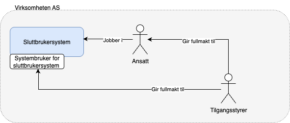
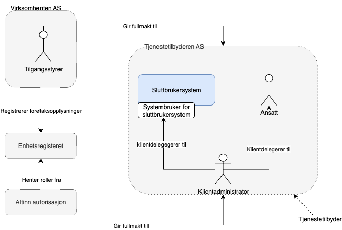

En systembruker er en virtuell bruker som en virksomhet kan opprette i Altinn. Den gir systemer og programvare, for eksempel et regnskapsprogram, tilgang til å hente og sende inn data på vegne av virksomheten. Handlinger utført via systembruker registreres som gjort av systembrukeren, og kan derfor ikke knyttes til en navngitt person. Dersom det kreves personlig ansvar, må man logge inn med vanlig Altinn-innlogging.

## Før du setter i gang

Før du oppretter en systembruker for ditt sluttbrukersystem, må du ta stilling til hvordan systemet skal brukes av sluttbrukerne – altså om rapporteringen skal skje for egen virksomhet, eller på vegne av andre virksomheter. Dette valget avgjør hvordan integrasjonen mot tjenesteeierens API-er settes opp, og hvilke rettigheter systembrukeren får. Systemet kan også være bygget for å støtte begge typer rapportering. I slike tilfeller må du opprette to separate systembrukere: én for rapportering på vegne av egen virksomhet, og én for rapportering på vegne av klienter.

## Systembruker for eget system

Dette alternativet passer dersom systemet skal brukes til å hente eller sende data for egen virksomhet.

Bildet viser leverandørstyrt opprettelse

**Typisk bruk for sluttbruker:**

- Sluttbrukeren er en ansatt i virksomheten.
- Systemet brukes kun til rapportering for eget organisasjonsnummer.
- Ingen andre virksomheter er involvert.

**Eksempel:** Et internt HR- eller regnskapssystem som sender A-meldinger eller MVA-meldinger for virksomheten.

**Konsekvens for sluttbruker:**

- Rapportering skjer kun for egen virksomhet.
- Det er ikke nødvendig med delegeringer fra andre virksomheter.
- Tilgangsstyringen er enkel og knyttet direkte til egen organisasjon.

## Systembruker for klientsystem

Dette alternativet passer dersom systemet ditt skal gjøre det mulig for sluttbrukere å rapportere for andre virksomheter – for eksempel kunder, klienter eller samarbeidspartnere.

Du kan få fullmakter for kunden på to måter:

1. Enhetsregisteret
   Her får tjenestetilbyder rettigheter ved at det er oppført et forhold i Enhetsregisteret. Dette gjelder forholdene Regnskapsfører (REGN), Revisor (REVI) og Forretningsfører (FFØR).
   Disse fullmaktene kan klientdelegeres til en systembruker med tilsvarende rettigheter.
2. Virksomhet til virksomhet delegering
   Tilgangsstyrer i en virksomhet gir fullmakt på organisasjonsnivå (delegerer til orgnr).
   Virksomhetsdelegering omfatter kunde-leverandørforhold som oppstår ved at kunde aktivt delegerer en eller flere tilgangspakker til sin leverandør.
   Når en tjenesteleverandør har mottatt en fullmakt kan klientadministrator hos tjenesteleverandør videredelegere denne til klientsystem med tilsvarende fullmakter.

**Typisk bruk for sluttbruker:**

- Sluttbrukeren er regnskapsfører, konsulent eller tjenesteyter.
- De logger inn i systemet og kan velge hvilken klient/virksomhet de skal rapportere for.
- Systemet må støtte flere organisasjonsnumre og håndtere delegeringer via Altinn eller tilsvarende løsning.

**Eksempel:** Et regnskapsbyrå som bruker et økonomisystem til å sende MVA-meldinger for sine kunder.

**Konsekvens for sluttbruker:**

- Brukeren kan rapportere på vegne av flere virksomheter.
- Klientene må ha gitt nødvendige rettigheter/delegeringer.
- Systemet må sikre korrekt tilgang og identifisering av hvem det rapporteres for.
- Dersom kundeforholdet fjernes/slettes fra Enhetsregisteret eller virksomhetsdelegeringen revokeres av kunden vil alle klientdelegeringer for den aktuelle fullmakten automatisk fjernes.
- Klientdelegering til systembruker kan gjøres via GUI eller eget API

> Klientsystemer kan kun opprettes med leverandørstyrt opprettelse.

## Opprettelse

Systembrukeren opprettes av virksomhet eller tjenestetilbyder som ønsker å bruke et sluttbrukersystem for integrasjon mot Altinn eller andre offentlige tjenester.
Opprettelse kan skje via sluttbrukerstyrt opprettelse eller leverandørstyrt opprettelse.

**Sluttbrukerstyrt opprettelse**
Ved sluttbrukerstyrt opprettelse er det kunden selv som går inn i Altinn og velger systemet han ønsker å opprette systembruker for fra en nedtrekksliste.
Etter systemet er valgt blir det presentert hvilke rettigheter sluttbrukersystemet krever. Ved å akseptere dette blir systembrukeren opprettet.

**Leverandørstyrt opprettelse**
Ved leverandørstyrt opprettelse er det sluttbrukersystem-leverandøren som initierer opprettelsen. Dette skjer mens kunden er i sluttbrukersystemet. Leverandøren lager en forespørsel om opprettelse av systembruker, med tilhørende rettigheter, i Altinn. I retur får hen en URL kunden kan sendes til for å godkjenne opprettelsen. Etter opprettelsen er godkjent vil kunden sendes tilbake til sluttbrukersystemet.


