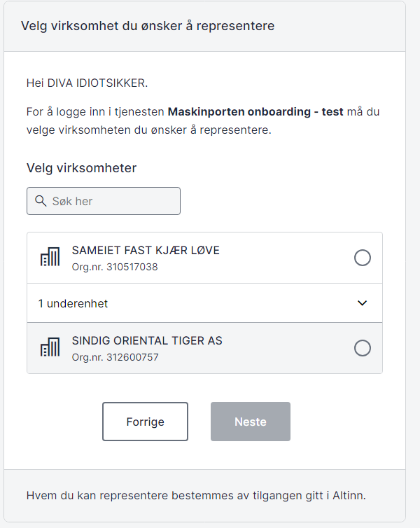
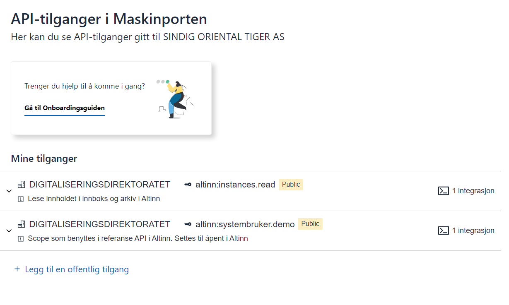
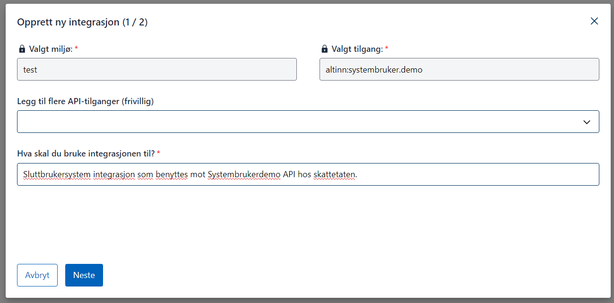
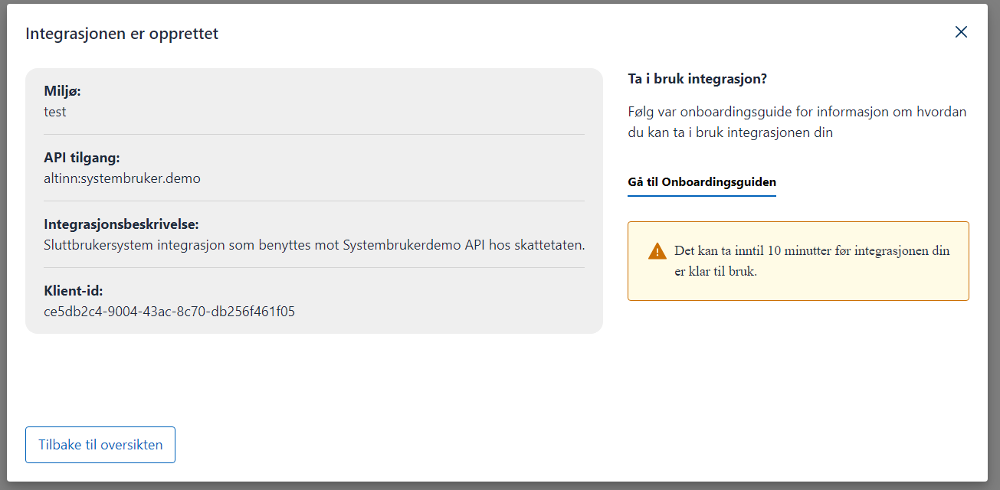
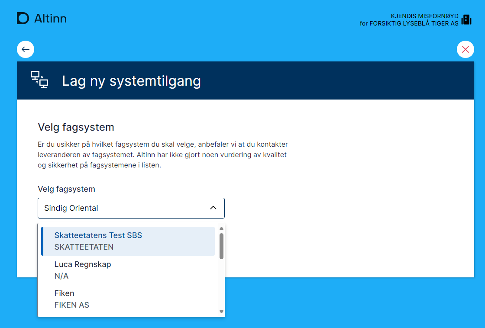
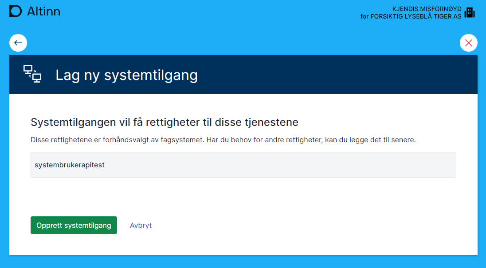
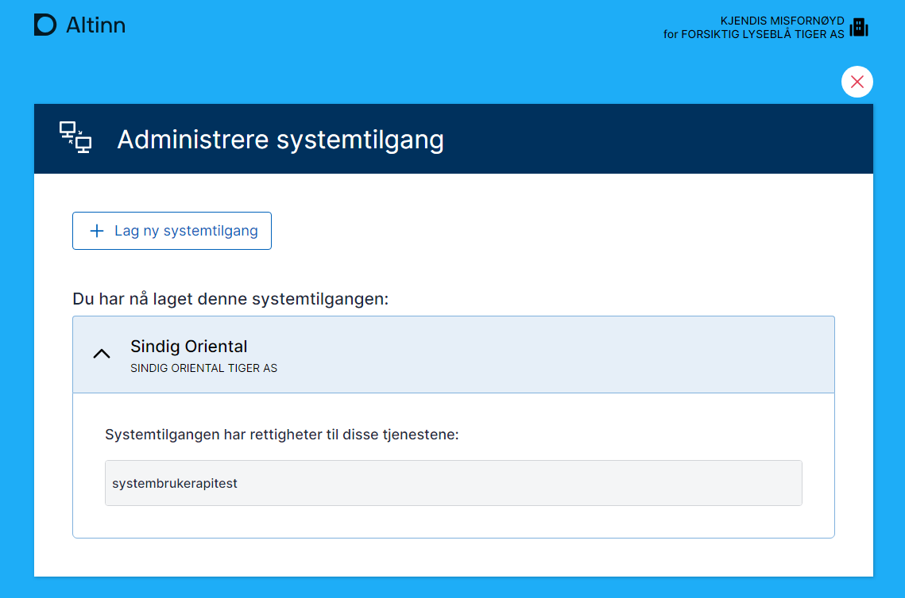

#### Tiltak utført av systemleverandøren (SmartCloud AS)

1.  Kontakt Digdir
    - Systemleverandøren må ta kontakt med Digdir for å få tilgang til systemregisteret og systembruker-scopes. Prossedyren for dette er beskrevet på [Samarbeidsportalen](https://samarbeid.digdir.no/altinn/kom-i-gang/2868).
2.  Opprette en Maskinporten-klient for systemet
    - SmartCloud AS ønsker å integrere systembrukeren i sitt regnskapsprogram, SmartCloud.
    - For å integrere må de opprette en klient i Maskinporten for SmartCloud, som får en klient-ID som brukes til autentisering og autorisering.
    - På [Samarbeidsportalen](https://samarbeid.digdir.no/altinn/kom-i-gang-i-testmiljoet-tt02/2868) kan du lese mer om skrittene som må gjennomføres får du kan starte med integrasjon og test mot vårt testmiljø (TT02)
    - Se veiledningen for å etablere Maskinporten-integrasjon [Maskinporten som konsument](https://samarbeid.digdir.no/maskinporten/konsument/119)
    - Pass på at du får tildelt scopene:
      - `altinn:authentication/systemregister.write` - for registrering av system i systemregisteret
      - `altinn:authentication/systemuser.request.write` - for leverandørstyrt flyt - opprette forespørsler
      - `altinn:authentication/systemuser.request.read` - leverandørstyrt flyt - forespørre staus
3.  Registrering av systemet i Altinn systemregister

    - SmartCloud AS registrerer deretter SmartCloud system i Altinn systemregister.
    - De definerer de nødvendige rettighetene for å få tilgang til 'Krav og betalinger' ved å knytte klient-ID-en til systemet.

    ```
    {
       "id": "991825827_smartcloud",
       "systemVendorOrgNumber": "991825827",
       "vendor":
       {
       "authority" : "iso6523-actorid-upis",
       "ID" : "0192:991825827"
       },
       "name":
       {
          "nb":"SmartCloud 1",
          "en":"SmartCloud 1",
          "nn":"Smart SKY"
       },
       "description":
       {
          "nb":"SmartCloud er verdens beste system.",
          "en":"SmartCloud Rocks.",
          "nn":"SmartSky er vestlandets beste system"
       },
       "rights": [
       {
          "resource": [
          {
             "id": "urn:altinn:resource",
             "value": "ske-krav-og-betalinger"
          }
       ]
       }
       ],
       "clientId": [
       "xxxxxx-xxxx-xxxx-xxxx-xxxxxxx"
       ],
       "allowedredirecturls": [
       "https://smartcloudxxxx/receipt"
       ],
       "isVisible": true
    }
    ```

    - Registrering av systemet med nødvendige tilgangspakker i Altinns systemregister. I dette eksempelet registrerer vi et system med nødvendig tilgang til en tilgangspakke. Leverandører må registrere systemet med tilgangspakker dersom brukerne deres for eksempel er et regnskapsfirma som representerer sine kunder.

    ```
    {
      "id": "991825827_smartcloud_ap",
      "systemVendorOrgNumber": "991825827",
      "vendor":
        {
          "authority" : "iso6523-actorid-upis",
          "ID" : "0192:991825827"
        },
      "name":
        {
            "nb":"Smartcloud TP",
            "en":"SmartCloud AP",
            "nn":"Smartcloud TP"
        },
      "description":
        {
            "nb":"SmartCloud er verdens beste system.",
            "en":"SmartCloud Rocks",
            "nn":"SmartSky er vestlandets beste system"
        },
        "accessPackages":
        [
            {
                "urn": "urn:altinn:accesspackage:regnskapsforer-med-signeringsrettighet"
            }
        ],
      "clientId": [
        "xxxxx-xxxx-xxx-xxx-xxx"
      ],
      "allowedredirecturls": [
        "https://smartcloudxxxx/receipt"
      ],
      "isVisible": true
    }
    ```

Se [her](https://platform.tt02.altinn.no/accessmanagement/api/v1/meta/info/accesspackages/export) for list av tilgjengelige tilgangspakker på tt02 miljø.

Se [her](/content/api/authentication/systemuserapi/systemregister/model/) for en detaljert beskrivelse av hver enkelt input. Ved all videre kommunikasjon må systemleverandøren referere til verdien som er angitt i feltet 'id'.

#### Opprettelse av systembruker for en standard system bruker

Systembrukeren kan opprettes på to måter

1.  Sluttbrukerstyrt
    - SmartCloud AS må be TILFELDIG SUBTIL APES (sluttbruker) om å logge inn i Altinn-portalen og opprette en systembruker for deres system SmartCloud.
2.  Leverandørstyrt

    - SmartCloud AS oppretter en systembrukerforespørsel (via Altinn API for systembrukerforespørsler) fra SmartCloud, som sendes til Altinn.

    ```
    {
       "externalRef": "d5cc6e61-023e-4945-82cc-3f32d8ee28ee",
       "systemId": "991825827_smartcloud",
       "partyOrgNo": "310904473",
       "rights": [
             {
                "resource": [
                   {
                         "id": "urn:altinn:resource",
                         "value": "ske-krav-og-betalinger"
                   }
                ]
             }
       ],
       "redirectUrl": "https://smartcloudxxxxxxx/receipt",
    }
    ```

    - Denne forespørselen inkluderer de nødvendige rettigheter for å utføre oppgaver knyttet til tjenesten 'Krav og betalinger' på vegne av TILFELDIG SUBTIL APE.
    - Responsen er for eksempel

      ```
      {
         "id": "505f8488-3d48-4c15-8e21-35cb9432f815",
         "externalRef": "smartcloud_demo_test",
         "systemId": "991825827_smartcloud",
         "partyOrgNo": "310904473",
         "rights": [
               {
                  "resource": [
                     {
                           "id": "urn:altinn:resource",
                           "value": "ske-krav-og-betalinger"
                     }
                  ]
               }
         ],
         "status": "New",
         "redirectUrl": "https://smartcloudxxxxxxxxx/receipt",
         "confirmUrl": "https://am.ui.tt02.altinn.no/accessmanagement/ui/systemuser/request?id=505f8488-3d48-4c15-8e21-35cb9432f815"
      }

      ```

    - Bekreftelseslenken (confirmurl) sendes til sluttbrukeren for godkjenning. Følg veiledningen for [sluttbruker for Standard systembruker](../../enduser/#veiledning-for-sluttbruker-stadig-konsert-dagligleder-til-tilfeldig-subtil-ape) for å håndtere forespørselen.

### Opprettelse av en systembruker for agentsystembruker

- Systembrukeren for en agentsystembruker kan kun opprettes ved en forespørsel fra en systembruker.
- SmartCloud AS oppretter en systembrukerforespørsel (via Altinn API for systembrukerforespørsel) fra SmartCloud, som deretter sendes til Altinn.
  For detaljert informasjon om hvert inputfelt, se dokumentasjonen [her](/api/authentication/systemuserapi/systemuserrequest/external/model/)

        ```
        {
            "externalRef": "smartcloud_demo_agent_test",
            "systemId": "991825827_smartcloud_ap",
            "partyOrgNo": "314250052",
            "accessPackages":
            [
                {
                    "urn": "urn:altinn:accesspackage:regnskapsforer-med-signeringsrettighet"
                }
            ],
            "redirectUrl": "https://smartcloudaltinn.azurewebsites.net/receipt"
        }

        ```

- Denne forespørselen inkluderer nødvendige tilgangspakker for å utføre oppgaver knyttet til tjenestene som tilgangspakken gir tilgang til.
- Responsen er noe ala :

  ```
  {
      "id": "605bb239-23b1-4d11-aae8-a40eb683aa1f",
      "externalRef": "smartcloud_demo_agent_test",
      "systemId": "991825827_smartcloud_ap",
      "partyOrgNo": "314250052",
      "accessPackages": [
          {
              "urn": "urn:altinn:accesspackage:regnskapsforer-med-signeringsrettighet"
          }
      ],
      "status": "New",
      "redirectUrl": "https://smartcloudxxxxx.azurewebsites.net/receipt",
      "confirmUrl": "https://am.ui.tt02.altinn.no/accessmanagement/ui/systemuser/agentrequest?id=605bb239-23b1-4d11-aae8-a40eb683aa1f"
  }

  ```

- Bekreftelseslenken (confirmurl) sendes til sluttbrukeren, her revisjonsorganisasjonen, for godkjenning. Når den er godkjent, kan sluttbrukeren legge til klienter til systembrukeren. Følg veiledningen for sluttbruker for [Agent systembruker](../enduser/#veiledning-for-sluttbruker-dress-minst-klientadministratør-i-tilbakeholden-usymmetrisk-tiger-as-)

Se [Samarbeisportalen](https://samarbeid.digdir.no/altinn/systembruker/2542) for illustrert og webinar.

se [api dokumentasjon](/api/authentication/systemuserapi/) for mer informasjon om endepunkter.

### 6. Test og Produksjonssetting

**Request**

Funksjonaliteten er basert på Oauth2-utvidelesen for fin-granulert autorisasjon (Rich Authorization Requests, RAR), der vi har definert en ny type urn:altinn:systemuser for systembruker-mønsteret.

Leverandøren ber om å få et token for en påstått kunde ved å oppgi kundens organisasjonsnummer, og dersom en systembruker-delegering foreligger i Altinn, vil det returneres et Maskinporten-token med systembruker-identifikator som API-tilbyder i sin tur kan benytte til å konstruere spørringer mot Altinn Autorisasjon PDP for å finne detaljert ut hva leverandørens system er autorisert til å utføre.


sequenceDiagram
Sluttbrukersystem->>+Maskinporten: Forespørre token(client_id, systemUserOrgNo)
Maskinporten->>Altinn Autorisasjon: GetSystemUser(client_id, systemUserOrgNo)
Altinn Autorisasjon-->>Maskinporten: Systembrukerinformasjon
Maskinporten-->>Sluttbrukersystem: Systembruker-token
Sluttbrukersystem->>API: API-kall m/systembrukertoken
API->>Altinn Autorisasjon: Authorize(systemUserId, res, action, part)
Altinn Autorisasjon-->>API: AuthorizationResponse
API-->>Sluttbrukersystem: API Resultat


Et fagsystem ber om å få systembruker-token på vegne av en part ved å inkludere en RAR-forespørsel av type urn:altinn:systemuser med partens organisasjonsidentifikator, i [JWT-grantet](https://docs.digdir.no/docs/Maskinporten/maskinporten_protocol_jwtgrant)

```json
POST https://test.maskinporten.no/token

{
  "aud" : "https://maskinporten.no",
  "sub" : "fc9a8287-e7cb-45e5-b90e-123048d32d85",
  "authorization_details" : [ {
    "systemuser_org" : {
      "authority" : "iso6523-actorid-upis",
      "ID" : "0192:123456789"
    },
    "type" : "urn:altinn:systemuser"
  } ],
  "scope" : "krr:global/kontaktinformasjon.read",
  "iss" : "fc9a8287-e7cb-45e5-b90e-123048d32d85",
  "exp" : 1718124835,
  "iat" : 1718124715,
  "jti" : "89365ecd-772b-4462-a4de-ac36af8ef3e2"
}


HTTP/1.1 200 OK
Content-Type: application/json; charset=utf-8

{
  "access_token" : "IxC0B76vlWl3fiQhAwZUmD0hr_PPwC9hSIXRdoUslPU=",
  "token_type" : "Bearer",
  "expires_in" : 599,
  "scope" : "difitest:test1"
}
```

> Man kan kun spørre på en part om gangen.

> Grantet må også alltid forespørre et eller flere Oauth2 scopes.

**Response - JWT Token**

Tokenet vil innehold en liste med systembrukere som tilhører kundens organisasjonnummer, og er knyttet mot leverandørens fagsystem gjennom det autentiserte fagsystemet (client_id):

```json
{
  "authorization_details": [
    {
      "type": "urn:altinn:systemuser",
      "systemuser_org": {
        "authority": "iso6523-actorid-upis",
        "id": "0192:123456789"
      },
      "systemuser_id": ["ebe4a681-0a8c-429e-a36f-8f9ca942b59f"],
      "system_id": "123456789_systemid"
    }
  ],
  "scope": "krr:global/kontaktinformasjon.read",
  "iss": "https://test.maskinporten.no/",
  "client_amr": "private_key_jwt",
  "token_type": "Bearer",
  "exp": 1718175135,
  "iat": 1718175015,
  "client_id": "fc9a8287-e7cb-45e5-b90e-123048d32d85",
  "jti": "-SpfU--1Zn_Oqvkpjwu3oVn--VLcPzSAwjqyiP6zBEw",
  "consumer": {
    "authority": "iso6523-actorid-upis",
    "ID": "0192:987654321"
  }
}
```

> Tokenet man får fra maskinporten legges ved som et bearer token mot de API man skal kalle.

## Demoklient

For en demo av hvordan leverandørstyrt opprettelsee kan se ut, så vår demolklient [SmartCloud](http://smartcloudaltinn.azurewebsites.net).

Se kode med dokumentasjon [her](https://github.com/TheTechArch/altinn-systemuser).

For opprettelse av systembrukere kan testbrukere/organisasjoner fra Tenor benyttes.

## Testing av systembruker i TT02

For å teste systembruker i TT02, kreves følgende:

Systemtilbyder registrert i Maskinporten. Dette gjøres via servicedesk@digdir.no.

Systemtilbyder registrert i Altinn. Dette gjøres via API for systemleverandør.

Systemintegrasjon registrert i Maskinporten test.

For å opprette systembrukere kan testbrukere/organisasjoner fra Tenor benyttes.

## Referanseimplementasjon og oppsett

En referanseimplementasjon er utviklet for å demonstrere bruk av systembruker. Den er utviklet i C# og kan kjøres som en konsollapplikasjon.
Den gjør følgende:

Oppretter et token basert på konfigurert JSON Web Key, klient-ID, scope og organisasjonsnummeret til systembrukeroppretteren.

Basert på mottatt token, gjør den kall mot referanse-API-er som krever systembruker.

Se kode med dokumentasjon [her](https://github.com/TheTechArch/altinn-systemuser).

## Oppsett av referanseimplementasjon med egen konfigurasjon

En referanseimplementasjon er utviklet for å demonstrere bruk av systembruker. Den er utviklet i C# og kan kjøres som en konsollapplikasjon.

Den gjør følgende:

Oppretter et token basert på konfigurert JSON Web Key, klient-ID, scope og organisasjonsnummeret til systembrukeroppretteren.

Basert på mottatt token, gjør den kall mot referanse-API-er som krever systembruker.

Se kode med dokumentasjon [her](https://github.com/TheTechArch/altinn-systemuser).

## Oppsett av referanseimplementasjon med egen konfigurasjon

Repositoryet inneholder nødvendig testsertifikat for å kjøre applikasjonen. Følgende må gjøres for å sette opp en egen integrasjon som systemtilbyder:

1. Logg inn på [onboarding Maskinporten](https://onboarding.test.maskinporten.no/). Her kan du bruke en testidentitet som er daglig leder i en testvirksomhet.

   

   

   

   

   

   

   

2. Få systemet registrert i Systemregisteret med korrekt klient-ID og kobling til nødvendige ressurser/tilgangspakker.

3. Logg inn med en testbruker på tt02.altinn.no. Brukeren må ha tilgangsstyringsrollen i Altinn for en testorganisasjon og gå til siden [https://authn.ui.tt02.altinn.no/authfront/ui/auth/creation](https://authn.ui.tt02.altinn.no/authfront/ui/auth/creation).
   

   

   

4. Konfigurer nøkkel, sertifikat, klient-ID og scope i testapplikasjonen.

```c#
string clientID = "7ee41fce-9f6e-4c32-8195-0fe2c1517f43";
string scope = "altinn:systembruker.demo";
string systemUserOrg = "210493352";
string pemCertificatePath = @".\mp-key.pem";
```
