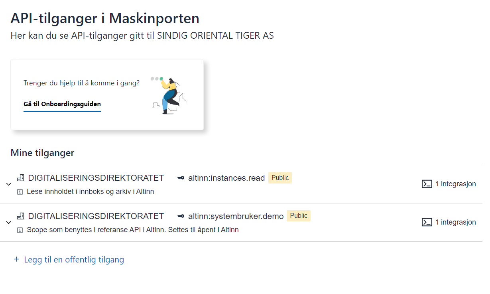
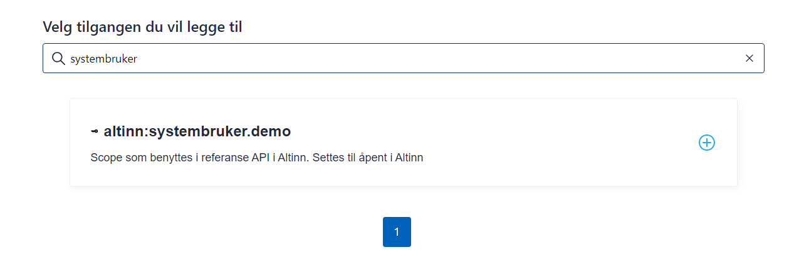
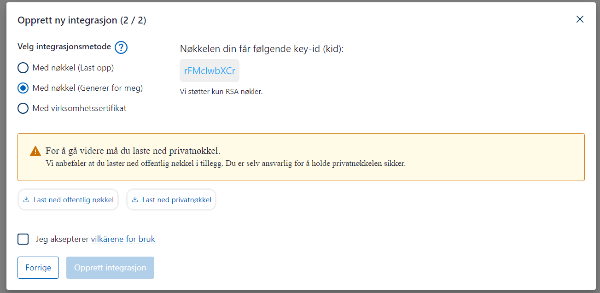
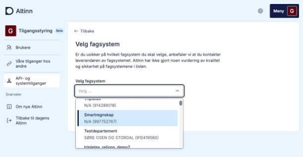
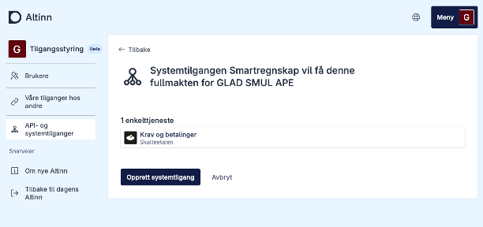
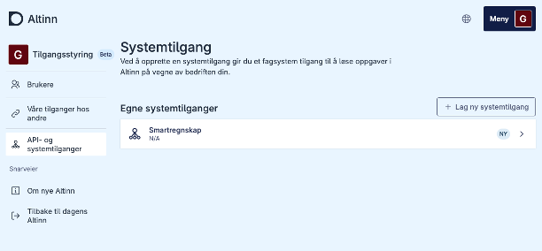

### Reference implementation and setup

A reference implementation has been developed to demonstrate the use of system user. It is developed in C# and can be run as a console application.
It does the following:

1. Creates a token based on configured JSON Web Key, client ID, scope, and organization number of the system user creator.
2. Based on the token received, it makes calls to reference APIs that require system user.

See code with documentation [here](https://github.com/TheTechArch/altinn-systemuser).

### Setting up reference implementation with own configuration

The repository contains the necessary test certificate to run the application. The following must be done to set up your own integration as a system provider:
{.floating-bullet-numbers-sibling-ol}

1. Log in to [onboarding Maskinporten](https://onboarding.test.maskinporten.no/). Here you can use a test ID that is the CEO of a test entity.

   

   

   

   

   

   

   

2. Get the system registered in the System Register with the correct client ID and linkage to necessary resources/access packages.

3. Log in with a test user at tt02.altinn.no. The user must have the access management role in Altinn for a test organization and go to the page [https://authn.ui.tt02.altinn.no/authfront/ui/auth/creation](https://authn.ui.tt02.altinn.no/authfront/ui/auth/creation).

   

   

   

4. Configure key, certificate, client ID, and scope in the test application.
   ```csharp
   string clientID = "7ee41fce-9f6e-4c32-8195-0fe2c1517f43";
   string scope = "altinn:systembruker.demo";
   string systemUserOrg = "210493352";
   string pemCertificatePath = @".\mp-key.pem";
   ```
