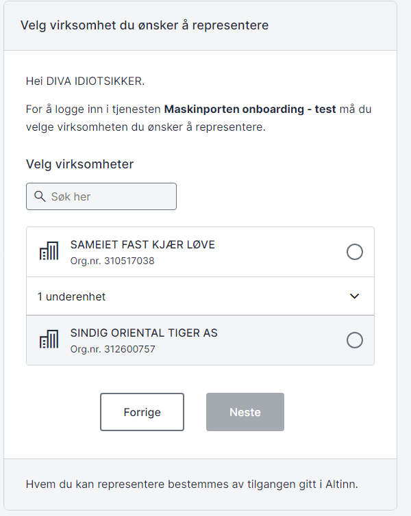

**Audience:** Developers and technical owners at end-user system vendors who need a concrete example of vendor-controlled system user onboarding.

## About the SmartCloud demo client

SmartCloud demonstrates the complete vendor-controlled onboarding flow.  
Try the solution at [smartcloudaltinn.azurewebsites.net](http://smartcloudaltinn.azurewebsites.net) and review the documented source code on GitHub: [TheTechArch/altinn-systemuser](https://github.com/TheTechArch/altinn-systemuser).

When testing system user creation you can rely on Tenor test users and organisations.

## Prerequisites

- System provider registered in Maskinporten (order via servicedesk@digdir.no).
- System provider registered in Altinn (via the system vendor API).
- Integration registered in Maskinporten’s TT02 environment.

## Test the system user flow in TT02

The reference implementation is written in C# and runs as a console application. It:

- generates a token based on the configured JSON Web Key, client ID, scope and the organisation number of the system provider, and
- calls reference APIs that require a system user using that token.

Source code and documentation: [TheTechArch/altinn-systemuser](https://github.com/TheTechArch/altinn-systemuser).

### Step-by-step: configure and run the reference implementation

The repository contains the test certificate you need. Follow these steps to set up your own integration:
{.floating-bullet-numbers-sibling-ol}

1. Sign in to [Maskinporten onboarding](https://onboarding.test.maskinporten.no/) with a test identity that represents the CEO of a test company.

   

   

   

   

   

   

   

2. Register the system in the system register with the correct client ID and the required resources/access packages.

3. Sign in with a test user at [tt02.altinn.no](https://tt02.altinn.no). The user must hold the Access Manager role in Altinn for a test organisation and open [https://authn.ui.tt02.altinn.no/authfront/ui/auth/creation](https://authn.ui.tt02.altinn.no/authfront/ui/auth/creation).

   

   

   

4. Configure key, certificate, client ID and scope in the test application before running it.
   ```csharp
   string clientID = "7ee41fce-9f6e-4c32-8195-0fe2c1517f43";
   string scope = "altinn:systembruker.demo";
   string systemUserOrg = "210493352";
   string pemCertificatePath = @".\mp-key.pem";
   ```
