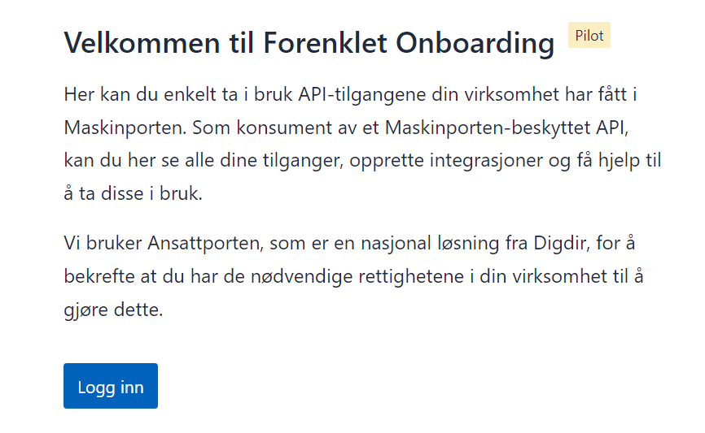
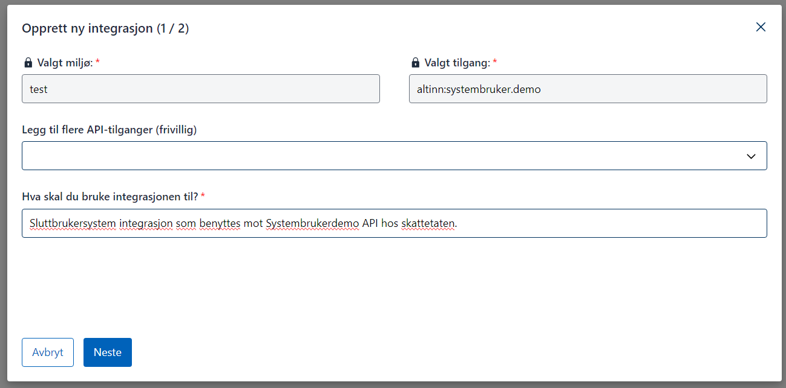

**Målgruppe:** Utviklere og tekniske ansvarlige hos sluttbrukersystemleverandører som ønsker et praktisk eksempel på leverandørstyrt opprettelse av systembruker.

## Om demoklienten SmartCloud

SmartCloud er en demoklient som demonstrerer hele flyten for leverandørstyrt opprettelse.  
Du kan teste løsningen på [smartcloudaltinn.azurewebsites.net](http://smartcloudaltinn.azurewebsites.net) og se kildekode med dokumentasjon på GitHub: [TheTechArch/altinn-systemuser](https://github.com/TheTechArch/altinn-systemuser).

Når du tester opprettelse av systembruker, kan du bruke testbrukere og -organisasjoner fra Tenor.

## Forutsetninger

- Systemtilbyder registrert i Maskinporten (bestilles via servicedesk@digdir.no).
- Systemtilbyder registrert i Altinn (opprettes via API for systemleverandør).
- Systemintegrasjon registrert i Maskinporten testmiljø (TT02).

## Test systembruker i TT02

Referanseimplementasjonen er skrevet i C# og kan kjøres som en konsollapplikasjon. Den:

- genererer et token basert på konfigurert JSON Web Key, klient-ID, scope og organisasjonsnummeret til systemtilbyderen
- kaller referanse-API-er som krever systembruker ved hjelp av tokenet

Kildekode og dokumentasjon: [TheTechArch/altinn-systemuser](https://github.com/TheTechArch/altinn-systemuser).

### Steg-for-steg: konfigurer og kjør referanseimplementasjonen

Repositoryet inneholder nødvendige testsertifikat. Følg stegene under for å sette opp en egen integrasjon:
{.floating-bullet-numbers-sibling-ol}

1. Logg inn på [Maskinportens onboarding-løsning](https://onboarding.test.maskinporten.no/) med en testidentitet som er daglig leder i en testvirksomhet.

   

   

   

   

   

   

   

2. Registrer systemet i systemregisteret med korrekt klient-ID og kobling til nødvendige ressurser og tilgangspakker.

3. Logg inn med en testbruker på [tt02.altinn.no](https://tt02.altinn.no). Brukeren må ha tilgangsstyrer-rollen for en testorganisasjon og gå til [https://authn.ui.tt02.altinn.no/authfront/ui/auth/creation](https://authn.ui.tt02.altinn.no/authfront/ui/auth/creation).

   

   

   

4. Konfigurer nøkkel, sertifikat, klient-ID og scope i testapplikasjonen før du kjører den.

   ```csharp
   string clientID = "7ee41fce-9f6e-4c32-8195-0fe2c1517f43";
   string scope = "altinn:systembruker.demo";
   string systemUserOrg = "210493352";
   string pemCertificatePath = @".\mp-key.pem";
   ```
