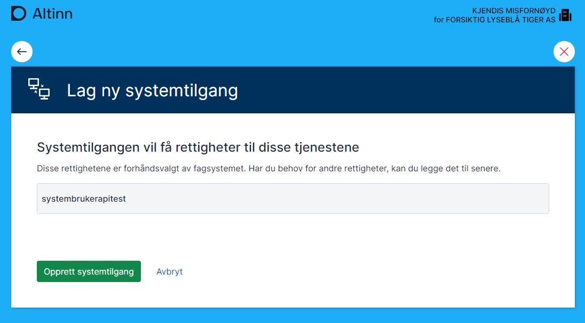

**Målgruppe:** Utviklere og tekniske ansvarlige hos sluttbrukersystemleverandører som ønsker et praktisk eksempel på leverandørstyrt opprettelse av systembruker.

## Om demoklienten SmartCloud

SmartCloud er en demoklient som demonstrerer hele flyten for leverandørstyrt opprettelse.  
Du kan teste løsningen på [smartcloudaltinn.azurewebsites.net](http://smartcloudaltinn.azurewebsites.net) og se kildekode med dokumentasjon på GitHub: [TheTechArch/altinn-systemuser](https://github.com/TheTechArch/altinn-systemuser).

Når du tester opprettelse av systembruker, kan du bruke testbrukere og -organisasjoner fra Tenor.

## Forutsetninger

- Systemtilbyder registrert i Maskinporten (bestilles via servicedesk@digdir.no).
- Systemtilbyder registrert i Altinn (opprettes via API for systemleverandør).
- Systemintegrasjon registrert i Maskinporten testmiljø (TT02).

## Test systembruker i TT02

Referanseimplementasjonen er skrevet i C# og kan kjøres som en konsollapplikasjon. Den:

- genererer et token basert på konfigurert JSON Web Key, klient-ID, scope og organisasjonsnummeret til systemtilbyderen
- kaller referanse-API-er som krever systembruker ved hjelp av tokenet

Kildekode og dokumentasjon: [TheTechArch/altinn-systemuser](https://github.com/TheTechArch/altinn-systemuser).

### Steg-for-steg: konfigurer og kjør referanseimplementasjonen

Repositoryet inneholder nødvendige testsertifikat. Følg stegene under for å sette opp en egen integrasjon:


Følg veiledningen for å [sette opp Maskinporten-klient](/nb/authorization/getting-started/maskinportenclient/). Sørg for å notere klient-ID, scopes og laste ned nøkkelmaterialet når integrasjonen er opprettet.



Registrer systemet i systemregisteret med korrekt klient-ID og kobling til nødvendige ressurser og tilgangspakker. Se veiledningen [Registrering av system](/nb/authorization/guides/system-vendor/system-user/systemregistration/) for detaljer.



La en testbruker logge inn på [tt02.altinn.no](https://tt02.altinn.no) med tilgangsstyrer-rollen for testorganisasjonen og gå til [authfront/ui/auth/creation](https://authn.ui.tt02.altinn.no/authfront/ui/auth/creation).








Sett opp nøkkel, sertifikat, klient-ID og scope i testapplikasjonen før du kjører den.

```csharp
string clientID = "7ee41fce-9f6e-4c32-8195-0fe2c1517f43";
string scope = "altinn:systembruker.demo";
string systemUserOrg = "210493352";
string pemCertificatePath = @".\mp-key.pem";
```


