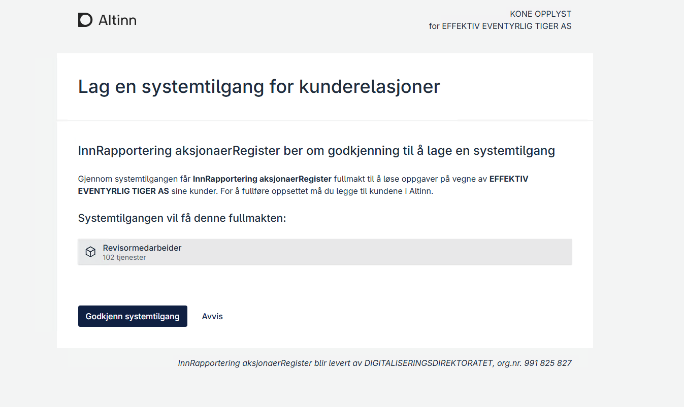
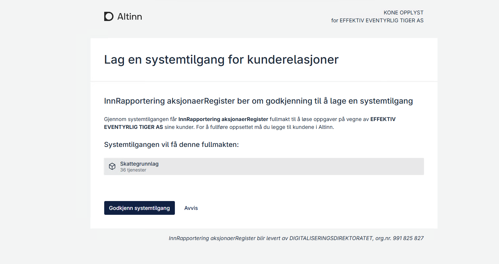
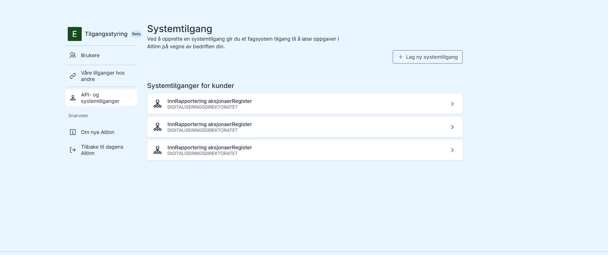
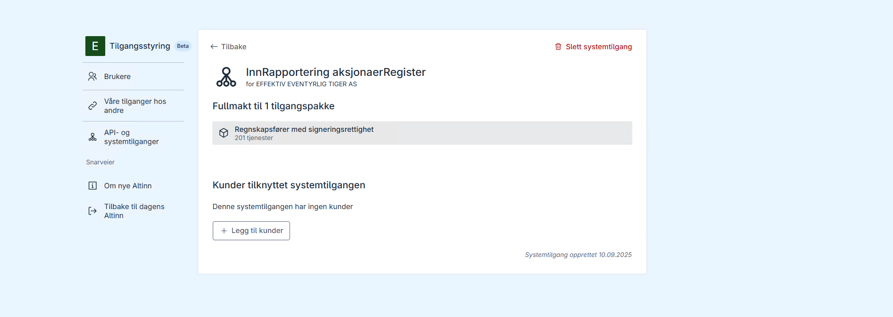
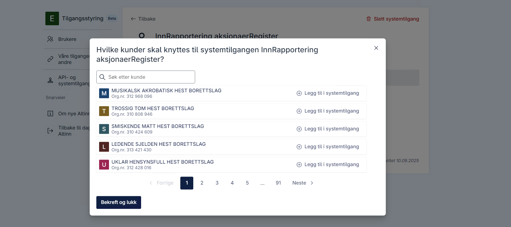

## Terms

Below are key terms used in the user scenarios.

### System vendor

Provider of end-user software available on the market. Has access to the system register in Altinn to register software with the necessary rights.

For locally installed or self-developed software, the system customer is also registered as the vendor.

### End-user system

Software that usually runs in the public cloud, but can also be run locally with some limitations. The end-user system supports organization and citizen processes and can for example be used for lice reporting or VAT reporting.

The end-user system can identify itself as a system user associated with the system. Which rights are required depends on the processes supported.

### System user

Virtual user for which system vendors can obtain tokens. Grants the end-user system the rights that the system user has.  
The system user is only assigned rights from the system customer.

### System customer

The organization that has procured the end-user system. The system user is created for the system customer, and the system vendor is given authority to authenticate as the system user on behalf of the system customer.

### System user for client relationships

Virtual user for which the system vendor can obtain tokens, used in client relationships where the system user is delegated rights for one or more clients.

### System user token

Token issued by Maskinporten that identifies a system user. Also contains information about the end-user system and the system vendor.

### Client

Organization that has an agreement with a service provider for support of organization processes. “Client” is often used in accounting and auditor contexts and corresponds to "customer".  
In reporting contexts the client is often referred to as the "party".

### Client administrator

Employee at the system customer responsible for linking their clients (customers) to the correct system users.

### Access package

A collection of rights for public services, defined in Altinn. Service owners bind rights to a given package, which has a name/scope adapted to the services.

---

## General assumptions

The following apply to most user scenarios:

1. System vendor responsibility for access control
   - Have an overview of which rights system users need (e.g., access packages or individual rights for VAT reporting).  
     Information about rights is obtained from the service owner or via the Altinn API. The service owner must communicate requirements clearly.
   - Configure these rights in the system register so that system users can be granted the necessary rights per customer.

---

## Access control in the end-user system

When using a system user, public services will not know the identity of the person behind the software that triggers issuance of a system user token and API calls.

To avoid misuse, system vendors must have good routines for authentication and authorization of users in the end-user system so that only authorized users get access to system user tokens.

This is especially important for larger organizations, such as accounting firms with many customers and employees, where there is a need to restrict access to data for different customers.

---

## 1. Registered accountant reports data for a client

Example: VAT reporting

### Preconditions

- The accountant is [registered in the Enhetsregisteret](https://info.altinn.no/skjemaoversikt/bronnoysundregistrene/registrere-nye-og-endre-eksisterende-foretak-og-enheter---samordnet-registermelding/) for the relevant client.
- The Tax Administration has [defined a policy on the application](/en/altinn-studio/v8/reference/configuration/authorization/) so that users with the access package "VAT reporting" get access.
- [The end-user system is configured](/en/authorization/guides/system-vendor/system-user/) with the [necessary access packages](https://docs.altinn.studio/authorization/what-do-you-get/accessgroups/accessgroups/) for VAT reporting.
- The accountant has created a [_system user for client relationships_](/en/authorization/guides/system-vendor/system-user/) linked to the end-user system.

### Steps

1. Add client  
   The client administrator at the accounting firm [links the accounting client (client) to the system user](/en/authorization/guides/end-user/system-user/). Access for the accounting client is automatically delegated to the system user.
2. Retrieve token  
   The end-user system [retrieves a system user token via Maskinporten](/en/authorization/guides/system-vendor/system-user/).
3. Send report  
   The end-user system sends the VAT report via the API with a valid token.
4. Validation and confirmation  
   The API calls Altinn Authorization PDP to [check access](/en/authorization/guides/resource-owner/integrating-link-service/). The API returns confirmation.

Support: Developed as part of system user delivery 5.

---

## 2. Property manager reports data for the principal

Rett Revisjon is property manager for several housing cooperatives. They have a dedicated team working with housing cooperatives and want a system user setup limited to this team and able to handle both registered and unregistered property managers.

Service: [Reporting for housing cooperatives](https://skatteetaten.github.io/api-dokumentasjon/api/innrapportering-boligsameie)

This service has configured that the following access packages grant the right to report for housing cooperatives

- regnskapsforer-med-signeringsrettighet
- ansvarlig-revisor
- skattegrunnlag
- forretningsforer-eiendom

### Preconditions

- The property manager is [registered in the Enhetsregisteret](https://info.altinn.no/skjemaoversikt/bronnoysundregistrene/registrere-nye-og-endre-eksisterende-foretak-og-enheter---samordnet-registermelding/) for the housing cooperative.
- The system vendor has registered the system in the system register with the mentioned access package.
- The system vendor has user management such that the property manager team can be assigned rights for functionality that uses the system user.

### Steps

1. System vendor sends a request to create a system user for clients to the property manager (the customer). The access package **forretningsforer-eiendom** is included as a requirement.
2. The property manager approves the request.
3. The property manager defines the property manager team in the end-user system and assigns which authenticated users (i.e., employees) can use the property manager functionality.
4. The client administrator adds the housing cooperative as a customer/client on the system user. The access package is automatically delegated to the system user.
5. The employee logs in and the end-user system validates that the employee can use the property manager functionality.
6. Reporting takes place via the system.
7. A system user token is retrieved from Maskinporten.
8. Submission is done via API.
9. Access is verified by Altinn PDP API.

Support: Developed as part of system user delivery 5.

---

## 3. Accountant needing to differentiate access to system user

Rett Revisjon's small business division allocates tasks internally and has now delegated reporting of payments to self-employed individuals to staff who are unregistered accountants for those companies.

Some are delegated access packages from their clients.  
Some have access packages re-delegated from a registered auditor at Rett Revisjon.

Rett Revisjon is concerned that actions may be performed on behalf of companies via the system user that exceed the responsibility of the unregistered accountants (often by accident).

### Challenge

When using a system user, the service does not know the identity of the person initiating the calls. It may be fully automated processes or actions performed by a logged-in user in the end-user system. Delegations in Altinn authorization do not affect who is actually using the system, and an end-user system therefore has no reliable way to verify which rights each user has been granted in Altinn.

Consequence: the end-user system must handle local authentication and authorization so that only authorized employees get access to functionality that calls Altinn on behalf of clients.

Service: [Payments to self-employed persons](https://www.skatteetaten.no/bedrift-og-organisasjon/rapportering-og-bransjer/tredjepartsopplysninger/andre-bransjer/betalinger-til-s-n/)

The following access packages are relevant for reporting:

- regnskapsforer-med-signeringsrettighet
- ansvarlig-revisor
- skattegrunnlag

### Preconditions

- Rett Revisjon is registered in the Enhetsregisteret for relevant clients.
- Unregistered clients have organization-delegated the access package skattegrunnlag to Rett Revisjon.
- The system vendor has registered the system in the system register with the required access packages.
- The system supports customer management so clients can be assigned to employees/roles.
- Rett Revisjon has defined which clients are registered vs. unregistered.

### Steps

1. System vendor sends a request to create a system user for registered clients (requirement: regnskapsforer-med-signeringsrettighet).
2. System vendor sends a request to create a system user for unregistered clients (requirement: skattegrunnlag).
3. Rett Revisjon approves the requests.
4. Rett Revisjon defines which employees should have access to registered and unregistered clients in the end-user system.
5. The client administrator distributes the clients across the correct system users (the accesses are re-delegated to the system user).
6. The employee logs in to the end-user system; the system validates locally that the person has the rights for the chosen client.
7. Reporting is sent via the system.
8. A system user token is retrieved from Maskinporten.
9. Submission is done via API.
10. Access is verified by Altinn PDP API.

---

## 4. Unregistered accountant reports data for a client

Scenario: The client is not registered in Enhetsregisteret with an accountant.

### Preconditions

- The client (accounting customer) has an agreement with the accountant for accounting services.
- The accountant has purchased the end-user system and configured it.

### Steps

1. Request access  
   The accountant asks the client to delegate the necessary rights.
2. Delegation  
   The client delegates via Altinn.
3. Add client  
   The client administrator at the accounting firm links the client to the system user. Access is re-delegated to the system user.
4. Retrieve token  
   The system user token is retrieved from Maskinporten.
5. Reporting  
   Submission is done via API.
6. Validation  
   Altinn verifies access and returns confirmation.

Support: Developed as part of system user delivery 6.

---

## 5. Organization reports its own data

Scenario: The organization uses a system user for reporting.

### Preconditions

- The system is configured with the resource that defines the service.

### Steps

1. Procurement of the system  
   The organization purchases a system from a vendor.
2. Request a system user  
   The vendor sends a request to create a system user with the necessary accesses.
3. Approval  
   The organization approves, and the system user is created.
4. Reporting  
   The system retrieves a token and sends data via API.
5. Validation  
   The API checks access and returns confirmation.

Support: Setup with single rights was developed as part of system user delivery 2.  
Setup with access packages is developed as part of system user delivery 4.

---

## 6. Accountant retrieves messages for a client via Dialogporten

Scenario: System user retrieves messages sent to a client.

### Preconditions

- Access to messages is included in the access package.
- The system supports Dialogporten.

### Steps

1. Request a system user  
   The vendor sends a request with requirements for message scope.
2. Approval  
   The accountant/organization approves the request.
3. Client linking  
   The client administrator has linked the client to the system user.
4. Retrieve token  
   Token is retrieved from Maskinporten.
5. Retrieve messages  
   Messages are fetched via API.
6. Validation  
   Altinn validates and returns messages.

---

## 7. Organization sends a file via a brokerage service (broker)

Scenario: Submission of registration of title (tinglysning) via the Land Registry's brokerage service.

### Preconditions

- The Land Registry has defined a resource and access.
- The system vendor has registered the system and received approval.

### Steps

1. User sends the registration via the system.
2. Token is retrieved from Maskinporten.
3. The API is called with the token.
4. Access is validated by Altinn.

---

## 8. Organization has developed its own reporting system

Scenario: Self-developed solution for submission via a brokerage service.

### Preconditions

1. Agreement with DigDir and access to the system register.
2. The system is registered with the necessary rights.

### Steps

1. A request for a system user is sent (to itself).
2. The request is approved.
3. Token is retrieved.
4. The system sends data via API.

---

## 9. Organization has purchased SAP for local installation

Scenario: SAP software is installed on the organization's own servers, without SAP having control.

### Preconditions

1. The organization has an agreement with DigDir for access to the system register.
2. The organization has created a Maskinporten client.
3. The organization registers the system in the register representing the SAP installation, with the necessary access rights.
4. The key for the client is installed and available on the server.

### Steps

1. A request to create a system user is sent to the organization itself.
2. The request is approved and the system user is created with the correct rights.
3. The system can now create Maskinporten tokens for the system user and call the necessary APIs.

Note: In such scenarios, the system vendor cannot share its own certificate/key pair with the system customer, as this could lead to misuse and access to customer data across system customers.

---

## 10. Rett Revisjon is accountant and auditor reporting the shareholder register for clients

Scenario: The firm Rett Revisjon offers accounting and auditing services in the market. For audit clients, Rett Revisjon is registered in the ER with the role REVI for their customers.

For accounting clients, some have registered Rett Revisjon as their accountant with the role REGN, while others have organization-delegated access packages such as Skattegrunnlag.

The service "Reporting shareholder register" has a setup that grants the following access packages the right to report

- regnskapsforer-med-signeringsrettighet (ER registered accountant)
- ansvarlig-revisor (ER registered auditor)
- skattegrunnlag (organization-delegated access package from the client's CEO)
- revisormedarbeider (ER registered auditor)

Rett Revisjon has purchased Maestro to report the shareholder register.

### Preconditions

- Rett Revisjon has shared with Maestro which client relationship they have for each customer.

### Steps

1. Maestro sends a request to create a system user for client relationships that require _revisormedarbeider_.
2. Maestro sends a request to create a system user for client relationships that require _skattegrunnlag_.
3. Maestro sends a request to create a system user for client relationships that require _regnskapsforer-med-signeringsrettighet_.
4. Rett Revisjon accepts these requests.
5. Rett Revisjon allocates their clients to the correct system users (see which package is linked to the system user).
6. Rett Revisjon uses Maestro to report for Customer A.
7. Maestro must at submission time know which type of client relationship Customer A has with Rett Revisjon to select the correct system user. This must be shared by Rett Revisjon.
8. Maestro must request a system user token from Maskinporten for the correct system user.
9. Maestro submits the shareholder register with the correct system user token.
10. The Tax Administration authorizes that the system user has the right to report the shareholder register for Customer A.

Note: An alternative solution would be to register a system per customer type and link each system user to that. This avoids extref but then you must manage a corresponding large number of clients.

## 10b. New customers

Rett Revisjon has acquired new customers. These must be linked to the correct system user based on the type of client relationship.

### Preconditions

- Rett Revisjon knows it has acquired new customers.

### Steps

1. Go to system user admin.
2. Identify the correct system user based on which customer to link to the system user.
3. Add the customer.

### Screenshots

Below are some screenshots for this scenario.

## NAV Scenario A (functionality not currently prioritized)

Example: Accountant uses "Superavstemming" from Kontrollen AS.

### Challenges

- NAV does not offer access packages with granularity only for A06/A07.
- Granular rights for system users or clients are not supported.

### Steps

1. System vendor sends a request for a limited system user.
2. The accountant approves.
3. Clients are added and assigned only A06/A07.
4. Reporting occurs via the system.
5. Token is retrieved and the API is called.
6. Authorization via Altinn PDP.

---

## NAV Scenario B (functionality not currently prioritized)

The service provider has purchased the system Superavstemming from Kontrollen AS.  
Superavstemming needs the necessary accesses to retrieve reconciliation data for the a-reporting (A06/A07) for the clients the system will be used for.  
The service provider wants to ensure that Superavstemming does not receive rights beyond retrieving reconciliation data for a-reporting.  
The client has only purchased the service "reconciliation of a-reporting" and wants to delegate rights only for this.  
(Here there are a few specific rights needed, likely not a whole access package, as access packages are often coarse-grained.)

---

## NAV Scenario C (functionality not currently prioritized)

The service provider has purchased the system Superavstemming from Kontrollen AS.  
Superavstemming needs the necessary accesses to retrieve reconciliation data for a-reporting (A06/A07) for the relevant clients.  
The service provider wants to ensure that Superavstemming does not receive rights beyond what is necessary.  
The client has purchased several services but wants to delegate only the necessary rights for the relevant services.  
(Here there will be several different rights relevant, but there is no single suitable access package.)

---
