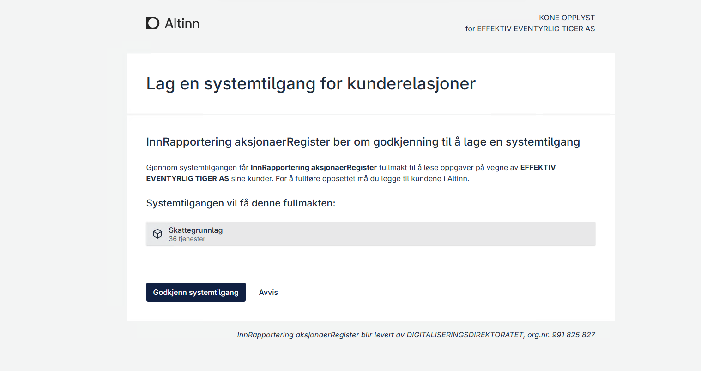
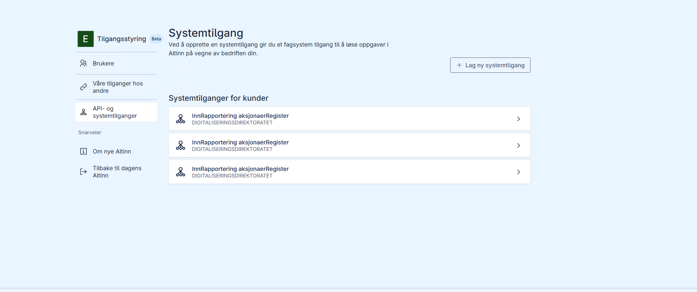
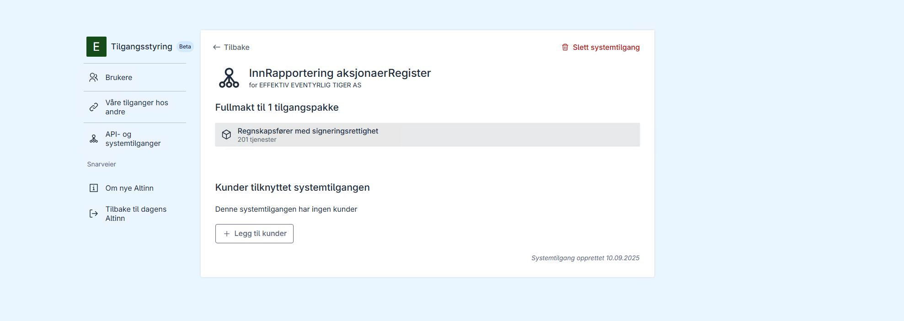
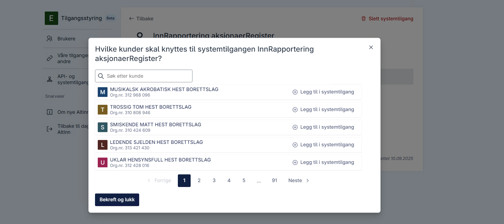

## Begreper

Nedenfor finner du sentrale begreper som brukes i brukerscenarioene.

### Systemleverandør

Leverandør av sluttbrukersystem tilgjengelig i markedet. Har tilgang til systemregisteret i Altinn for å registrere programvare med nødvendige rettigheter.

Ved lokal eller egenutviklet programvare registreres systemkunden også som leverandør.

### Sluttbrukersystem

Programvare som vanligvis kjører i public cloud, men kan også kjøres lokalt med noen begrensninger. Sluttbrukersystemet støtter virksomhets- og innbyggerprosesser, og kan for eksempel brukes til lakselusrapportering eller MVA-rapportering.

Sluttbrukersystemet kan identifisere seg som systembruker knyttet til systemet. Hvilke rettigheter som kreves avhenger av hvilke prosesser som støttes.

### Systembruker

Virtuell bruker som systemleverandører kan få utstedt token for. Gir sluttbrukersystemet de rettighetene systembrukeren har.  
Systembrukeren får kun tildelt rettigheter fra systemkunden.

### Systemkunde

Virksomheten som har anskaffet sluttbrukersystem. Systembrukeren opprettes for systemkunden, og systemleverandøren gis fullmakt til å autentisere seg som systembrukeren på vegne av systemkunden.

### Systembruker for klientforhold

Virtuell bruker som systemleverandør kan få utstedt token for, og som brukes i klientforhold der systembrukeren får delegert rettigheter for én eller flere klienter.

### Systembruker-token

Token utstedt fra Maskinporten som identifiserer en systembruker. Inneholder også informasjon om sluttbrukersystemet og systemleverandøren.

### Klient

Virksomhet som har avtale med tjenestetilbyder om støtte for virksomhetsprosesser. Klient brukes ofte i regnskaps- og revisorbransjen, og tilsvarer "kunde".  
I rapporteringsforhold omtales klienten ofte som "part".

### Klientadministrator

Ansatt hos systemkunden, ansvarlig for å knytte sine klienter (kunder) til riktige systembrukere.

### Tilgangspakke

En samling rettigheter for offentlige tjenester, definert i Altinn. Tjenesteeiere knytter rettigheter til en gitt pakke, som har et navn/område tilpasset tjenestene.

---

## Generelle forutsetninger

Følgende gjelder for de fleste brukerscenarier:

1. **Systemleverandørens ansvar for tilgangskontroll**
   - Ha oversikt over hvilke rettigheter systembrukere trenger (f.eks. tilgangspakker eller enkeltrettigheter for MVA-rapportering).  
     Informasjon om rettigheter innhentes fra tjenesteeier eller via Altinn API. Tjenesteeier må kommunisere krav tydelig.
   - Konfigurere disse rettighetene i systemregisteret slik at systembrukere kan tildeles nødvendige rettigheter per kunde.

---

## Tilgangskontroll i sluttbrukersystem

Ved bruk av systembruker vil offentlige tjenester ikke kjenne identiteten til personen bak programvaren som utløser utstedelse av systembruker-token og API-kall.

For å unngå misbruk må systemleverandører ha gode rutiner for autentisering og autorisering av brukere i sluttbrukersystemet, slik at kun autoriserte brukere får tilgang til systembruker-token.

Dette er spesielt viktig for større virksomheter, som regnskapsbyråer med mange kunder og ansatte, hvor det er behov for å begrense tilgangen til data for ulike kunder.

---

## 1. Registrert regnskapsfører rapporterer data for klient

**Eksempel:** MVA-rapportering

### Forutsetninger

- Regnskapsfører er [registrert i Enhetsregisteret](https://info.altinn.no/skjemaoversikt/bronnoysundregistrene/registrere-nye-og-endre-eksisterende-foretak-og-enheter---samordnet-registermelding/) for aktuell klient.
- Skatteetaten har definert policy på applikasjon slik at brukere med tilgangspakken MVA rapportering får tilgang.
- [Sluttbrukersystemet er satt opp](/nb/authorization/guides/system-vendor/system-user/) med [nødvendige tilgangspakker](/nb/authorization/what-do-you-get/accessgroups/accessgroups/) for MVA-rapportering.
- Regnskapsfører har opprettet en [_systembruker for klientforhold_](/nb/authorization/guides/system-vendor/system-user/#systembruker-for-klientsystem) knyttet til sluttbrukersystemet.

### Steg

1. **Legg til klient**.
   Klientadministrator hos regnskapsfører [knytter regnskapskunden (klient) til systembrukeren](/nb/authorization/guides/end-user/system-user/delegate-clients/). Tilgang for regnskapskunden delegeres automatisk til systembrukeren.
2. **Hent token**  
   Sluttbrukersystemet [henter systembruker-token via Maskinporten](/nb/authorization/guides/system-vendor/system-user).
3. **Send rapport**  
   Sluttbrukersystemet sender MVA-rapport via API med gyldig token.
4. **Validering og bekreftelse**  
   API kaller Altinn Autorisasjon PDP for å [sjekke tilgang](/nb/authorization/guides/resource-owner/integrating-link-service/). API returnerer bekreftelse.

**Støtte:** Utvikles som del av systembrukerleveranse 5.

---

## 2. Forretningsfører rapporterer data for oppgavegiver

Rett Revisjon er forretningsfører for flere boligsameier. De har et eget team som arbeider med boligsameier, og ønsker et systembrukeroppsett som er begrenset til dette teamet og håndterer at teamet har registrerte og uregistrerte forretningsførere.

**Tjeneste:** [Rapportering for boligsameie](https://skatteetaten.github.io/api-dokumentasjon/api/innrapportering-boligsameie)

Denne tjenesten har satt opp at følgende tilgangspakker gir rettighet til å rapportere boligsameie

- regnskapsforer-med-signeringsrettighet
- ansvarlig-revisor
- skattegrunnlag
- forretningsforer-eiendom

### Forutsetninger

- Forretningsfører er [registrert i Enhetsregisteret](https://info.altinn.no/skjemaoversikt/bronnoysundregistrene/registrere-nye-og-endre-eksisterende-foretak-og-enheter---samordnet-registermelding/) for boligsameiet.
- Systemleverandøren har registrert systemet i systemregisteret med nevnte tilgangspakke.
- Systemleverandøren har brukerhåndtering slik at forretningsførerteamet kan tildeles rettigheter for funksjonalitet som bruker systembruker.

### Steg

1. Systemleverandør sender forespørsel om opprettelse av systembruker for klienter til forretningsfører (kunden). Tilgangspakken **forretningsforer-eiendom** legges inn som krav.
2. Forretningsfører godkjenner forespørselen.
3. Forretningsfører definerer forretningsførerteamet i sluttbrukersystemet og tilordner hvilke autentiserte brukere (dvs. ansatte) som kan benytte seg av forretningsfører-funksjonaliteten.
4. Klientadministrator legger til boligsameiet som kunde/klient på systembrukeren. Tilgangspakken videredelegeres automatisk til systembrukeren.
5. Den ansatte logger inn og sluttbrukersystemet validerer at den ansatte kan bruke forretningsfører-funksjonalitet.
6. Rapportering skjer via systemet.
7. Systembruker-token hentes fra Maskinporten.
8. Innsending skjer via API.
9. Tilgang verifiseres av Altinn PDP API.

**Støtte:** Utviklet som del av systembrukerleveranse 5.

---

## 3. Regnskapsfører med behov for å differensiere tilgang til systembruker

Rett Revisjon sin avdeling for små bedrifter fordeler oppgaver internt og har nå fordelt innrapportering av betalinger til selvstendig næringsdrivende til medarbeidere som er uregistrerte regnskapsførere for bedriftene.

Noen får delegert tilgangspakker fra sine klienter.  
Noen får videredelegert tilgangspakker fra registrert revisor i Rett Revisjon.

Rett Revisjon er bekymret for at det kan utføres handlinger på vegne av bedriftene via systembruker som ikke ligger innenfor ansvaret til de uregistrerte regnskapsførerne (ofte ved uhell).

### Utfordring

Ved bruk av systembruker kjenner ikke tjenesten identiteten til personen som utløser kallene. Det kan være helt automatiserte prosesser eller handlinger utført av en innlogget bruker i sluttbrukersystemet. Delegasjoner i Altinn autorisasjon påvirker ikke hvem som faktisk bruker systemet, og et sluttbrukersystem har derfor i utgangspunktet ingen pålitelig måte å verifisere hvilke rettigheter den enkelte bruker har fått i Altinn.

Konsekvens: sluttbrukersystemet må håndtere lokal autentisering og autorisasjon slik at kun autoriserte medarbeidere får tilgang til funksjonalitet som kaller Altinn på vegne av klienter.

**Tjeneste:** [Betalinger til selvstendig næringsdrivende](https://www.skatteetaten.no/bedrift-og-organisasjon/rapportering-og-bransjer/tredjepartsopplysninger/andre-bransjer/betalinger-til-s-n/)

Følgende tilgangspakker er relevante for rapportering:

- regnskapsforer-med-signeringsrettighet
- ansvarlig-revisor
- skattegrunnlag

### Forutsetninger

- Rett Revisjon er registrert i Enhetsregisteret for relevante kunder.
- Uregistrerte kunder har virksomhetsdelegert tilgangspakken skattegrunnlag til Rett Revisjon.
- Systemleverandøren har registrert systemet i systemregisteret med nødvendige tilgangspakker.
- Systemet støtter kundeadministrasjon slik at klienter kan fordeles på ansatte/roller.
- Rett Revisjon har definert hvilke kunder som er registrerte vs. uregistrerte.

### Steg

1. Systemleverandør sender forespørsel om opprettelse av systembruker for registrerte klienter (krav: regnskapsforer-med-signeringsrettighet).
2. Systemleverandør sender forespørsel om opprettelse av systembruker for uregistrerte klienter (krav: skattegrunnlag).
3. Rett Revisjon godkjenner forespørslene.
4. Rett Revisjon definerer hvilke medarbeidere som skal ha tilgang til registrerte og uregistrerte kunder i sluttbrukersystemet.
5. Klientadministrator fordeler klientene på riktige systembrukere (tilgangene videredelegeres til systembrukeren).
6. Den ansatte logger inn i sluttbrukersystemet; systemet validerer lokalt at vedkommende har rettigheter for valgt kunde.
7. Rapportering sendes via systemet.
8. Systembruker-token hentes fra Maskinporten.
9. Innsending skjer via API.
10. Tilgang verifiseres av Altinn PDP API.

---

## 4. Uregistrert regnskapsfører rapporterer data for klient

**Scenario:** Klienten er ikke registrert i Enhetsregisteret med regnskapsfører.

### Forutsetninger

- Klienten (regnskapsførerkunde) har avtale med regnskapsfører om regnskapstjenester.
- Regnskapsfører har kjøpt sluttbrukersystem og satt det opp.

### Steg

1. **Forespørsel om tilgang**  
   Regnskapsfører ber klienten delegere nødvendige rettigheter.
2. **Delegering**  
   Klienten delegerer via Altinn.
3. **Legg til klient**  
   Klientadministrator hos regnskapsfører knytter klient til systembrukeren. Tilgang videredelegeres til systembrukeren.
4. **Hent token**  
   Systembruker-token hentes fra Maskinporten.
5. **Rapportering**  
   Innsending skjer via API.
6. **Validering**  
   Altinn verifiserer tilgang og returnerer bekreftelse.

**Støtte:** Utvikles som del av systembrukerleveranse 6.

---

## 5. Virksomhet rapporterer egne data

I dette scenarioet har møbelprodusenten Myke Møbler kjøpt seg tilgang på sluttbrukersystem. De står selv ansvarlig for
rapporteringen.

### Forutsetninger

- Systemet er satt opp med ressursen som definerer tjenesten.

### Steg

1. **Anskaffelse av system**  
   Virksomheten kjøper system fra leverandør.
2. **Forespørsel om systembruker**  
   Leverandør sender forespørsel om opprettelse av systembruker med nødvendige tilganger.
3. **Godkjenning**  
   Virksomheten godkjenner, og systembrukeren opprettes.
4. **Rapportering**  
   Systemet henter token og sender data via API.
5. **Validering**  
   API sjekker tilgang og returnerer bekreftelse.

**Støtte:** Oppsett med enkeltrettighet ble utviklet som del av systembrukerleveranse 2.  
Oppsett med tilgangspakker utvikles som del av systembrukerleveranse 4.

---

## 6. Regnskapsfører henter meldinger for klient via Dialogporten

**Scenario:** Systembruker henter meldinger sendt til klient.

### Forutsetninger

- Tilgang til meldinger er inkludert i tilgangspakken.
- Systemet støtter Dialogporten.

### Steg

1. **Forespørsel om systembruker**  
   Leverandør sender forespørsel med krav til meldingsscope.
2. **Godkjenning**  
   Regnskapsfører/virksomhet godkjenner forespørselen.
3. **Klientknytning**  
   Klientadministrator har knyttet klient til systembrukeren.
4. **Hent token**  
   Token hentes fra Maskinporten.
5. **Hent meldinger**  
   Meldinger hentes via API.
6. **Validering**  
   Altinn validerer og returnerer meldinger.

---

## 7. Virksomhet sender fil via formidlingstjeneste (broker)

**Scenario:** Innsending av tinglysning via Kartverkets formidlingstjeneste.

### Forutsetninger

- Kartverket har definert ressurs og tilgang.
- Systemleverandør har registrert systemet og fått godkjenning.

### Steg

1. Bruker sender tinglysning via systemet.
2. Token hentes fra Maskinporten.
3. API kalles med token.
4. Tilgang valideres av Altinn.

---

## 8. Virksomhet har utviklet eget rapporteringssystem

I dette scenarioet har konsulentfirmaet Leet Consulting laget et eget system for automatisk innraportering
av data til myndighetene.

### Forutsetninger

1. Avtale med DigDir og tilgang til systemregisteret.
2. System registreres med nødvendige rettigheter i systemregisteret

### Steg

1. Forespørsel om systembruker sendes (til seg selv) med krav om tilgangspakker
2. Forespørsel godkjennes.
3. Token hentes.
4. Systemet sender data via API.

---

## 9. Virksomhet har kjøpt inn SAP for lokal installasjon

**Scenario:** SAP-programvare installeres på virksomhetens egne servere, uten at SAP har kontroll.

### Forutsetninger

1. Virksomheten har avtale med Digdir for tilgang til systemregisteret.
2. Virksomheten har opprettet Maskinporten-klient.
3. Virksomheten registrerer systemet i registeret som representerer SAP-installasjonen, med nødvendige rettigheter.
4. Nøkkel for klient er installert og tilgjengelig på server.

### Steg

1. Forespørsel om opprettelse av systembruker sendes til egen virksomhet.
2. Forespørsel godkjennes og systembruker opprettes med riktige rettigheter.
3. Systemet kan nå opprette Maskinporten-token for systembrukeren og kalle nødvendige API.

**Merknad:** I slike scenarioer kan ikke systemleverandør dele eget sertifikat/nøkkelpar med systemkunde, da det kan medføre misbruk og tilgang til kundedata på tvers av systemkunder.

---

## 10. Rett Revisjon er regnskapsfører og revisor rapporterer aksjonærregisteroppgaven for kunder

**Scenario:** Firmaet Rett Revisjon tilbyr regnskapstjenester og revisortjenester i markedet. For revisorklientene er Rett Revisjon registrert i ER med rollen REVI for sine kunder.

For regnskapskunder har noen registrert at Rett Revisjon er regnskapsfører med rollen REGN, mens andre har virksomhetsdelegerte tilgangspakker som Skattegrunnlag.

Tjenesten **Rapportering aksjonærregister** har et oppsett som gir følgende tilgangspakker rettighet til å rapportere

- regnskapsforer-med-signeringsrettighet (ER registrert regnskapsfører)
- ansvarlig-revisor (ER registrert revisor)
- skattegrunnlag (virksomhetsdelegert tilgangspakke fra daglig leder hos klient)
- revisormedarbeider (ER registrert revisor)

Rett Revisjon har kjøpt inn Maestro for å rapportere aksjonærregisteroppgaven.

### Forutsetninger

- Rett Revisjon har delt med Maestro hvilket kundeforhold de har for hver enkelt kunde.

### Steg

1. Maestro sender forespørsel om å opprette systembruker for klientforhold som krever _revisormedarbeider_.
2. Maestro sender forespørsel om å opprette systembruker for klientforhold som krever _skattegrunnlag_.
3. Maestro sender forespørsel om å opprette systembruker for klientforhold som krever _regnskapsforer-med-signeringsrettighet_.
4. Rett Revisjon aksepterer disse forespørslene.
5. Rett Revisjon fordeler klientene sine på riktige systembrukere (se hvilken pakke som er knyttet til systembruker).
6. Rett Revisjon benytter Maestro for å rapportere for Kunde A.
7. Maestro må i innsendingsøyeblikket vite hvilken type klientforhold Kunde A har til Rett Revisjon, for å velge riktig systembruker. Dette må deles av Rett Revisjon.
8. Maestro må spørre Maskinporten om systembrukertoken for riktig systembruker.
9. Maestro sender inn aksjonærregisteroppgaven med riktig systembrukertoken.
10. SKD autoriserer at systembrukeren har rettighet til å rapportere aksjonærregisteroppgaven for Kunde A.

**Merk** Alternativ løsning for dette vil være at man registrerer et system per kundetype og knytter hver systembruker mot dette. Dette gjør at man unngår extref, men må da håndtere tilsvarende mange klienter.

## 10b. Nye kunder

Rett Revisjon har fått nye kunder. Disse må knyttes til riktig systembruker basert på type klientforhold.

### Forutsetninger

- Rett Revisjon vet selv at de har fått nye kunder.

### Steg

1. Gå til systembrukeradmin.
2. Identifiser riktig systembruker basert på hvilken kunde man skal knytte til systembruker.
3. Legg til kunde.

### Skjermbilder

Nedenfor vises noen skjermbilder for dette scenarioet.

## NAV Scenario A (funksjonalitet ikke prioritert per nå)

**Eksempel:** Regnskapsfører bruker “Superavstemming” fra Kontrollen AS.

### Utfordringer

- NAV tilbyr ikke tilgangspakker med granularitet kun for A06/A07.
- Granulerte rettigheter for systembrukere eller klienter støttes ikke.

### Steg

1. Systemleverandør sender forespørsel om begrenset systembruker.
2. Regnskapsfører godkjenner.
3. Klienter legges til og tildeles kun A06/A07.
4. Rapportering skjer via systemet.
5. Token hentes og API kalles.
6. Autorisasjon via Altinn PDP.

---

## NAV Scenario B (funksjonalitet ikke prioritert per nå)

Tjenesteleverandør har kjøpt systemet Superavstemming fra Kontrollen AS.  
Superavstemming trenger nødvendige tilganger til å hente avstemmingsdata for a-melding (A06/A07) for de klientene systemet skal brukes for.  
Tjenesteleverandøren ønsker å sikre at Superavstemming ikke får rettigheter utover å hente avstemmingsdata for a-melding.  
Klienten har kun kjøpt tjenesten "avstemming av a-melding" og ønsker kun å delegere rettigheter for dette.  
(Her er det noen få spesifikke rettigheter som er nødvendige, trolig ikke en hel tilgangspakke, da tilgangspakker ofte er grovkornede.)

---

## NAV Scenario C (funksjonalitet ikke prioritert per nå)

Tjenesteleverandør har kjøpt systemet Superavstemming fra Kontrollen AS.  
Superavstemming trenger nødvendige tilganger til å hente avstemmingsdata for a-melding (A06/A07) for de aktuelle klientene.  
Tjenesteleverandøren ønsker å sikre at Superavstemming ikke får rettigheter utover det som er nødvendig.  
Klienten har kjøpt flere tjenester, men ønsker kun å delegere nødvendige rettigheter for de aktuelle tjenestene.  
(Her vil det være flere ulike rettigheter som er aktuelle, men det finnes ikke én passende tilgangspakke.)

---
