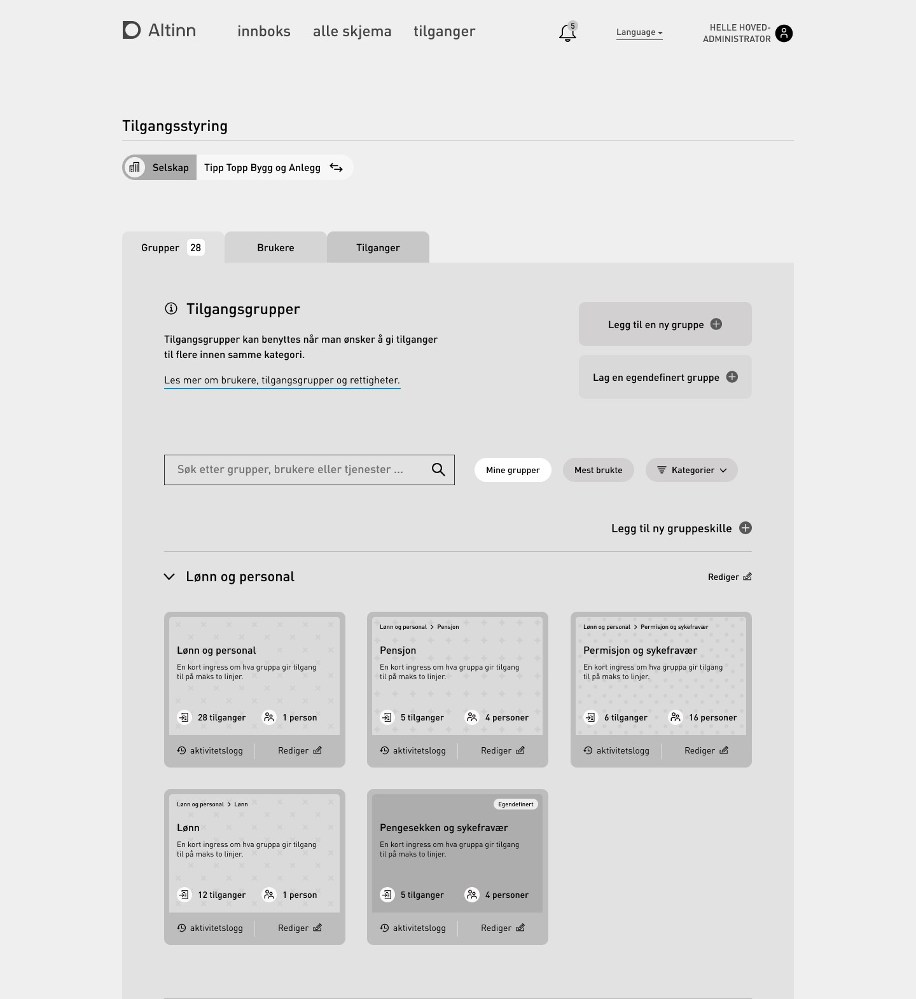

Innen juni 2025 så skal dagens Altinn løsning være modernisert og migrert til skyen. Det innebærer at mye av dagens løsning må utvikles på nytt. 

## Overordnet målsetning for modernisering
- Autorisasjon skal være en selvstendig komponent og eget produkt 
- Sikre en robust og sikker drift samtidig som vi understøtter stor vekst i bruken av autorisasjon. 
- Øke endringstakten i Autorisasjon slik at veien fra behov til løsning blir raskere. 
- Forbedre og forenkle brukerflyten slik at det blir enklere å administrere tilganger 
- Tilby nye og moderne API som gjør det enklere å integrere mot og ta i bruk Altinn Autorisasjon som tilgangsstyringløsning for andre offentlige tjenester

## Hva skal gjøres? 

For å sikre fremtidige behov så tegnes det en ny arkitektur for Altinn Autorisasjon,
 [se ny løsningsarkitektur](/technology/solutions/altinn-platform/authorization/) 

### Migrering av tjenester fra Altinn 2 til Altinn 3
Alle tjenester som i dag bruker Altinn som autorisasjonsløsning må flyttes fra Altinn 2 til Altinn 3 plattformen. 
Det er laget en egen [plan](../migration/servicemigrationplan/) for hvilken rekkefølge dette skal skje og når de enkelte tjenestene skal være ferdig migrert.

### Nye tilgangsgrupper og ny brukerflate for tilgangsstyring for virksomheter
*Dette arbeidet vil starte opp Q1 2023. Målet er å lansere ny brukerflate og tilgangsgrupper Q2 2024.*

I dag administrerer hvem som kan opptre på virksomhetens vegne i Altinns profil. Denne brukerflaten vil få et nytt utseende i Altinn 3. 

Dagens roller i Altinn 2.0 er forholdsvis store og rommer tilgang til veldig mange tjenester. 
I tilegg skal Altinn styre tilgang til mange tusen tjenester. 
Resultatet er at dette kan oppleves som forvirrende, overveldende, usikkert og frusterende for enkelte tilgansstyrere.

Den nye brukerflaten i Altinn Autorisasjon har som mål å tilby en tilrettelagt og nøyaktig tilgangsstyring som forenkle arbeidsflyten og oppleves som betyrggende for brukeren 
Dette skal også sikre at man ikke får tilgang til mer enn man strengt tatt trenger.

En konsekvens av dette er at dagens [roller i Altinn 2.0](/app/development/configuration/authorization/guidelines_authorization/roles_and_rights/roles_altinn/altinn_roles_enterprices/) 
skal fases ut og erstattes med nye [tilgangsgrupper i Altinn 3.0](../accessgroups/type-accessgroups/)

#### Hva blir konsekvensen av at man infører nye tilgangsgrupper? 
I forkant av lansering av nye tilgangsgrupper og i en overgangsfase vil det være nødvendig å angi både gamle Altinn 2.0 roller og nye 3.0 tilgangsgrupper som rollekrav knyttet til tjenesten. 
Det betyr at en bruker enten kan få tilgang til en tjeneste fordi vedkommende har en gammel 2.0 rolle eller fordi hun har fått en ny 3.0 tilgangsgruppe. 

Samtidig som nye tilgangsgrupper lanseres så vil det ikke lenger være mulig å delegere gamle 2.0 roller til sine ansatte. 
I tillegg vil vi utvikle en veileder som "motiverer" virksomheter som har ansatte med gamle 2.0 roller om å erstatte disse med nye 3.0 tilgangsgrupper. 

Ved å innføre nye 3.0 tilgangsgrupper på denne måten så vil ingen brukere miste tilgang til tjenester "over natta" fordi vi innfører nye tilgangsgrupper. 

Virksomhetene kommer til å få god tid til å rydde opp gamle 2.0 roller som er delegert får disse fjernes. 

### Nye tilgangsgrupper og ny brukerflate for tilgangsstyring for innbyggere
*Dette arbeidet starter Q1 2024.*

I dag administrerer innbygger hvem som kan opptre på egne vegne i Altinns profil. 
Denne brukerflaten har høy brukerterskel for mange innbyggere og i forbindelse med migrering til Altinn 3 så vil denne gjøres om. 
I ny brukerflate vil man legge større vekt på behov som innbyggere har. 

### Migrering av autorative kilder/registre og ta i bruk nye autorative kilder
*Dette arbeidet starter Q1 2024.*

I dag har Altinn en kopi av Enhetsregisteret og Folkeregisteret som er vår autorative kilde for å si hvem som i utgangspunktet har fullmakt til opptre på vegne av en virksomhet.
Disse registrene skal flyttes fra Altinn 2 til Altinn 3 plattfromen.  

I forbindelse med migrering av våre Autorative kilder vil man sikre at det blir enklere å ta i bruk andre autorative kilder for å gi tilgang til tjenester via Altinn Autorisasjon. 
Disse nye kildene kan være kopier som etableres i Altinn Autorisasjon eller det kan skje ved oppslag mot eksterne registre som vi har tilgang til. 

Følgende nye klider er aktuelle som nye autorative kilder: 
- Vergemål (Folkeregisteret), 
- Advokatregisteret (Tilsynsrådet for advokater), 
- Arbeidstaker og arbeidsgiverregisteret (NAV), 
- Fullmaktsregister for innbygger hos eHelse, 
- Fullmaktsregister for innbyggere hos NAV 

