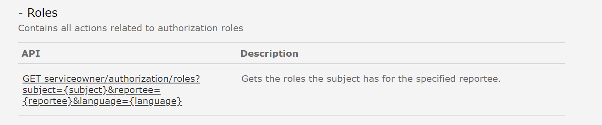
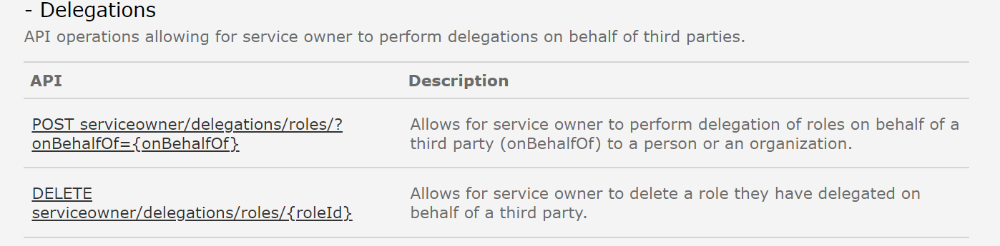

*Siden er under konstruksjon*

Eksisterende REST API i Altinn 2 er dokumentert [her](https://www.altinn.no/api/serviceowner/help)

## Reportees
### Migreringsstrategi
#### Hvilke konsekvenser har dette for konsumenter
### Tidsplan
### Tjenester og API i Altinn 3 som erstatter eksisterende API-tjeneste

## Rights
### Migreringsstrategi
#### Hvilke konsekvenser har dette for konsumenter
### Tidsplan
### Tjenester og API i Altinn 3 som erstatter eksisterende API-tjeneste

## AppRights
### Migreringsstrategi
#### Hvilke konsekvenser har dette for konsumenter
### Tidsplan
### Tjenester og API i Altinn 3 som erstatter eksisterende API-tjeneste

## Roles

Tjenesten benyttes for å hente ut hvilke roller en bruker har for å 
### Migreringsstrategi
I forbindelse med overgang til Altinn 3 erstattes dagens Altinn roller med nye tilgangspakker, se [brev sendt tjenesteeiere](/authorization/migration/informasjon-sent/letter-accessgroupes/).
Det er foreløpig ikke bestemt hva som vil skje med ROLES API når de nye tilgangsgruppene innføres. 
#### Hvilke konsekvenser har dette for konsumenter
Ikke avklart
### Tidsplan
- Dette APIet påvirkes ikke av arbeid med å [Klargjøre Altinn 3 for migrering av lenketjeneser](https://github.com/Altinn/altinn-roadmap/issues/63)
- Dette APIet påvirkes av arbeid som skjer i forbindelse med [Ny brukerflate for tilgangsstyring for virksomheter](https://github.com/Altinn/altinn-access-management/issues/341)
### Tjenester og API i Altinn 3 som erstatter eksisterende API-tjeneste
Ikke avklart

## RoleDefinitions
### Migreringsstrategi
#### Hvilke konsekvenser har dette for konsumenter
### Tidsplan
### Tjenester og API i Altinn 3 som erstatter eksisterende API-tjeneste

## SrrRight
### Migreringsstrategi
#### Hvilke konsekvenser har dette for konsumenter
### Tidsplan
### Tjenester og API i Altinn 3 som erstatter eksisterende API-tjeneste

## Consents
### Migreringsstrategi
#### Hvilke konsekvenser har dette for konsumenter
### Tidsplan
### Tjenester og API i Altinn 3 som erstatter eksisterende API-tjeneste

## DelegationRequests
### Migreringsstrategi
#### Hvilke konsekvenser har dette for konsumenter
### Tidsplan
### Tjenester og API i Altinn 3 som erstatter eksisterende API-tjeneste

## Delegations

Tjenesten benyttes i dag av Skatteetaten for å administrere tilgang til skattetjenester for brukere som ikke har eID. 
### Migreringsstrategi
Foreløpig konklusjon er at det utvikles nytt API som konsument må ta i bruk når aktuelle tjenester flyttes eller nye tilgangspakker etableres og tas i bruk. 
#### Hvilke konsekvenser har dette for konsumenter
Tjenesteeier må ta i bruk nye API før de flytter tjenester som er avhengig av dette APIet fra Altinn 2 til Altinn 3

### Tidsplan
- Dette APIet påvirkes av arbeid med å [Klargjøre Altinn 3 for migrering av lenketjeneser](https://github.com/Altinn/altinn-roadmap/issues/63)
- Dette APIet påvirkes av arbeid som skjer i forbindelse med [Ny brukerflate for tilgangsstyring for virksomheter](https://github.com/Altinn/altinn-access-management/issues/341)
### Tjenester og API i Altinn 3 som erstatter eksisterende API-tjeneste

