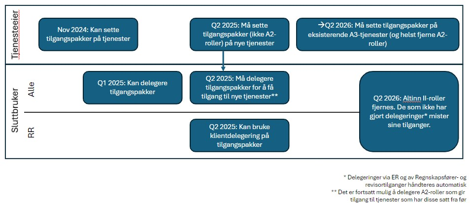

Altinn skal erstatte rollene som gir tilgang til tjenester i Altinn 2 når vi flytter Altinn Autorisasjon til Altinn 3. I stedet for roller vil det i Altinn 3 være ulike tilgangspakker som består av tjenester som hører til et ansvarsområde. 

## Tidsplan for arbeidet

**Utførte aktiviteter**
1. Foreslå nye tilgangspakker (Q1 2023)
2. Gjennomføre høring av versjon 1 av forslag til tilgangspakker (Q2/Q3 2023). Se [høringsbrev](/authorization/migration/informasjon-sent/letter-accessgroupes/) sendt ut i starten av juni. Frist 1.8.2023
3. Etablere nye tilgangspakker versjon 2 (Q3 2023)
4. Gjennomføre hørring av versjon 2 av forslag til tilgangspakker (Q3/Q4 2023).Høring er ennå ikke sendt ut men forslaget utvikles [her](). Antatt høringsfrist blir slutten av okotber 2023.
5. Etablere endelig versjon av tilgangspakker  
   
**Pågående og planlagte aktiviteter**  

6. Tjenesteeiere kan begynne å sette tilgangspakker på apper og ressurser. Q4-24 
   Fullstendig GUI og komplett liste over tilgangspakker vil bli tilgjengelig i Ressursregisteret/Altinn Studio i løpet av Q4-24. Tjenesteeiere som har behov for å knytte tilgangspakke til tjeneste før, kan be om å få aktuell(e) tilgangspakke(r) tilgjengelig manuelt.
7. Lansere [ny brukerflate](/authorization/migration/#nye-tilgangspakker-og-ny-brukerflate-for-tilgangsstyring-for-virksomheter) for fullmaktstyring for virksomheter (Q1 2025)  
   På ny brukerflate for tilgangsstyring, vil det være mulig å delegere roller, tilgangspakker og enkeltrettigheter, samt få oversikt over mottatte og gitte fullmakter. Det skal også være mulig å trekke tilbake gitte fullmakter og slette fullmakter man har fått.
8. Avvikle Altinn 2 roller i løsningen (Q2 2026)
   - Altinn 2-rollene fases ut samtidig som hele Altinn 2 slås av i juni 2026. 
     - Policyen for tjenesten vil på dette tidpunktet endres til å henvise til bare nye Altinn 3 tilgangspakker
     - Fra dette tidspunktet mister ansatte tilgang til tjenester gjennom de gamle Altinn 2 rollene

 Det er ikke før vi lanserer ny brukeflate for de som er administratorer for virksomhetene at de nye tilgangspakkene faktisk blir tatt i bruk og det vil være mulig å gi disse til ansatte. 
 

 Vi har laget denne [overordnede issuen](https://github.com/Altinn/altinn-access-groups/issues/6)for innføring av nye tilgangspakker hvor tidsplan holdes oppdatert. 

## Spørsmål og svar: 
1. *Av dagens Altinn-roller, er det kun rollene "Utfyller/innsender" og "Begrenset signeringsrett" som ønskes fjernet?*
     
      Nei, alle gamle Altinn2 roller vil fjernes, men noen får tilgangspakker som er ganske like, f.eks. rollen "patent og varemerke"
2. *Vil gamle Altinn-roller inngå i ny modell?*
      
      Etter en overgangsfase så vil alle eksisterende altinnroller fases ut og tjenester kun være tilgjengelig gjennom direkte delegering av tjeneste eller via en av de nye tilgangspakkene. 
3. *Vil koblingen mellom ER-roller og Altinn-roller bestå som i dag?*
      
      Roller i Enhetsreisteret vil knyttes til de nye tilgangspakkene. Når man har avsluttet høring vil vi starte arbeidet med å bestemme hvilke ER-roller som skal få hvilke tilgangspakker. I dette arbeidet vil vi inkludere en vurdring av Enhetsregister-rollens lovmessige fullmakt til å opptre på vegne av virksomheten. 
4. *Planlegges det ingen endring på Altinn-rollene for privatpersoner, kun virksomheter?* 
     
      Jo, dette vil gjøres i fase to. Da innføres nye tilgangspakkene for innbyggere som erstatter dagens Altinn 2-roller. Intensjonen er at disse tilgangspakkene skal bygge på den granulering av fullmakter som er gjort for vergemål. 
5. *Vil tilgangspakkene være tjenesteeierspesifikke?*
      
    Ingen av tilgangspakkene er i utgangspunktet "tjenesterierspesifikke" - men noen av de vil kanskje være i bruk av kun én eller et fåtall tjenesteeiere. 
6. *Vi har veldig mange tjenester i Altinn. Er tidsplan for å innføre nye tilgangspakker innen Altinn-rollene forsvinner realistisk?* 
      
      Ja, det mener vi. 
      Vi ser for oss at alle tjenesteeiere selv angir hvilke nye tilgangspakker som skal knyttes til nye/migrerte tjenester etterhvert som de flyttes. Tiden til å sette tilgangspakker på tjenester som allerede er etablert på Altinn 3 bør være tilstrekkelig gitt antallet tjenester som er etablert.
      Vi vil lage veiledning for dette slik at det skal være enkelt for dere å velge riktig tilgangspakke(r) og knytte det til tjenestene.

      Å utvide policy for tjeneste med å legge til en ny tilgangspakke vil ikke påvirke tjenestens funksjonalitet, så det vil svært sannsynlig ikke være behov for testing utover den verifiseringen som gjøres av Altinn. 
7. *Når tenker dere å slette dagens Altinn-roller og når vil de nye rollene være klare til å tas i bruk?*
      
      Se [tidsplan over](#tidsplan-for-arbeidet). 
 
 8. *Hva må vi i praksis gjøre med de appene vi har kjørende på Altinn 3 før/når endringen iverksettes?*

      Appene må oppdateres med nye policyer som inkluderer nye tilgangspakker i tillegg til de rollene som er definert der i dag. Rollene som står på tjenesten kan stå der til Altinn 2 fases ut, så lenge tjenesten har fått ny(e) tilgangspakker i tillegg.
 9. *Vil enkeltrettighet forsvinne?*

      Nei, at en tjeneste endrer policy har ingen betydning for enkeltrettigehter som er delegert direkte på tjenesten. Alle enkeltrettigheter som en virksomhet har gitt til en ansatt i Altinn 2 vil flyttes sammen med lenketjenesten til Altinn 3 plattformen. 

 10. *Mange av våre skjemaer dekker flere ulike tema og går ut til mange ulike næringer? Hvordan tenker dere at vi best håndterer slike?*

      Det vil være mulig å knytte tjenester til flere ulike tilgangspakker samtidig. I tilfeller hvor tjenester omfatter flere tema bør man knytte tjenesten til alle fullmaktsområdene som passer.

8.  *Når ny tjeneste for tilgangspakker er fullstendig satt i produksjon i Q2 2025, vil det da ikke være mulig lenger å delegere rettigheter på eksisterende måte?*

       Også etter at nye tilgangspakker er satt i produksjon så vil det fortsatt være mulig å deleger rettigheter til bare tjenesten/enkeltrettighet, på samme måte som i dag. 
       Vi vurderer om de gamle Altinn 2-rollene fortsatt vil være mulig å gi videre til andre, men man vil i alle fall i en overgangsperiode fortsatt vil få utført tjenesten med denne rollen.

