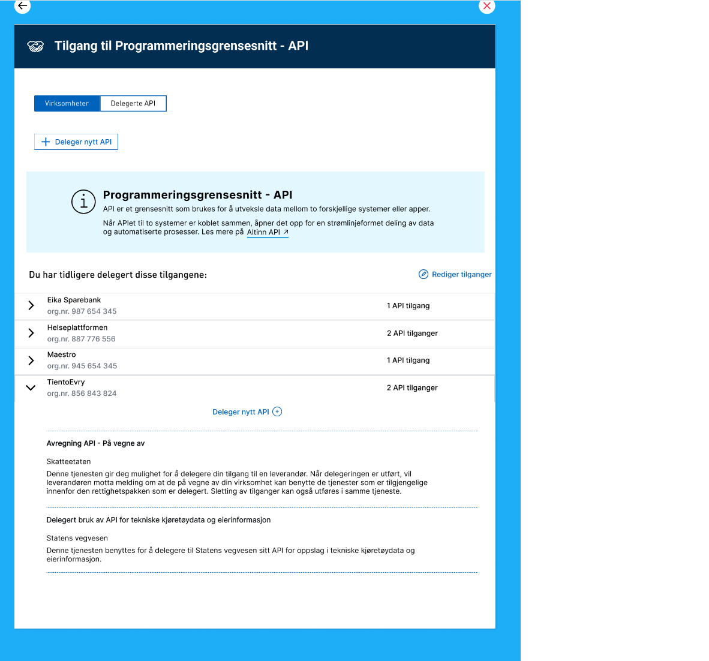
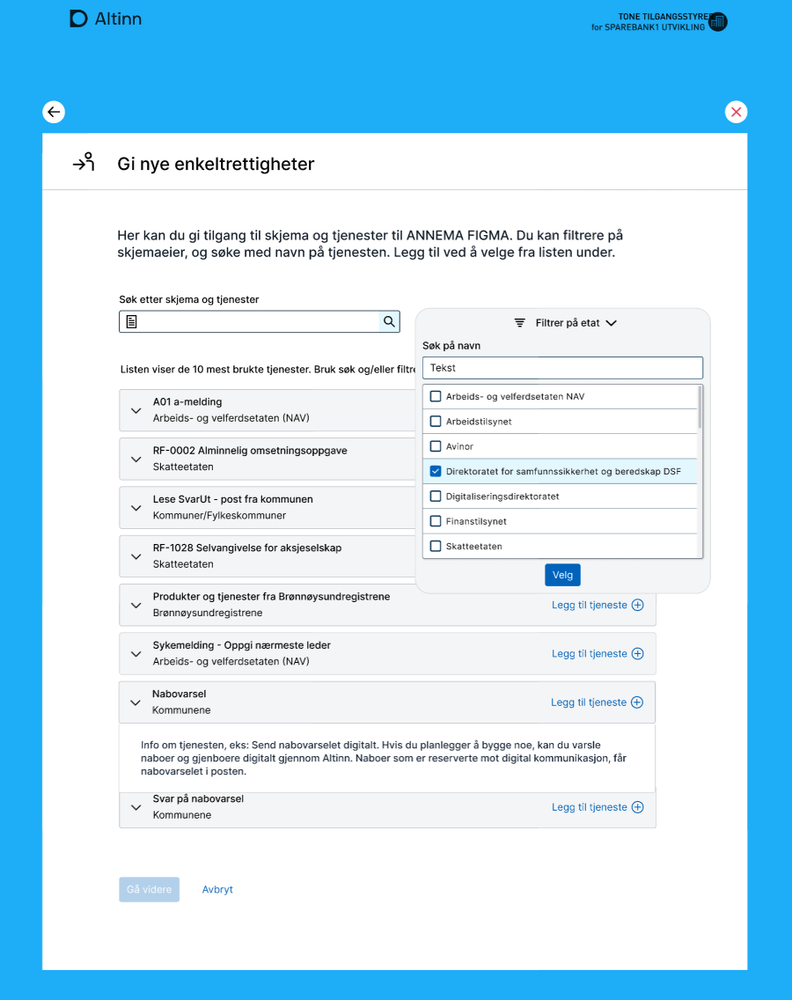

## Skjema-, innsyns- og samhandlingstjenester
### Migreringsstrategi
Tjenesteeier er selv ansvarlig for å migrere disse tjenestene fra Altinn 2 til Altinn 3. Det innebærer at man må utvikle skjematjenesten på nytt som en 3.0 app.  
[Her finner du veiledning](/app/) for hvordan dette gjøres. 

### Tidsplan
- Oppstart utvikling: Påbegynt
- Migrering tjenester avsluttet: senest Q1 2025
  

## Delegerbare API ressurser (ferdig migrert)
### Migreringsstrategi 
Alle tjenester av typen "Delegerbare api ressurser" vil bli flyttet fra Altinn 2 til Altinn 3 i en operasjon. 
Dette vil medføre en kort nedetid for disse tjenestene. Nedetid blir varslet på forhånd. 

Digdir vil ta ansvar for å flytte alle disse tjenestene. Tjenesteeier må i den forbindelse bidra med noe utfyllende informasjon om sine tjenester. Alle dette gjelder vil bli kontaktet særskilt.  

Alle delegeringer som finnes for disse tjenestene vil bli tatt vare på og flyttet samtidig med tjenesten fra Altinn 2 til Altinn 3. 
Det betyr at alle systemleverandører som i dag har rettighet til å bruke "Delegerbare API ressurser" på vegne av sine kunder vil beholde disse delegeringene etter at tjenestene er flyttet. 

### Ny brukerflate for administrering av Delegerbare API ressurser
I forbindelse med migrering av tjenestene så vil vi tilby en ny brukerflate for å administrere disse. 

### Konsekvenser for tilhørende API
Etter at tjenestene er flyttet vil det ikke være mulig for tjenesteeiere å opprette nye Delegerbare API ressurser via dagens grensesnitt. 
Tjenesteeiere som ønsker å opprette  nye tjenester av typen "Delegerbare API ressurser" må enten ta i bruk de nye APIene eller via epost be Digdir om å opprette disse på deres vegne. 

Det vil bli laget nye API for å hente ut informasjon om hvilke delegeringer som foreligger. Dette er API som i dag brukes av Maskinporten, Norsk Helsenett og SKatteetaten. 
Det vil i en overgangsfase være mulig å benytte de gamle API-ene. 

Informasjon om tjenestene vil etter flytting kunne slås opp her: 
- [Testmiljø- tt02](https://platform.tt02.altinn.no/resourceregistry/api/v1/resource/search)
- [Produksjonsmlijø - altinn.no](https://platform.altinn.no/resourceregistry/api/v1/resource/search)

#### API for delegering slås av
I dag er det mulig for sluttbruker å benytte API for å slette eller opprette delegeringer til Delegerbare API ressurser se [API-beskrivlese](https://altinn.github.io/docs/api/rest/autorisasjon/roller-og-rettigheter/#slette-delegerte-tjenesterettigheter--roller)). I forbindelse med migrering av disse ressursene fra Altinn 2 til Altinn 3 vil det i en overgangsfase ikke lenger være mulig å utføre dette via API. Nye API vil bli tilbydt i løpet av Q4 2023. 

### Tidsplan
- Oppstart utvikling: Avsluttet
- Migrering tjenester avsluttet:  Alle tjenester ble flyttet 13.6.23
- Informasjon sendt til tjenesteeiere finner du [her](/authorization/migration/informasjon-sent/letter-api-reources/)

## Lenketjenester
### Migreringsstrategi 
Alle tjenester av typen "Lenketjenester" flyttes èn og èn fra Altinn 2 til Altinn 3. Lenketjenester bytter navn i den forbindelse og vil i Altinn 3.0 bli kalt "tjenesteressurser".

Det er tjenesteeiers ansvar at disse flyttes, men Altinn vil legge til rette for at denne jobben blir så enkel som mulig. 
Tjenesteeier må i den forbindelse bidra med noe utfyllende informasjon om sine tjenester. Alle tjenesteeier som dette gjelder vil bli kontaktet særskilt.  

Altinn 2 API for tjenesteeier vil ikke inneholde informasjon om lenketjenester som er flyttet fra A2 til A3. 
Tjenesteeiere kan derfor ikke flytte sine ressurser før de er klar til å ta i bruk nye API for autorisasjon i Altinn 3.

Alle delegeringer som finnes for disse tjenestene vil bli tatt vare på og flyttet samtidig med tjenesten fra Altinn 2 til Altinn 3. 
Det betyr at alle brukere som i dag har tilgang til en ekstern lenketjenester på vegne av en aktør vil beholde disse delegeringene etter at tjenestene er flyttet. 

### Konsekvenser for tilhørende API
Det vil bli laget nye API for å hente ut informasjon om brukers rettigheter på vegne av andre.
Dette er API som i dag brukes av alle tjenesteeiere som har opprettet lenketjenster og som bruker Altinn som tilgangsstyringsløsning på deres egen tjensteplattform. 

Altinn 2 API for tjenesteeier vil ikke inneholde informasjon om lenketjenester som er flyttet fra A2 til A3. 
Tjenesteeiere kan derfor ikke flytte sine ressurser før de selv er klar til å ta i bruk nye API for Accessmanagement i Altinn 3.

Det vil i en overgangsfase være mulig for sluttbrukersystem å benytte de gamle API-ene på REST og SOAP. 
Beskrivelse av de nye APIene for sluttbrukersystem finnes i [swagger](https://app.swaggerhub.com/apis/jonkjetiloye/Accessmanagement/1.0.0#/). Denne er fortsatt under arbeid. 

### Brukerflate for administrering av tilgang til tjenesteressurser
Funksjonalitet i profil for å delegere enkeltrettigheter flyttes fra Altinn2 til Altinn 3. I all hovedsak vil utseende og funksjonalitet fortsette slik det er i dag, men vi kommer til å forbedre søk for å finne riktig tjeneste og muligheter for filterering på tjenesteeier. 

### Konsekvenser for Lokale roller i Altinn 2
Lokale roller fungerer i dag kun for tjenester som finnes på Altinn 2 plattformen. Vi har undersøkt utbredelse og bruk av disse og ser at funksjonaliteten er tatt i bruk av svært få virksomheter. I tillegg tror vi behovet for lokale roller vil forsvinne når man innfører [nye tilgangsgrupper](https://docs.altinn.studio/authorization/modules/accessgroups/type-accessgroups/) i Altinn 3. 

Det er derfor tatt en beslutning om at man ikke vil videreføre lokale roller i Altinn 3, men at vi inntill videre lar de lokale rollene som er opprettet og i bruk bestå. I praksis betyr dette at etterhvert som flere og flere tjenester migreres fra Altinn 2 til Altinn 3 så vil de lokale roller ha færre og færre tjenester de gjelder for. 

### Tidsplan
- Oppstart utvikling: 01.01.2023
- Klart for migrering av lenketjenester: Q4 2023
- Migrering må være gjort innen: ikke besluttet, men senest Q1 2025

## Samtykketjenester
### Migreringsstrategi
Det er ikke bestemt om tjenester av typen "Samtykke" skal flyttes èn og èn fra Altinn 2 til Altinn 3 eller om det skal gjøres i èn operasjon.  

Digdir vil ta ansvar for å flytte alle disse tjenestene. 

Alle samtykker som finnes for disse tjenestene vil bli tatt vare på og flyttet samtidig med tjenesten fra Altinn 2 til Altinn 3. 
Det betyr at alle brukere som i dag har fått samtykke på vegne av en aktør vil beholde dette etter at tjenestene er flyttet. 

### Konsekvenser for tilhørende API
Det er fortsatt ikke utredet hvilke konsekvenser dette får for API som tilhører samtykketjenester. 
Det vil i en overgangsfase være mulig å benytte de gamle API-ene. 

### Tidsplan
- Oppstart utvikling: ikke besluttet
- Klart for migrering av samtykketjenester: ikke besluttet
- Migrering må være gjort innen: ikke besluttet, men senest Q1 2025

## Formidlingstjenester
### Migreringsstrategi
Det er ikke bestemt om alle tjenester av typen "Formidlingstjenester" skal flyttes èn og èn fra Altinn 2 til Altinn 3 eller om det skal gjøres i èn operasjon.  
Konsept for modernisering av Formidlingstjenesten følges opp [her](https://github.com/digdir/portfolio/issues/48)

### Konsekvenser for tilhørende API
Det er fortsatt ikke utredet hvilke konsekvenser dette får for API som tilhører formidlingstjenesten. 
Det vil i en overgangsfase være mulig å benytte de gamle API-ene. 

### Tidsplan 
- Oppstart utvikling: Q3 2023
- Klart for migrering av tjenester: Q1 2024
- Migrering av tjenester må være gjort innen: ikke besluttet, men senest Q1 2025

## Meldingstjenester
### Migreringsstrategi
Det er ikke bestemt hvilken migreringsstrategi man skal ha for meldingstjenester (Correspondence), 
Valgt løsning for [dialogporten](https://digdir.github.io/dialogporten/) vil henge sammen med migrring av meldingstjenester. 
Fremdriftsplan for dialogporten finner du [her](https://github.com/orgs/digdir/projects/8/views/25)

### Konsekvenser for tilhørende API
Det er ikke utredet hvilke konsekvenser dette har på tilhørende API

### Tidsplan
- Oppstart utvikling: ikke besluttet
- Klart for migrering av tjenester: ikke besluttet
- Migrering av tjenester må være gjort innen: ikke besluttet, men senest Q1 2025
