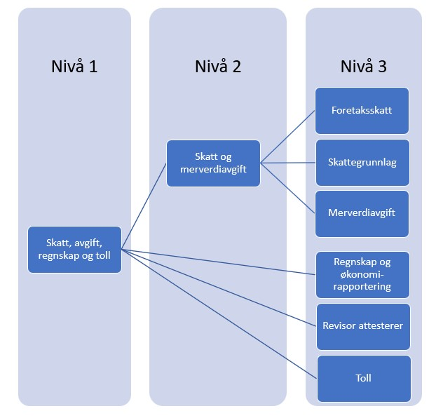

*Høring er avsluttet og svar er under behandling*

Altinn skal erstatte rollene som gir tilgang til tjenester i Altinn 2 når vi flytter Altinn Autorisasjon til Altinn 3. 
I stedet for roller vil det i Altinn 3 være ulike tilgangspakker som består av tjenester som hører til et ansvarsområde.
tilgangspakkene vil fungere som maler for tilgangsstyrer i en virksomhet som de kan bruke for å gi egne ansatte tilgang til et sett med tjenester som naturlig hører sammen. 

I forbindelse med innføring av nye tilgangspakker så endres brukergrensesnitt for tilgangsstyrer slik at disse blir enklere å forstå og ta i bruk enn dagens roller.  

**Her finner du som er tjenesteeier forslag til kategorier og navn på de nye tilgangspakkene. Vi ønsker innspill om de nye tilgangspakkene passer til deres tjeneste.**

## Administrator gir tilgang til grupper med tjenester og maler
Den som skal gi tilgang til tjenester i en virksomhet kalles administrator. Administrator kan gi tilgang til tjenester ved å lage en gruppe som består av maler med tjenester i og brukere. 
Dette vil gi oss større frihet til å revidere malene senere, uten at det skaper mye merarbeid for administratorer eller tjenesteeiere.

Eksterne roller fra Enhetsregisteret (f eks Daglig leder, styreleder eller Regnskapsfører), får automatisk tilgang til en mal for en virksomhet. Altinn skal sammen med Enhetsregisteret på nytt vurdere hvilke eksterne roller det er aktuelt å knytte til de ulike tilgangspakkene. 
## De nye malene gjør det lettere å administrere tilganger

Den største forskjellen på rollene i 2.0   og malene i 3.0 blir:

-	Flere maler som er delt inn i tre nivåer, slik at administrator kan gi tilgang til færre tjenester og det blir lettere å finne riktig mal. 
-	Mer findelte tilgangspakker gjør det lettere for tjenesteeiere å velge riktig målgruppe for sine tjenester.

Grunnlaget for inndelingen i maler er [Altinns skjemakatalog](https://www.altinn.no/skjemaoversikt/?category=category) og [SSBs standard for å kategorisere virksomheter](https://www.ssb.no/klass/klassifikasjoner/6)

## Nå må du knytte tjenester til det laveste nivået i hierarkiet 

Malene har tre nivåer. Du må knytte tjenester til det laveste nivået, nivå 3.
Det betyr for eksempel at du ikke kan knytte en tjeneste til malen «Skatt, avgift, regnskap og toll» som er nivå 1. Du kan heller ikke knytte til nivået under, for eksempel «Skatt og Merverdiavgift». Du må knytte til «Foretaksskatt», «Skattegrunnlag » og/eller "Merverdiavgift".

Målet med mer findelte nivåer et at folk skal få tilgang til akkurat det de trenger, men ikke få for omfattende tilganger. 
Maler som foreløpig er definert som nivå 3 er markert med * i oversikten under. Hvis du trenger det, kan vi lage flere maler på de ulike nivåene. 
Du kan knytte en tjeneste til flere maler hvis du mener det er riktig. 
 

### Avvikler generelle roller
I forbindelse med innføring av nye tilgangspakker så foreslår vi å avvikle følgende 2 generelle roller:  
- Utfyller/innsender 
- Begrenset signeringsrett 

Øvrige Altinn 2 roller vil erstattes av en eller flere tilgangspakker som kan benyttes som erstatning. 

### Informasjon om tilgang til digital post kommer senere
Akkurat nå er det uklart om vi skal styre tilgangen til digital post på samme måte når vi går fra Altinn 2 til Altinn 3. Derfor har vi ikke foreslått nye maler for å motta digital post i denne versjonen.

## Vi ønsker innspill fra dere som er tjenesteeierne
Vi sender dette forslaget til nye maler på høring mai 2023. Vi ønsker tilbakemeldinger på
-	om de foreslåtte malene passer til de tjenestene dere har
-	navnene på alle de tre nivåene til malene

Tilbakemelding kan du sende på e-post til servicedesk@altinn.no innen 1.8 2023.

# Forslag til tilgangspakker på nivå 1: 
## tilgangspakker relevant for mange/alle virksomheter
1. [Skatt, avgift, regnskap og toll](/authorization/modules/accessgroups/type-accessgroups/versjon-1/#nivå-1-skatt-avgiff-regnskap-og-toll)
2. [Personale](/authorization/modules/accessgroups/type-accessgroups/versjon-1/#nivå-1-personale)
3. [Miljø, ulykke og sikkerhet](/authorization/modules/accessgroups/type-accessgroups/versjon-1/#nivå-1-miljø-ulykke-og-sikkerhet)
4. [Grunnlag for virksomheten](/authorization/modules/accessgroups/type-accessgroups/versjon-1/#nivå-1-grunnlag-for-virksomheten)
5. [Integrasjoner og API-er](/authorization/modules/accessgroups/type-accessgroups/versjon-1/#nivå-1-integrasjoner-og-api-er)
6. [Administrere tilganger](/authorization/modules/accessgroups/type-accessgroups/versjon-1/#nivå-1-administrere-tilganger)

## Bransjespesifikke tilgangspakker
7. [Jordbruk, skogbruk, jakt, fiske og akvakultur](/authorization/modules/accessgroups/type-accessgroups/versjon-1/#nivå-1-jordbruk-skogbruk-jakt-fiske-og-akvakultur)
8. [Bygg, anlegg og eiendom](/authorization/modules/accessgroups/type-accessgroups/versjon-1/#nivå-1-bygg-anlegg-og-eiendom)
9. [Transport og lagring](/authorization/modules/accessgroups/type-accessgroups/versjon-1/#nivå-1-transport-og-lagring)
10. [Helse, pleie, omsorg og vern](/authorization/modules/accessgroups/type-accessgroups/versjon-1/#nivå-1-helse-pleie-omsorg-og-vern)
11. [Oppvekst og utdanning](/authorization/modules/accessgroups/type-accessgroups/versjon-1/#nivå-1-oppvekst-og-utdanning)
12. [Energi, vann, avløp og avfall](/authorization/modules/accessgroups/type-accessgroups/versjon-1/#nivå-1-energi-vann-avløp-og-avfall)
13. [Industrier](/authorization/modules/accessgroups/type-accessgroups/versjon-1/#nivå1-industrier)
14. [Kultur og frivillighet](/authorization/modules/accessgroups/type-accessgroups/versjon-1/#nivå-1-kultur-og-frivillighet)
15. [Handel, overnatting og servering](/authorization/modules/accessgroups/type-accessgroups/versjon-1/#nivå1-handel-overnatting-og-servering)
16. [Andre tjenesteytende næringer](/authorization/modules/accessgroups/type-accessgroups/versjon-1/#nivå-1-andre-tjenesteytende-næringer)

## Andre spesialiserte tilgangspakker
17. [tilgangspakker for regnskapsførere](/authorization/modules/accessgroups/type-accessgroups/versjon-1/#tilgangspakker-for-regnskapsførere)
18. [tilgangspakker for revisor](/authorization/modules/accessgroups/type-accessgroups/versjon-1/#tilgangspakker-for-revisor)
19. [tilgangspakker for konkursbo](/authorization/modules/accessgroups/type-accessgroups/versjon-1/#tilgangspakker-for-konkursbo)

## Nivå 1: Skatt, avgiff, regnskap og toll
Tilgangspakken er nyttig for alle virksomheter som er skatte- og regnskapspliktige.

Denne tilgangspakken har disse tilgangspakkene på nivå 2 og 3.  

tilgangspakken har følgende undergrupper: 
- Niva 2 Skatt og Merverdiavgift
  - *Foretaksskatt (tilsvarende som i Altinn skjemakatalog)
  - *Skattegrunnlag (tilsvarende som i Altinn skjemakatalog)
  - *Merverdiavgift (tilsvarende som i Altinn skjemakatalog)
- *Regnskap og øknomirapportering (tilsvarende som i Altinn skjemakatalog)
- *Reviorattesterer 
- *Toll (tilsvarende som i Altinn skjemakatalog)

Beslektet rolle i 2.0 er "Regnskapsmedarbeider" og "Revisorattesterer - MVA kompensasjon"

## Nivå 1: Personale
Tilgangspakken er nyttig for alle virksomheter som har ansatte. 

Denne tilgangspakken har disse tilgangspakkene på nivå 3.

- *Ansettelsesforhold (tilsvarende som i Altinn skjemakatalog)
- *Lønn (tilsvarende som i Altinn skjemakatalog)
- *Pensjon (tilsvarende som i Altinn skjemakatalog)
- *Permisjon og sykefravær (tilsvarende som i Altinn skjemakatalog)
  
Beslektet rolle i 2.0 er "Lønn og personalmedarbeider", 

## Nivå 1: Miljø, ulykke og sikkerhet 
Tilgangspakken er nyttig for mange virksomheter.

Denne tilgangspakken har disse tilgangspakkene på nivå 2 og 3.

- Nivå 2: Miljø og klimarapportering
  - *Renovasjon
  - *Miljørydding, miljørensing og lignende (tilsvarende som i Altinn skjemakatalog)
- *Sikkerhet og internkontroll (tilsvarende som i Altinn skjemakatalog)
- *Ulykke og yrkesskade (tilsvarende som i Altinn skjemakatalog)

Beslektet rolle i 2.0 er  "Energi, miljø og klima"
  

## Nivå 1: Grunnlag for virksomheten
Tilgangspakken er nyttig for alle virksomheter.

Denne tilgangspakken har disse tilgangspakkene på nivå 3.

- *Starte, endre og avvikle virksomhet (tilsvarende som i Altinn skjemakatalog)
- *Aksjer og eierforhold (tilsvarende som i Altinn skjemakatalog)
- *Attester (tilsvarende som i Altinn skjemakatalog)
- *Dokumentbasert tilsyn (tilsvarende som i Altinn skjemakatalog)
- *Infrastruktur (tilsvarende som i Altinn skjemakatalog)
- *Patent, varmerke og design (tilsvarende som i Altinn skjemakatalog)
- *Tilskudd, støtte og erstatning (tilsvarende som i Altinn skjemakatalog)
- *Mine sider hos kommunen

Beslektet rolle i 2.0 er "Signerer av samordnet registermelding", "Patent, varemerke og design" og “Kommunale tjenester ”

## Nivå 1: Integrasjoner og API-er
Tilgangspakken er nyttig for mange virksomheter. 

Denne tilgangspakken har disse tilgangspakkene på nivå 2 og 3.

- Nivå 2: Dataintegrasjoner
  - *Programmeringsgrensesnitt (API)
  - *Maskinlesbare hendelser
  
## Nivå 1: Administrere tilganger
Tilgangspakken er nyttig for alle virksomheter.

Denne tilgangspakken har disse tilgangspakkene på nivå 3.

- *Klientadminstrasjon (for Regnskapsfører, Revisor) 
- *Tilgangsstyring
- *Hovedadministrator
- *Kundeadministrator (for leverandører som ikke er Regnskapsfører eller Revisor)

Beslektet rolle i 2.0 er Klientaadministrator, Tilgangsstyrer, Hovedadministrator 

## Nivå 1: Jordbruk, skogbruk, jakt, fiske og akvakultur
Tilgangspakken er tilpasset denne bransjen og inneholder tjenester som virksomheter i denne bransjen bruker.

Denne tilgangspakken har disse tilgangspakkene på nivå 3.

- *Planteproduksjon og dyrehold
- *Jakt og viltstell
- *Skogbruk 
- *Fiske og fangst
- *Akvakultur

Beslektede rolle i 2.0 er "Primærnæring og næringsmiddel"

## Nivå 1: Bygg, anlegg og eiendom
Tilgangspakken er tilpasset denne bransjen og inneholder tjenester som virksomheter i denne bransjen bruker.

Denne tilgangspakken har disse tilgangspakkene på nivå 2 og 3.

- Nivå 2: Bygg og anlegg
  - *Plan og byggesaker
- Nivå 2: Omsetning og drift av eiendom
  - *Kjøp og salg av eiendom
  - *Utleie av eiendom
  - *Eiendomsmegler

Beslektede rolle i 2.0 er "Plan og byggesak"

## Nivå 1: Transport og lagring
Tilgangspakken er tilpasset denne bransjen og inneholder tjenester som virksomheter i denne bransjen bruker.

Denne tilgangspakken har disse tilgangspakkene på nivå 3.

- *Transport: På land og i rør
- *Sjøfart
- *Lufttransport
- *Lagring og andre tjenester tilknyttet transport

Beslektede rolle i 2.0 er "Samferdsel"
## Nivå 1: Helse, pleie, omsorg og vern 
Tilgangspakken er tilpasset denne bransjen og inneholder tjenester som virksomheter i denne bransjen bruker.

Denne tilgangspakken har disse tilgangspakkene på nivå 3.

- *Helsetjenester
- *Pleie- og omsorgstjenester i institusjon
- *Sosiale omsorgstjenester uten botilbud
- *Barnevern og familievern

Beslektede rolle i 2.0 er "Helse-, sosial- og velferdstjenester"
## Nivå 1: Oppvekst og utdanning
Tilgangspakken er tilpasset denne bransjen og inneholder tjenester som virksomheter i denne bransjen bruker.

Denne tilgangspakken har disse tilgangspakkene på nivå 3.

- Nivå 2: Skole 
  - *Grunnskole
  - *Videregående utdanning
  - *Høyere utdanning
- *Barnehage 

## Nivå 1: Energi, vann, avløp og avfall
Tilgangspakken er tilpasset denne bransjen og inneholder tjenester som virksomheter i denne bransjen bruker.

Denne tilgangspakken har disse tilgangspakkene på nivå 3.

- *Elektrisitet: produsere, overføre og distribuere
- *Damp- og varmtvann
- *Vann: ta ut fra kilde, rense og distribuere
- *Samle opp og behandle avløpsvann
- *Avfall: samle inn, behandle bruke og gjenvinne
- *Utvinning av råolje og naturgass

## Nivå1: Industrier
Tilgangspakken er tilpasset denne bransjen og inneholder tjenester som virksomheter i denne bransjen bruker.

Denne tilgangspakken har disse tilgangspakkene på nivå 3.

-	*Næringsmidler, drikkevarer og tobakk
-	*Tekstiler, klær og lærvarer
-	*Trelast, trevarer og papirvarer
-	*Trykkerier og reproduksjon av innspilte opptak
-	*Oljeraffinering, kjemisk og farmasøytisk industri
-	*Gummi og plast
-	*Metaller og mineraler
-	*Metallvarer, elektrisk utstyr og maskiner
-	*Verft og andre transportmidler
-	*Møbler og annen industri   
-	*Reparasjon og installasjon av maskiner og utstyr
-	*Bergverk

## Nivå 1: Kultur og frivillighet
Tilgangspakken er tilpasset denne bransjen og inneholder tjenester som virksomheter i denne bransjen bruker.

Denne tilgangspakken har disse tilgangspakkene på nivå 3.

- *Kunst og underholdning
- *Biblioteker, museer, arkiver, og annen kultur
- *Lotteri og spill
- *Sports- og fritid 
- *Fornøyelser
- *Politikk

## Nivå1: Handel, overnatting og servering
Tilgangspakken er tilpasset denne bransjen og inneholder tjenester som virksomheter i denne bransjen bruker.

Denne tilgangspakken har disse tilgangspakkene på nivå 3.
- *Varehandel
- *Overnatting
- *Servering
 
 
## Nivå 1: Andre tjenesteytende næringer
Tilgangspakken er tilpasset denne bransjen og inneholder tjenester som virksomheter i denne bransjen bruker.

Denne tilgangspakken har disse tilgangspakkene på nivå 3.
- *Post og telekommunikasjon
- *Informasjon og kommunikasjon
- *Finansiering og forsikring
- *Annen tjenesteyting

## tilgangspakker for regnskapsførere
Disse tilgangspakkene er bare tilgjengelig for regnskapsførere og er de samme som vi har i Altinn 2 i dag. Du bruker dem for å gi egne ansatte tilgang til virksomheter/klienter de er registrert som regnskapsførere for i Enhetsregisteret.

Denne tilgangspakken har disse tilgangspakkene på nivå 3.
- *Regnskapsfører med signeringsrettighet
- *Regnskapsfører uten signeringsrettighet
- *Regnskapsfører lønn

## tilgangspakker for revisor
Disse tilgangspakkene er bare tilgjengelig for revisor og er de samme som vi har i Altinn 2 i dag. Du bruker dem for å gi egne ansatte tilgang til virksomheter/klienter de er registrert som revisor for i Enhetsregisteret.

Denne tilgangspakken har disse tilgangspakkene på nivå 3.

- *Ansvarlig revisor
- *Revisormedarbeider

## tilgangspakker for konkursbo
Disse tilgangspakkene er bare tilgjengelig for konkursbo og er de samme som vi har i Altinn 2 i dag. Du bruker dem for å gi kreditorer og andre tilgang til opplysninger om konkursbo.

Denne tilgangspakken har disse tilgangspakkene på nivå 3.

- *Konkursbo tilgangsstyring
- *Konkursbo lesetilgang
- *Konkursbo skrivetilgang

Disse tilgangspakkene er videreføring av tilsvarende roller som finnes i dag for konkursbo

