# Siden er under arbeid
Nedenfor er oversikt over fullmaktsgrupper revidert etter innspill fra Tjenesteeeiere. 
- Under hvert bilde er forslag til fullmaktsbeskrivelse som skal presenteres administrator for virksomheten i forbindelse med tilgangsstyring 
- Denne beskrivelsen vil forklare hvilke type tjenester som er knyttet til fullmakten og som fullmakten dermed gir tilgang til
- Alle fullmakstbeskrivelser vil ha følgende ettertekst: *Ved regelverksendringer eller innføring av nye digitale tjenester kan det bli endringer i tilganger som fullmakten gir*

- Det er tjenesteeier som avgjør hvilken fullmaktsgruppe deres tjeneste/ressus hører inn under. Det er viktig å legge merke til at:
  - Tjenester/ressurser knyttes alltid til laveste nivå (grønn boks)
  - Det er mulig å knytte en tjeneste/ressurs til flere fullmaktsgrupper.
  - En slik struktur som er rikere og mer ganulert, vil gjøre det enklere i fremtiden å endre fullmaktsgrupper. Det vil vær mulig å lage nye, dele opp eller slå sammen fullmaktsgrupper, uten at det får stor påvirkning på de ansatte i virksomhetene som skal utføre tjenestene. 

## Fullmaktsgrupppe Skatt, avgift, regnskap og toll
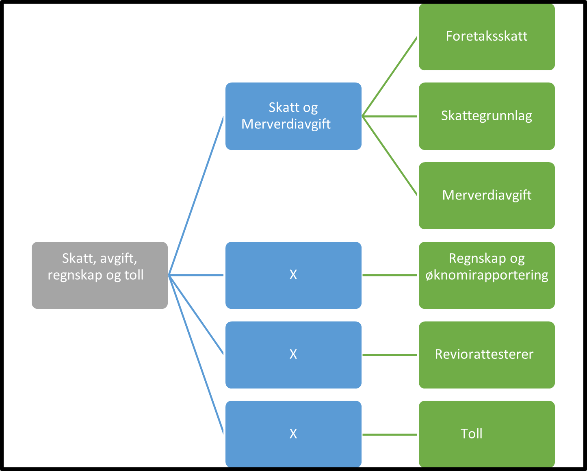  
- **Skatt, avgift, regnskap og toll:** Denne fullmakten gir tilgang til alle tjenester som angår skatt, avgift, regnskap og toll
	- **Skatt og Merverdiavgift:** Denne fullmakten gir tilgang til alle tjenester  som angår skatt og merverdiavgift
		- **Foretaksskatt:** Denne fullmakten gir tilgang til alle tjenester knyttet til skatt for foretak
		- **Skattegrunnlag:** Denne fullmakten gir tilgang til alle tjenester knyttet til innhenting av skattegrunnlag
		- **Merverdiavgift:** Denne fullmakten gir tilgang til alle tjenester knyttet til merverdiavgift
	- **Regnskap og øknomirapportering:** Denne fullmakten gir tilgang til alle tjenester knyttet til regnskap og øknomirapportering som ikke tilhører skatt og merverdiavgift
	- **Reviorattesterer:** Denne fullmakten gir tilgang til alle tjenester knyttet til skatt, avgift, regnskap og toll som krever revisorattestering
	- **Toll:** Denne fullmakten gir tilgang til alle tjenester knyttet til toll og fortolling

Fullmaktsgruppene tildeles følgende roller fra ER: 
- For alle organisasjonsformer tildeles fullmaktsgrupper til: Daglig leder, Styrets leder, Forretningsfører, 
- I tillegg tildeles fullmaktsgrupper til følgende roller: Innehaver i ENK, Deltakere i ANS, DA, PRE, Komplementær i KS, Bestyrende Reder i PART og Represtentant i NUF.  

## Fullmaktsgrupppe Personale
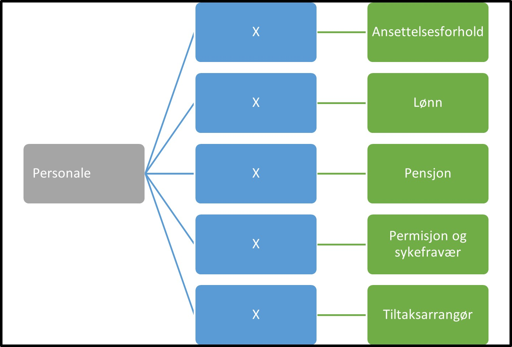
- **Personale:** Denne fullmakten gir tilgang til alle tjenester som angår ansatte og personalforhold
	- **Ansettelsesforhold:** Denne fullmakten gir tilgang til alle tjenester knyttet til ansettelsesforhold
	- **Lønn:** Denne fullmakten gir tilgang til alle tjenester knyttet til lønn og honorar
	- **Pensjon:** Denne fullmakten gir tilgang til alle tjenester knyttet til pensjon 
	- **Permisjon og sykefravær:** Denne fullmakten gir tilgang til alle tjenester knyttet til permisjon og sykefravær
	- **Tiltaksarrangør:** (mangler)	

## Fullmaktsgrupppe Miljø, ulykke og sikkerhet
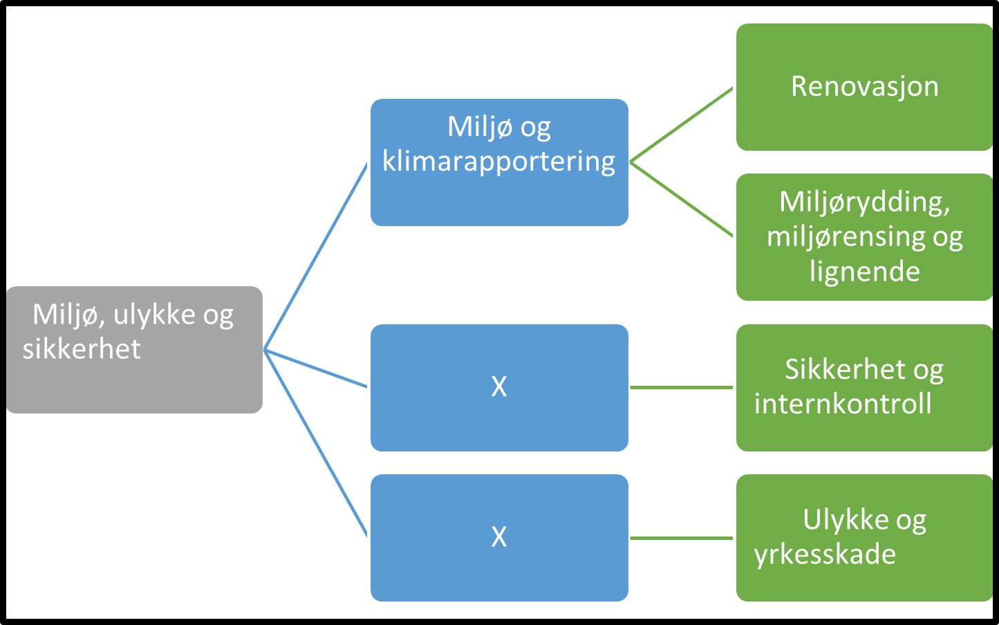
- **Miljø, ulykke og sikkerhet:** Denne fullmakten gir tilgang til alle tjenester som angår miljø, klima, renovasjon samt helse, miljø ogsikkerehet
	- **Miljø og klimarapportering:** Denne fullmakten gir tilgang til alle tjenester som angår renovasjon, miljø og klimarapportering
		- **Renovasjon:** Denne fullmakten gir tilgang til alle tjenester knyttet til renovasjon
        - **Miljørydding, miljørensing og lignende:** Denne fullmakten gir tilgang til alle tjenester knyttet til miljørydding, miljørensing og lignende
	- **Sikkerhet og internkontroll:** Denne fullmakten gir tilgang til alle tjenester knyttet til sikkerhet og internkontroll
	- **Ulykke og yrkesskade:** Denne fullmakten gir tilgang til alle tjenester knyttet til ulykke og yrkesskade

## Fullmaktsgruppe Post/arkiv

Disse fullmaktsgruppene knyttes til alle meldinger som sendes virksomheten og som det er naturlig at post/arkiv medarbeider har tilgang til.

Tjenesteeier bør alltid vurdere å knytte meldingen til andre fullmaktsgrupper når dette er naturlig. 

- **Post/arkiv:** (mangler)
	- **Tilgang til all ordinær post som sendes virksomheten:** Denne fullmakten gir tilgang til all post som ikke innholder særlig sensitiv og taushetsbelagt informasjon som sendes virksomheten. 
	- **Tilgang til all post med taushetsbelagt innhold som sendes virksomheten:** Denne fullmakten gir tilgang til all post som innholder særlig sensitiv og taushetsbelagt informasjon som sendes virksomheten. 

## Fullmaktsgruppe Grunnlag for virksomheten
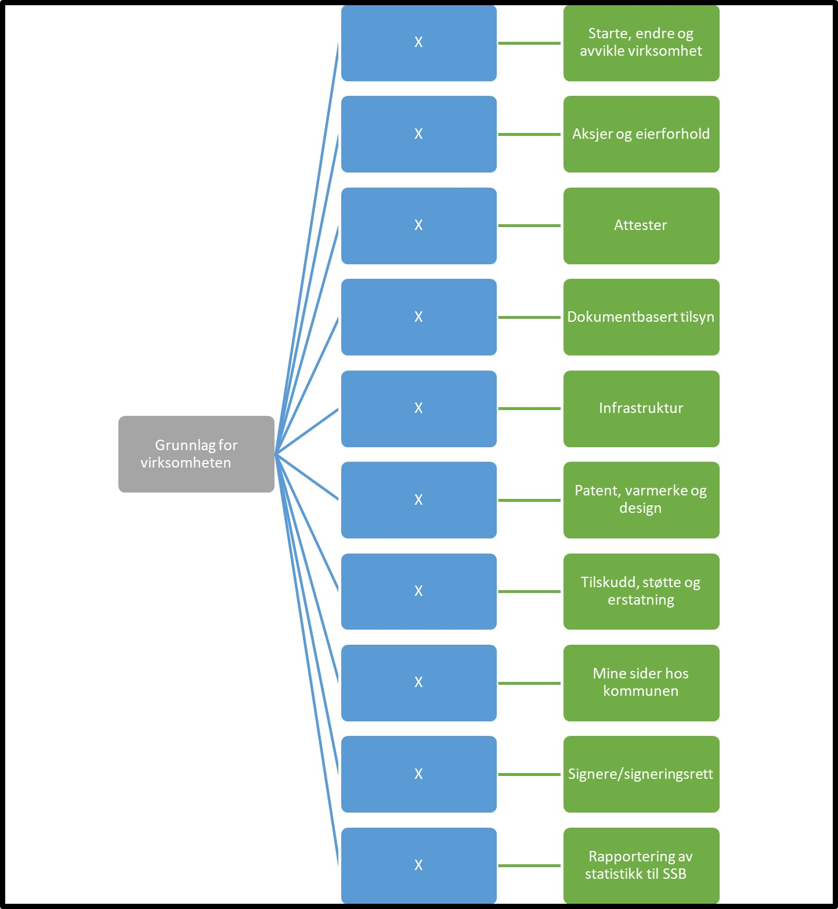
- **Grunnlag for virksomheten:**			Denne fullmakten gir tilgang til alle tjenester som er relatert til å etablere en virksomhet
	- **Starte, endre og avvikle virksomhet:**		Denne fullmakten gir tilgang til alle tjenester knyttet til å starte, endre og avvikle en virksomhet
	- **Aksjer og eierforhold:** Denne fullmakten gir tilgang til alle tjenester knyttet til aksjer og eierforhold
	- **Attester:** Denne fullmakten gir tilgang til alle tjenester knyttet til attestering av virksomhet
	- **Dokumentbasert tilsyn:** Denne fullmakten gir tilgang til alle tjenester knyttet til dokumentbaserte tilsyn
	- **Infrastruktur:** Denne fullmakten gir tilgang til alle tjenester knyttet til virksomhetens infrastruktur 
	- **Patent, varmerke og design:** Denne fullmakten gir tilgang til alle tjenester knyttet til patent, varemerke og design 
	- **Tilskudd, støtte og erstatning:** Denne fullmakten gir tilgang til alle tjenester knyttet til å søke tilskudd, støtte og erstatning
	- **Mine sider hos kommunen:** Denne fullmakten gir generell tilgang til tjenester av typen "mine side" tjenester hos kommuner. 
	- **Signere/signeringsrett:** Denne fullmakten gir generell tilgang til å signere utvalgte skjema og tjeneser på vegne av virksomheten i rapporteringer/tjenester som krever særlig signeringsfullmakt. 
	- **Rapportering av statistikk til SSB:** Denne fullmakten gir tilgang til alle pålagte rapportering til Statistisk sentralbyrå.

## Fullmaktsgruppe Integrasjoner og API-er
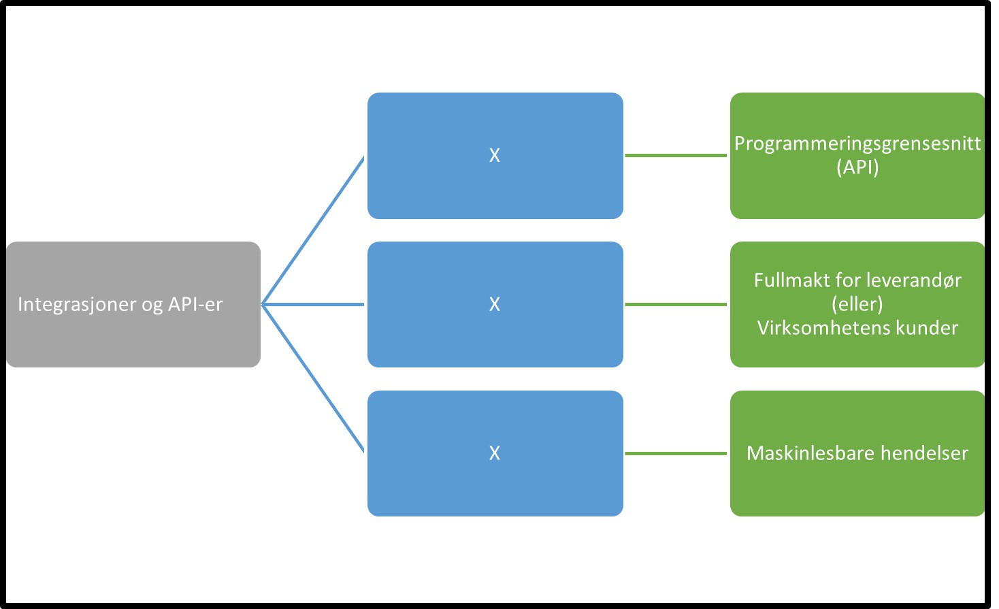
- **Integrasjoner og API-er:** Denne fullmakten gir tilgang til å sette opp og administrere dataintegrasjoner og API som tilbys.  
	- **Programmeringsgrensesnitt (API):** Denne fullmakten gir tilgang til alle tjenester for å administrere tilgang til data og programmeringsgrensenitt (API) hos offentlige etater
	- **"Fullmakt for leverandør (eller) Virksomhetens kunder":** Denne fullmakten benyttes når en leverandørvirksomhet skal utføre tjenester på vegne av en kunde via et programmeringsgrensesnitt (API). Fullmakten kan gis til til virksomhetsbruker som er knyttet til leverandørens organisasjonsnummer. Men denne fullmakten vil virksomhetsbrukeren kunne utføre alle tjenester som leverandøren har tilgang til å utføre på vegne av alle sine kunder/klienter. Fullmakten gir ikke virksomhetsbruker tilgang til å utføre tjenester på vegne av leverandøren selv, bare kunder av leverandøren. "
	- **Maskinlesbare hendelser:** Denne fullmakten gir tilgang til alle tjenester for å administrere tilgang til maskinlesbare hendelser

## Fullmaktsgruppe Administrere tilganger

- **Administrere tilganger**			
	- **Klientadminstrasjon for Regnskapsfører og Revisor:** Denne fullmakten gir bruker mulighet til å administrere tilgang til tjenester det er naturlig at regnskapsfører eller revisor utfører. Bruker kan administrere tilgang til tjenestene  til ansatte hos regnskapsfører eller revisor på vegne av deres kunder. 
	- **Tilgangsstyring:** Denne fullmakten gir bruker mulighet til å gi videre tilganger for virksomheten som man selv har mottatt
	- **Hovedadministrator:** Denne fullmakten gir bruker mulighet til å administrere alle tilganger for virksomheten
	- **Kundeadministrator:** Denne fullmakten gir bruker mulighet til å administrere tilganger man har mottatt for sine kunder til ansatte i egen virksomheten

## Fullmaktsgruppe Jordbruk, skogbruk, jakt, fiske og akvakultur

- **Jordbruk, skogbruk, jakt, fiske og akvakultur:** Denne fullmakten gir tilgang til alle tjenester som angår jordbruk, skogbruk, jakt, fiske og akvakultur"
	- **Planteproduksjon og dyrehold:** Denne fullmakten gir tilgang til alle tjenester knyttet til planteproduksjon og dyrehold
"
    - **Jakt og viltstell:** Denne fullmakten gir tilgang til alle tjenester knyttet til jakt og viltstell
    - **Skogbruk:** Denne fullmakten gir tilgang til alle tjenester knyttet til skogbruk
    - **Fiske:** Denne fullmakten gir tilgang til alle tjenester knyttet til fiske
    - **Akvakultur:** Denne fullmakten gir tilgang til alle tjenester knyttet til akvakultur og fiskeoppdrett

## Fullmaktsgruppe Bygg, anlegg og eiendom
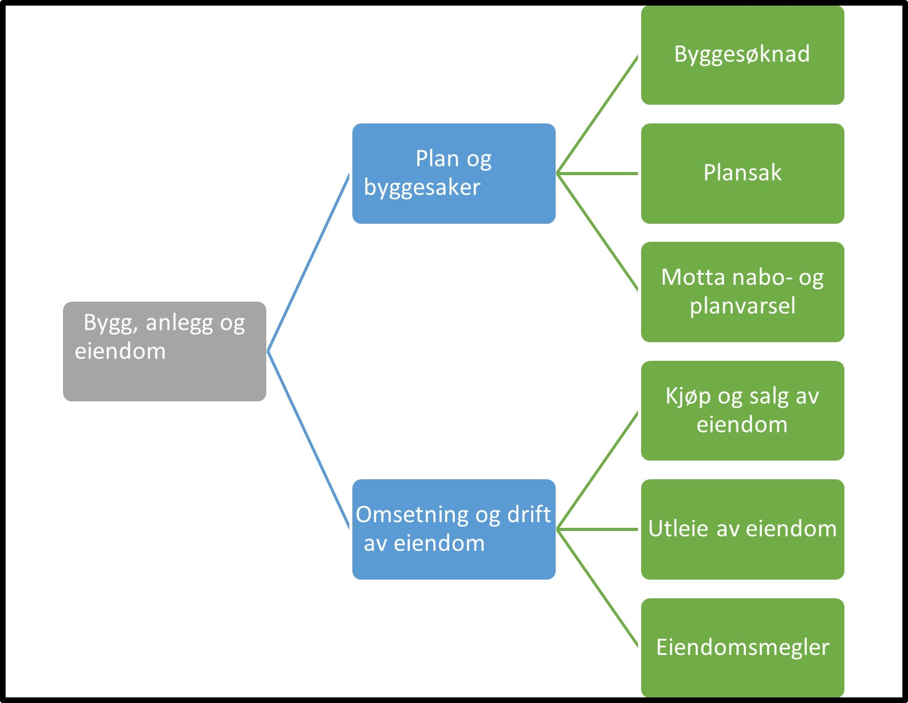
- **Bygg, anlegg og eiendom:** Denne fullmakten gir tilgang til alle tjenester som angår bygge og anleggsvirksomhet, samt 
	- **Plan og byggesaker:** Denne fullmakten gir tilgang til alle tjenester knyttet til nybygg, vedlikehold og reperasjon av bygge, samt anleggsvirksomhet
		- **Byggesøknad:** Denne fullmakten gir tilgang til alle tjenester som ansvarlig søker/tiltakshaver trenger, for eksempel byggesøknader, direkte signerte erklæringer, nabovarsel og eiendomssak
		- **Plansak:** Denne fullmakten gir tilgang til alle tjenester som forslagsstiller/ plankonsulent trenger, for eksempel varsel om planopppstart og høring og offentlig ettersyn.
		- **Motta nabo- og planvarsel:** Denne fullmakten gir tilgang til å lese og svare på varsel om plan-/byggesak
	- **Omsetning og drift av eiendom:** Denne fullmakten gir tilgang til alle tjenester knyttet til omsetning og drift av eiendom
		- **Kjøp og salg av eiendom:** Denne fullmakten gir tilgang til alle tjenester knyttet til kjøp og salg av eiendom.
		- **Utleie av eiendom:** Denne fullmakten gir tilgang til alle tjenester knyttet til utleie av eiendom.
		- **Eiendomsmegler:** Denne fullmakten gir tilgang til alle tjenester knyttet til omsetning og drift av fast eiendom på oppdrag, som eiendomsmegling og eiendomsforvaltning

## Fullmaktsgruppe Transport og lagring
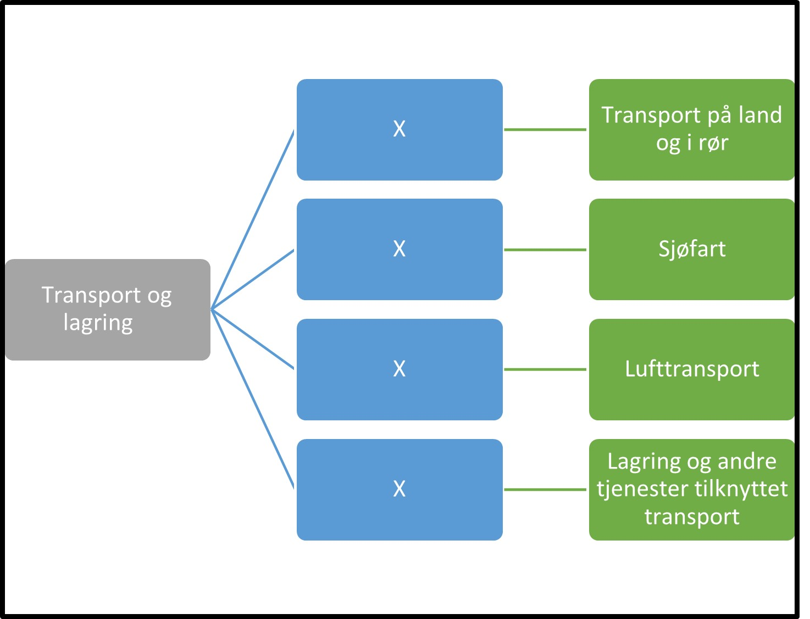
- **Transport og lagring:** Denne fullmakten gir tilgang til alle tjenester som angår transport og lagring inkludert passasjer og godstransport, samt post og kurervirksomhet
	- **Transport på land og i rør:** Denne fullmakten gir tilgang til alle tjenester knyttet til vei- og jernbanetransport av passasjerer og gods samt rørtransport
	- **Sjøfart:** Denne fullmakten gir tilgang til alle tjenester knyttet til passasjer og godstransport til sjø
	- **Lufttransport:** Denne fullmakten gir tilgang til alle tjenester knyttet til luftfartøy og romfartøy
	- **Lagring og andre tjenester tilknyttet transport:** Denne fullmakten gir tilgang til alle tjenester knyttet til  lagring og hjelpetjenester i forbindelse med transport, samt post og kurervirksomhet

## Fullmaktsgruppe Helse, pleie, omsorg og vern
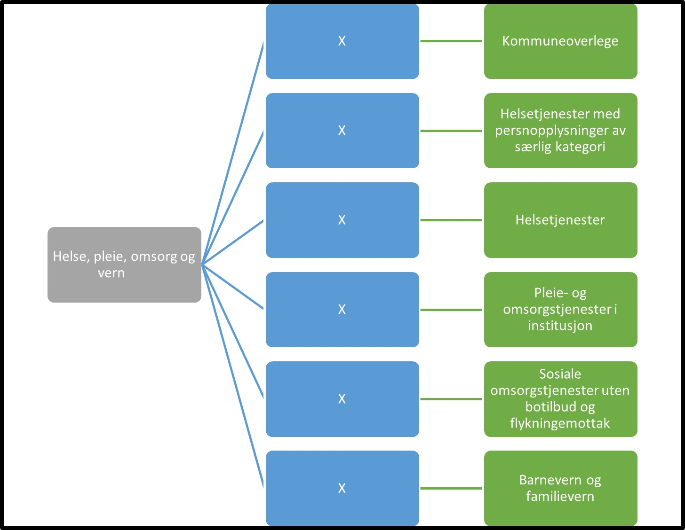
- **Helse, pleie, omsorg og vern:** Denne fullmakten gir tilgang til alle tjenester som omfatter helse- og sosialtjenester med og uten botilbud. Denne fullmakten kan gi bruker tilgang til helseopplysninger om personer det rapporteres om.
	- **Kommuneoverlege:** (mangler)		
	- **Helsetjenester med persnopplysninger av særlig kategori:** (mangler)	
	- **Helsetjenester:** Denne fullmakten gir tilgang til alle tjenester knyttet til sykehus, lege, tannlege og hjemmesykepleie,fysioterapi, ambulanse og lignende. Denne fullmakten kan gi bruker tilgang til helseopplysninger om personer det rapporteres om.
	- **Pleie- og omsorgstjenester i institusjon:** Denne fullmakten gir tilgang til alle tjenester knyttet til pleie og omsorgstilbud i institursjon. Dette er tjenester som tilbyr institusjonsopphold kombinert med sykepleie, tilsyn eller annen form for pleie alt etter hva som kreves av beboerne. Denne fullmakten kan gi bruker tilgang til helseopplysninger om personer det rapporteres om.
	- **Sosiale omsorgstjenester uten botilbud og flykningemottak:** Denne fullmakten gir tilgang til alle tjenester knyttet til sosiale omsorgstjeneser uten botilbud for eldre, funksjonshemmede og rusmisbrukere samt flykningemottak, og tjenester relatert til arbeidstrening og andre sosiale tjenester, f eks i regi av velferdsorganisasjoner. Denne fullmakten kan gi bruker tilgang til helseopplysninger om personer det rapporteres om.
	- **Barnevern og familievern:** Denne fullmakten gir tilgang til alle tjenester knyttet til barnevern og familievern. Denne fullmakten kan gi bruker tilgang til helseopplysninger om personer det rapporteres om.

## Fullmaktsgruppe Oppvekst og skole
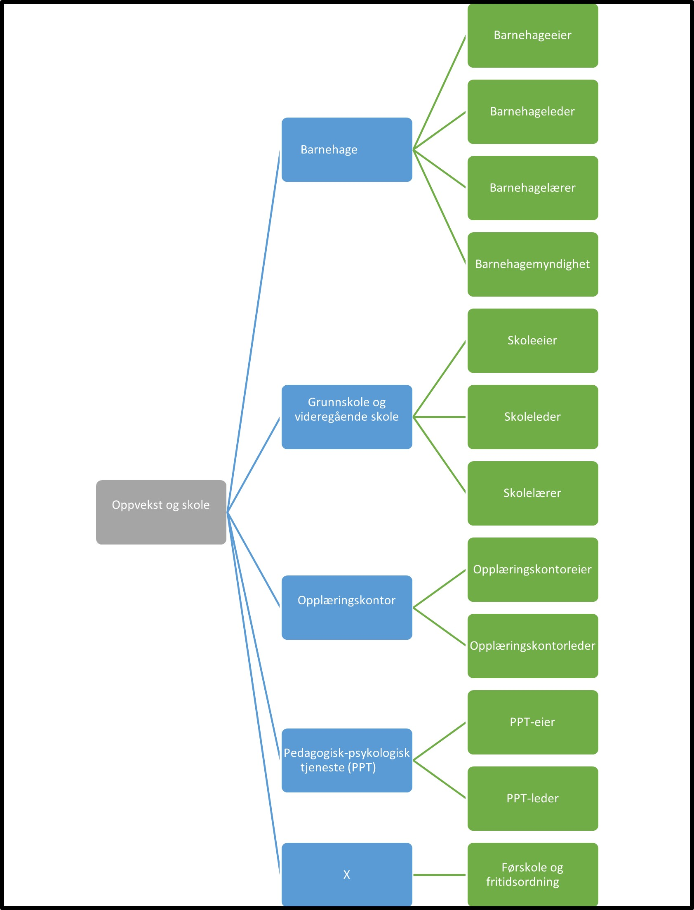
- **Oppvekst og skole:** Denne fullmakten gir tilgang til alle tjenester som omhandler barnehage og skole 
	- **Barnehage:** Denne fullmakten gir tilgang til alle tjenester knyttet til tilbud og drift av barnehage
		- **Barnehageeier:** Denne fullmakten gir tilgang til alle tjenester innen drift av barnehage som barnehageeier er ansvarlig for
		- **Barnehageleder:** Denne fullmakten gir tilgang til alle tjenester innen drift av barnehage som barnehageleder er ansvarlig for
		- **Barnehagelærer:** Denne fullmakten gir tilgang til alle tjenester innen drift av barnehage som barnehagelærer er ansvarlig for
		- **Barnehagemyndighet:** Denne fullmakten gir tilgang til alle tjenester innen drift av barnehage som barnehagemyndighet er ansvarlig for
	- **Grunnskole og videregående skole:** Denne fullmakten gir tilgang til alle tjenester knyttet til tilbud og drift av skole
		- **Skoleeier:** Denne fullmakten gir tilgang til alle tjenester innen drift av skole som skoleeier er ansvarlig for
		- **Skoleleder:** Denne fullmakten gir tilgang til alle tjenester innen drift av skole som skoleleder er ansvarlig for
		- **Skolelærer:** Denne fullmakten gir tilgang til alle tjenester innen drift av skole som skolelærer er ansvarlig for
	- **Opplæringskontor:** Denne fullmakten gir tilgang til alle tjenester knyttet til opplæringskontor
		- **Opplæringskontoreier:** Denne fullmakten gir tilgang til alle tjenester innen drift av opplæringskontor som opplæringskontoreier er ansvarlig for
		- **Opplæringskontorleder:** Denne fullmakten gir tilgang til alle tjenester innen drift av opplæringskontor som opplæringskontorleder er ansvarlig for
	- **Pedagogisk-psykologisk tjeneste (PPT):** Denne fullmakten gir tilgang til alle tjenester knyttet til pedagogisk-psykologisk tjeneste (PPT)
		- **PPT-eier:** Denne fullmakten gir tilgang til alle tjenester innen drift av Pedagogisk-psykologisk tjeneste (PPT) som PPT-eier er ansvarlig for
		- **PPT-leder:** Denne fullmakten gir tilgang til alle tjenester innen drift av Pedagogisk-psykologisk tjeneste (PPT) som PPT-leder er ansvarlig for
	- **Førskole og fritidsordning:** Denne fullmakten gir tilgang til alle tjenester knyttet til førskole og fritidsordning

## Fullmaktsgruppe Høyere utdanning
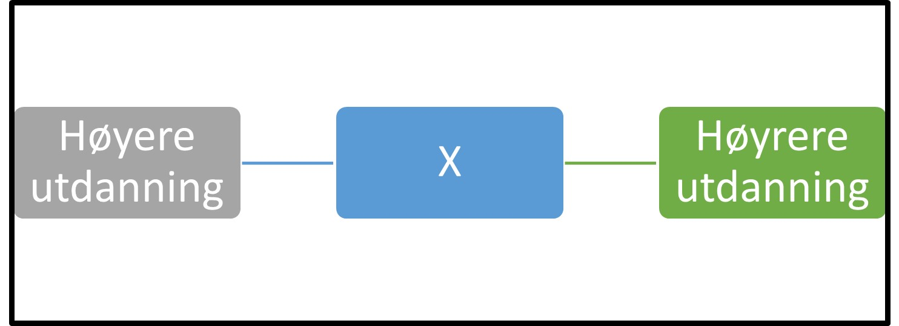
- **Høyere utdanning:** Denne fullmakten gir tilgang til alle tjenester knyttet til høyere utdanning. 

## Fullmaktsgruppe Energi, vann, avløp og avfall
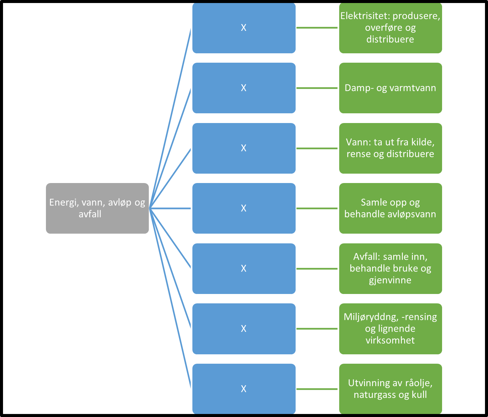
- **Energi, vann, avløp og avfall:** Denne fullmakten gir tilgang til alle tjenester som omhandler energi, vann, avløp og avfall
	- **Elektrisitet: produsere, overføre og distribuere:** Denne fullmakten gir tilgang til alle tjenester knyttet til elektrisitet: produsere, overføre og distribuere
	- **Damp- og varmtvann:** Denne fullmakten gir tilgang til alle tjenester knyttet til damp- og varmtvann.
	- **Vann: ta ut fra kilde, rense og distribuere:** Denne fullmakten gir tilgang til alle tjenester knyttet til vann: ta ut fra kilde, rense og distribuere
	- **Samle opp og behandle avløpsvann:** Denne fullmakten gir tilgang til alle tjenester knyttet til samle opp og behandle avløpsvann
	- **Avfall: samle inn, behandle bruke og gjenvinne:** Denne fullmakten gir tilgang til alle tjenester knyttet til avfall: samle inn, behandle bruke og gjenvinne
	- **Miljøryddng, -rensing og lignende virksomhet:** Denne fullmakten gir tilgang til alle tjenester knyttet til miljøryddng, -rensing og lignende virksomhet
	- **Utvinning av råolje,  naturgass og kull:** Denne fullmakten gir tilgang til alle tjenester knyttet til utvinning av råolje,  naturgass og kull

## Fullmaktsgruppe Industrier	

- **Industrier:** Denne fullmakten gir tilgang til alle tjenester som omhandler industrier som fysisk eller kjemisk omdanner materialer, stoffer eller deler til nye produkter. 
	- **Næringsmidler, drikkevarer og tobakk:** Denne fullmakten gir tilgang til alle tjenester knyttet til industri i forbindelse med næringsmidler, drikkevarer og tobakk
	- **Tekstiler, klær og lærvarer:** Denne fullmakten gir tilgang til alle tjenester knyttet til industri i forbindelse med tekstiler, klær og lærvarer
	- **Trelast, trevarer og papirvarer:** Denne fullmakten gir tilgang til alle tjenester knyttet til industri i forbindelse med trelast, trevarer og papirvarer
	- **Trykkerier og reproduksjon av innspilte opptak:** Denne fullmakten gir tilgang til alle tjenester knyttet til industri i forbindelse med trykkerier og reproduksjon av innspilte opptak
	- **Oljeraffinering, kjemisk og farmasøytisk industri:** Denne fullmakten gir tilgang til alle tjenester knyttet til industri i forbindelse med trykkerier og reproduksjon av innspilte opptak
	- **Gummi, plast og ikke-metallholdige mineralprodukter:** Denne fullmakten gir tilgang til alle tjenester knyttet til industri i forbindelse med gummi, plast og ikke-metallholdige mineralprodukter
	- **Metaller og  mineraler:** Denne fullmakten gir tilgang til alle tjenester knyttet til industri i forbindelse med metaller og  mineraler
	- **Metallvarer, elektrisk utstyr og maskiner:** Denne fullmakten gir tilgang til alle tjenester knyttet til industri i forbindelse med metallvarer, elektrisk utstyr og maskiner
	- **Verft og andre transportmidler:** Denne fullmakten gir tilgang til alle tjenester knyttet til industri i forbindelse med verft og andre transportmidler
	- **Møbler og annen industri:** Denne fullmakten gir tilgang til alle tjenester knyttet til industri i forbindelse med møbler og annen industri
	- **Reparasjon og installasjon av maskiner og utstyr:** Denne fullmakten gir tilgang til alle tjenester knyttet til industri i forbindelse med reparasjon og installasjon av maskiner og utstyr
	- **Bergverk:** Denne fullmakten gir tilgang til alle tjenester knyttet til industri i forbindelse med bergverk og tilhørende tjenester til bergverksdrift og utvinning

## Fullmaktsgruppe Kultur og frivillighet

- **Kultur og frivillighet:** Denne fullmakten gir tilgang til alle tjenester som omhandler kulturelle aktiviteter og frivillig arbeid
	- **Kunst og underholdning:** Denne fullmakten gir tilgang til alle tjenester knyttet til kunstnerisk og underholdningsaktiviteter
	- **Biblioteker, museer, arkiver, og annen kultur:** Denne fullmakten gir tilgang til alle tjenester knyttet til biblioteker, museer, arkiver, og annen kultur som botaniske og zoologiske hager, og drift av naturfenomener av historisk, kulturell eller undervisningsmessig interesse (f.eks. verdenskulturarv mv.)
	- **Lotteri og spill:** Denne fullmakten gir tilgang til alle tjenester knyttet til lotteri og spill, som f eks kasinoer, bingohaller og videospillhaller samt spillevirksomhet som f.eks. lotterier og veddemål som inngås utenfor banen
	- **Sports- og fritid:** Denne fullmakten gir tilgang til alle tjenester knyttet til sports- og fritidsaktiviteter 
	- **Fornøyelser:** Denne fullmakten gir tilgang til alle tjenester knyttet til drift av fornøyelsesetablissementer
	- **Politikk:** Denne fullmakten gir tilgang til alle tjenester knyttet til aktiviteter i forbinndelse med politisk arbeid

## Fullmaktsgruppe Handel, overnatting og servering

- **Handel, overnatting og servering:** Denne fullmakten gir tilgang til alle tjenester som omhandler varehandel, overnatting og servering
	- **Varehandel:** Denne fullmakten gir tilgang til alle tjenester knyttet til varehandel og salg og reperasjon av motorvogner
	- **Overnatting:** Denne fullmakten gir tilgang til alle tjenester knyttet til overnattingsvirksomhet
	- **Servering:** Denne fullmakten gir tilgang til alle tjenester knyttet til serveringsvirksomhet

## Fullmaktsgruppe Andre tjenesteytende næringer

- **Andre tjenesteytende næringer:** Denne fullmakten gir tilgang til alle tjenester som omhandler annen tjenestyting som f eks post, telekommunikasjon, informasjon, kommunikasjon, forsikring, finansiering. 
	- **Post og telekommunikasjon:** Denne fullmakten gir tilgang til alle tjenester knyttet til post og telekommunikasjon
	- **Informasjon og kommunikasjon:** Denne fullmakten gir tilgang til alle tjenester knyttet til informasjon og kommunikasjon
	- **Finansiering og forsikring:** Denne fullmakten gir tilgang til alle tjenester knyttet til finansiering og forsikring
	- **Annen tjenesteyting:** Denne fullmakten gir tilgang til alle tjenester knyttet til annen tjenesteyting som f eks  organisasjoner og foreninger, reparasjon av datamaskiner og varer til personlig bruk og husholdningsbruk og en rekke personlige tjenester som ikke er nevnt annet sted

## Fullmaktsgruppe Regnskapsførere
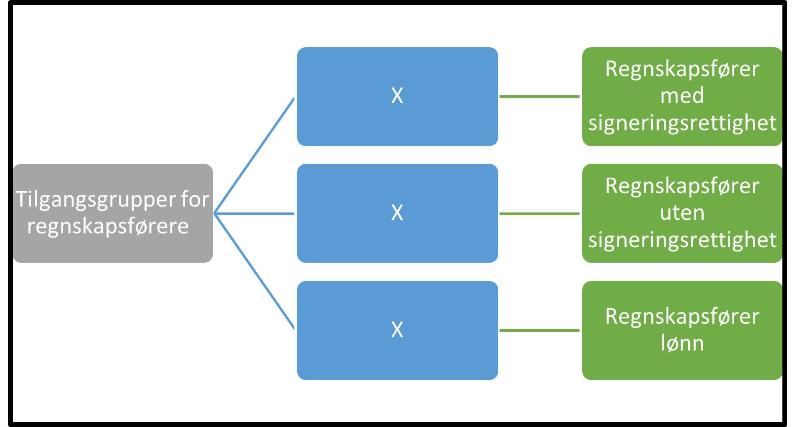
- **Tilgangsgrupper for regnskapsførere:** Denne fullmakten gir tilgang til alle tjenester som det er naturlig at en regnskapsfører utfører på vegne av sin kunde
	- **Regnskapsfører med signeringsrettighet:** Denne fullmakten gir tilgang til regnskapfører å kunne signere på vegne av kunden for alle tjenester som krever signeringsrett. Dette er tjenester som man har vurdert det som naturlig at en regnskapsfører utfører på vegne av sin kunde. Fullmakten gis kun til autoriserte regnskapsførere. Fullmakt hos regnskapfører oppstår når kunden registrerer regnskapsfører i Enhetsregisteret. 
	- **Regnskapsfører uten signeringsrettighet:** Denne fullmakten gir tilgang til å kunne utføre alle tjenester som ikke krever signeringsrett. Dette er tjenester som man har vurdert det som naturlig at en regnskapsfører utfører på vegne av sin kunde. Fullmakten gis kun til autoriserte regnskapsførere. Fullmakt hos regnskapfører oppstår når kunden registrerer regnskapsfører i Enhetsregisteret. 
	- **Regnskapsfører lønn:** Denne fullmakten gir tilgang til regnskapsfører å rapportere lønn for sin kunde. Dette er tjenester som man har vurdert det som naturlig at en regnskapsfører utfører på vegne av sin kunde. Fullmakten gis kun til autoriserte regnskapsførere. Fullmakt hos regnskapfører oppstår når kunden registrerer regnskapsfører i Enhetsregisteret. 

## Fullmaktsgruppe Revisor
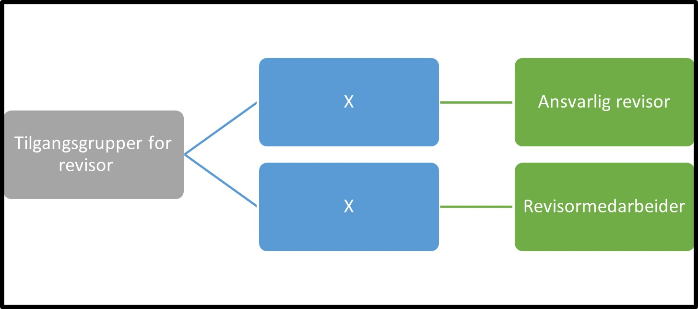
- **Tilgangsgrupper for revisor:** Denne fullmakten gir tilgang til alle tjenester som det er naturlig at en revisor utfører på vegne av sin kunde
	- **Ansvarlig revisor:** Denne fullmakten gir revisor tilgang til å opptre som ansvarlig revisor for en kunde og utføre alle tjenester som krever denne fullmakten. Dette er tjenester som tjenestetilbyder har vurdert det som naturlig at en revisor utfører på vegne av sin kunde. Fullmakten gis kun til autoriserte revisorer. Fullmakt hos revisor oppstår når kunden registrerer regnskapsfører i Enhetsregisteret. 
	- **Revisormedarbeider:** Denne fullmakten gir revisor tilgang til å opptre som revisormedarbeider for en kundeog utføre alle tjenester som krever denne fullmakten. Dette er tjenester som tjenestetilbyder har vurdert det som naturlig at en revisor utfører på vegne av sin kunde. Fullmakten gis kun til autoriserte revisorer. Fullmakt hos revisor oppstår når kunden registrerer regnskapsfører i Enhetsregisteret. 

## Fullmaktsgruppe Konkursbo
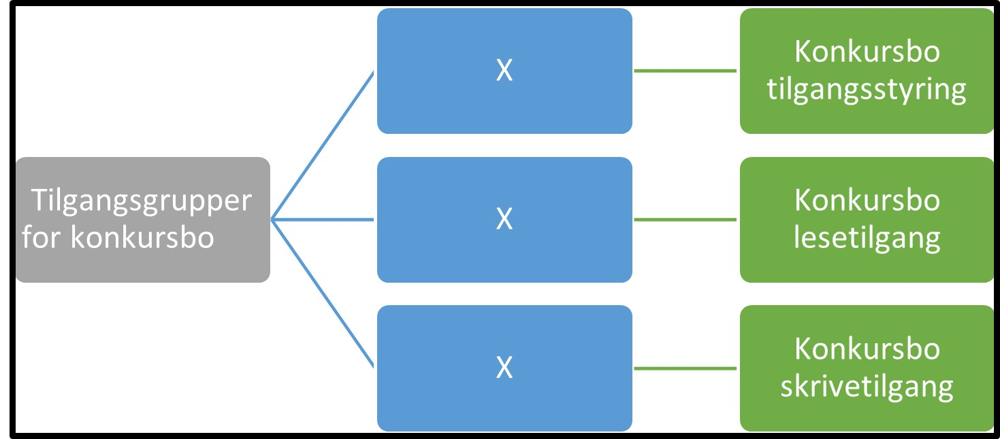
- **Tilgangsgrupper for konkursbo:** (mangler)
	- **Konkursbo tilgangsstyring:** (mangler)
	- **Konkursbo lesetilgang:** (mangler)
	- **Konkursbo skrivetilgang:** (mangler)
