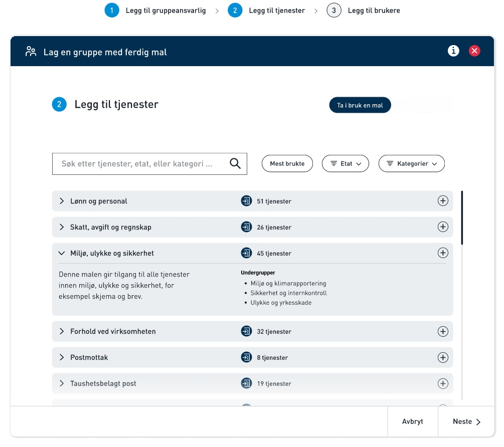
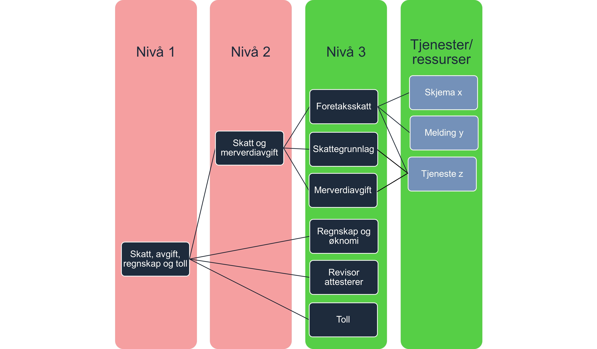

# Siden er under arbeid

Altinn skal erstatte rollene som gir tilgang til tjenester i Altinn 2 når vi flytter Altinn Autorisasjon til Altinn 3. 
I stedet for roller vil det i Altinn 3 være ulike fullmaktsgrupper som består av tjenester som hører til et ansvarsområde.

I forbindelse med innføring av nye fullmaktsgrupper så endres brukergrensesnitt for tilgangsstyrer slik at disse blir enklere å forstå og ta i bruk enn dagens roller.  

**Her finner du som er tjenesteeier forslag til kategorier og navn på de nye tilgangsgruppene. Vi ønsker innspill om de nye tilgangsgruppene passer til deres tjeneste.**

## Administrator gir tilgang til grupper med tjenester
Den som skal gi tilgang til tjenester i en virksomhet kalles administrator. 
Administrator kan gi tilgang til ansatte ved å legge de til fullmaktsgrupper. 

Eksterne roller fra Enhetsregisteret (f eks Daglig leder, styreleder eller Regnskapsfører, heretter kalt ER-roller), får automatisk tilgang til fullmaktsgruppene for sin virksomhet. 
Forslag til hvilke ER-roller som automatisk skal få hvilke fullmaktsgrupper er beskrevet på hver fullmaktsgruppe. 
## De nye fullmaktsgruppene gjør det lettere å administrere tilganger

Den største forskjellen på rollene i 2.0 og fullmaktsgruppene i 3.0 blir:

- Flere fullmaktsgrupper som kan være delt inn i opptil tre nivåer, slik at administrator kan gi tilgang til færre tjenester og det blir lettere å finne riktig fullmaktsgruppe. 
- Mer findelte fullmaktsgrupper gjør det lettere for tjenesteeiere å velge riktig målgruppe for sine tjenester.

Grunnlaget for inndelingen i maler er [Altinns skjemakatalog](https://www.altinn.no/skjemaoversikt/?category=category) og [SSBs standard for å kategorisere virksomheter](https://www.ssb.no/klass/klassifikasjoner/6). 
## Tjenester må til det laveste nivået i hierarkiet 

Fullmaktsgruppene har maksimalt tre nivåer. Du må knytte tjenester til det laveste nivået for fullmaktsgruppen du skal bruke.
Det betyr for eksempel at du ikke kan knytte en tjeneste til malen «Skatt, avgift, regnskap og toll» som er nivå 1. Du kan heller ikke knytte til nivået under, for eksempel «Skatt og Merverdiavgift». Du må knytte til «Foretaksskatt», «Skattegrunnlag » og/eller "Merverdiavgift".

Målet med mer findelte nivåer et at folk skal få tilgang til akkurat det de trenger, men ikke få for omfattende tilganger. 
Du kan knytte en tjeneste til flere fullmaktsgrupper hvis du mener det er riktig. 
 

### Avvikler alle Altinn 2 generelle roller
Alle Altinn 2 roller vil bli avviklet i forbindelse med overgang til nye fullmaktsgruppene. 

Noen få av de nye fullmaktsgruppene vil være identiske med gamle Altinn2 roller (gjelder bl a fullmaktsgrupper for regnskapsfører og revisor ). 
For disse tilfellene vil Altinn sørge for at de ansatte som har en utgående Altinn2 rolle automatisk får de nye fullmaktsgruppene.

## Vi ønsker innspill fra dere som er tjenesteeierne
Vi gjennomfører nå høring nummer 2 av nye fullmaktsgrupper. Vi ønsker tilbakemeldinger på
- om de foreslåtte fullmaktsgruppene passer til de tjenestene dere har
- navnene på fullmaktsgruppene som dere forholder dere til
- beskrivelsene av fullmaktsgruppene som dere vil forholder dere til
- om forslag til hvilke ER-roller som skal få de nye fullmaktsgruppene automatisk er dekkende for dere.

Tilbakemelding kan du sende på e-post til servicedesk@altinn.no innen 15.10.2023.

## Oversikt over fullmaktsgrupper

### Generelt om beskrivelse av fullmaktsgruppene

- Fullmaktsbeskrivelse presenteres administrator. Denne skal sikre at administrator forstår hvilke fullmakter man gir videre til sin ansatt.
- Fullmaktsbeskrivelsen vil forklare hvilke type tjenester som er knyttet til fullmakten og som fullmakten dermed gir tilgang til
- Det er tjenesteeier som avgjør hvilken fullmaktsgruppe deres tjeneste/ressus hører inn under. 
- Tjenester/ressurser knyttes alltid til laveste nivå (grønn boks)
- Det er mulig å knytte en tjeneste/ressurs til flere fullmaktsgrupper. 

(klikk på lenken for å se nedover i hierarkiet)
### Fullmaktsgrupper relevant for mange/alle virksomheter
1. [Skatt, avgift, regnskap og toll](/authorization/modules/accessgroups/type-accessgroups/versjon-2/_skatt/)

### Bransjespesifikke fullmaktsgrupper

### Andre spesialiserte fullmaktsgrupper
