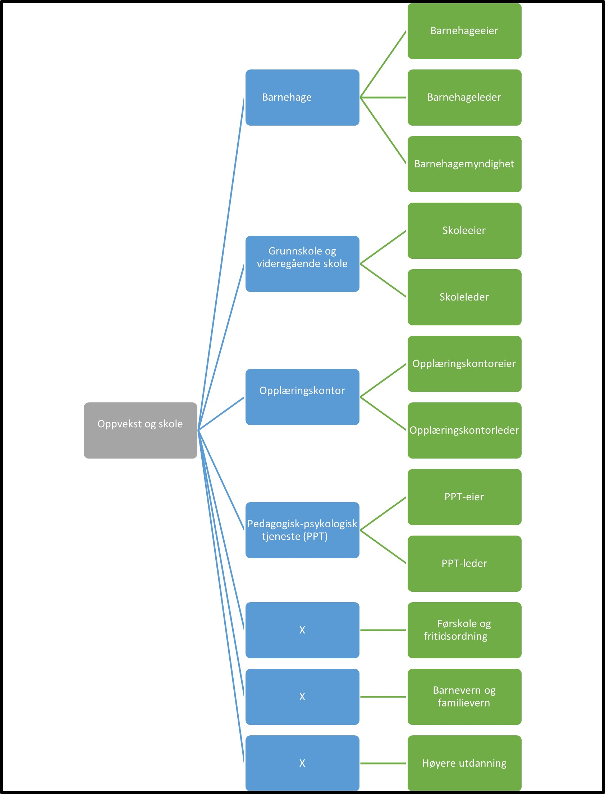

Tilbake til [hovedoversikt](/authorization/modules/accessgroups/type-accessgroups/versjon-2/#oversikt-over-fullmaktsgrupper)

- **Oppvekst og skole:** Denne fullmakten gir tilgang til alle tjenester som omhandler barnehage og skole. Ved regelverksendringer eller innføring av nye digitale tjenester kan det bli endringer i tilganger som fullmakten gir.
	- **Barnehage:** Denne fullmakten gir tilgang til alle tjenester knyttet til tilbud og drift av barnehage. Ved regelverksendringer eller innføring av nye digitale tjenester kan det bli endringer i tilganger som fullmakten gir.
		- **Barnehageeier:** Denne fullmakten gir tilgang til alle tjenester innen drift av barnehage som barnehageeier er ansvarlig for. Ved regelverksendringer eller innføring av nye digitale tjenester kan det bli endringer i tilganger som fullmakten gir.
		- **Barnehageleder:** Denne fullmakten gir tilgang til alle tjenester innen drift av barnehage som barnehageleder er ansvarlig for. Ved regelverksendringer eller innføring av nye digitale tjenester kan det bli endringer i tilganger som fullmakten gir.
		- **Barnehagemyndighet:** Denne fullmakten gir tilgang til alle tjenester innen drift av barnehage som barnehagemyndighet er ansvarlig for. Ved regelverksendringer eller innføring av nye digitale tjenester kan det bli endringer i tilganger som fullmakten gir.
	- **Grunnskole og videregående skole:** Denne fullmakten gir tilgang til alle tjenester knyttet til tilbud og drift av skole. Ved regelverksendringer eller innføring av nye digitale tjenester kan det bli endringer i tilganger som fullmakten gir.
		- **Skoleeier:** Denne fullmakten gir tilgang til alle tjenester innen drift av skole som skoleeier er ansvarlig for. Ved regelverksendringer eller innføring av nye digitale tjenester kan det bli endringer i tilganger som fullmakten gir.
		- **Skoleleder:** Denne fullmakten gir tilgang til alle tjenester innen drift av skole som skoleleder er ansvarlig for. Ved regelverksendringer eller innføring av nye digitale tjenester kan det bli endringer i tilganger som fullmakten gir.
	- **Opplæringskontor:** Denne fullmakten gir tilgang til alle tjenester knyttet til opplæringskontor. Ved regelverksendringer eller innføring av nye digitale tjenester kan det bli endringer i tilganger som fullmakten gir.
		- **Opplæringskontoreier:** Denne fullmakten gir tilgang til alle tjenester innen drift av opplæringskontor som opplæringskontoreier er ansvarlig for. Ved regelverksendringer eller innføring av nye digitale tjenester kan det bli endringer i tilganger som fullmakten gir.
		- **Opplæringskontorleder:** Denne fullmakten gir tilgang til alle tjenester innen drift av opplæringskontor som opplæringskontorleder er ansvarlig for. Ved regelverksendringer eller innføring av nye digitale tjenester kan det bli endringer i tilganger som fullmakten gir.
	- **Pedagogisk-psykologisk tjeneste (PPT):** Denne fullmakten gir tilgang til alle tjenester knyttet til pedagogisk-psykologisk tjeneste (PPT). Ved regelverksendringer eller innføring av nye digitale tjenester kan det bli endringer i tilganger som fullmakten gir.
		- **PPT-eier:** Denne fullmakten gir tilgang til alle tjenester innen drift av Pedagogisk-psykologisk tjeneste (PPT) som PPT-eier er ansvarlig for. Ved regelverksendringer eller innføring av nye digitale tjenester kan det bli endringer i tilganger som fullmakten gir.
		- **PPT-leder:** Denne fullmakten gir tilgang til alle tjenester innen drift av Pedagogisk-psykologisk tjeneste (PPT) som PPT-leder er ansvarlig for. Ved regelverksendringer eller innføring av nye digitale tjenester kan det bli endringer i tilganger som fullmakten gir.
	- **Førskole og fritidsordning:** Denne fullmakten gir tilgang til alle tjenester knyttet til førskole og fritidsordning. Ved regelverksendringer eller innføring av nye digitale tjenester kan det bli endringer i tilganger som fullmakten gir.
	- **Barnevern og familievern:** Denne fullmakten gir tilgang til alle tjenester knyttet til barnevern og familievern. Ved regelverksendringer eller innføring av nye digitale tjenester kan det bli endringer i tilganger som fullmakten gir.
	- **Høyere utdanning** Denne fullmakten gir tilgang til alle tjenester knyttet til høyere utdanning. Ved regelverksendringer eller innføring av nye digitale tjenester kan det bli endringer i tilganger som fullmakten gir.

## Egenskaper ved fullmaktsgruppene
|Navn fullmaktsgruppe|Kan delegeres til ansatte?|Kan knytte tjenester til?|[ER rolle](/authorization/modules/accessgroups/register_er/#rolletyper-fra-enhetsregisteret) som får fullmakten|
|---|---|---|---|
|Oppvekst, skole og høyere utdanning| ja|nei|DAGL, STYR,INNH, DTPR, DTSO, KOMP, BEST, REPR, BOBE|
|Barnehage|ja|nei|DAGL, STYR,INNH, DTPR, DTSO, KOMP, BEST, REPR, BOBE|
|Barnehageeier|ja|ja|DAGL, STYR,INNH, DTPR, DTSO, KOMP, BEST, REPR, BOBE|
|Barnehageleder|ja|ja|DAGL, STYR,INNH, DTPR, DTSO, KOMP, BEST, REPR, BOBE|
|Barnehagemyndighet|ja|ja|DAGL, STYR,INNH, DTPR, DTSO, KOMP, BEST, REPR, BOBE|
|Grunnskole og videregående skole|ja|nei|DAGL, STYR,INNH, DTPR, DTSO, KOMP, BEST, REPR, BOBE|
|Skoleeier|ja|ja|DAGL, STYR,INNH, DTPR, DTSO, KOMP, BEST, REPR, BOBE|
|Skoleleder|ja|ja|DAGL, STYR,INNH, DTPR, DTSO, KOMP, BEST, REPR, BOBE|
|Opplæringskontor|ja|nei|DAGL, STYR,INNH, DTPR, DTSO, KOMP, BEST, REPR, BOBE|
|Opplæringskontoreier|ja|ja|DAGL, STYR,INNH, DTPR, DTSO, KOMP, BEST, REPR, BOBE|
|Opplæringskontorleder|ja|ja|DAGL, STYR,INNH, DTPR, DTSO, KOMP, BEST, REPR, BOBE|
|Pedagogisk-psykologisk tjeneste (PPT)|ja|nei|DAGL, STYR,INNH, DTPR, DTSO, KOMP, BEST, REPR, BOBE|
|PPT-eier|ja|ja|DAGL, STYR,INNH, DTPR, DTSO, KOMP, BEST, REPR, BOBE|
|PPT-leder|ja|ja|DAGL, STYR,INNH, DTPR, DTSO, KOMP, BEST, REPR, BOBE|
|Førskole og fritidsordning|ja|ja|DAGL, STYR,INNH, DTPR, DTSO, KOMP, BEST, REPR, BOBE|
|Barnevern og familievern|ja|ja|DAGL, STYR,INNH, DTPR, DTSO, KOMP, BEST, REPR, BOBE|
|Høyere utdanning|ja|ja|DAGL, STYR,INNH, DTPR, DTSO, KOMP, BEST, REPR, BOBE|

Tilbake til [hovedoversikt](/authorization/modules/accessgroups/type-accessgroups/versjon-2/#oversikt-over-fullmaktsgrupper)
