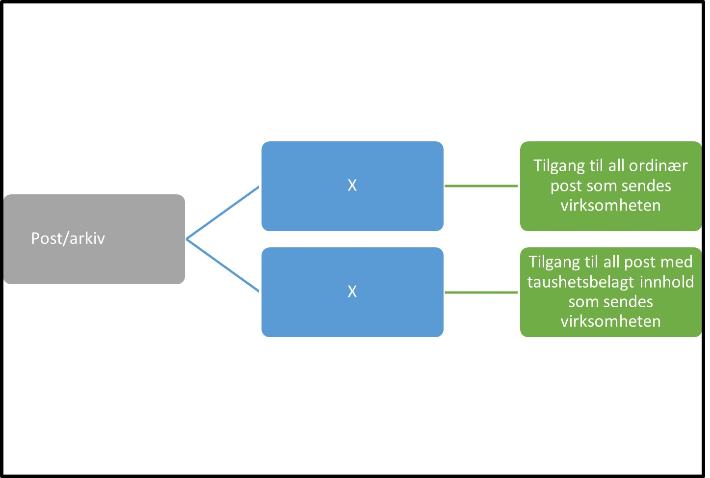

Tilbake til [hovedoversikt](/authorization/modules/accessgroups/type-accessgroups/versjon-2/#oversikt-over-fullmaktsgrupper)

- **Post og arkiv:** (ingen beskrivelse, fullmaktsgruppen kan ikke gis videre til andre)
	- **Ordinær post til virksomheten:** Denne fullmakten gir tilgang til all mottatt post som ikke innholder sensitiv/taushetsbelagt informasjon som sendes virksomheten. Fullmakten gis normalt til de i virksomheten som håndterer mottak av post. Ved regelverksendringer eller innføring av nye digitale tjenester kan det bli endringer i tilganger som fullmakten gir. 
	- **Post med taushetsbelagt til virksomheten:** Denne fullmakten gir tilgang til all mottatt post som innholder sensitiv/taushetsbelagt informasjon som sendes virksomheten.  Fullmakten gis normalt til de i virksomheten som håndterer mottak av post som har taushetsbelagt innhold. Ved regelverksendringer eller innføring av nye digitale tjenester kan det bli endringer i tilganger som fullmakten gir. 

## Egenskaper ved fullmaktsgruppene
|Navn fullmaktsgruppe|Kan delegeres til ansatte?|Kan knytte tjenester til?|[ER rolle](/authorization/modules/accessgroups/register_er/#rolletyper-fra-enhetsregisteret) som får fullmakten|
|---|---|---|---|
|Post og arkiv| nei|nei||
|Post med taushetsbelagt til virksomheten| ja|ja|DAGL, STYR,INNH, DTPR, DTSO, KOMP, BEST, REPR, BOBE|
|Tilgang til all post med taushetsbelagt innhold som sendes virksomheten|ja|ja|DAGL, STYR,INNH, DTPR, DTSO, KOMP, BEST, REPR, BOBE|

{} Det er fortsatt uavklart hvilke fullmakter det vil være natulig å gi personer med rollen Forretningsførerer innenfor fullmaktsområdet "Post og arkiv" {}

{} Det er fortsatt uavklart hva som skjer med alle gamle arkiverte elementer i Altinn 2 som tilhører tjenester som er ute av produksjon. Hvis disse flyttes slik at de blir tilgjengelig for sluttbrukere også i fremtiden så kan det være aktuelt å innføre en ny fullmaktsgruppe for tilgang til arkiverte elementer. Dette vil vil være en fullmaktsgruppe som typisk tildeles arkiv-medarbeidere i virksomheten {}

Tilbake til [hovedoversikt](/authorization/modules/accessgroups/type-accessgroups/versjon-2/#oversikt-over-fullmaktsgrupper)
