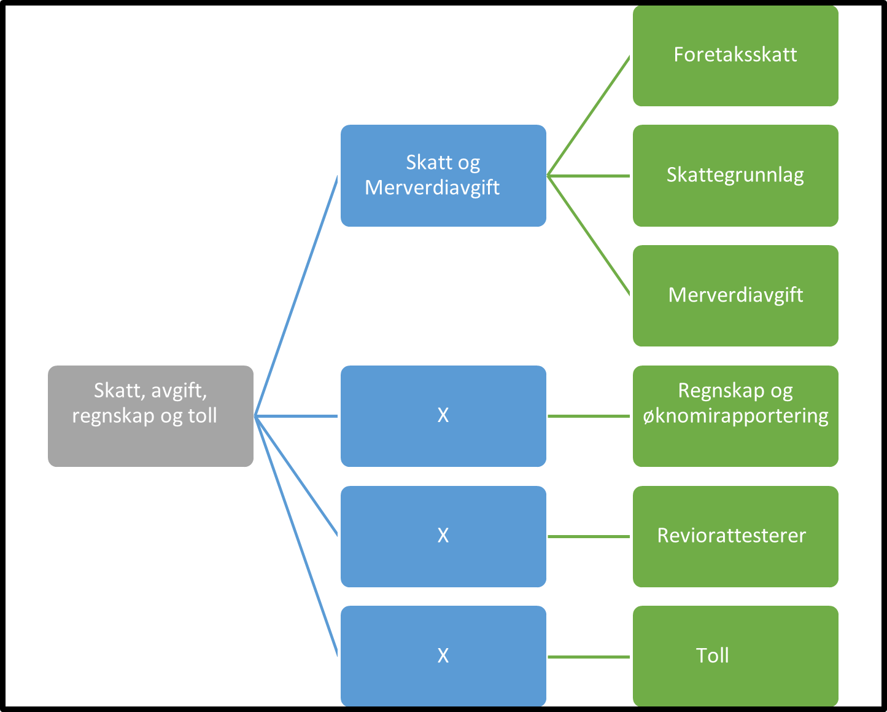

Tilbake til [hovedoversikt](/authorization/modules/accessgroups/type-accessgroups/versjon-2/#oversikt-over-fullmaktsgrupper)

- **Skatt, avgift, regnskap og toll:** Denne fullmakten gir tilgang til alle tjenester som angår skatt, avgift, regnskap og toll. Ved regelverksendringer eller innføring av nye digitale tjenester kan det bli endringer i tilganger som fullmakten gir.
	- **Skatt og Merverdiavgift:** Denne fullmakten gir tilgang til alle tjenester  som angår skatt og merverdiavgift. Ved regelverksendringer eller innføring av nye digitale tjenester kan det bli endringer i tilganger som fullmakten gir
		- **Foretaksskatt:** Denne fullmakten gir tilgang til alle tjenester knyttet til skatt for foretak. Ved regelverksendringer eller innføring av nye digitale tjenester kan det bli endringer i tilganger som fullmakten gir.
		- **Skattegrunnlag:** Denne fullmakten gir tilgang til alle tjenester knyttet til innhenting av skattegrunnlag. Ved regelverksendringer eller innføring av nye digitale tjenester kan det bli endringer i tilganger som fullmakten gir.
		- **Merverdiavgift:** Denne fullmakten gir tilgang til alle tjenester knyttet til merverdiavgift. Ved regelverksendringer eller innføring av nye digitale tjenester kan det bli endringer i tilganger som fullmakten gir.
	- **Regnskap og øknomirapportering:** Denne fullmakten gir tilgang til alle tjenester knyttet til regnskap og øknomirapportering som ikke tilhører skatt og merverdiavgift. Ved regelverksendringer eller innføring av nye digitale tjenester kan det bli endringer i tilganger som fullmakten gir. 
	- **Reviorattesterer:** Denne fullmakten gir tilgang til alle tjenester som krever revisorattestering. Ved regelverksendringer eller innføring av nye digitale tjenester kan det bli endringer i tilganger som fullmakten gir. 
	- **Toll:** Denne fullmakten gir tilgang til alle tjenester knyttet til toll og fortolling. Ved regelverksendringer eller innføring av nye digitale tjenester kan det bli endringer i tilganger som fullmakten gir. 

## Egenskaper ved fullmaktsgruppene
|Navn fullmaktsgruppe|Kan delegeres til ansatte?|Kan knytte tjenester til?|[ER rolle](/authorization/modules/accessgroups/register_er/#rolletyper-fra-enhetsregisteret) som får fullmakten|
|---|---|---|---|
|Skatt, avgift, regnskap og toll| ja|nei||
|Skatt og Merverdiavgift|ja|nei||
|Foretaksskatt|ja|ja|DAGL, STYR,INNH, DTPR, DTSO, KOMP, BEST, REPR, BOBE|
|Skattegrunnlag|ja|ja|DAGL, STYR,INNH, DTPR, DTSO, KOMP, BEST, REPR, BOBE|
|Merverdiavgift|ja|ja|DAGL, STYR,INNH, DTPR, DTSO, KOMP, BEST, REPR, BOBE|
|Regnskap og øknomirapportering|ja|ja|DAGL, STYR,INNH, DTPR, DTSO, KOMP, BEST, REPR, BOBE|
|Reviorattesterer|ja|ja|DAGL, STYR,INNH, DTPR, DTSO, KOMP, BEST, REPR, BOBE|
|Toll|ja|ja|DAGL, STYR,INNH, DTPR, DTSO, KOMP, BEST, REPR, BOBE|

{} Det er fortsatt uavklart hvilke fullmakter det vil være natulig å gi personer med rollen Forretningsførerer innenfor fullmaktsområdet "Skatt, avgift, regnskap og toll" {}

Tilbake til [hovedoversikt](/authorization/modules/accessgroups/type-accessgroups/versjon-2/#oversikt-over-fullmaktsgrupper)

[def]: sart.jpg