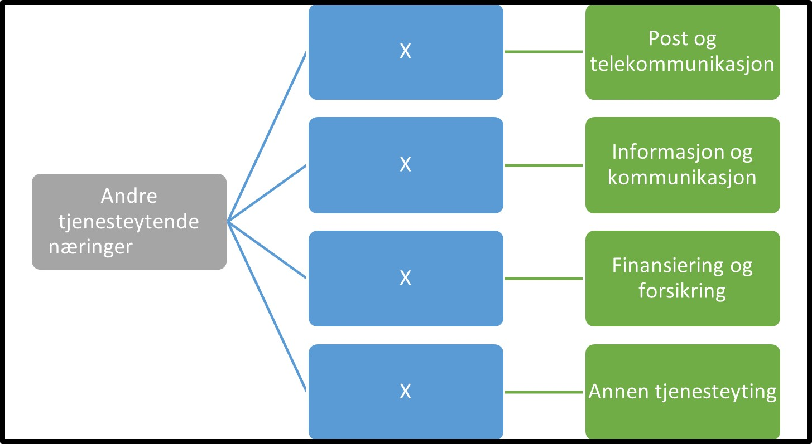

Tilbake til [hovedoversikt](/authorization/modules/accessgroups/type-accessgroups/versjon-2/#oversikt-over-fullmaktsgrupper)

 

- **Andre tjenesteytende næringer:** Denne fullmakten gir tilgang til alle tjenester som omhandler annen tjenestyting som f eks post, telekommunikasjon, informasjon, kommunikasjon, forsikring, finansiering. 
	- **Post og telekommunikasjon:** Denne fullmakten gir tilgang til alle tjenester knyttet til post og telekommunikasjon
	- **Informasjon og kommunikasjon:** Denne fullmakten gir tilgang til alle tjenester knyttet til informasjon og kommunikasjon
	- **Finansiering og forsikring:** Denne fullmakten gir tilgang til alle tjenester knyttet til finansiering og forsikring
	- **Annen tjenesteyting:** Denne fullmakten gir tilgang til alle tjenester knyttet til annen tjenesteyting som f eks  organisasjoner og foreninger, reparasjon av datamaskiner og varer til personlig bruk og husholdningsbruk og en rekke personlige tjenester som ikke er nevnt annet sted

## Egenskaper ved fullmaktsgruppene
|Navn fullmaktsgruppe|Kan delegeres til ansatte?|Kan knytte tjenester til?|[ER rolle](/authorization/modules/accessgroups/register_er/#rolletyper-fra-enhetsregisteret) som får fullmakten|
|---|---|---|---|
|Andre tjenesteytende næringer| ja|nei|DAGL, STYR,INNH, DTPR, DTSO, KOMP, BEST, REPR, BOBE|
|Post og telekommunikasjon|ja|ja|DAGL, STYR,INNH, DTPR, DTSO, KOMP, BEST, REPR, BOBE|
|Informasjon og kommunikasjon|ja|ja|DAGL, STYR,INNH, DTPR, DTSO, KOMP, BEST, REPR, BOBE|
|Finansiering og forsikring|ja|ja|DAGL, STYR,INNH, DTPR, DTSO, KOMP, BEST, REPR, BOBE|
|Annen tjenesteyting|ja|ja|DAGL, STYR,INNH, DTPR, DTSO, KOMP, BEST, REPR, BOBE|

Tilbake til [hovedoversikt](/authorization/modules/accessgroups/type-accessgroups/versjon-2/#oversikt-over-fullmaktsgrupper)