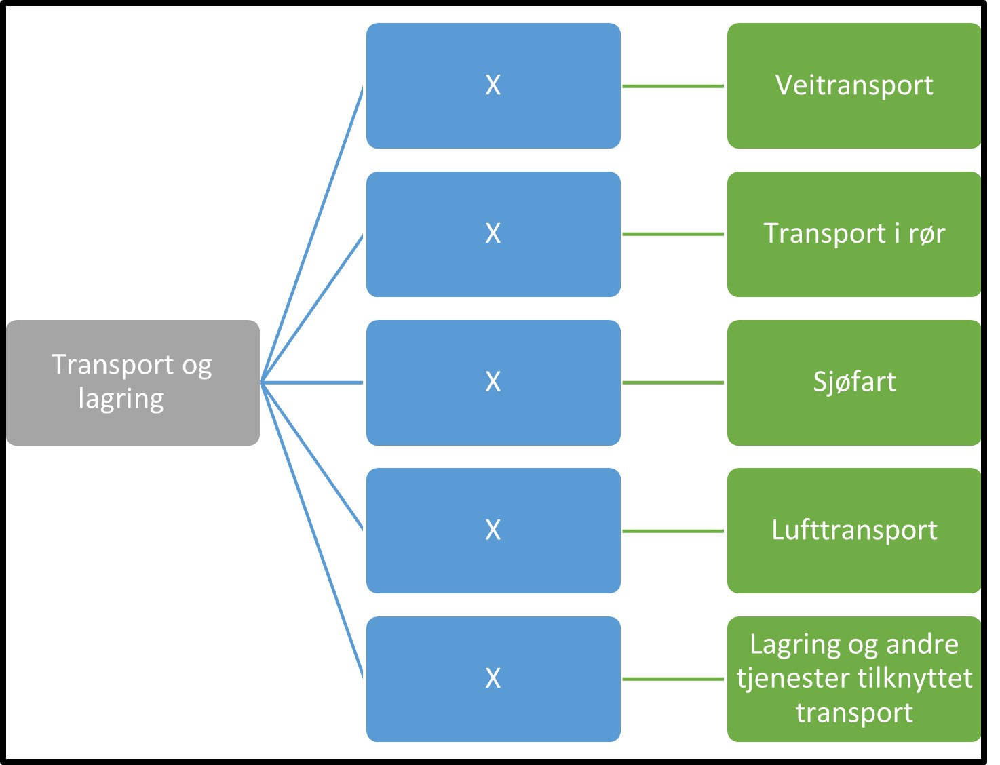

Tilbake til [hovedoversikt](/authorization/modules/accessgroups/type-accessgroups/versjon-2/#oversikt-over-fullmaktsgrupper)

- **Transport og lagring:** Denne fullmakten gir tilgang til alle tjenester som angår transport og lagring inkludert passasjer og godstransport, samt post og kurervirksomhet. Ved regelverksendringer eller innføring av nye digitale tjenester kan det bli endringer i tilganger som fullmakten gir.
	- **Veitransport:** (mangler)
    	- **Transport** (mangler)
    	- **Trafikant** (mangler)
	- **Transport i rør** (mangler)
	- **Sjøfart:** Denne fullmakten gir tilgang til alle tjenester knyttet til passasjer og godstransport til sjø. Ved regelverksendringer eller innføring av nye digitale tjenester kan det bli endringer i tilganger som fullmakten gir.
	- **Lufttransport:** Denne fullmakten gir tilgang til alle tjenester knyttet til luftfartøy og romfartøy. Ved regelverksendringer eller innføring av nye digitale tjenester kan det bli endringer i tilganger som fullmakten gir.
	- **Lagring og andre tjenester tilknyttet transport:** Denne fullmakten gir tilgang til alle tjenester knyttet til  lagring og hjelpetjenester i forbindelse med transport, samt post og kurervirksomhet. Ved regelverksendringer eller innføring av nye digitale tjenester kan det bli endringer i tilganger som fullmakten gir.

## Egenskaper ved fullmaktsgruppene
|Navn fullmaktsgruppe|Kan delegeres til ansatte?|Kan knytte tjenester til?|[ER rolle](/authorization/modules/accessgroups/register_er/#rolletyper-fra-enhetsregisteret) som får fullmakten|
|---|---|---|---|
|Transport og lagring| ja|nei||
|Veitransport|ja|ja|DAGL, STYR,INNH, DTPR, DTSO, KOMP, BEST, REPR, BOBE|
|Transport i rør|ja|ja|DAGL, STYR,INNH, DTPR, DTSO, KOMP, BEST, REPR, BOBE|
|Sjøfart|ja|ja|DAGL, STYR,INNH, DTPR, DTSO, KOMP, BEST, REPR, BOBE|
|Lufttransport|ja|ja|DAGL, STYR,INNH, DTPR, DTSO, KOMP, BEST, REPR, BOBE|
|Lagring og andre tjenester tilknyttet transport|ja|ja|DAGL, STYR,INNH, DTPR, DTSO, KOMP, BEST, REPR, BOBE|

{} Det er fortsatt uavklart hvilke fullmakter det vil være natulig å gi personer med rollen Forretningsførerer innenfor fullmaktsområdet "Transport og lagring" {}

Tilbake til [hovedoversikt](/authorization/modules/accessgroups/type-accessgroups/versjon-2/#oversikt-over-fullmaktsgrupper)