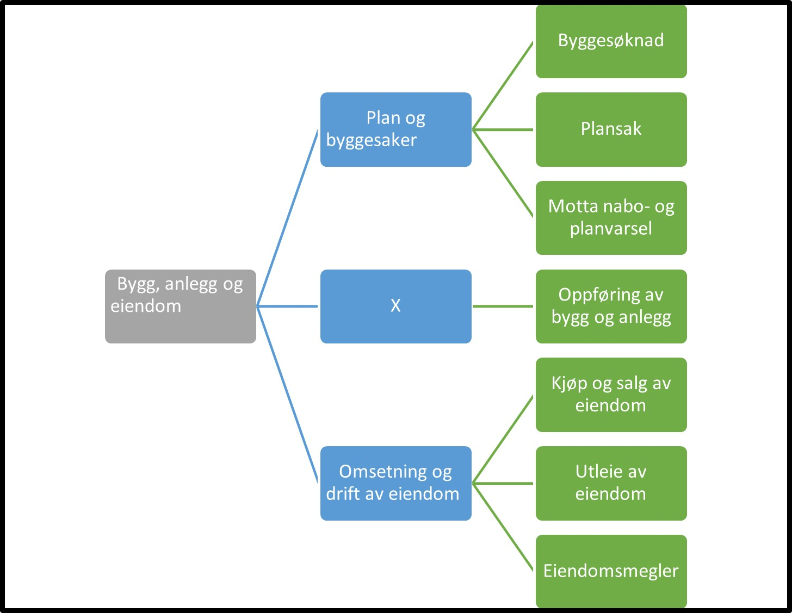

Tilbake til [hovedoversikt](/authorization/modules/accessgroups/type-accessgroups/versjon-3/#oversikt-over-tilgangspakker)

- **Bygg, anlegg og eiendom:** Hovedkategori for tilgangspakker til tjenester som angår bygge og anleggsvirksomhet, samt oppføring, omsetning og drift av anlegg/eiendom. 
	- **Plan og byggesaker:** Underkategori for tilgangspakker til tjenester knyttet til plan og byggesaker. 
		- **Byggesøknad:** Denne tilgangspakken gir fullmakter til tjenester som ansvarlig søker/tiltakshaver trenger, for eksempel byggesøknader, direkte signerte erklæringer, nabovarsel og eiendomssak. Ved regelverksendringer eller innføring av nye digitale tjenester kan det bli endringer i tilganger som fullmakten gir. **urn:altinn.accesspackage:byggesoknad**
		- **Plansak:** Denne tilgangspakken gir fullmakter til tjenester som forslagsstiller/ plankonsulent trenger, for eksempel varsel om planopppstart og høring og offentlig ettersyn. Ved regelverksendringer eller innføring av nye digitale tjenester kan det bli endringer i tilganger som fullmakten gir.  **urn:altinn.accesspackage:plansak**
		- **Motta nabo- og planvarsel:** Denne tilgangspakken gir fullmakter til tjenester til å lese og svare på varsel om plan-/byggesak. Ved regelverksendringer eller innføring av nye digitale tjenester kan det bli endringer i tilganger som fullmakten gir.  **urn:altinn.accesspackage:motanaboogplanvarsel**
	- **Oppføring av bygg og annlegg:** Denne tilgangspakken gir fullmakter til tjenester relatert til oppføring av bygninger og annlegg unntatt plan og byggesaksbehandling. Ved regelverksendringer eller innføring av nye digitale tjenester kan det bli endringer i tilganger som fullmakten gir. **urn:altinn.accesspackage:oppføringbygganlegg**
	- **Omsetning og drift av eiendom:** Underkategori for tilgangspakker til tjenester knyttet til omsetning og drift av eiendom. 
		- **Kjøp og salg av eiendom:** Denne tilgangspakken gir fullmakter til tjenester knyttet til kjøp og salg av eiendom. Ved regelverksendringer eller innføring av nye digitale tjenester kan det bli endringer i tilganger som fullmakten gir. **urn:altinn.accesspackage:kjopogsalgeiendom**
		- **Utleie av eiendom:** Denne tilgangspakken gir fullmakter til tjenester knyttet til utleie av eiendom. Ved regelverksendringer eller innføring av nye digitale tjenester kan det bli endringer i tilganger som fullmakten gir. **urn:altinn.accesspackage:utleieeiendom**
		- **Eiendomsmegler:** Denne tilgangspakken gir fullmakter til tjenester knyttet til omsetning og drift av fast eiendom på oppdrag, som eiendomsmegling og eiendomsforvaltning. Ved regelverksendringer eller innføring av nye digitale tjenester kan det bli endringer i tilganger som fullmakten gir. **urn:altinn.accesspackage:utleieeiendom**

## Egenskaper ved tilgangspakkene
|Navn tillgangspakke|Kan delegeres til ansatte?|Kan knytte tjenester til?|[ER rolle](/authorization/modules/accessgroups/register_er/#rolletyper-fra-enhetsregisteret) som får fullmakten|
|---|---|---|---|
|Bygg, anlegg og eiendom| ja|nei||
|Plan og byggesaker|ja|nei||
|Byggesøknad|ja|ja|DAGL, LEDE, INNH, DTPR, DTSO, KOMP, BEST, REPR, BOBE|
|Plansak|ja|ja|DAGL, LEDE, INNH, DTPR, DTSO, KOMP, BEST, REPR, BOBE|
|Motta nabo- og planvarsel|ja|ja|DAGL, LEDE, INNH, DTPR, DTSO, KOMP, BEST, REPR, BOBE|
|Oppføring av bygg og annlegg|ja|ja|DAGL, LEDE, INNH, DTPR, DTSO, KOMP, BEST, REPR, BOBE|
|Omsetning og drift av eiendom|ja|nei||
|Kjøp og salg av eiendom|ja|ja|DAGL, LEDE, INNH, DTPR, DTSO, KOMP, BEST, REPR, BOBE|
|Utleie av eiendom|ja|ja|DAGL, LEDE, INNH, DTPR, DTSO, KOMP, BEST, REPR, BOBE|
|Eiendomsmegler|ja|ja|DAGL, LEDE, INNH, DTPR, DTSO, KOMP, BEST, REPR, BOBE|

{} Det er fortsatt uavklart hvilke fullmakter det vil være natulig å gi personer med rollen Forretningsførerer innenfor fullmaktsområdet "Bygg, anlegg og eiendom" {}

Tilbake til [hovedoversikt](/authorization/modules/accessgroups/type-accessgroups/versjon-3/#oversikt-over-tilgangspakker)
