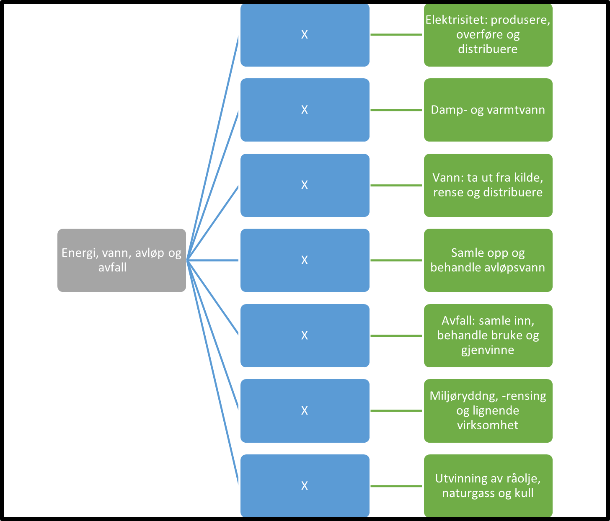

Tilbake til [hovedoversikt](/authorization/modules/accessgroups/type-accessgroups/versjon-3/#oversikt-over-tilgangspakker)

- **Energi, vann, avløp og avfall:** Hovedkategori for tilgangspakker til tjenester som omhandler energi, vann, avløp og avfall.
	- **Elektrisitet: produsere, overføre og distribuere:** Denne tilgangspakken gir fullmakter til tjenester knyttet til elektrisitet: produsere, overføre og distribuere. Ved regelverksendringer eller innføring av nye digitale tjenester kan det bli endringer i tilganger som fullmakten gir. **urn:altinn.acccesspackage:elektrisitetprodusereoverforedistrubere**
	- **Damp- og varmtvann:** Denne tilgangspakken gir fullmakter til tjenester knyttet til damp- og varmtvann. Ved regelverksendringer eller innføring av nye digitale tjenester kan det bli endringer i tilganger som fullmakten gir. **urn:altinn.acccesspackage:dampvarmtvann**
	- **Vann: ta ut fra kilde, rense og distribuere:** Denne tilgangspakken gir fullmakter til tjenester knyttet til vann: ta ut fra kilde, rense og distribuere. Ved regelverksendringer eller innføring av nye digitale tjenester kan det bli endringer i tilganger som fullmakten gir. **urn:altinn.acccesspackage:vannkilderensedistrubere**
	- **Samle opp og behandle avløpsvann:** Denne tilgangspakken gir fullmakter til tjenester knyttet til samle opp og behandle avløpsvann. Ved regelverksendringer eller innføring av nye digitale tjenester kan det bli endringer i tilganger som fullmakten gir.  **urn:altinn.acccesspackage:samlebehandleavlopsvann**
	- **Avfall: samle inn, behandle bruke og gjenvinne:** Denne tilgangspakken gir fullmakter til tjenester knyttet til avfall: samle inn, behandle bruke og gjenvinne. Ved regelverksendringer eller innføring av nye digitale tjenester kan det bli endringer i tilganger som fullmakten gir. **urn:altinn.acccesspackage:avfallbehandlegjenvinne**
	- **Miljøryddng, -rensing og lignende virksomhet:** Denne tilgangspakken gir fullmakter til tjenester knyttet til miljøryddng, -rensing og lignende virksomhet. Ved regelverksendringer eller innføring av nye digitale tjenester kan det bli endringer i tilganger som fullmakten gir. **urn:altinn.acccesspackage:miljoryddingrensing**
	- **Utvinning av råolje,  naturgass og kull:** Denne tilgangspakken gir fullmakter til tjenester knyttet til utvinning av råolje,  naturgass og kull. Ved regelverksendringer eller innføring av nye digitale tjenester kan det bli endringer i tilganger som fullmakten gir.  . **urn:altinn.acccesspackage:utvinningraoljenaturgasskull**

## Egenskaper ved tilgangspakkene
|Navn tillgangspakke|Kan delegeres til ansatte?|Kan knytte tjenester til?|[ER rolle](/authorization/modules/accessgroups/register_er/#rolletyper-fra-enhetsregisteret) som får fullmakten|
|---|---|---|---|
|Energi, vann, avløp og avfall| ja|nei||
|Elektrisitet: produsere, overføre og distribuere|ja|ja|DAGL, STYR,INNH, DTPR, DTSO, KOMP, BEST, REPR, BOBE|
|Damp- og varmtvann|ja|ja|DAGL, LEDE, INNH, DTPR, DTSO, KOMP, BEST, REPR, BOBE|
|Vann: ta ut fra kilde, rense og distribuere|ja|ja|DAGL, LEDE, INNH, DTPR, DTSO, KOMP, BEST, REPR, BOBE|
|Samle opp og behandle avløpsvann|ja|ja|DAGL, LEDE, INNH, DTPR, DTSO, KOMP, BEST, REPR, BOBE|
|Avfall: samle inn, behandle bruke og gjenvinne|ja|ja|DAGL, LEDE, INNH, DTPR, DTSO, KOMP, BEST, REPR, BOBE|
|Miljøryddng, -rensing og lignende virksomhet|ja|ja|DAGL, LEDE, INNH, DTPR, DTSO, KOMP, BEST, REPR, BOBE|
|Utvinning av råolje,  naturgass og kull|ja|ja|DAGL, LEDE, INNH, DTPR, DTSO, KOMP, BEST, REPR, BOBE|

{} Det er fortsatt uavklart hvilke fullmakter det vil være natulig å gi personer med rollen Forretningsførerer innenfor fullmaktsområdet "Energi, vann, avløp og avfall" {}

Tilbake til [hovedoversikt](/authorization/modules/accessgroups/type-accessgroups/versjon-3/#oversikt-over-tilgangspakker)