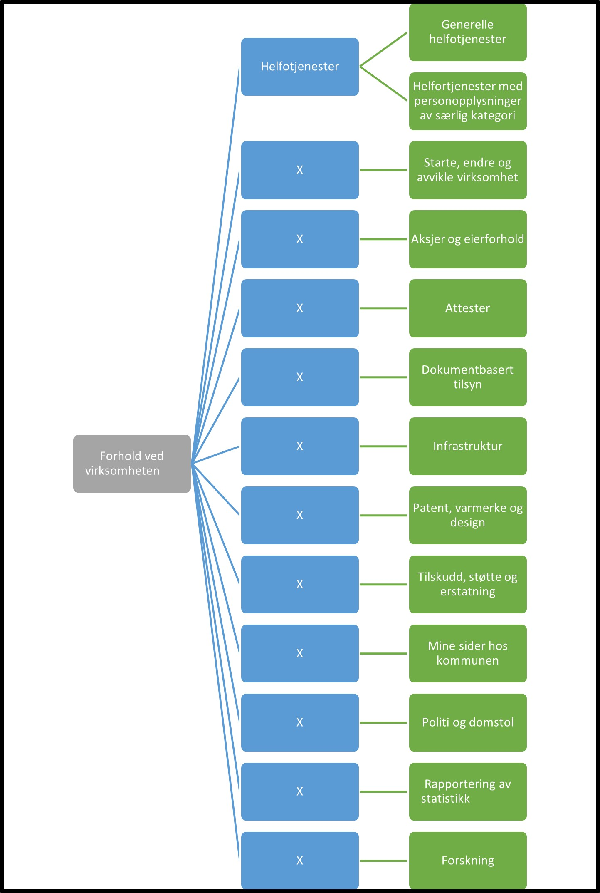

Tilbake til [hovedoversikt](/authorization/modules/accessgroups/type-accessgroups/versjon-3/#oversikt-over-fullmaktsgrupper)

- **Forhold ved virksomheten:** Denne fullmakten gir tilgang til alle tjenester som er relatert til å etablere og drive en virksomhet. Ved regelverksendringer eller innføring av nye digitale tjenester kan det bli endringer i tilganger som fullmakten gir.
  - **Helfotjenester** Denne fullmakten gir tilgang til alle tjenester knyttet til virksomhetens dialog med Helfo der bruker kan få tilgang til personopplysninger om personer det rapporteres om. Ved regelverksendringer eller innføring av nye digitale tjenester kan det bli endringer i tilganger som fullmakten gir.
    - **Generelle helfotjenester** Denne fullmakten gir tilgang til ordinære tjenester knyttet til virksomhetens dialog med Helfo der bruker kan få tilgang til personopplysninger om personer det rapporteres om. Ved regelverksendringer eller innføring av nye digitale tjenester kan det bli endringer i tilganger som fullmakten gir.
    - **Helfotjenester med personopplysninger av særlig kategori** Denne fullmakten gir tilgang til alle tjenester knyttet til virksomhetens dialog med Helfo der bruker kan få tilgang til personopplysninger av særlig kategori. Ved regelverksendringer eller innføring av nye digitale tjenester kan det bli endringer i tilganger som fullmakten gir
  - **Starte, drive, endre og avvikle virksomhet:**	Denne fullmakten gir tilgang til alle tjenester knyttet til å starte, endre og avvikle en virksomhet. Ved regelverksendringer eller innføring av nye digitale tjenester kan det bli endringer i tilganger som fullmakten gir.
  - **Aksjer og eierforhold:** Denne fullmakten gir tilgang til alle tjenester knyttet til aksjer og eierforhold. Ved regelverksendringer eller innføring av nye digitale tjenester kan det bli endringer i tilganger som fullmakten gir.
  - **Attester:** Denne fullmakten gir tilgang til alle tjenester knyttet til attestering av virksomhet. Ved regelverksendringer eller innføring av nye digitale tjenester kan det bli endringer i tilganger som fullmakten gir.
  - **Dokumentbasert tilsyn:** Denne fullmakten gir tilgang til alle tjenester knyttet til dokumentbaserte tilsyn. Ved regelverksendringer eller innføring av nye digitale tjenester kan det bli endringer i tilganger som fullmakten gir.
  - **Infrastruktur:** Denne fullmakten gir tilgang til alle tjenester knyttet til virksomhetens infrastruktur. Ved regelverksendringer eller innføring av nye digitale tjenester kan det bli endringer i tilganger som fullmakten gir.
  - **Patent, varmerke og design:** Denne fullmakten gir tilgang til alle tjenester knyttet til patent, varemerke og design. Ved regelverksendringer eller innføring av nye digitale tjenester kan det bli endringer i tilganger som fullmakten gir.
  - **Tilskudd, støtte og erstatning:** Denne fullmakten gir tilgang til alle tjenester knyttet til å søke tilskudd, støtte og erstatning. Ved regelverksendringer eller innføring av nye digitale tjenester kan det bli endringer i tilganger som fullmakten gir.
  - **Mine sider hos kommunen:** Denne fullmakten gir generell tilgang til tjenester av typen "mine side" tjenester hos kommuner. Ved regelverksendringer eller innføring av nye digitale tjenester kan det bli endringer i tilganger som fullmakten gir.
  - **Politi og domstol:** Denne fullmakten gir tilgang til alle tjenester knyttet til virksomhetens dialog om juridiske forhold med politi og jusitsmyndigheter. Ved regelverksendringer eller innføring av nye digitale tjenester kan det bli endringer i tilganger som fullmakten gir.
  - **Rapportering av statistikk:** Denne fullmakten gir tilgang til alle pålagte rapportering av statistikk. Ved regelverksendringer eller innføring av nye digitale tjenester kan det bli endringer i tilganger som fullmakten gir.

## Egenskaper ved fullmaktsgruppene
|Navn fullmaktsgruppe|Kan delegeres til ansatte?|Kan knytte tjenester til?|[ER rolle](/authorization/modules/accessgroups/register_er/#rolletyper-fra-enhetsregisteret) som får fullmakten|
|---|---|---|---|
|Forhold ved virksomheten| ja|nei||
|Helfotjenester| ja|nei|DAGL, LEDE, INNH, DTPR, DTSO, KOMP, BEST, REPR, BOBE|
|Generelle helfotjenester| ja| ja|DAGL, LEDE, INNH, DTPR, DTSO, KOMP, BEST, REPR, BOBE|
|Helfotjenester med personopplysninger av særlig kategori| ja| ja|DAGL, LEDE, INNH, DTPR, DTSO, KOMP, BEST, REPR, BOBE|
|Starte, endre og avvikle virksomhet|ja|ja|DAGL, LEDE, INNH, DTPR, DTSO, KOMP, BEST, REPR, BOBE|
|Aksjer og eierforhold:|ja|ja|DAGL, LEDE, INNH, DTPR, DTSO, KOMP, BEST, REPR, BOBE|
|Attester|ja|ja|DAGL, LEDE, INNH, DTPR, DTSO, KOMP, BEST, REPR, BOBE|
|Dokumentbasert tilsyn|ja|ja|DAGL, LEDE, INNH, DTPR, DTSO, KOMP, BEST, REPR, BOBE|
|Infrastruktur|ja|ja|DAGL, LEDE, INNH, DTPR, DTSO, KOMP, BEST, REPR, BOBE|
|Patent, varmerke og design|ja|ja|DAGL, LEDE, INNH, DTPR, DTSO, KOMP, BEST, REPR, BOBE|
|Tilskudd, støtte og erstatning|ja|ja|DAGL, LEDE, INNH, DTPR, DTSO, KOMP, BEST, REPR, BOBE|
|Mine sider hos kommunen|ja|ja|DAGL, LEDE, INNH, DTPR, DTSO, KOMP, BEST, REPR, BOBE|
|Politi og domstol|ja|ja|DAGL, LEDE, INNH, DTPR, DTSO, KOMP, BEST, REPR, BOBE|
|Rapportering av statistikk|ja|ja|DAGL, LEDE, INNH, DTPR, DTSO, KOMP, BEST, REPR, BOBE|

{} Det er fortsatt uavklart hvilke fullmakter det vil være natulig å gi personer med rollen Forretningsførerer innenfor fullmaktsområdet "Forhold ved virksomheten" {}

Tilbake til [hovedoversikt](/authorization/modules/accessgroups/type-accessgroups/versjon-3/#oversikt-over-fullmaktsgrupper)
