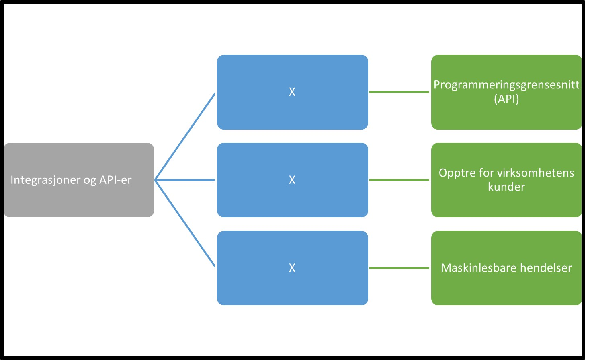

Tilbake til [hovedoversikt](/authorization/modules/accessgroups/type-accessgroups/versjon-3/#oversikt-over-tilgangspakker)

- **Integrasjoner og API-er:** Denne fullmakten gir tilgang til å sette opp og administrere dataintegrasjoner og API som tilbys. Ved regelverksendringer eller innføring av nye digitale tjenester kan det bli endringer i tilganger som fullmakten gir.
	- **Programmeringsgrensesnitt (API):** Denne fullmakten gir tilgang til å administrere tilgang til data og programmeringsgrensenitt (API) som benytter [Maskinporten](https://docs.digdir.no/docs/Maskinporten/maskinporten_overordnet) eller tilsvarende løsninger for APIsikring. Ved regelverksendringer eller innføring av nye digitale tjenester kan det bli endringer i tilganger som fullmakten gir.
	- **Opptre for virksomhetens kunder:** Denne fullmakten benyttes når en leverandørvirksomhet skal utføre tjenester på vegne av sine kunder via et programmeringsgrensesnitt (API). Fullmakten kan gis til til virksomhetsbruker som er knyttet til leverandørens organisasjonsnummer. Men denne fullmakten vil virksomhetsbrukeren kunne utføre alle tjenester som leverandøren har tilgang til å utføre på vegne av alle sine kunder/klienter. Fullmakten gir ikke virksomhetsbruker tilgang til å utføre tjenester på vegne av leverandøren selv, bare kunder av leverandøren. Ved regelverksendringer eller innføring av nye digitale tjenester kan det bli endringer i tilganger som fullmakten gir. Denne fullmakten har tidligere hatt navnet "ECKEYROLE", behovet for denne må vurderes opp mot ny løsning for systembruker. 
	- **Maskinlesbare hendelser:** Denne fullmakten gir tilgang til å administrere tilgang til maskinlesbare hendelser. Ved regelverksendringer eller innføring av nye digitale tjenester kan det bli endringer i tilganger som fullmakten gir.

## Egenskaper ved tilgangspakkene
|Navn tillgangspakke|Kan delegeres til ansatte?|Kan knytte tjenester til?|[ER rolle](/authorization/modules/accessgroups/register_er/#rolletyper-fra-enhetsregisteret) som får fullmakten|
|---|---|---|---|
|Integrasjoner og API-er| ja|nei||
|Programmeringsgrensesnitt (API)|ja|ja|DAGL, LEDE, INNH, DTPR, DTSO, KOMP, BEST, REPR, BOBE|
|Opptre for virksomhetens kunder|ja|ja|DAGL, LEDE, INNH, DTPR, DTSO, KOMP, BEST, REPR, BOBE|
|Maskinlesbare hendelser|ja|ja|DAGL, LEDE, INNH, DTPR, DTSO, KOMP, BEST, REPR, BOBE|

{} Det er fortsatt uavklart hvilke fullmakter det vil være natulig å gi personer med rollen Forretningsførerer innenfor fullmaktsområdet "Integrasjoner og API-er" {}

Tilbake til [hovedoversikt](/authorization/modules/accessgroups/type-accessgroups/versjon-3/#oversikt-over-tilgangspakker)