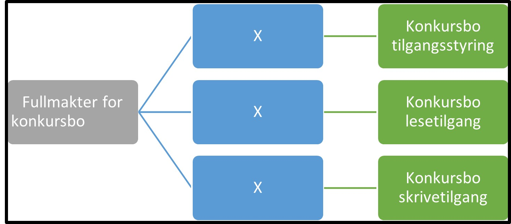

Tilbake til [hovedoversikt](/authorization/modules/accessgroups/type-accessgroups/versjon-3/#oversikt-over-tilgangspakker)

- **Fullmakter for konkursbo:** Denne kategorien inneholder tilgangspakker som er relevant for alle konkurser, tvangsoppløsninger og tvangsavviklinger som har fått registrert et tilhørende konkursbo i Enhetsregisteret
	- **Konkursbo tilgangsstyring:** Denne fullmakten gir rettighet til å administrere konkursbo. Fullmakten er en engangsdelegering, og den gir ikke tilgang til noen tjenester. **urn:altinn:accesspackage:konkursbotilgangsstyring**
	- **Konkursbo lesetilgang:**  Denne fullmakten delegeres til kreditorer og andre som skal ha lesetilgang til det enkelte konkursbo. **urn:altinn:accesspackage:konkursbolesetilgang**
	- **Konkursbo skrivetilgang:** Denne fullmakten gir bostyrers medhjelper tilgang til å jobbe på vegne av bostyrer. Bostyrer delegerer denne fullmakten sammen med Konkursbo lesetilgang til medhjelper for hvert konkursbo.  **urn:altinn:accesspackage:konkursboskrivetilgang**

## Egenskaper ved tilgangspakkene
|Navn tillgangspakke|Kan delegeres til ansatte?|Kan knytte tjenester til?|[ER rolle](/authorization/modules/accessgroups/register_er/#rolletyper-fra-enhetsregisteret) som får fullmakten|
|---|---|---|---|
|Fullmakter for konkursbo|nei|nei||
|Konkursbo tilgangsstyring|ja|ja|PRIV, BOBE|
|Konkursbo lesetilgang|ja|ja|BOBE|
|Konkursbo skrivetilgang|ja|ja|BOBE|

Tilbake til [hovedoversikt](/authorization/modules/accessgroups/type-accessgroups/versjon-3/#oversikt-over-tilgangspakker)