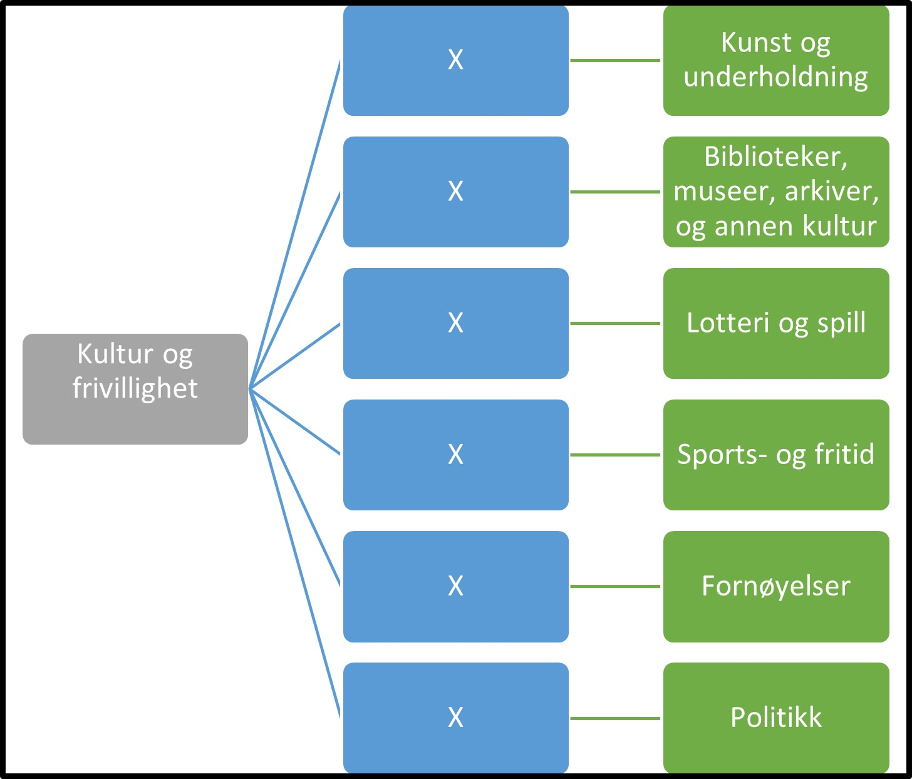

Tilbake til [hovedoversikt](/authorization/modules/accessgroups/type-accessgroups/versjon-3/#oversikt-over-tilgangspakker)

- **Kultur og frivillighet:** Denne fullmakten gir tilgang til alle tjenester som omhandler aktiviteter innen kunst, kultur, sport og frivillig arbeid
	- **Kunst og underholdning:** Denne tilgangspakken gir fullmakter til tjenester knyttet til kunstnerisk og underholdningsaktiviteter. Ved regelverksendringer eller innføring av nye digitale tjenester kan det bli endringer i tilganger som fullmakten gir.
	- **Biblioteker, museer, arkiver, og annen kultur:** Denne tilgangspakken gir fullmakter til tjenester knyttet til biblioteker, museer, arkiver, og annen kultur som botaniske og zoologiske hager, og drift av naturfenomener av historisk, kulturell eller undervisningsmessig interesse (f.eks. verdenskulturarv mv.). Ved regelverksendringer eller innføring av nye digitale tjenester kan det bli endringer i tilganger som fullmakten gir.
	- **Lotteri og spill:** Denne tilgangspakken gir fullmakter til tjenester knyttet til lotteri og spill, som f eks kasinoer, bingohaller og videospillhaller samt spillevirksomhet som f.eks. lotterier og veddemål som inngås utenfor banen. Ved regelverksendringer eller innføring av nye digitale tjenester kan det bli endringer i tilganger som fullmakten gir.
	- **Sports- og fritid:** Denne tilgangspakken gir fullmakter til tjenester knyttet til sports- og fritidsaktiviteter. Ved regelverksendringer eller innføring av nye digitale tjenester kan det bli endringer i tilganger som fullmakten gir. 
	- **Fornøyelser:** Denne tilgangspakken gir fullmakter til tjenester knyttet til drift av fornøyelsesetablissementer. Ved regelverksendringer eller innføring av nye digitale tjenester kan det bli endringer i tilganger som fullmakten gir.
	- **Politikk:** Denne tilgangspakken gir fullmakter til tjenester knyttet til aktiviteter i forbindelse med politisk arbeid. Ved regelverksendringer eller innføring av nye digitale tjenester kan det bli endringer i tilganger som fullmakten gir.

## Egenskaper ved tilgangspakkene
|Navn tillgangspakke|Kan delegeres til ansatte?|Kan knytte tjenester til?|[ER rolle](/authorization/modules/accessgroups/register_er/#rolletyper-fra-enhetsregisteret) som får fullmakten|
|---|---|---|---|
|Kultur og frivillighet| ja|nei||
|Kunst og underholdning|ja|ja|DAGL, LEDE, INNH, DTPR, DTSO, KOMP, BEST, REPR, BOBE|
|Biblioteker, museer, arkiver, og annen kultur|ja|ja|DAGL, LEDE, INNH, DTPR, DTSO, KOMP, BEST, REPR, BOBE|
|Lotteri og spill|ja|ja|DAGL, LEDE, INNH, DTPR, DTSO, KOMP, BEST, REPR, BOBE|
|Sports- og fritid|ja|ja|DAGL, LEDE, INNH, DTPR, DTSO, KOMP, BEST, REPR, BOBE|
|Fornøyelser|ja|ja|DAGL, LEDE, INNH, DTPR, DTSO, KOMP, BEST, REPR, BOBE|
|Politikk|ja|ja|DAGL, LEDE, INNH, DTPR, DTSO, KOMP, BEST, REPR, BOBE|

{} Det er fortsatt uavklart hvilke fullmakter det vil være natulig å gi personer med rollen Forretningsførerer innenfor fullmaktsområdet "Kultur og frivillighet" {}

Tilbake til [hovedoversikt] (/authorization/modules/accessgroups/type-accessgroups/versjon-3/#oversikt-over-tilgangspakker)