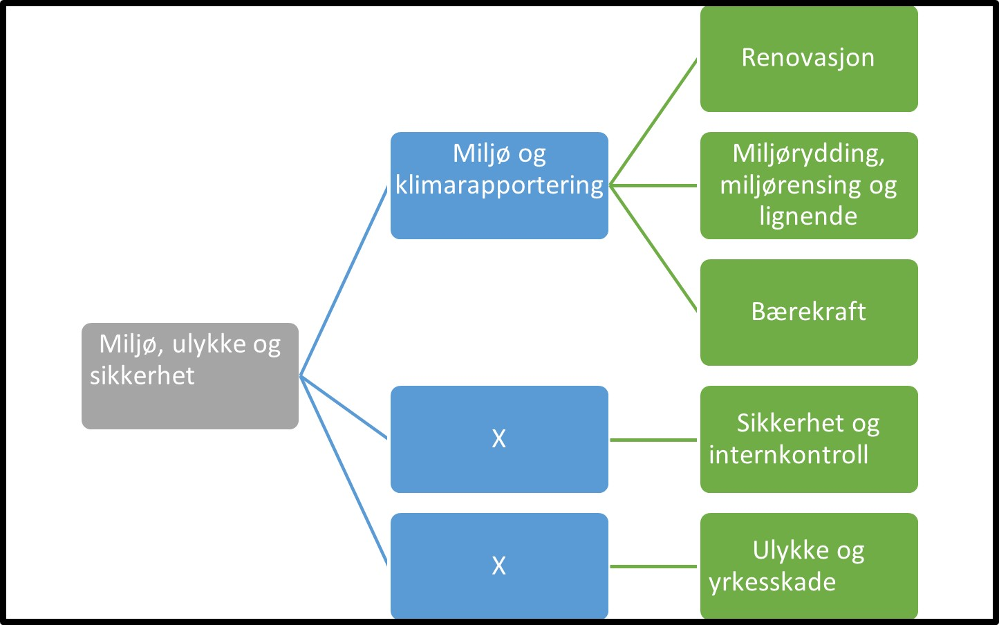

Tilbake til [hovedoversikt](/authorization/modules/accessgroups/type-accessgroups/versjon-3/#oversikt-over-fullmaktsgrupper)

- **Miljø, ulykke og sikkerhet:** Denne fullmakten gir tilgang til alle tjenester som angår miljø, klima, renovasjon samt helse, miljø og sikkerhet. Ved regelverksendringer eller innføring av nye digitale tjenester kan det bli endringer i tilganger som fullmakten gir. 
	- **Miljø og klimarapportering:** Denne fullmakten gir tilgang til alle tjenester som angår renovasjon, miljø og klimarapportering. Ved regelverksendringer eller innføring av nye digitale tjenester kan det bli endringer i tilganger som fullmakten gir. 
		- **Renovasjon:** Denne fullmakten gir tilgang til alle tjenester knyttet til renovasjon. Ved regelverksendringer eller innføring av nye digitale tjenester kan det bli endringer i tilganger som fullmakten gir. 
        - **Miljørydding, miljørensing og lignende:** Denne fullmakten gir tilgang til alle tjenester knyttet til miljørydding, miljørensing og lignende. Ved regelverksendringer eller innføring av nye digitale tjenester kan det bli endringer i tilganger som fullmakten gir. 
        - **Bærekraft:** Denne fullmakten gir tilgang til alle tjenester knyttet til tiltak og rapportering på bærekraft. Ved regelverksendringer eller innføring av nye digitale tjenester kan det bli endringer i tilganger som fullmakten gir.
	- **Sikkerhet og internkontroll:** Denne fullmakten gir tilgang til alle tjenester knyttet til sikkerhet og internkontroll. Ved regelverksendringer eller innføring av nye digitale tjenester kan det bli endringer i tilganger som fullmakten gir.
	- **Ulykke og yrkesskade:** Denne fullmakten gir tilgang til alle tjenester knyttet til ulykke og yrkesskade. Ved regelverksendringer eller innføring av nye digitale tjenester kan det bli endringer i tilganger som fullmakten gir. 

## Egenskaper ved fullmaktsgruppene
|Navn fullmaktsgruppe|Kan delegeres til ansatte?|Kan knytte tjenester til?|[ER rolle](/authorization/modules/accessgroups/register_er/#rolletyper-fra-enhetsregisteret) som får fullmakten|
|---|---|---|---|
|Miljø, ulykke og sikkerhet| ja|nei||
|Miljø og klimarapportering|ja|nei||
|Renovasjon|ja|ja|DAGL, LEDE, INNH, DTPR, DTSO, KOMP, BEST, REPR, BOBE|
|Miljørydding, miljørensing og lignende|ja|ja|DAGL, LEDE, INNH, DTPR, DTSO, KOMP, BEST, REPR, BOBE|
|Sikkerhet og internkontroll|ja|ja|DAGL, LEDE, INNH, DTPR, DTSO, KOMP, BEST, REPR, BOBE|
|Ulykke og yrkesskade|ja|ja|DAGL, LEDE, INNH, DTPR, DTSO, KOMP, BEST, REPR, BOBE|

{} Det er fortsatt uavklart hvilke fullmakter det vil være natulig å gi personer med rollen Forretningsførerer innenfor fullmaktsområdet "Miljø, ulykke og sikkerhet" {}

Tilbake til [hovedoversikt](/authorization/modules/accessgroups/type-accessgroups/versjon-3/#oversikt-over-fullmaktsgrupper)
