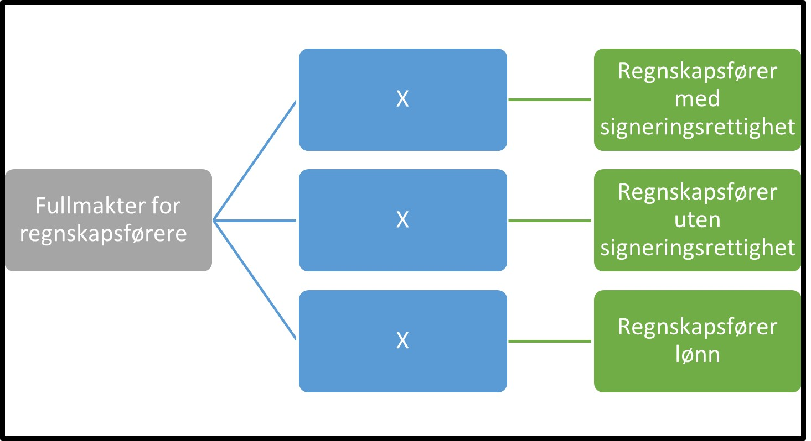

Tilbake til [hovedoversikt](/authorization/modules/accessgroups/type-accessgroups/versjon-2/#oversikt-over-fullmaktsgrupper)

- **Fullmakter for regnskapsførere:** Denne fullmakten gir tilgang til alle tjenester som det er naturlig at en regnskapsfører utfører på vegne av sine kunder
	- **Regnskapsfører med signeringsrettighet:** Denne fullmakten gir tilgang til regnskapfører å kunne signere på vegne av kunden for alle tjenester som krever signeringsrett. Dette er tjenester som man har vurdert det som naturlig at en regnskapsfører utfører på vegne av sin kunde. Fullmakten gis kun til autoriserte regnskapsførere. Fullmakt hos regnskapfører oppstår når kunden registrerer regnskapsfører i Enhetsregisteret. 
	- **Regnskapsfører uten signeringsrettighet:** Denne fullmakten gir tilgang til å kunne utføre alle tjenester som ikke krever signeringsrett. Dette er tjenester som man har vurdert det som naturlig at en regnskapsfører utfører på vegne av sin kunde. Fullmakten gis kun til autoriserte regnskapsførere. Fullmakt hos regnskapfører oppstår når kunden registrerer regnskapsfører i Enhetsregisteret. 
	- **Regnskapsfører lønn:** Denne fullmakten gir tilgang til regnskapsfører å rapportere lønn for sin kunde. Dette er tjenester som man har vurdert det som naturlig at en regnskapsfører utfører på vegne av sin kunde. Fullmakten gis kun til autoriserte regnskapsførere. Fullmakt hos regnskapfører oppstår når kunden registrerer regnskapsfører i Enhetsregisteret. 

## Egenskaper ved fullmaktsgruppene
|Navn fullmaktsgruppe|Kan delegeres til ansatte?|Kan knytte tjenester til?|[ER rolle](/authorization/modules/accessgroups/register_er/#rolletyper-fra-enhetsregisteret) som får fullmakten|
|---|---|---|---|
|Fullmakter for regnskapsførere| ja|nei||
|Regnskapsfører med signeringsrettighet|ja|ja|DAGL, LEDE, INNH, DTPR, DTSO, KOMP, BEST, REPR, BOBE|
|Regnskapsfører uten signeringsrettighet|ja|ja|DAGL, LEDE, INNH, DTPR, DTSO, KOMP, BEST, REPR, BOBE|
|Regnskapsfører lønn|ja|ja|DAGL, LEDE, INNH, DTPR, DTSO, KOMP, BEST, REPR, BOBE|

Tilbake til [hovedoversikt](/authorization/modules/accessgroups/type-accessgroups/versjon-2/#oversikt-over-fullmaktsgrupper)