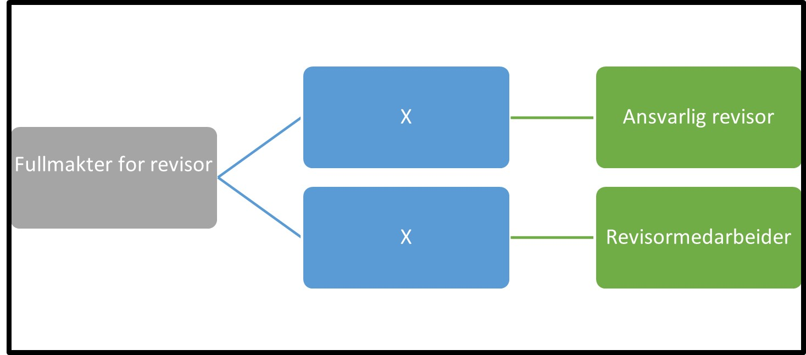

Tilbake til [hovedoversikt](/authorization/modules/accessgroups/type-accessgroups/versjon-3/#oversikt-over-tilgangspakker)

- **Fullmakter for revisor:** Denne fullmakten gir tilgang til alle tjenester som det er naturlig at en revisor utfører på vegne av sine kunder
	- **Ansvarlig revisor:** Denne fullmakten gir revisor tilgang til å opptre som ansvarlig revisor for en kunde og utføre alle tjenester som krever denne fullmakten. Dette er tjenester som tjenestetilbyder har vurdert det som naturlig at en revisor utfører på vegne av sin kunde. Fullmakten gis kun til autoriserte revisorer. Fullmakt hos revisor oppstår når kunden registrerer regnskapsfører i Enhetsregisteret. Ved regelverksendringer eller innføring av nye digitale tjenester kan det bli endringer i tilganger som fullmakten gir.
	- **Revisormedarbeider:** Denne fullmakten gir revisor tilgang til å opptre som revisormedarbeider for en kundeog utføre alle tjenester som krever denne fullmakten. Dette er tjenester som tjenestetilbyder har vurdert det som naturlig at en revisor utfører på vegne av sin kunde. Fullmakten gis kun til autoriserte revisorer. Fullmakt hos revisor oppstår når kunden registrerer regnskapsfører i Enhetsregisteret. Ved regelverksendringer eller innføring av nye digitale tjenester kan det bli endringer i tilganger som fullmakten gir.

## Egenskaper ved tilgangspakkene
|Navn tillgangspakke|Kan delegeres til ansatte?|Kan knytte tjenester til?|[ER rolle](/authorization/modules/accessgroups/register_er/#rolletyper-fra-enhetsregisteret) som får fullmakten|
|---|---|---|---|
|Fullmakter for revisor|nei|nei||
|Ansvarlig revisor|ja|ja|REVI|
|Revisormedarbeider|ja|ja|REVI|

Tilbake til [hovedoversikt](/authorization/modules/accessgroups/type-accessgroups/versjon-3/#oversikt-over-tilgangspakker)