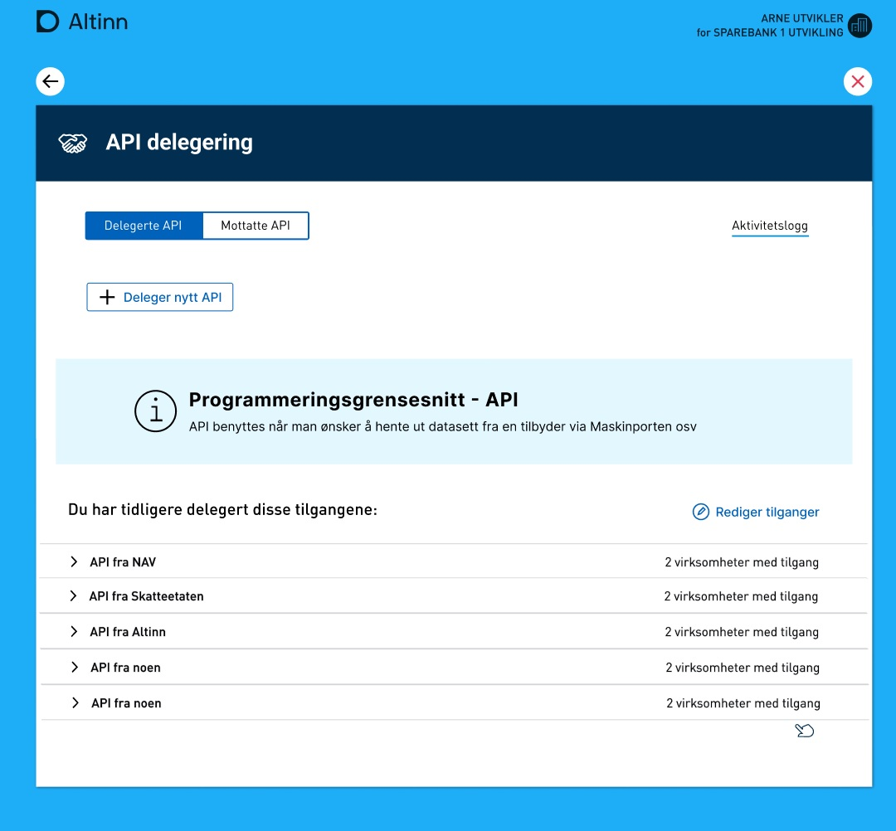
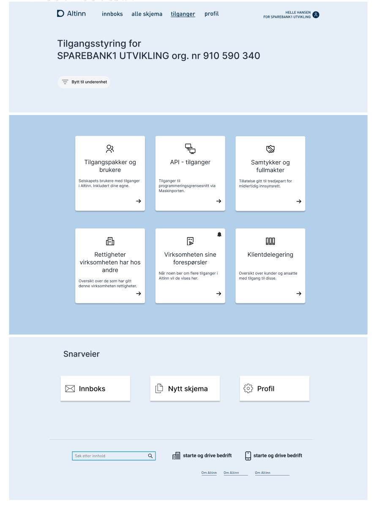
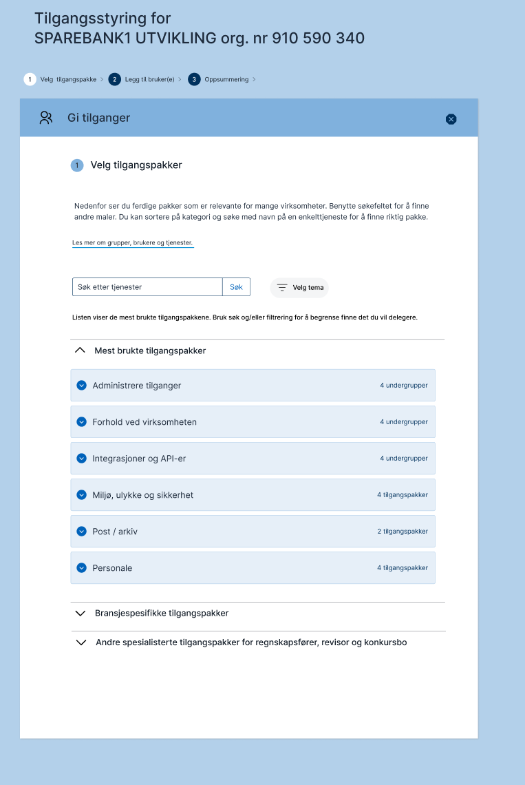
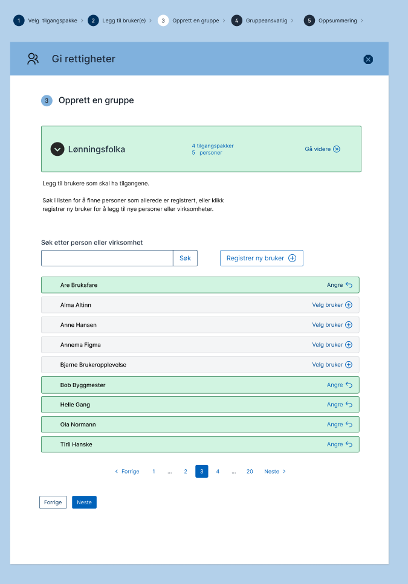


This is work in progress


The access management will provide functionality to manage different aspects of authorization in Altinn.

- Delegate and revoke Altinn 2 roles
- Add and remove membership for Access Groups
- Delegate App and instance rights
- [Manage Delegatable Maskinporten API resources](https://github.com/Altinn/altinn-authorization/issues/59)
- List access groups members
- List resources that is linked to access groups

## Delegation & Administration of Delegated API Access 

This functionality allows users to delegate access throug API with help of delegating access in maskinporten.

This functionality is expected to be delivered winter 2022/2023.

## Delegation of general resource rights

The second feature delivered from the new Access Management component will be 

## Delegation and management of Access Groups

As part of new design, management of access groups will take over for role management

This design is in early phase. 

### Construction

See details how AccessManagement is [constructed](/authorization/architecture/accessmanagment/).