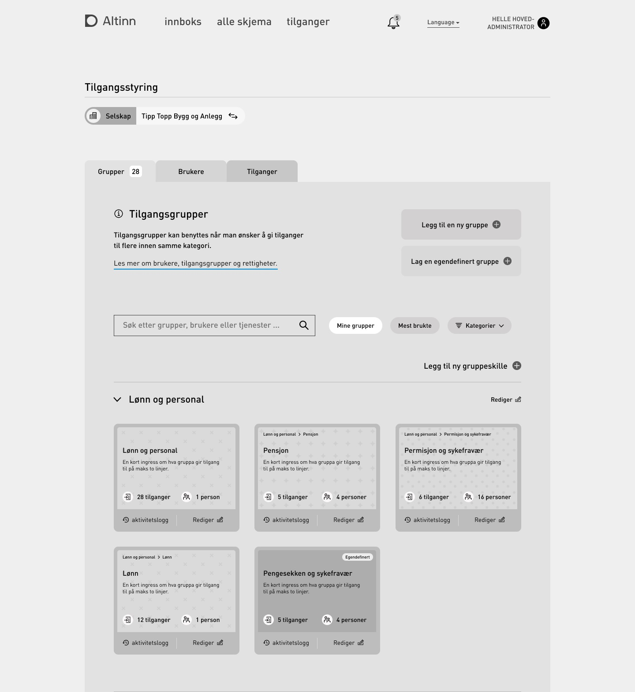


Dette er et arbeid som pågår


Tilgangsstyringen vil gi funksjonalitet for å administrere ulike aspekter ved autorisasjon i Altinn.

- Delegere og tilbakekalle Altinn 2 roller
- Legg til og fjern medlemskap for tilgangsgrupper
- Delegere app- og instansrettigheter
- [Administrer delegerbare Maskinporten API-ressurser](https://github.com/Altinn/altinn-authorization/issues/59)
- Liste tilgangsgrupper medlemmer
- Liste ressurser som er knyttet til tilgangsgrupper

Dette designet er i tidlig fase.

## Delegering og administrasjon av delegert API-tilgang

Denne funksjonaliteten lar brukere delegere tilgang gjennom API ved hjelp av å delegere tilgang i maskinporten.

Denne funksjonaliteten forventes levert vinteren 2022/2023.

## Delegering av generelle ressursrettigheter

Den andre funksjonen som leveres fra den nye Access Management-komponenten vil være

## Delegering og administrasjon av tilgangsgrupper

Som en del av ny design vil ledelse av tilgangsgrupper overta for rollestyring

### Konstruksjon

Se detaljer hvordan AccessManagement er [konstruert](/authorization/architecture/accessmanagment/).