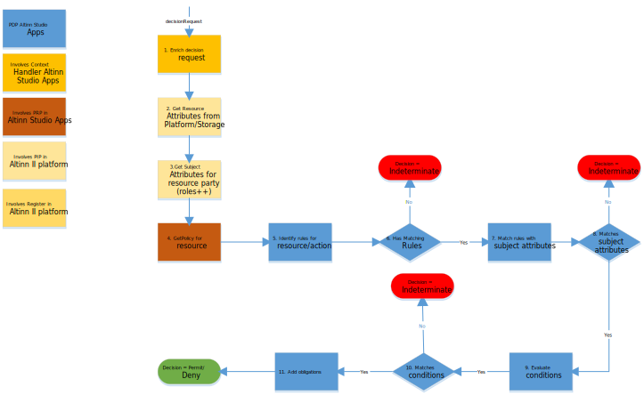

The Policy Decision Point is implemented in the [access control component](../../../../authorization/architecture/accesscontrol/) that is deployed to Altinn Platform.

The Policy Decision Point follow [eXtensible Access Control Markup Language (XACML) Version 3.0](https://docs.oasis-open.org/xacml/3.0/xacml-3.0-core-spec-os-en.html). 

This mean that the rules are defined in XACML Policies files and PDP evalutes request based on the rules.

The PDP evaluates the Context Request based on standard XACML 3.0 behaviour. There is no specific Altinn behaviour.

Policy Decision Point exposes a method that authorize the decision request.

PDP uses the configured [Context Handler](../contexthandler) to enrich the decision request with attributes about the subject, resource and environment. 

If instanceID or dataID is used as Resource ID PDP will use the Context Handler to identifiy the correct appId,
the instance workflow state and the reporteId for the existing resource.

For request for non existing instances the appId will be used and the reportee is a required input.

## API  

The PDP component exposes a XACML 3.0 Json API to allow PDP checks. This API supports JSON formatet request. 

Documentation for this API is found [here](http://localhost:1313/nb/api/authorization/spec/#/Decision/post_authorize)

It is required to have access to a scope altinn:authorization:pdp and a API key for this access. Contact Altinn to get this. 

## XACML 3.0 Conformance

The PDP tries to follow XACML 3.0 standard and have implemented some conformance tests. The goal is to fully implement
all conformance test.

There exist no official XACML 3.0 conformance test but AT&T research made som available for OASIS in [this thread](https://lists.oasis-open.org/archives/xacml-comment/201404/msg00001.html).

See our tests [here](https://github.com/Altinn/altinn-authorization/blob/main/test/IntegrationTests/Xacml30ConformanceTests.cs). 

Testdata for conformance tests is found [here](https://github.com/Altinn/altinn-authorization/tree/main/test/IntegrationTests/Data/Xacml/3.0/ConformanceTests), and official description of tests [here](https://raw.githubusercontent.com/Altinn/altinn-studio/master/src/Altinn.Platform/Altinn.Platform.Authorization/IntegrationTests/Data/Xacml/3.0/ConformanceTests/ConformanceTests.html).

[See Github 2818 for status on conformance test coverage](https://github.com/Altinn/altinn-authorization/issues/1)

## PDP flow

The diagram below show the detailed flow.

Flow explained

1. Decision Request is sent to context handler for enriching
2. Context handler call PIP for resource attributes
3. Context handler call PIP for subject attributes
4. PRP Identifies the correct policy based on resource attributes in enriched decision request
5. PDP identifyes matching rules
6. PDP checks if there is any matching rules and returnes interderminate if not
7. Matches the rules with subject attributes
8. Verify match and return indeterminate if not
9. Evaluate any conditions in policy
10. If condiation does not match return indterminate
11. Add any obligations to the result
12. Return the decsion result

## Implementation and construction details

Details about the implementation of PDP is found under
[construction components for PDP.](/authorization/architecture/accesscontrol#policy-decision-point---pdp)