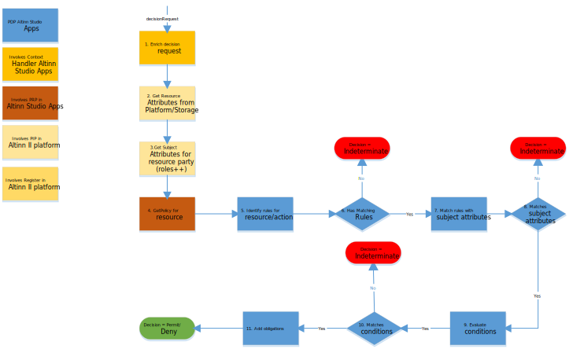

Policy Decision Point er implementert i [tilgangskontrollkomponenten](../../../../authorization/architecture/accesscontrol/) som er distribuert til Altinn-plattformen.

Policy Decision Point følger [eXtensible Access Control Markup Language (XACML) versjon 3.0](https://docs.oasis-open.org/xacml/3.0/xacml-3.0-core-spec-os-en.html).

Dette betyr at reglene er definert i XACML Policies-filer og PDP evaluerer forespørselen basert på reglene.

PDP evaluerer kontekstforespørselen basert på standard XACML 3.0-atferd. Det er ingen spesifikk Altinn-atferd.

Policy Decision Point viser en metode som autoriserer beslutningsforespørselen.

PDP bruker den konfigurerte [Context Handler](../contexthandler) for å berike beslutningsforespørselen med attributter om emnet, ressursen og miljøet.

Hvis forekomst-ID eller data-ID brukes som ressurs-ID, vil PDP bruke kontekstbehandleren til å identifisere riktig app-ID,
forekomstens arbeidsflyttilstand og reporteId for den eksisterende ressursen.

For forespørsel for ikke-eksisterende forekomster vil appId-en bli brukt, og rapporteringsmottakeren er en nødvendig inndata.

## XACML 3.0-konformitet

PDP prøver å følge XACML 3.0-standarden og har implementert noen samsvarstester. Målet er å implementere fullt ut
all samsvarstest.

Det finnes ingen offisiell XACML 3.0-konformitetstest, men AT&T-undersøkelser gjorde noe tilgjengelig for OASIS i [denne tråden](https://lists.oasis-open.org/archives/xacml-comment/201404/msg00001.html).

Se våre tester [her](https://github.com/Altinn/altinn-authorization/blob/main/test/IntegrationTests/Xacml30ConformanceTests.cs).

Testdata for samsvarstester finner du [her](https://github.com/Altinn/altinn-authorization/tree/main/test/IntegrationTests/Data/Xacml/3.0/ConformanceTests), og offisiell beskrivelse av tester [her]( https://raw.githubusercontent.com/Altinn/altinn-studio/master/src/Altinn.Platform/Altinn.Platform.Authorization/IntegrationTests/Data/Xacml/3.0/ConformanceTests/ConformanceTests.html).

[Se Github 2818 for status på dekning av samsvarstest](https://github.com/Altinn/altinn-studio/issues/2818)

## PDP-flyt

Diagrammet nedenfor viser den detaljerte flyten.

Flow forklart

1. Beslutningsforespørsel sendes til kontekstbehandler for berikelse
2. Kontekstbehandler kaller PIP for ressursattributter
3. Kontekstbehandler kaller PIP for emneattributter
4. PRP Identifiserer riktig policy basert på ressursattributter i en beriket beslutningsforespørsel
5. PDP identifiserer samsvarsregler
6. PDP sjekker om det er noen samsvarende regler og returnerer interderminate hvis ikke
7. Matcher reglene med emneattributter
8. Bekreft samsvar og returner ubestemt hvis ikke
9. Vurder eventuelle forhold i politikken
10. Hvis betingelsen ikke samsvarer, returner ubestemt
11. Legg til eventuelle forpliktelser til resultatet
12. Returner beslutningsresultatet

## Implementerings- og konstruksjonsdetaljer

Detaljer om implementering av PDP finnes under
[konstruksjonskomponenter for PDP.](/authorization/architecture/accesscontrol#policy-decision-point---pdp)