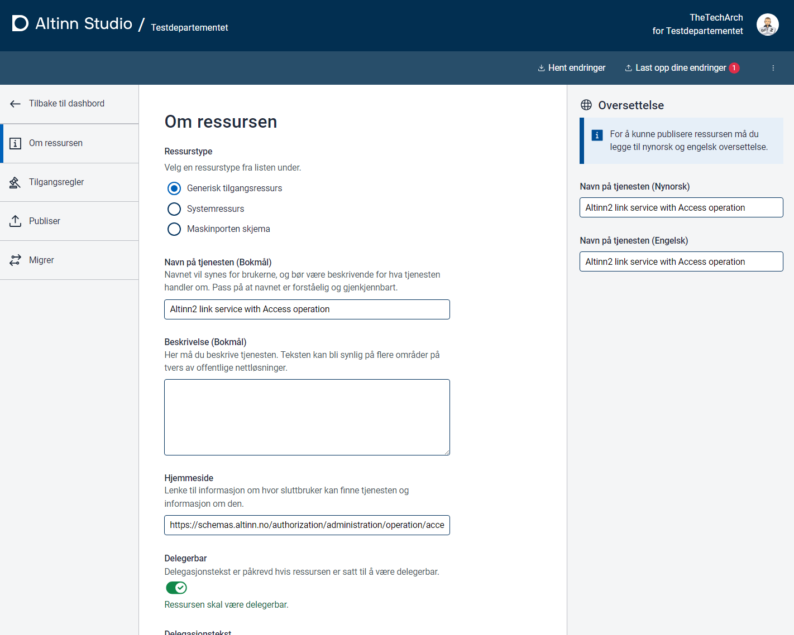

I ressursregisteret kan man opprette helt nye ressurser eller baserer ressurser på Altinn 2 lenketjenester. 

### Import fra Altinn 2 lenketjenester

Hvis man har eksisterende lenketjenester i Altinn 2 som man benytter for ekstern autorisasjon må disse flyttes over til ressursregisteret i Altinn 3 plattformen.

I Altinn Studio kan man velge å opprette ny ressurser basert på eksisteren lenketjenste.

Velg importer ressurs

Gi id som skal benyttes i Altinn ressourceregistret. Denne Id vil være sentral i 

Når man trykker import opprettes det en ny ressurs i Altinn Studio i repositry til organisasjon. 

Da ressursregisteret krever mer komplette data enn hva som var mulig å sette i Altinn 2, vil du måtte fylle ut ekstra verdier

- Tittel på Bokmål, Nynorsk og Engelsk
- Delegeringstekst på Bokmål, Nynorsk og Engelsk
- Beskrivelse på Bokmål, Nynorsk og Engelsk
- Kontaktinformasjon for tjenesten (vil kunne vises i tjenestekatalog)

#### Tilgangsregler

Ved import opprettes det tilgangsregler lik de som var i Altinn 2. 

Det bør også legges til relevant tilgangspakker for å gjøre tjenesten klar for overgang til tilgangspakker fra Altinn roller. 

#### Publisering

Når egenskaper med ressursen er komplett kan den publiseres til testmiljø eller produksjon. 

#### Endring av API integrasjon

For å gjøre tilgangskontroll på brukere i eksterne tjenester må tjenesteeier gjøre at kall mot Altinn tilgangskontroll (PDP) for å sjekke tilgang
Dette gjøres vi et API basert på XACML standarden. 

Funksjonelt inneholder forespørselen

- Informasjon om hvem som ønsker å utføre forespørsel
- Hvilken type ressurs er de snakk om og hvem er part for den ressursen. 
- Hvilken operasjon er det som sluttbruker ønsker å utføre. 

I en forespørsel kan man spørre om flere ting samtidig ved behov. 

#### Migrering av rettigheter

For de fleste lenketjenester finnes det aktive delegeringer i Altinn 2. Dette er rettigheter som er gitt fra en aktør til en person eller organisasjon. 
For at disse brukerne skal ha fortsatt tilgang etter en overgang til ressurs i ressursregisteret må rettighetene migreres over. 

Altinn planlegger å tilby følgende

- 

