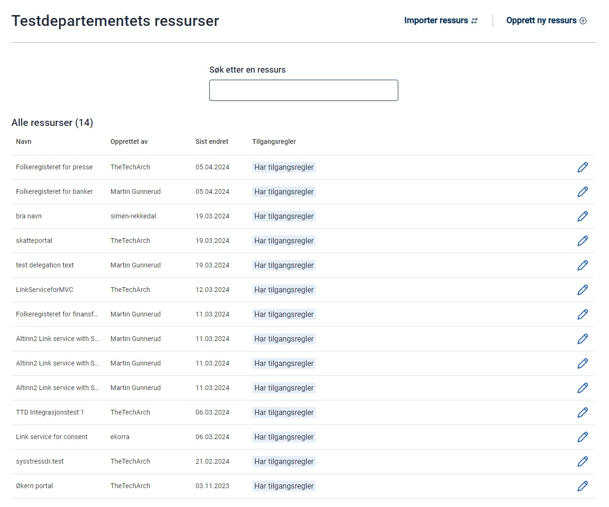
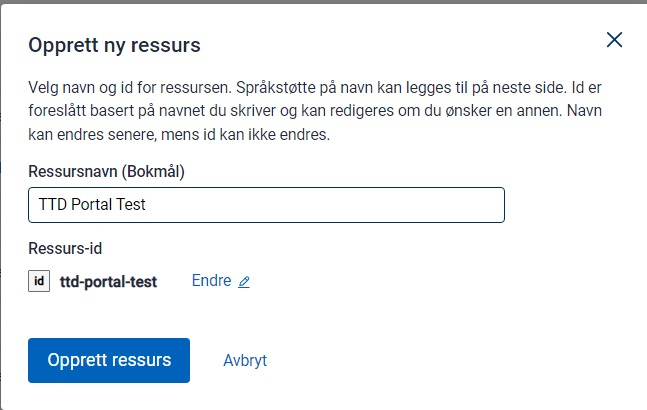
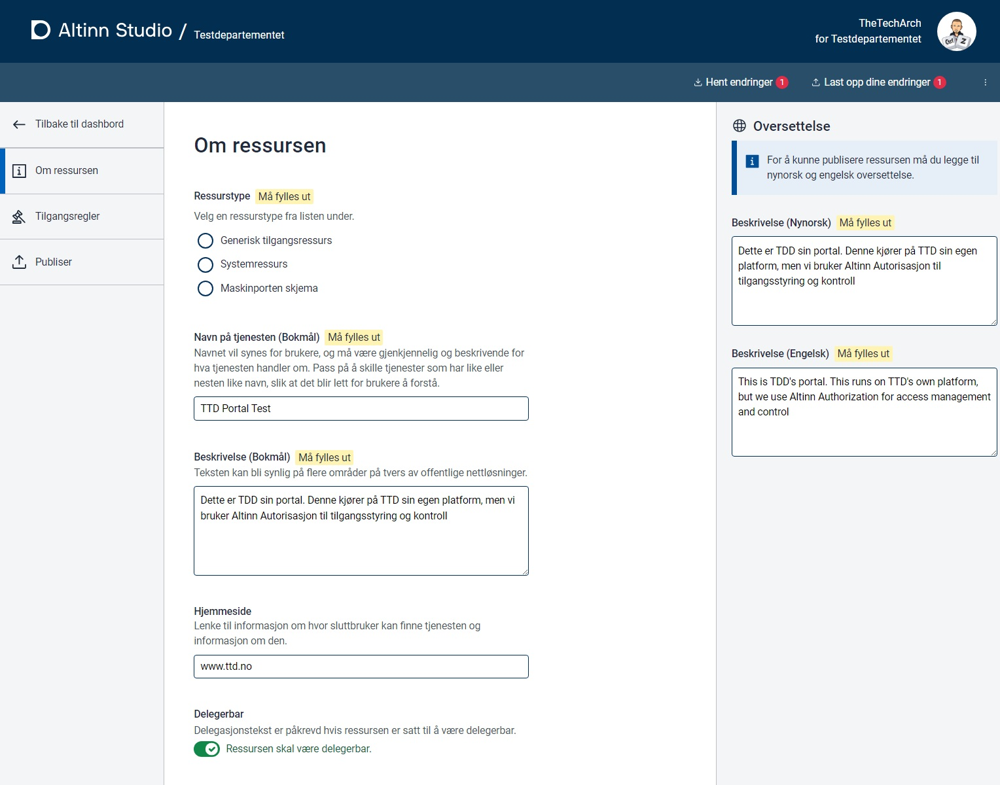
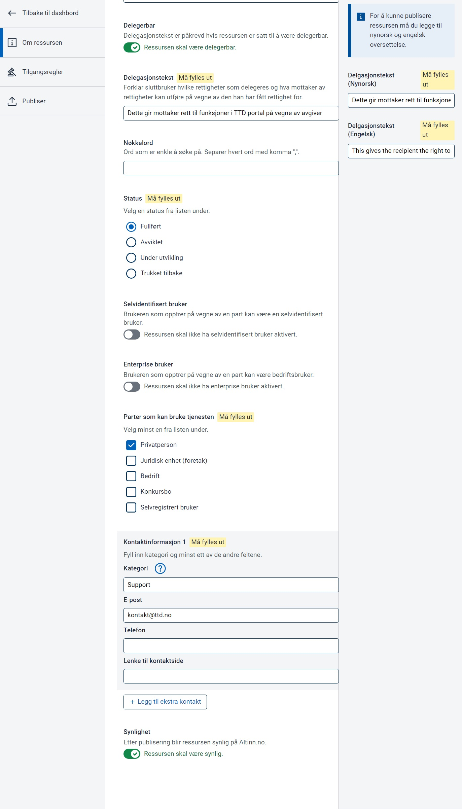

Ressursregisteret tilbyr API for alle typer håndtering av ressurser, men som del av Altinn studio kan man administrere 
ressursene.

Ressursene håndteres som filer i et repo for hver tjenesteeier. 

Hvis tjenesteeier har opprettet repo {org}-resourcs så vil dashboard for ressurser være tilgjengelig på forsiden av Altinn Studio.

Fra Dashboardet så kan man opprette ressurser. Ressursene kan gis et navn samt en id. 

Hver ressurrjs må få fylt ut

