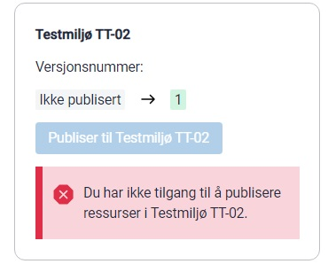
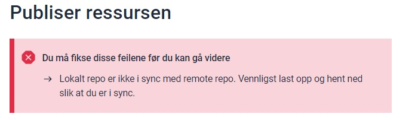
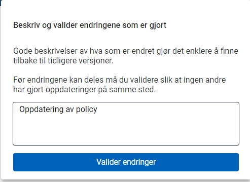
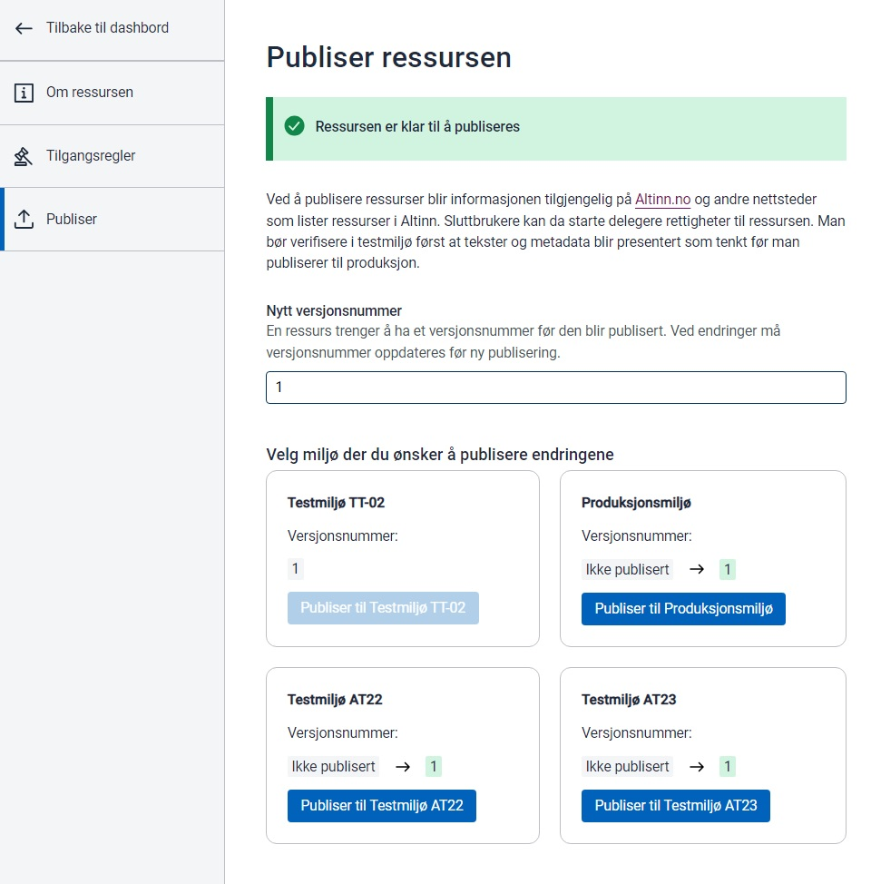

Ressursene håndteres som filer i et repo for hver tjenesteeier. 

Hvis tjenesteeier har opprettet repo {org}-resources så vil dashboard for ressurser være tilgjengelig på forsiden av Altinn Studio. 

Brukere som tilhører en team som har tilgang til repo kan gjøre endringer på ressurser.

Fra Dashboardet kan man opprette eller endre på ressurser. Ressursene kan gis et navn samt en id. 
Denne id må kun bestå av tall eller små bokstaver a - z og må være globalt unikt.

Den bør utformes slik at det er forståelig hvilken tjeneste det er snakk om. 

For at ressursene skal være gyldig må forskjellig typer informasjon fylles ut for alle Altinns hovedspråk. Bokmål, nynorsk og engelsk. Dette for at informasjonen skal kunne presenteres på riktig språk avhengig av brukers preferanse.

For å kunne publisere ressurser til resssursregisteret gjelder følgende

1. Ressursen må være synkronisert med GIT repository. Det er ikke mulig å publisere en ressurs som ikke er sjekket inn.
2. Må ha et oppdatert versjonsr
3. Må tilhøre publiseringsgruppen for TT02 eller Produksjon.

Når ressursen er publisert vil man kunne kalle PDP tjenesten for å autorisere brukere og systemer som aksessere tjenester som er registerert
som ressurser i ressursregisteret. 

Når publiseringen er gjennomført finnes også ressursen i utlisting på ressurs api.

- [Ressursliste TT02](https://platform.tt02.altinn.no/resourceregistry/api/v1/resource/search)
- [Ressurliste PROD](https://platform.altinn.no/resourceregistry/api/v1/resource/search)

Ressursen er tilgjengelig på følgende url for PROD  https://platform.altinn.no/resourceregistry/api/v1/resource/{id}